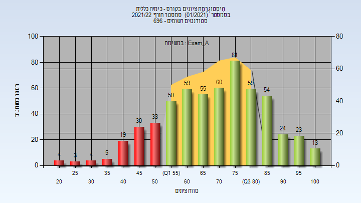
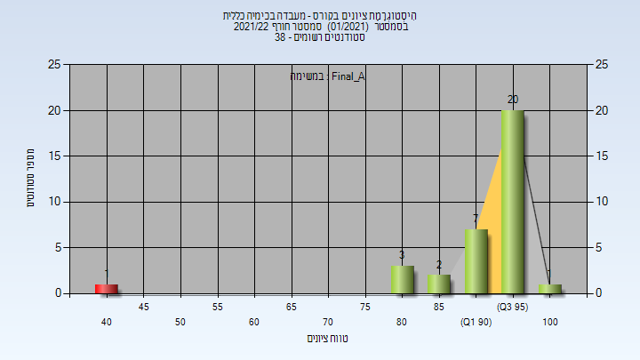
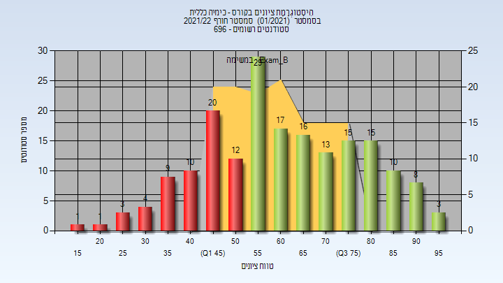
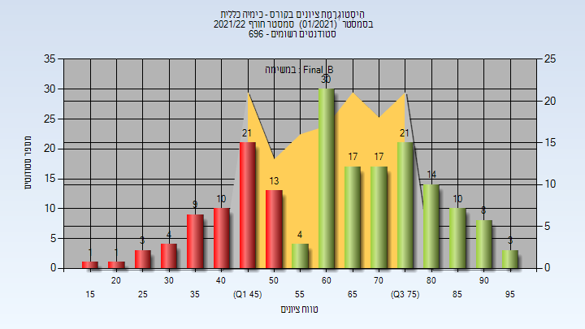
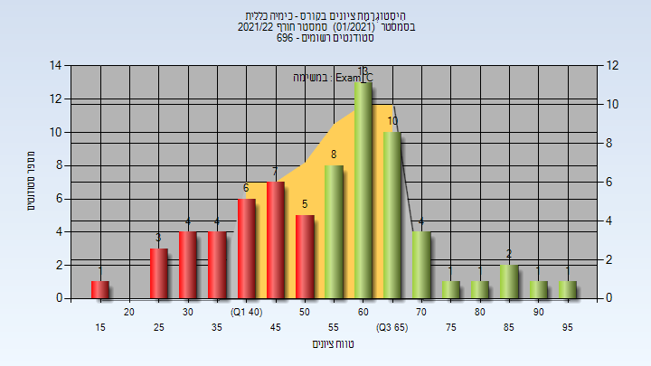
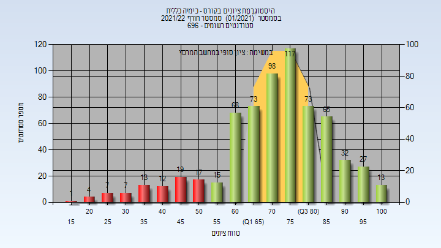
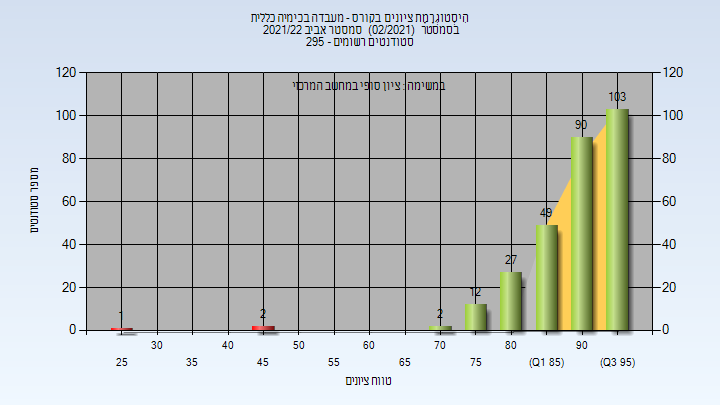

# 012500

**הערה**: מאגר ההיסטוגרמות הוקם עבור [CheeseFork](https://cheesefork.cf/), כלי בניית מערכת שעות עבור סטודנטים בטכניון. באתר בו אתם גולשים ניתן לעיין בהיסטוגרמות, אך הדרך היותר נוחה היא לעיין בהיסטוגרמות, ובמידע נוסף כגון חוות דעת של סטודנטים, באתר CheeseFork.

* [חורף 2018-2019](#201801)
  * [מבחן מועד א'](#201801-Exam_A)
  * [סופי מועד א'](#201801-Final_A)
  * [מבחן מועד ב'](#201801-Exam_B)
  * [סופי מועד ב'](#201801-Final_B)
  * [סופי](#201801-Finals)
* [חורף 2021-2022](#202101)
  * [מבחן מועד א'](#202101-Exam_A)
  * [סופי מועד א'](#202101-Final_A)
  * [מבחן מועד ב'](#202101-Exam_B)
  * [סופי מועד ב'](#202101-Final_B)
  * [מבחן מועד ג'](#202101-Exam_C)
  * [סופי](#202101-Finals)
* [אביב 2022](#202102)
  * [סופי מועד א'](#202102-Final_A)
  * [סופי](#202102-Finals)

<h2 id="201801">חורף 2018-2019</h2>

| איש סגל | תפקיד |
| ---- | ---- |
| אמדורסקי נדב | מרצה - אחראי מקצוע |
| שטנגר אמנון | מרצה |
| מלצמן שי | מרצה |
| טרביה טארק | מתרגל |
| מן גיא | מתרגל |
| מולדובן גיא | מתרגל |
| יוחנובסקי אנה | מתרגל |
| כהן אנטוני | מתרגל |
| הריס דביר | מתרגל |
| גבע מורן | מתרגל |
| אביגדורי עידן | מתרגל |

<h3 id="201801-Exam_A">מבחן מועד א'</h3>

| סטודנטים | עברו/נכשלו | אחוז עוברים | ציון מינימלי | ציון מקסימלי | ממוצע | חציון |
| ---- | ---- | ---- | ---- | ---- | ---- | ---- |
| 652 | 440/212 | 67 | 5.255 | 100 | 62.149 | 61.5 |

<h3 id="201801-Final_A">סופי מועד א'</h3>

| סטודנטים | עברו/נכשלו | אחוז עוברים | ציון מינימלי | ציון מקסימלי | ממוצע | חציון |
| ---- | ---- | ---- | ---- | ---- | ---- | ---- |
| 652 | 439/213 | 67 | 5.255 | 100 | 64.496 | 67 |

<h3 id="201801-Exam_B">מבחן מועד ב'</h3>

| סטודנטים | עברו/נכשלו | אחוז עוברים | ציון מינימלי | ציון מקסימלי | ממוצע | חציון |
| ---- | ---- | ---- | ---- | ---- | ---- | ---- |
| 308 | 188/120 | 61 | 16.5 | 98.5 | 60.731 | 58.5 |

<h3 id="201801-Final_B">סופי מועד ב'</h3>

| סטודנטים | עברו/נכשלו | אחוז עוברים | ציון מינימלי | ציון מקסימלי | ממוצע | חציון |
| ---- | ---- | ---- | ---- | ---- | ---- | ---- |
| 308 | 187/121 | 61 | 16.5 | 99 | 62.987 | 65 |

<h3 id="201801-Finals">סופי</h3>

| סטודנטים | עברו/נכשלו | אחוז עוברים | ציון מינימלי | ציון מקסימלי | ממוצע | חציון |
| ---- | ---- | ---- | ---- | ---- | ---- | ---- |
| 654 | 519/135 | 79 | 5 | 100 | 70.362 | 71 |

<h2 id="202101">חורף 2021-2022</h2>

| איש סגל | תפקיד |
| ---- | ---- |
| דיזנדרוק צ'רלס | מרצה - אחראי מקצוע |
| מלצמן שי | מרצה |
| שפירא רעות | מרצה |
| כהן אנטוני | מתרגל - עם הרשאות מרצה אחראי |
| יוחנובסקי אנה | מתרגל |
| אביגדורי עידן | מתרגל |
| טרביה טארק | מתרגל |
| איו מיכאל | מתרגל |

<h3 id="202101-Exam_A">מבחן מועד א'</h3>

| סטודנטים | עברו/נכשלו | אחוז עוברים | ציון מינימלי | ציון מקסימלי | ממוצע | חציון |
| ---- | ---- | ---- | ---- | ---- | ---- | ---- |
| 576 | 478/98 | 83 | 20 | 100 | 68.238 | 70 |

<h3 id="202101-Final_A">סופי מועד א'</h3>

| סטודנטים | עברו/נכשלו | אחוז עוברים | ציון מינימלי | ציון מקסימלי | ממוצע | חציון |
| ---- | ---- | ---- | ---- | ---- | ---- | ---- |
| 576 | 476/100 | 83 | 20 | 100 | 71.233 | 74 |

<h3 id="202101-Exam_B">מבחן מועד ב'</h3>

| סטודנטים | עברו/נכשלו | אחוז עוברים | ציון מינימלי | ציון מקסימלי | ממוצע | חציון |
| ---- | ---- | ---- | ---- | ---- | ---- | ---- |
| 186 | 126/60 | 68 | 15 | 95 | 60.161 | 60 |

<h3 id="202101-Final_B">סופי מועד ב'</h3>

| סטודנטים | עברו/נכשלו | אחוז עוברים | ציון מינימלי | ציון מקסימלי | ממוצע | חציון |
| ---- | ---- | ---- | ---- | ---- | ---- | ---- |
| 186 | 124/62 | 67 | 15 | 96 | 62.667 | 63.5 |

<h3 id="202101-Exam_C">מבחן מועד ג'</h3>

| סטודנטים | עברו/נכשלו | אחוז עוברים | ציון מינימלי | ציון מקסימלי | ממוצע | חציון |
| ---- | ---- | ---- | ---- | ---- | ---- | ---- |
| 71 | 41/30 | 58 | 15 | 95 | 53.732 | 55 |

<h3 id="202101-Finals">סופי</h3>

| סטודנטים | עברו/נכשלו | אחוז עוברים | ציון מינימלי | ציון מקסימלי | ממוצע | חציון |
| ---- | ---- | ---- | ---- | ---- | ---- | ---- |
| 661 | 581/80 | 88 | 15 | 100 | 72.107 | 74 |

<h2 id="202102">אביב 2022</h2>

| איש סגל | תפקיד |
| ---- | ---- |
| דה-רויטר גרהאם | מדריך מעבדה - עם הרשאות מרצה אחראי |
| ווגט שרלוט |  |
| אגמי איריס | מדריך מעבדה |
| פישמן עדי | מדריך מעבדה |
| זלנר-יפע משה מיכאל | מדריך מעבדה |
| סויסה שלייף מעיין | מדריך מעבדה |
| קעיק מריה | מדריך מעבדה |
| בהר אנסטסיה אס | מדריך מעבדה |
| נ'גם סאלי | מדריך מעבדה |
| רפאלי רון | מדריך מעבדה |
| סקליאר ג'ניה | מדריך מעבדה |
| וורוביוב ניקול | מדריך מעבדה |
| חמודה ליאן | מדריך מעבדה |
| פישמן עדי | מדריך מעבדה |
| הלוי גבריאלה | סגל מנהלי - עם הרשאות מרצה אחראי |

<h3 id="202102-Final_A">סופי מועד א'</h3>

| סטודנטים | עברו/נכשלו | אחוז עוברים | ציון מינימלי | ציון מקסימלי | ממוצע | חציון |
| ---- | ---- | ---- | ---- | ---- | ---- | ---- |
| 286 | 283/3 | 99 | 28 | 99 | 90.514 | 93 |

<h3 id="202102-Finals">סופי</h3>

| סטודנטים | עברו/נכשלו | אחוז עוברים | ציון מינימלי | ציון מקסימלי | ממוצע | חציון |
| ---- | ---- | ---- | ---- | ---- | ---- | ---- |
| 286 | 283/3 | 99 | 28 | 99 | 90.514 | 93 |

