# 01250013 - מעבדה בכימיה כללית

**הערה**: מאגר ההיסטוגרמות הוקם עבור [CheeseFork](https://cheesefork.cf/), כלי בניית מערכת שעות עבור סטודנטים בטכניון. באתר בו אתם גולשים ניתן לעיין בהיסטוגרמות, אך הדרך היותר נוחה היא לעיין בהיסטוגרמות, ובמידע נוסף כגון חוות דעת של סטודנטים, באתר CheeseFork.

* [אביב 2025](#202402)
  * [סופי מועד א'](#202402-Final_A)
  * [סופי](#202402-Finals)
* [חורף 2024-2025](#202401)
  * [סופי מועד א'](#202401-Final_A)
  * [סופי](#202401-Finals)
* [אביב 2024](#202302)
  * [סופי מועד א'](#202302-Final_A)
  * [סופי](#202302-Finals)
* [חורף 2023-2024](#202301)
  * [סופי מועד א'](#202301-Final_A)
  * [סופי](#202301-Finals)
* [אביב 2023](#202202)
  * [סופי מועד א'](#202202-Final_A)
  * [סופי](#202202-Finals)
* [חורף 2022-2023](#202201)
  * [סופי מועד א'](#202201-Final_A)
  * [סופי](#202201-Finals)
* [אביב 2022](#202102)
  * [סופי מועד א'](#202102-Final_A)
  * [סופי](#202102-Finals)
* [חורף 2021-2022](#202101)
  * [סופי מועד א'](#202101-Final_A)
  * [סופי](#202101-Finals)
* [אביב 2021](#202002)
  * [סופי מועד א'](#202002-Final_A)
  * [סופי](#202002-Finals)
* [חורף 2020-2021](#202001)
  * [סופי מועד א'](#202001-Final_A)
  * [סופי](#202001-Finals)
* [אביב 2020](#201902)
  * [סופי מועד א'](#201902-Final_A)
  * [סופי](#201902-Finals)
* [חורף 2019-2020](#201901)
  * [סופי מועד א'](#201901-Final_A)
  * [סופי](#201901-Finals)
* [אביב 2019](#201802)
  * [סופי מועד א'](#201802-Final_A)
  * [סופי](#201802-Finals)
* [חורף 2018-2019](#201801)
  * [סופי מועד א'](#201801-Final_A)
  * [סופי](#201801-Finals)
* [אביב 2018](#201702)
  * [סופי מועד א'](#201702-Final_A)
  * [סופי](#201702-Finals)
* [חורף 2017-2018](#201701)
  * [סופי מועד א'](#201701-Final_A)
  * [סופי](#201701-Finals)
* [אביב 2017](#201602)
  * [סופי מועד א'](#201602-Final_A)
  * [סופי](#201602-Finals)
* [חורף 2016-2017](#201601)
  * [סופי מועד א'](#201601-Final_A)
  * [סופי](#201601-Finals)
* [אביב 2016](#201502)
  * [סופי מועד א'](#201502-Final_A)
  * [סופי](#201502-Finals)
* [אביב 2015](#201402)
  * [סופי מועד א'](#201402-Final_A)
  * [סופי](#201402-Finals)
* [אביב 2014](#201302)
  * [סופי מועד א'](#201302-Final_A)
* [חורף 2013-2014](#201301)
  * [סופי מועד א'](#201301-Final_A)
* [אביב 2013](#201202)
  * [סופי מועד א'](#201202-Final_A)

<h2 id="202402">אביב 2025</h2>

| איש סגל | תפקיד |
| ---- | ---- |
| דה-רויטר גרהאם | מרצה - אחראי מקצוע |
| ינוביץ תומר | מתרגל |
| טולדו הילה | מדריך מעבדה |

<h3 id="202402-Final_A">סופי מועד א'</h3>

| סטודנטים | עברו/נכשלו | אחוז עוברים | ציון מינימלי | ציון מקסימלי | ממוצע | חציון |
| ---- | ---- | ---- | ---- | ---- | ---- | ---- |
| 111 | 107/4 | 96 | 0 | 99 | 90.712 | 95 |

<h3 id="202402-Finals">סופי</h3>

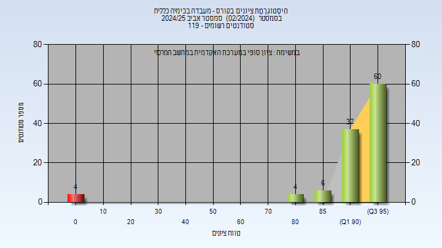

| סטודנטים | עברו/נכשלו | אחוז עוברים | ציון מינימלי | ציון מקסימלי | ממוצע | חציון |
| ---- | ---- | ---- | ---- | ---- | ---- | ---- |
| 111 | 107/4 | 96 | 0 | 99 | 90.712 | 95 |

<h2 id="202401">חורף 2024-2025</h2>

| איש סגל | תפקיד |
| ---- | ---- |
| דה-רויטר גרהאם | מרצה - אחראי מקצוע |
| ינוביץ תומר | מתרגל |
| חג'אזי רנין | מתרגל |
| אורישינה אנה | מתרגל |
| סעאידה תאמר | מתרגל |
| הלוי גבריאלה | מדריך מעבדה |

<h3 id="202401-Final_A">סופי מועד א'</h3>

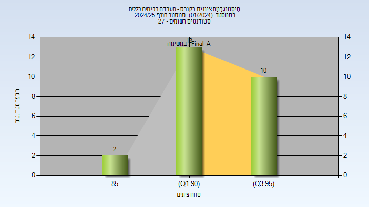

| סטודנטים | עברו/נכשלו | אחוז עוברים | ציון מינימלי | ציון מקסימלי | ממוצע | חציון |
| ---- | ---- | ---- | ---- | ---- | ---- | ---- |
| 25 | 25/0 | 100 | 89 | 98 | 93.84 | 94 |

<h3 id="202401-Finals">סופי</h3>

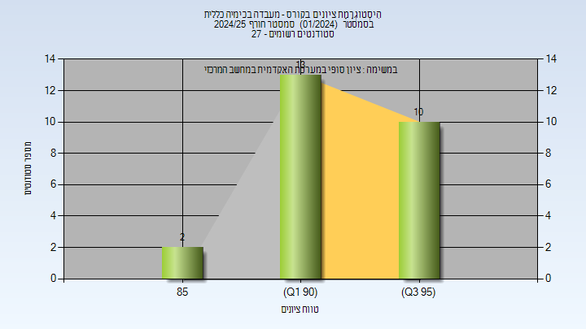

| סטודנטים | עברו/נכשלו | אחוז עוברים | ציון מינימלי | ציון מקסימלי | ממוצע | חציון |
| ---- | ---- | ---- | ---- | ---- | ---- | ---- |
| 25 | 25/0 | 100 | 89 | 98 | 93.84 | 94 |

<h2 id="202302">אביב 2024</h2>

| איש סגל | תפקיד |
| ---- | ---- |
| דה-רויטר גרהאם | מרצה - אחראי מקצוע |
| אורישינה אנה | מדריך מעבדה |
| ינוביץ תומר | מדריך מעבדה |
| הלוי גבריאלה | מדריך מעבדה |
| רחמיאל יאיר | מדריך מעבדה |
| בהר אנסטסיה אסתר | מדריך מעבדה |
| חסן מהדי | מדריך מעבדה |
| יעקוב סעיד | מדריך מעבדה |
| חג'אזי רנין | מדריך מעבדה |

<h3 id="202302-Final_A">סופי מועד א'</h3>

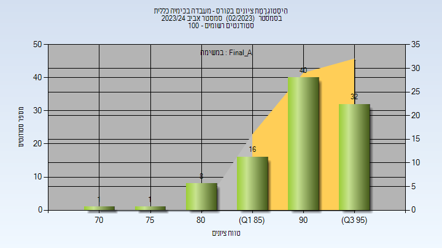

| סטודנטים | עברו/נכשלו | אחוז עוברים | ציון מינימלי | ציון מקסימלי | ממוצע | חציון |
| ---- | ---- | ---- | ---- | ---- | ---- | ---- |
| 98 | 98/0 | 100 | 73 | 98 | 91.531 | 93 |

<h3 id="202302-Finals">סופי</h3>

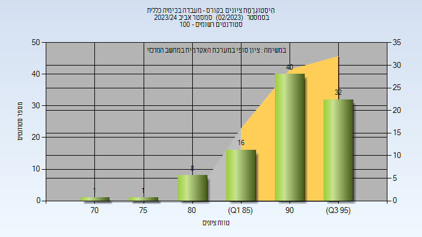

| סטודנטים | עברו/נכשלו | אחוז עוברים | ציון מינימלי | ציון מקסימלי | ממוצע | חציון |
| ---- | ---- | ---- | ---- | ---- | ---- | ---- |
| 98 | 98/0 | 100 | 73 | 98 | 91.531 | 93 |

<h2 id="202301">חורף 2023-2024</h2>

| איש סגל | תפקיד |
| ---- | ---- |
| דה-רויטר גרהאם | מדריך מעבדה - עם הרשאות מרצה אחראי |
| חג'אזי רנין | מדריך מעבדה |
| סקליאר ג'ניה | מדריך מעבדה |
| וורוביוב ניקול | מדריך מעבדה |
| הלוי גבריאלה | סגל מנהלי - עם הרשאות מרצה אחראי |

<h3 id="202301-Final_A">סופי מועד א'</h3>

| סטודנטים | עברו/נכשלו | אחוז עוברים | ציון מינימלי | ציון מקסימלי | ממוצע | חציון |
| ---- | ---- | ---- | ---- | ---- | ---- | ---- |
| 30 | 30/0 | 100 | 80 | 98 | 91.6 | 92.5 |

<h3 id="202301-Finals">סופי</h3>

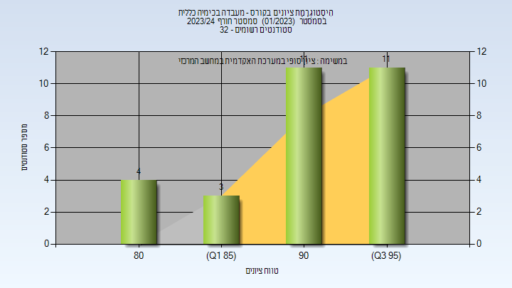

| סטודנטים | עברו/נכשלו | אחוז עוברים | ציון מינימלי | ציון מקסימלי | ממוצע | חציון |
| ---- | ---- | ---- | ---- | ---- | ---- | ---- |
| 29 | 29/0 | 100 | 82 | 98 | 92 | 93 |

<h2 id="202202">אביב 2023</h2>

| איש סגל | תפקיד |
| ---- | ---- |
| חג'אזי רנין | מתרגל |
| יעקוב סעיד | מתרגל |
| ווגט שרלוט | מדריך מעבדה - עם הרשאות מרצה אחראי |
| דה-רויטר גרהאם | מדריך מעבדה |
| עוזרי ענבל | מדריך מעבדה |
| ינוביץ תומר | מדריך מעבדה |
| רפאלי רון | מדריך מעבדה |
| סקליאר ג'ניה | מדריך מעבדה |
| נ'גם סאלי | מדריך מעבדה |
| וורוביוב ניקול | מדריך מעבדה |
| בהר אנסטסיה אסתר | מדריך מעבדה |
| חסן מהדי | מדריך מעבדה |
| הלוי גבריאלה | סגל מנהלי - עם הרשאות מרצה אחראי |

<h3 id="202202-Final_A">סופי מועד א'</h3>

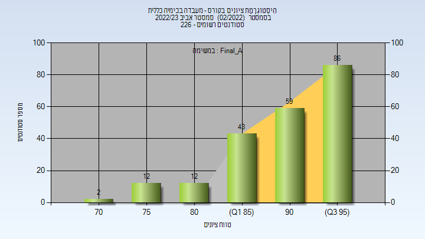

| סטודנטים | עברו/נכשלו | אחוז עוברים | ציון מינימלי | ציון מקסימלי | ממוצע | חציון |
| ---- | ---- | ---- | ---- | ---- | ---- | ---- |
| 214 | 214/0 | 100 | 71 | 99 | 91.477 | 93 |

<h3 id="202202-Finals">סופי</h3>

| סטודנטים | עברו/נכשלו | אחוז עוברים | ציון מינימלי | ציון מקסימלי | ממוצע | חציון |
| ---- | ---- | ---- | ---- | ---- | ---- | ---- |
| 214 | 214/0 | 100 | 71 | 99 | 91.602 | 93 |

<h2 id="202201">חורף 2022-2023</h2>

| איש סגל | תפקיד |
| ---- | ---- |
| שמידט אשר ז"ל | מרצה - אחראי מקצוע |
| דורון דינה | מדריך מעבדה |
| נ'גם סאלי | מדריך מעבדה |
| רפאלי רון | מדריך מעבדה |
| סקליאר ג'ניה | מדריך מעבדה |
| הלוי גבריאלה | סגל מנהלי - עם הרשאות מרצה אחראי |

<h3 id="202201-Final_A">סופי מועד א'</h3>

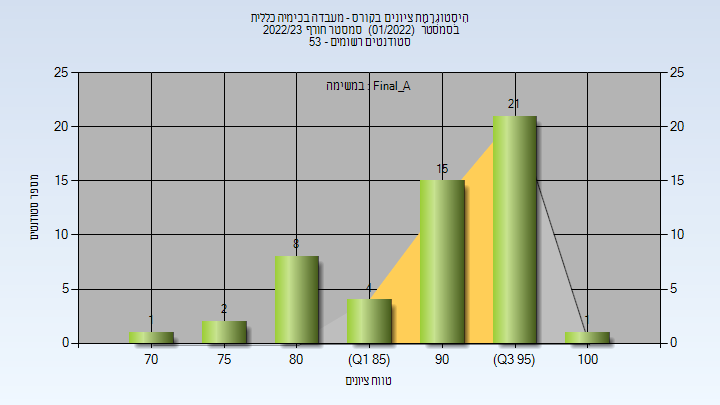

| סטודנטים | עברו/נכשלו | אחוז עוברים | ציון מינימלי | ציון מקסימלי | ממוצע | חציון |
| ---- | ---- | ---- | ---- | ---- | ---- | ---- |
| 52 | 52/0 | 100 | 74 | 101 | 91.154 | 93 |

<h3 id="202201-Finals">סופי</h3>

| סטודנטים | עברו/נכשלו | אחוז עוברים | ציון מינימלי | ציון מקסימלי | ממוצע | חציון |
| ---- | ---- | ---- | ---- | ---- | ---- | ---- |
| 51 | 51/0 | 100 | 74 | 100 | 91.157 | 93 |

<h2 id="202102">אביב 2022</h2>

| איש סגל | תפקיד |
| ---- | ---- |
| דה-רויטר גרהאם | מדריך מעבדה - עם הרשאות מרצה אחראי |
| ווגט שרלוט | מדריך מעבדה |
| אגמי איריס | מדריך מעבדה |
| פישמן עדי | מדריך מעבדה |
| זלנר-יפע משה מיכאל | מדריך מעבדה |
| סויסה שלייף מעיין | מדריך מעבדה |
| קעיק מריה | מדריך מעבדה |
| בהר אנסטסיה אסתר | מדריך מעבדה |
| נ'גם סאלי | מדריך מעבדה |
| רפאלי רון | מדריך מעבדה |
| סקליאר ג'ניה | מדריך מעבדה |
| וורוביוב ניקול | מדריך מעבדה |
| חמודה ליאן | מדריך מעבדה |
| פישמן עדי | מדריך מעבדה |
| הלוי גבריאלה | סגל מנהלי - עם הרשאות מרצה אחראי |

<h3 id="202102-Final_A">סופי מועד א'</h3>

| סטודנטים | עברו/נכשלו | אחוז עוברים | ציון מינימלי | ציון מקסימלי | ממוצע | חציון |
| ---- | ---- | ---- | ---- | ---- | ---- | ---- |
| 287 | 284/3 | 99 | 28 | 99 | 90.502 | 93 |

<h3 id="202102-Finals">סופי</h3>

| סטודנטים | עברו/נכשלו | אחוז עוברים | ציון מינימלי | ציון מקסימלי | ממוצע | חציון |
| ---- | ---- | ---- | ---- | ---- | ---- | ---- |
| 286 | 283/3 | 99 | 28 | 99 | 90.514 | 93 |

<h2 id="202101">חורף 2021-2022</h2>

| איש סגל | תפקיד |
| ---- | ---- |
| שמידט אשר ז"ל | מרצה - אחראי מקצוע |
| היימן עדי | מרצה |

<h3 id="202101-Final_A">סופי מועד א'</h3>

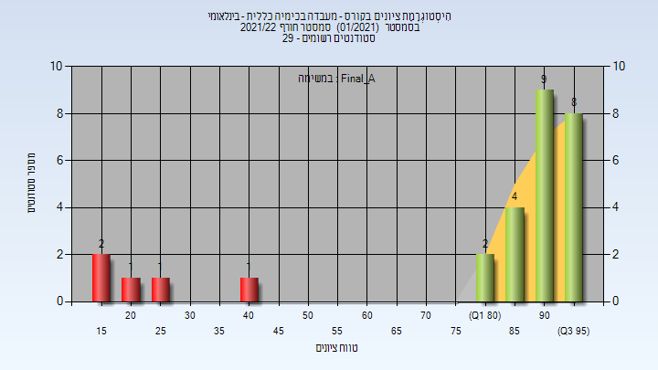

| סטודנטים | עברו/נכשלו | אחוז עוברים | ציון מינימלי | ציון מקסימלי | ממוצע | חציון |
| ---- | ---- | ---- | ---- | ---- | ---- | ---- |
| 28 | 23/5 | 82 | 16 | 97 | 80 | 91 |

<h3 id="202101-Finals">סופי</h3>

| סטודנטים | עברו/נכשלו | אחוז עוברים | ציון מינימלי | ציון מקסימלי | ממוצע | חציון |
| ---- | ---- | ---- | ---- | ---- | ---- | ---- |
| 28 | 23/5 | 82 | 16 | 97 | 80 | 91 |

<h2 id="202002">אביב 2021</h2>

| איש סגל | תפקיד |
| ---- | ---- |
| דה-רויטר גרהאם | מדריך מעבדה - עם הרשאות מרצה אחראי |
| פוקרא מוחמד | מדריך מעבדה |
| הלוי גבריאלה | מדריך מעבדה |
| עמירב דרורי לילך | מדריך מעבדה |
| מעדי דיאנה | מדריך מעבדה |
| ג'רפי אלינור | מדריך מעבדה |
| עתאמלה פאטמה | מדריך מעבדה |
| סקליאר ג'ניה | מדריך מעבדה |
| פרשל מאיה | מדריך מעבדה |
| אגמי איריס | מדריך מעבדה |
| גלוז נעמה | מדריך מעבדה |
| בהר אנסטסיה אס | מדריך מעבדה |
| נ'גם סאלי | מדריך מעבדה |

<h3 id="202002-Final_A">סופי מועד א'</h3>

| סטודנטים | עברו/נכשלו | אחוז עוברים | ציון מינימלי | ציון מקסימלי | ממוצע | חציון |
| ---- | ---- | ---- | ---- | ---- | ---- | ---- |
| 297 | 297/0 | 100 | 68 | 99 | 93.461 | 94 |

<h3 id="202002-Finals">סופי</h3>

| סטודנטים | עברו/נכשלו | אחוז עוברים | ציון מינימלי | ציון מקסימלי | ממוצע | חציון |
| ---- | ---- | ---- | ---- | ---- | ---- | ---- |
| 297 | 297/0 | 100 | 68 | 99 | 93.471 | 94 |

<h2 id="202001">חורף 2020-2021</h2>

| איש סגל | תפקיד |
| ---- | ---- |
| שמידט אשר ז"ל | מדריך מעבדה - עם הרשאות מרצה אחראי |
| אטרש מוחמד | מדריך מעבדה |
| זלנר-יפע משה מיכאל | מדריך מעבדה |
| פרשל מאיה | מדריך מעבדה |
| בהר אנסטסיה אס | מדריך מעבדה |
| הלוי גבריאלה | סגל מנהלי - עם הרשאות מרצה אחראי |

<h3 id="202001-Final_A">סופי מועד א'</h3>

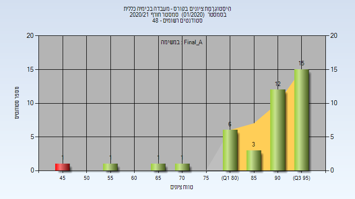

| סטודנטים | עברו/נכשלו | אחוז עוברים | ציון מינימלי | ציון מקסימלי | ממוצע | חציון |
| ---- | ---- | ---- | ---- | ---- | ---- | ---- |
| 40 | 39/1 | 98 | 48 | 99 | 89.1 | 93 |

<h3 id="202001-Finals">סופי</h3>

| סטודנטים | עברו/נכשלו | אחוז עוברים | ציון מינימלי | ציון מקסימלי | ממוצע | חציון |
| ---- | ---- | ---- | ---- | ---- | ---- | ---- |
| 40 | 39/1 | 98 | 48 | 99 | 89.1 | 93 |

<h2 id="201902">אביב 2020</h2>

| איש סגל | תפקיד |
| ---- | ---- |
| דה-רויטר גראהם | מדריך מעבדה - עם הרשאות מרצה אחראי |
| עמירב דרורי לילך | מדריך מעבדה |
| אגמי איריס | מדריך מעבדה |
| פוקרא מוחמד | מדריך מעבדה |
| מג'דוב מחמוד | מדריך מעבדה |
| שויחט חגית | מדריך מעבדה |
| פרשל מאיה | מדריך מעבדה |
| עתאמלה פאטמה | מדריך מעבדה |
| סקליאר ג'ניה | מדריך מעבדה |
| אטרש מוחמד | מדריך מעבדה |
| בהר אנסטסיה אסתר | מדריך מעבדה |
| זלנר-יפע משה מיכאל | מדריך מעבדה |
| טבק שיר | מדריך מעבדה |
| פריאנטה עדי | מדריך מעבדה |
| הלוי גבריאלה | סגל מנהלי - עם הרשאות מרצה אחראי |

<h3 id="201902-Final_A">סופי מועד א'</h3>

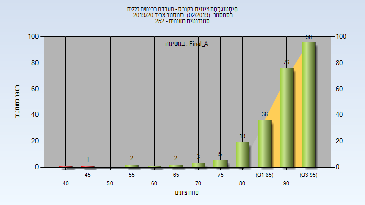

| סטודנטים | עברו/נכשלו | אחוז עוברים | ציון מינימלי | ציון מקסימלי | ממוצע | חציון |
| ---- | ---- | ---- | ---- | ---- | ---- | ---- |
| 242 | 240/2 | 99 | 44 | 99 | 91.021 | 93 |

<h3 id="201902-Finals">סופי</h3>

| סטודנטים | עברו/נכשלו | אחוז עוברים | ציון מינימלי | ציון מקסימלי | ממוצע | חציון |
| ---- | ---- | ---- | ---- | ---- | ---- | ---- |
| 243 | 240/3 | 99 | 44 | 99 | 90.84 | 93 |

<h2 id="201901">חורף 2019-2020</h2>

| איש סגל | תפקיד |
| ---- | ---- |
| שמידט אשר | מדריך מעבדה - עם הרשאות מרצה אחראי |
| זלנר-יפע משה מיכאל | מדריך מעבדה |
| אטרש מוחמד | מדריך מעבדה |
| בהר אנסטסיה אס | מדריך מעבדה |
| הלוי גבריאלה | סגל מנהלי - עם הרשאות מרצה אחראי |

<h3 id="201901-Final_A">סופי מועד א'</h3>

| סטודנטים | עברו/נכשלו | אחוז עוברים | ציון מינימלי | ציון מקסימלי | ממוצע | חציון |
| ---- | ---- | ---- | ---- | ---- | ---- | ---- |
| 27 | 27/0 | 100 | 76 | 97 | 91.185 | 92 |

<h3 id="201901-Finals">סופי</h3>

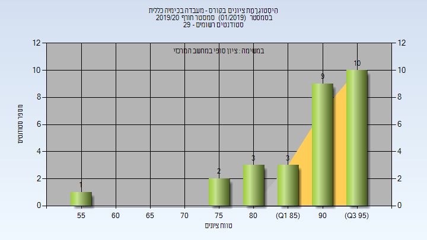

| סטודנטים | עברו/נכשלו | אחוז עוברים | ציון מינימלי | ציון מקסימלי | ממוצע | חציון |
| ---- | ---- | ---- | ---- | ---- | ---- | ---- |
| 28 | 28/0 | 100 | 55 | 97 | 89.893 | 93 |

<h2 id="201802">אביב 2019</h2>

| איש סגל | תפקיד |
| ---- | ---- |
| דה-רויטר גראהם | מדריך מעבדה - עם הרשאות מרצה אחראי |
| עמירב דרורי לילך |  |
| טרביה טארק | מדריך מעבדה |
| פוקרא מוחמד | מדריך מעבדה |
| אבו סאלח דועא | מדריך מעבדה |
| פרשל מאיה | מדריך מעבדה |
| ארוסטמיאן סופיה | מדריך מעבדה |
| בורשטיין תומר | מדריך מעבדה |
| הריס לימור | מדריך מעבדה |
| אטרש מוחמד | מדריך מעבדה |
| סויסה שלייף מעיין | מדריך מעבדה |
| פריאנטה עדי | מדריך מעבדה |
| זלנר-יפע משה מיכאל | מדריך מעבדה |
| יוחנובסקי אנה | מדריך מעבדה |
| נ'גם סאלי | מדריך מעבדה |
| לוינמן מריה | מדריך מעבדה |
| הלוי גבריאלה | סגל מנהלי - עם הרשאות מרצה אחראי |

<h3 id="201802-Final_A">סופי מועד א'</h3>

| סטודנטים | עברו/נכשלו | אחוז עוברים | ציון מינימלי | ציון מקסימלי | ממוצע | חציון |
| ---- | ---- | ---- | ---- | ---- | ---- | ---- |
| 277 | 274/3 | 99 | 34 | 98 | 89.715 | 91 |

<h3 id="201802-Finals">סופי</h3>

| סטודנטים | עברו/נכשלו | אחוז עוברים | ציון מינימלי | ציון מקסימלי | ממוצע | חציון |
| ---- | ---- | ---- | ---- | ---- | ---- | ---- |
| 277 | 274/3 | 99 | 34 | 98 | 89.704 | 91 |

<h2 id="201801">חורף 2018-2019</h2>

| איש סגל | תפקיד |
| ---- | ---- |
| שמידט אשר | מדריך מעבדה - עם הרשאות מרצה אחראי |
| דה-רויטר גראהם |  |
| עמירב דרורי לילך |  |
| אטרש מוחמד | מדריך מעבדה |
| זלנר-יפע משה מיכאל | מדריך מעבדה |
| לוינמן מריה | מדריך מעבדה |
| הלוי גבריאלה | סגל מנהלי - עם הרשאות מרצה אחראי |

<h3 id="201801-Final_A">סופי מועד א'</h3>

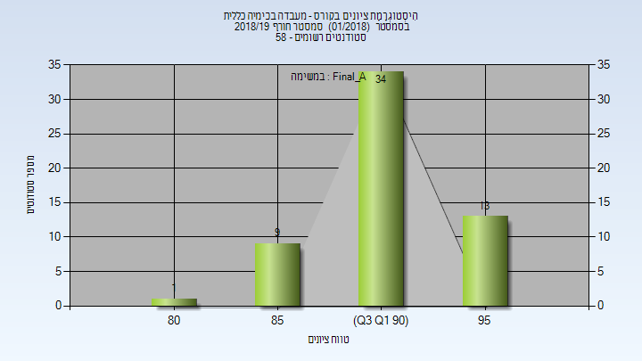

| סטודנטים | עברו/נכשלו | אחוז עוברים | ציון מינימלי | ציון מקסימלי | ממוצע | חציון |
| ---- | ---- | ---- | ---- | ---- | ---- | ---- |
| 57 | 57/0 | 100 | 84 | 98 | 92.123 | 93 |

<h3 id="201801-Finals">סופי</h3>

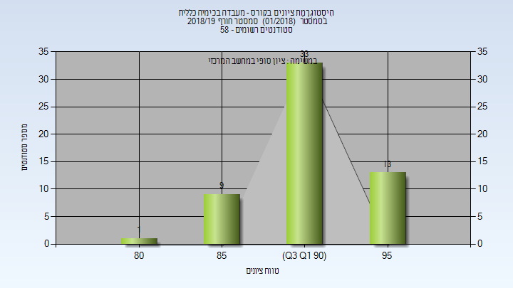

| סטודנטים | עברו/נכשלו | אחוז עוברים | ציון מינימלי | ציון מקסימלי | ממוצע | חציון |
| ---- | ---- | ---- | ---- | ---- | ---- | ---- |
| 56 | 56/0 | 100 | 84 | 98 | 92.107 | 93 |

<h2 id="201702">אביב 2018</h2>

| איש סגל | תפקיד |
| ---- | ---- |
| מעין גליה | מדריך מעבדה - עם הרשאות מרצה אחראי |
| צ'ונטונוב לב | מדריך מעבדה |
| הלוי גבריאלה | מדריך מעבדה |
| בסקין מריה | מדריך מעבדה |
| כדורי מאיה | מדריך מעבדה |
| חריטן עידן | מדריך מעבדה |
| אגמי איריס | מדריך מעבדה |
| אנגלברג לי | מדריך מעבדה |
| זלנר-יפע משה מיכאל | מדריך מעבדה |
| לוינמן מריה | מדריך מעבדה |
| גלוז נעמה | מדריך מעבדה |
| פרשל מאיה | מדריך מעבדה |
| גולדמן יבגניה | מדריך מעבדה |
| ליבנה אחיה | מדריך מעבדה |

<h3 id="201702-Final_A">סופי מועד א'</h3>

| סטודנטים | עברו/נכשלו | אחוז עוברים | ציון מינימלי | ציון מקסימלי | ממוצע | חציון |
| ---- | ---- | ---- | ---- | ---- | ---- | ---- |
| 281 | 280/1 | 100 | 35 | 99 | 93.274 | 94 |

<h3 id="201702-Finals">סופי</h3>

| סטודנטים | עברו/נכשלו | אחוז עוברים | ציון מינימלי | ציון מקסימלי | ממוצע | חציון |
| ---- | ---- | ---- | ---- | ---- | ---- | ---- |
| 280 | 279/1 | 100 | 35 | 99 | 93.307 | 94 |

<h2 id="201701">חורף 2017-2018</h2>

| איש סגל | תפקיד |
| ---- | ---- |
| דיזנדרוק צ'רלס | מרצה - אחראי מקצוע |
| ליבנה אחיה | מתרגל |
| פרשל מאיה |  |
| זלנר-יפע משה מיכאל |  |
| עוזרי ענבל |  |
| בסקין מריה |  |
| הלוי גבריאלה |  |

<h3 id="201701-Final_A">סופי מועד א'</h3>

| סטודנטים | עברו/נכשלו | אחוז עוברים | ציון מינימלי | ציון מקסימלי | ממוצע | חציון |
| ---- | ---- | ---- | ---- | ---- | ---- | ---- |
| 58 | 58/0 | 100 | 78 | 98 | 92.5 | 94 |

<h3 id="201701-Finals">סופי</h3>

| סטודנטים | עברו/נכשלו | אחוז עוברים | ציון מינימלי | ציון מקסימלי | ממוצע | חציון |
| ---- | ---- | ---- | ---- | ---- | ---- | ---- |
| 125 | 125/0 | 100 | 78 | 98 | 92.728 | 93 |

<h2 id="201602">אביב 2017</h2>

| איש סגל | תפקיד |
| ---- | ---- |
| צ'ונטונוב לב | מרצה - אחראי מקצוע |
| אנגלברג לי | מתרגל |
| בסקין מריה |  |
| זלנר-יפע משה מיכאל |  |
| עוזרי ענבל |  |
| גלנט אור |  |
| הלוי גבריאלה |  |
| שטנברג דגני ירדן |  |
| מקרוב קונסטנטין |  |
| גלוז נעמה |  |
| קאושנסקי אלכסנדר |  |
| פרשל מאיה |  |
| גולדמן יבגניה |  |
| אגמי איריס |  |

<h3 id="201602-Final_A">סופי מועד א'</h3>

| סטודנטים | עברו/נכשלו | אחוז עוברים | ציון מינימלי | ציון מקסימלי | ממוצע | חציון |
| ---- | ---- | ---- | ---- | ---- | ---- | ---- |
| 368 | 365/3 | 99 | 36 | 98 | 90.478 | 93 |

<h3 id="201602-Finals">סופי</h3>

| סטודנטים | עברו/נכשלו | אחוז עוברים | ציון מינימלי | ציון מקסימלי | ממוצע | חציון |
| ---- | ---- | ---- | ---- | ---- | ---- | ---- |
| 366 | 363/3 | 99 | 36 | 98 | 90.615 | 93 |

<h2 id="201601">חורף 2016-2017</h2>

| איש סגל | תפקיד |
| ---- | ---- |
| דיזנדרוק צ'רלס | מרצה - אחראי מקצוע |
| זלנר-יפע משה מיכאל | מתרגל |
| הלוי גבריאלה |  |
| אגמי איריס |  |
| עוזרי ענבל |  |

<h3 id="201601-Final_A">סופי מועד א'</h3>

| סטודנטים | עברו/נכשלו | אחוז עוברים | ציון מינימלי | ציון מקסימלי | ממוצע | חציון |
| ---- | ---- | ---- | ---- | ---- | ---- | ---- |
| 38 | 37/1 | 97 | 52 | 95 | 85.263 | 87.5 |

<h3 id="201601-Finals">סופי</h3>

| סטודנטים | עברו/נכשלו | אחוז עוברים | ציון מינימלי | ציון מקסימלי | ממוצע | חציון |
| ---- | ---- | ---- | ---- | ---- | ---- | ---- |
| 57 | 56/1 | 98 | 52 | 97 | 87.281 | 90 |

<h2 id="201502">אביב 2016</h2>

| איש סגל | תפקיד |
| ---- | ---- |
| מעין גליה | מרצה - אחראי מקצוע |
| חריטן עידן | מתרגל |
| נואטחה מיכאל | מתרגל |
| בסקין מריה | מתרגל |
| משין יבגני | מתרגל |
| פרשל מאיה | מתרגל |
| אבו חרירי אזהאר | מתרגל |
| לנדאו ילנה | מתרגל |
| אביגדורי עידן | מתרגל |
| אגמי איריס | מתרגל |
| זלנר-יפע משה מיכאל | מתרגל |
| עוזרי ענבל | מתרגל |
| גלנט אור | מתרגל |
| הלוי גבריאלה | סגל מנהלי - עם הרשאות מרצה אחראי |

<h3 id="201502-Final_A">סופי מועד א'</h3>

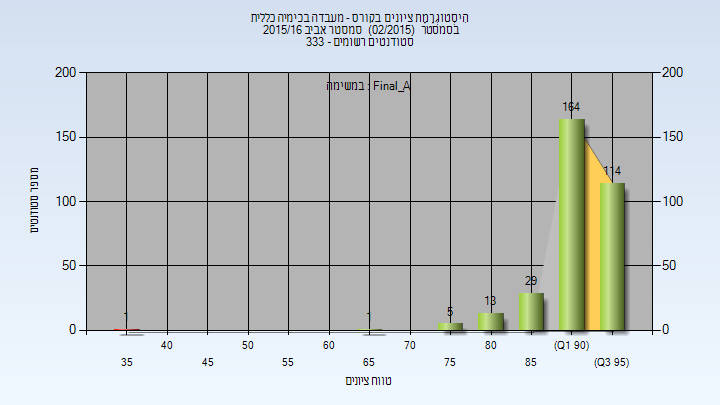

| סטודנטים | עברו/נכשלו | אחוז עוברים | ציון מינימלי | ציון מקסימלי | ממוצע | חציון |
| ---- | ---- | ---- | ---- | ---- | ---- | ---- |
| 327 | 326/1 | 100 | 39 | 99 | 92.511 | 94 |

<h3 id="201502-Finals">סופי</h3>

| סטודנטים | עברו/נכשלו | אחוז עוברים | ציון מינימלי | ציון מקסימלי | ממוצע | חציון |
| ---- | ---- | ---- | ---- | ---- | ---- | ---- |
| 327 | 326/1 | 100 | 39 | 99 | 92.511 | 94 |

<h2 id="201402">אביב 2015</h2>

| איש סגל | תפקיד |
| ---- | ---- |
| אישן יואב | מרצה - אחראי מקצוע |
| טיגר הגר | מתרגל |
| סמוליאקיב אליסה | מתרגל |
| קרני נורית | מתרגל |
| גולדמן יבגניה | מתרגל |
| דנטוס מאוריסיו | מתרגל |
| פרשל מאיה | מתרגל |
| זלנר-יפע משה מיכאל | מתרגל |
| בסקין מריה | מתרגל |
| יחזקאל שני | מתרגל |
| חריטן עידן | מתרגל |
| שטנברג דגני ירדן | מתרגל |
| הלוי גבריאלה | סגל מנהלי - עם הרשאות מרצה אחראי |

<h3 id="201402-Final_A">סופי מועד א'</h3>

| סטודנטים | עברו/נכשלו | אחוז עוברים | ציון מינימלי | ציון מקסימלי | ממוצע | חציון |
| ---- | ---- | ---- | ---- | ---- | ---- | ---- |
| 327 | 327/0 | 100 | 67 | 98 | 91.434 | 93 |

<h3 id="201402-Finals">סופי</h3>

| סטודנטים | עברו/נכשלו | אחוז עוברים | ציון מינימלי | ציון מקסימלי | ממוצע | חציון |
| ---- | ---- | ---- | ---- | ---- | ---- | ---- |
| 328 | 328/0 | 100 | 67 | 98 | 91.439 | 93 |

<h2 id="201302">אביב 2014</h2>

| איש סגל | תפקיד |
| ---- | ---- |
| רהב סער | מרצה - אחראי מקצוע |
| יחזקאל שני | מתרגל |
| בסקין מריה | מתרגל |
| רטנר תמר | מתרגל |
| רזניק איל | מתרגל |
| טייב-פליגלמן עינב | מתרגל |
| חריטן עידן | מתרגל |
| טלמון אינה | מתרגל |
| טיגר הגר | מתרגל |
| פרשל מאיה | מתרגל |
| הלוי גבריאלה | סגל מנהלי - עם הרשאות מרצה אחראי |

<h3 id="201302-Final_A">סופי מועד א'</h3>

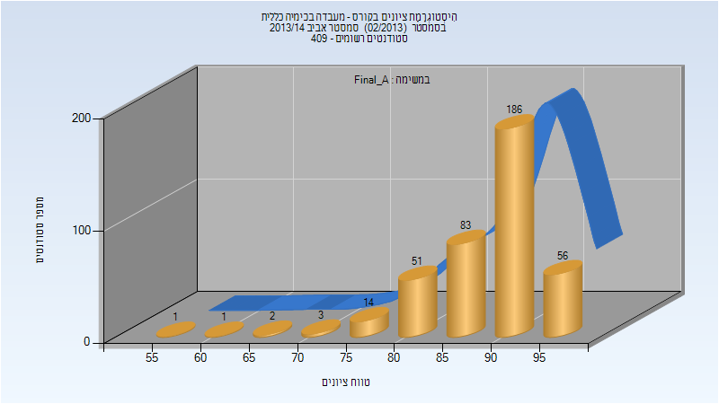

| סטודנטים | עברו/נכשלו | אחוז עוברים | ציון מינימלי | ציון מקסימלי | ממוצע | חציון |
| ---- | ---- | ---- | ---- | ---- | ---- | ---- |
| 397 | 397/0 | 100 | 59 | 98 | 89.542 | 91 |

<h2 id="201301">חורף 2013-2014</h2>

| איש סגל | תפקיד |
| ---- | ---- |
| אישן יואב | מרצה - אחראי מקצוע |
| רטנר תמר | מתרגל |
| טלמון אינה | מתרגל |
| הלוי גבריאלה | מתרגל |
| יענקילביץ תמרה | מתרגל |
| טייב-פליגלמן עינב | מתרגל |

<h3 id="201301-Final_A">סופי מועד א'</h3>

| סטודנטים | עברו/נכשלו | אחוז עוברים | ציון מינימלי | ציון מקסימלי | ממוצע | חציון |
| ---- | ---- | ---- | ---- | ---- | ---- | ---- |
| 55 | 55/0 | 100 | 55 | 95 | 82.818 | 85 |

<h2 id="201202">אביב 2013</h2>

| איש סגל | תפקיד |
| ---- | ---- |
| שמידט אשר | מרצה - אחראי מקצוע |
| טייב-פליגלמן עינב | מתרגל |
| רזניק איל | מתרגל |
| טלמון אינה | מתרגל |
| הלוי גבריאלה | מתרגל |
| רוזלר חיים | מתרגל |
| קאושנסקי אלכסנדר | מתרגל |
| בלומקין מוריה | מתרגל |
| סמולקין בוריס | מתרגל |
| רטנר תמר | מתרגל |
| חיימוב אלוירה | מתרגל |
| אוסקר לירון | מתרגל |
| שטנברג דגני ירדן | מתרגל |

<h3 id="201202-Final_A">סופי מועד א'</h3>

| סטודנטים | עברו/נכשלו | אחוז עוברים | ציון מינימלי | ציון מקסימלי | ממוצע | חציון |
| ---- | ---- | ---- | ---- | ---- | ---- | ---- |
| 346 | 332/14 | 96 | 10 | 97 | 81.971 | 85 |

