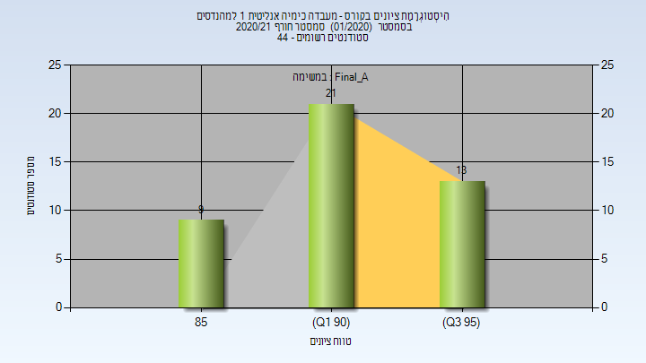
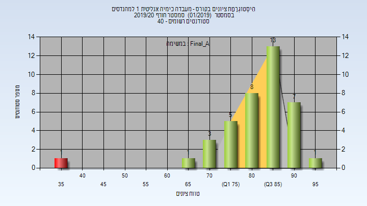

# 01250102 - מעבדה כימיה אנליטית 1 למהנדסים

**הערה**: מאגר ההיסטוגרמות הוקם עבור [CheeseFork](https://cheesefork.cf/), כלי בניית מערכת שעות עבור סטודנטים בטכניון. באתר בו אתם גולשים ניתן לעיין בהיסטוגרמות, אך הדרך היותר נוחה היא לעיין בהיסטוגרמות, ובמידע נוסף כגון חוות דעת של סטודנטים, באתר CheeseFork.

* [חורף 2024-2025](#202401)
  * [סופי מועד א'](#202401-Final_A)
  * [סופי](#202401-Finals)
* [חורף 2023-2024](#202301)
  * [סופי מועד א'](#202301-Final_A)
  * [סופי](#202301-Finals)
* [חורף 2022-2023](#202201)
  * [סופי מועד א'](#202201-Final_A)
  * [סופי](#202201-Finals)
* [חורף 2021-2022](#202101)
  * [סופי מועד א'](#202101-Final_A)
  * [סופי](#202101-Finals)
* [חורף 2020-2021](#202001)
  * [סופי מועד א'](#202001-Final_A)
  * [סופי](#202001-Finals)
* [חורף 2019-2020](#201901)
  * [סופי מועד א'](#201901-Final_A)
  * [סופי](#201901-Finals)
* [חורף 2018-2019](#201801)
  * [סופי מועד א'](#201801-Final_A)
  * [סופי](#201801-Finals)
* [חורף 2017-2018](#201701)
  * [סופי מועד א'](#201701-Final_A)
  * [סופי](#201701-Finals)
* [חורף 2016-2017](#201601)
  * [סופי מועד א'](#201601-Final_A)
  * [סופי](#201601-Finals)
* [חורף 2015-2016](#201501)
  * [סופי מועד א'](#201501-Final_A)
  * [סופי](#201501-Finals)

<h2 id="202401">חורף 2024-2025</h2>

| איש סגל | תפקיד |
| ---- | ---- |
| איזנברג דוד | מרצה - אחראי מקצוע |
| ברזילי איריס | מתרגל - עם הרשאות מרצה אחראי |
| רואן שאהין | מדריך מעבדה |
| שויחט חגית | מדריך מעבדה |
| שומסקי אולג אלי | מדריך מעבדה |
| פאס תמר | מדריך מעבדה |
| קעיק מריה | מדריך מעבדה |
| סקליאר ג'ניה | מדריך מעבדה |
| סעיד בשיר | מדריך מעבדה |

<h3 id="202401-Final_A">סופי מועד א'</h3>

| סטודנטים | עברו/נכשלו | אחוז עוברים | ציון מינימלי | ציון מקסימלי | ממוצע | חציון |
| ---- | ---- | ---- | ---- | ---- | ---- | ---- |
| 40 | 40/0 | 100 | 63 | 97 | 89.075 | 91.5 |

<h3 id="202401-Finals">סופי</h3>

| סטודנטים | עברו/נכשלו | אחוז עוברים | ציון מינימלי | ציון מקסימלי | ממוצע | חציון |
| ---- | ---- | ---- | ---- | ---- | ---- | ---- |
| 105 | 105/0 | 100 | 63 | 97 | 89.086 | 90 |

<h2 id="202301">חורף 2023-2024</h2>

| איש סגל | תפקיד |
| ---- | ---- |
| איזנברג דוד | מרצה - אחראי מקצוע |
| שומסקי אולג אלי | מדריך מעבדה |
| בהר אנסטסיה אס | מדריך מעבדה |
| טולדו הילה | מדריך מעבדה |
| וורוביוב ניקול | מדריך מעבדה |
| בשקורוב רומן | מדריך מעבדה |

<h3 id="202301-Final_A">סופי מועד א'</h3>

| סטודנטים | עברו/נכשלו | אחוז עוברים | ציון מינימלי | ציון מקסימלי | ממוצע | חציון |
| ---- | ---- | ---- | ---- | ---- | ---- | ---- |
| 33 | 33/0 | 100 | 61 | 97 | 88.515 | 91 |

<h3 id="202301-Finals">סופי</h3>

| סטודנטים | עברו/נכשלו | אחוז עוברים | ציון מינימלי | ציון מקסימלי | ממוצע | חציון |
| ---- | ---- | ---- | ---- | ---- | ---- | ---- |
| 33 | 33/0 | 100 | 61 | 97 | 88.515 | 91 |

<h2 id="202201">חורף 2022-2023</h2>

| איש סגל | תפקיד |
| ---- | ---- |
| איזנברג דוד | מרצה - אחראי מקצוע |
| סקליאר ג'ניה | מדריך מעבדה |
| שומסקי אולג אלי | מדריך מעבדה |
| שרון אוריה | מדריך מעבדה |
| קעיק מריה | מדריך מעבדה |
| לייפר רחל | מדריך מעבדה |

<h3 id="202201-Final_A">סופי מועד א'</h3>

| סטודנטים | עברו/נכשלו | אחוז עוברים | ציון מינימלי | ציון מקסימלי | ממוצע | חציון |
| ---- | ---- | ---- | ---- | ---- | ---- | ---- |
| 37 | 37/0 | 100 | 73 | 98 | 91.324 | 93 |

<h3 id="202201-Finals">סופי</h3>

| סטודנטים | עברו/נכשלו | אחוז עוברים | ציון מינימלי | ציון מקסימלי | ממוצע | חציון |
| ---- | ---- | ---- | ---- | ---- | ---- | ---- |
| 35 | 35/0 | 100 | 82 | 98 | 92.286 | 93 |

<h2 id="202101">חורף 2021-2022</h2>

| איש סגל | תפקיד |
| ---- | ---- |
| איזנברג דוד | מדריך מעבדה - עם הרשאות מרצה אחראי |
| חמודה ליאן | מדריך מעבדה |
| מג'דוב מחמוד | מדריך מעבדה |
| זרטל יובל | מדריך מעבדה |
| עוזר גל | מדריך מעבדה |
| בוקטוב אליסה | מדריך מעבדה |
| בהר אנסטסיה אס | מדריך מעבדה |
| עואד מוחמד | מדריך מעבדה |
| לוצקי גיא | מדריך מעבדה |
| אגמי איריס | מדריך מעבדה |
| לויט ריטה | מדריך מעבדה |
| לוי שי | מדריך מעבדה |

<h3 id="202101-Final_A">סופי מועד א'</h3>

| סטודנטים | עברו/נכשלו | אחוז עוברים | ציון מינימלי | ציון מקסימלי | ממוצע | חציון |
| ---- | ---- | ---- | ---- | ---- | ---- | ---- |
| 47 | 47/0 | 100 | 79 | 95 | 88.936 | 89 |

<h3 id="202101-Finals">סופי</h3>

| סטודנטים | עברו/נכשלו | אחוז עוברים | ציון מינימלי | ציון מקסימלי | ממוצע | חציון |
| ---- | ---- | ---- | ---- | ---- | ---- | ---- |
| 47 | 47/0 | 100 | 79 | 95 | 88.936 | 89 |

<h2 id="202001">חורף 2020-2021</h2>

| איש סגל | תפקיד |
| ---- | ---- |
| איזנברג דוד | מדריך מעבדה - עם הרשאות מרצה אחראי |
| נהור עודד | מדריך מעבדה |
| לפס שי | מדריך מעבדה |
| רובינשטיין הילה | מדריך מעבדה |
| אגמי איריס | מדריך מעבדה |
| בורג טליה | מדריך מעבדה |
| פוקרא מוחמד | מדריך מעבדה |
| ליבני אורית | מדריך מעבדה |
| בשקורוב רומן | מדריך מעבדה |
| הוטנר שוורץ גבריאלה | מדריך מעבדה |

<h3 id="202001-Final_A">סופי מועד א'</h3>

| סטודנטים | עברו/נכשלו | אחוז עוברים | ציון מינימלי | ציון מקסימלי | ממוצע | חציון |
| ---- | ---- | ---- | ---- | ---- | ---- | ---- |
| 43 | 43/0 | 100 | 86 | 99 | 92.442 | 92 |

<h3 id="202001-Finals">סופי</h3>

| סטודנטים | עברו/נכשלו | אחוז עוברים | ציון מינימלי | ציון מקסימלי | ממוצע | חציון |
| ---- | ---- | ---- | ---- | ---- | ---- | ---- |
| 44 | 44/0 | 100 | 86 | 99 | 92.386 | 92.5 |

<h2 id="201901">חורף 2019-2020</h2>

| איש סגל | תפקיד |
| ---- | ---- |
| איזנברג דוד | מדריך מעבדה - עם הרשאות מרצה אחראי |
| נואטחה מיכאל | מדריך מעבדה |
| ליבוביץ ליאב | מדריך מעבדה |
| מסללם מונא | מדריך מעבדה |
| לפס שי | מדריך מעבדה |
| טולדו הילה | מדריך מעבדה |
| שויחט חגית | מדריך מעבדה |
| סקליאר ג'ניה | מדריך מעבדה |

<h3 id="201901-Final_A">סופי מועד א'</h3>

| סטודנטים | עברו/נכשלו | אחוז עוברים | ציון מינימלי | ציון מקסימלי | ממוצע | חציון |
| ---- | ---- | ---- | ---- | ---- | ---- | ---- |
| 39 | 38/1 | 97 | 38 | 95 | 82.846 | 85 |

<h3 id="201901-Finals">סופי</h3>

| סטודנטים | עברו/נכשלו | אחוז עוברים | ציון מינימלי | ציון מקסימלי | ממוצע | חציון |
| ---- | ---- | ---- | ---- | ---- | ---- | ---- |
| 39 | 38/1 | 97 | 38 | 95 | 82.846 | 85 |

<h2 id="201801">חורף 2018-2019</h2>

| איש סגל | תפקיד |
| ---- | ---- |
| איזנברג דוד | מרצה - אחראי מקצוע |
| לוצקי איתי | מדריך מעבדה |
| בר צבי שירה | מדריך מעבדה |
| סויסה שלייף מעיין | מדריך מעבדה |
| מסללם מונא | מדריך מעבדה |

<h3 id="201801-Final_A">סופי מועד א'</h3>

| סטודנטים | עברו/נכשלו | אחוז עוברים | ציון מינימלי | ציון מקסימלי | ממוצע | חציון |
| ---- | ---- | ---- | ---- | ---- | ---- | ---- |
| 27 | 27/0 | 100 | 73.977 | 96.686 | 89.712 | 90.9 |

<h3 id="201801-Finals">סופי</h3>

| סטודנטים | עברו/נכשלו | אחוז עוברים | ציון מינימלי | ציון מקסימלי | ממוצע | חציון |
| ---- | ---- | ---- | ---- | ---- | ---- | ---- |
| 27 | 27/0 | 100 | 74 | 97 | 89.704 | 91 |

<h2 id="201701">חורף 2017-2018</h2>

| איש סגל | תפקיד |
| ---- | ---- |
| בלנק אהרן | מדריך מעבדה - עם הרשאות מרצה אחראי |
| עבד אלהאדי מיכאל |  |
| זלמן בת-חן |  |
| גולדשטיין יוליה |  |
| לוי חרות |  |
| סויסה שלייף מעיין |  |
| יוחנובסקי אנה |  |
| איזנברג דוד |  |
| לפס שי |  |
| בר צבי שירה |  |
| מסללם מונא |  |

<h3 id="201701-Final_A">סופי מועד א'</h3>

| סטודנטים | עברו/נכשלו | אחוז עוברים | ציון מינימלי | ציון מקסימלי | ממוצע | חציון |
| ---- | ---- | ---- | ---- | ---- | ---- | ---- |
| 41 | 41/0 | 100 | 56 | 94 | 85.073 | 89 |

<h3 id="201701-Finals">סופי</h3>

| סטודנטים | עברו/נכשלו | אחוז עוברים | ציון מינימלי | ציון מקסימלי | ממוצע | חציון |
| ---- | ---- | ---- | ---- | ---- | ---- | ---- |
| 41 | 41/0 | 100 | 56 | 94 | 85.073 | 89 |

<h2 id="201601">חורף 2016-2017</h2>

| איש סגל | תפקיד |
| ---- | ---- |
| בלנק אהרן | מרצה - אחראי מקצוע |
| הרוש עדי |  |
| גלנט אור |  |
| גולדשטיין יוליה |  |
| נואטחה מיכאל |  |
| יוחנובסקי אנה |  |
| מקרוב קונסטנטין |  |
| לנדאו ילנה |  |
| פרשל מאיה |  |
| פרי-גל אפרת |  |

<h3 id="201601-Final_A">סופי מועד א'</h3>

| סטודנטים | עברו/נכשלו | אחוז עוברים | ציון מינימלי | ציון מקסימלי | ממוצע | חציון |
| ---- | ---- | ---- | ---- | ---- | ---- | ---- |
| 45 | 45/0 | 100 | 66 | 96 | 89.311 | 91 |

<h3 id="201601-Finals">סופי</h3>

| סטודנטים | עברו/נכשלו | אחוז עוברים | ציון מינימלי | ציון מקסימלי | ממוצע | חציון |
| ---- | ---- | ---- | ---- | ---- | ---- | ---- |
| 66 | 66/0 | 100 | 66 | 96 | 89.424 | 91 |

<h2 id="201501">חורף 2015-2016</h2>

| איש סגל | תפקיד |
| ---- | ---- |
| בלנק אהרן | מרצה - אחראי מקצוע |

<h3 id="201501-Final_A">סופי מועד א'</h3>

| סטודנטים | עברו/נכשלו | אחוז עוברים | ציון מינימלי | ציון מקסימלי | ממוצע | חציון |
| ---- | ---- | ---- | ---- | ---- | ---- | ---- |
| 64 | 64/0 | 100 | 69 | 97 | 88.859 | 90 |

<h3 id="201501-Finals">סופי</h3>

| סטודנטים | עברו/נכשלו | אחוז עוברים | ציון מינימלי | ציון מקסימלי | ממוצע | חציון |
| ---- | ---- | ---- | ---- | ---- | ---- | ---- |
| 64 | 64/0 | 100 | 69 | 97 | 88.859 | 90 |

