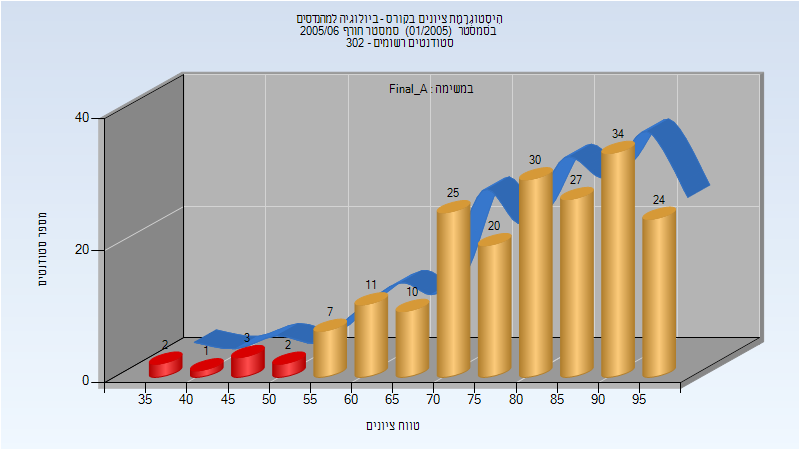
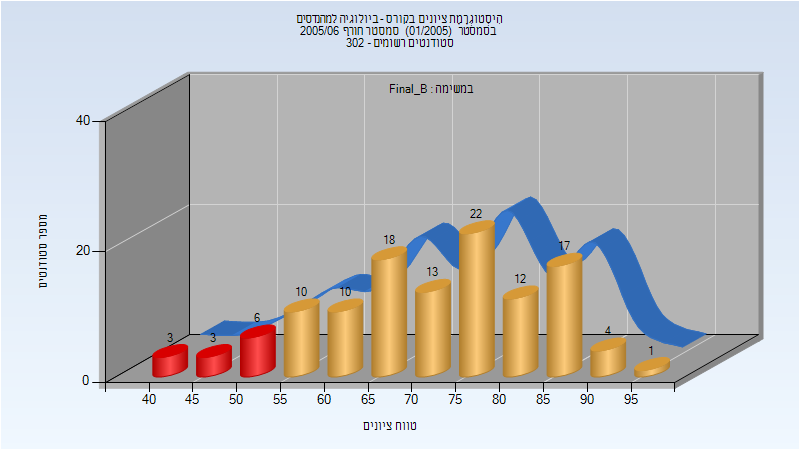

# 01340010 - ביולוגיה למהנדסים

**הערה**: מאגר ההיסטוגרמות הוקם עבור [CheeseFork](https://cheesefork.cf/), כלי בניית מערכת שעות עבור סטודנטים בטכניון. באתר בו אתם גולשים ניתן לעיין בהיסטוגרמות, אך הדרך היותר נוחה היא לעיין בהיסטוגרמות, ובמידע נוסף כגון חוות דעת של סטודנטים, באתר CheeseFork.

* [חורף 2005-2006](#200501)
  * [סופי מועד א'](#200501-Final_A)
  * [סופי מועד ב'](#200501-Final_B)

<h2 id="200501">חורף 2005-2006</h2>

| איש סגל | תפקיד |
| ---- | ---- |
| אסרף יהודה | מרצה - אחראי מקצוע |

<h3 id="200501-Final_A">סופי מועד א'</h3>

| סטודנטים | עברו/נכשלו | אחוז עוברים | ציון מינימלי | ציון מקסימלי | ממוצע | חציון |
| ---- | ---- | ---- | ---- | ---- | ---- | ---- |
| 196 | 188/8 | 96 | 38 | 98 | 79.694 | 83 |

<h3 id="200501-Final_B">סופי מועד ב'</h3>

| סטודנטים | עברו/נכשלו | אחוז עוברים | ציון מינימלי | ציון מקסימלי | ממוצע | חציון |
| ---- | ---- | ---- | ---- | ---- | ---- | ---- |
| 119 | 107/12 | 90 | 40 | 95 | 71.378 | 73 |

