# 014003 - סטטיסטיקה

## חורף 2014-2015

| איש סגל | תפקיד |
| ---- | ---- |
| פישביין ברק | מרצה - אחראי מקצוע |

### סופי

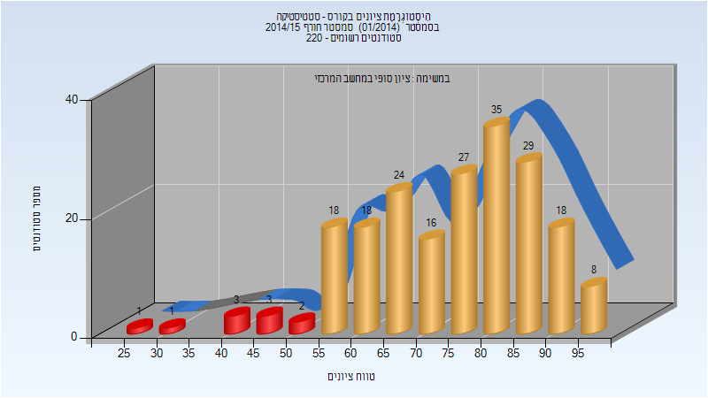

| סטודנטים | עברו/נכשלו | אחוז עוברים | ציון מינימלי | ציון מקסימלי | ממוצע | חציון |
| ---- | ---- | ---- | ---- | ---- | ---- | ---- |
| 203 | 193/10 | 95 | 28 | 98 | 74.872 | 77 |

## אביב 2015

| איש סגל | תפקיד |
| ---- | ---- |
| פישביין ברק | מרצה - אחראי מקצוע |

### מבחן מועד א'

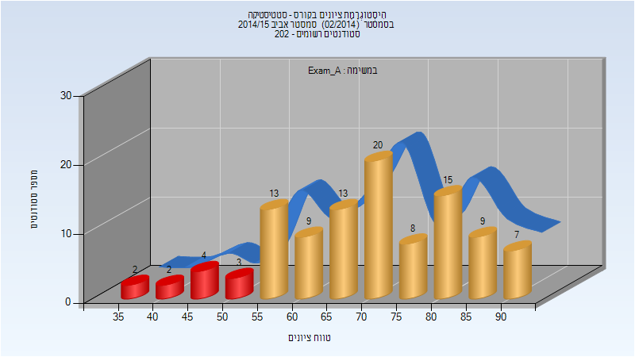

| סטודנטים | עברו/נכשלו | אחוז עוברים | ציון מינימלי | ציון מקסימלי | ממוצע | חציון |
| ---- | ---- | ---- | ---- | ---- | ---- | ---- |
| 105 | 94/11 | 90 | 38 | 94 | 70.69 | 72.5 |

### סופי מועד א'

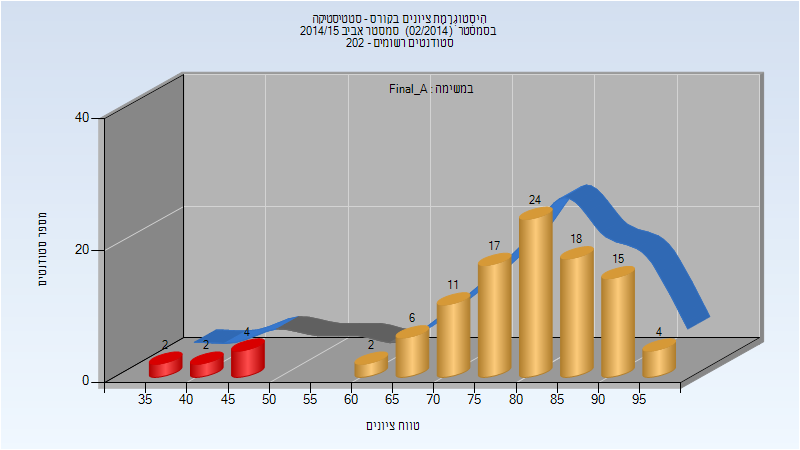

| סטודנטים | עברו/נכשלו | אחוז עוברים | ציון מינימלי | ציון מקסימלי | ממוצע | חציון |
| ---- | ---- | ---- | ---- | ---- | ---- | ---- |
| 105 | 97/8 | 92 | 38 | 96 | 78.752 | 81 |

### סופי מועד ב'

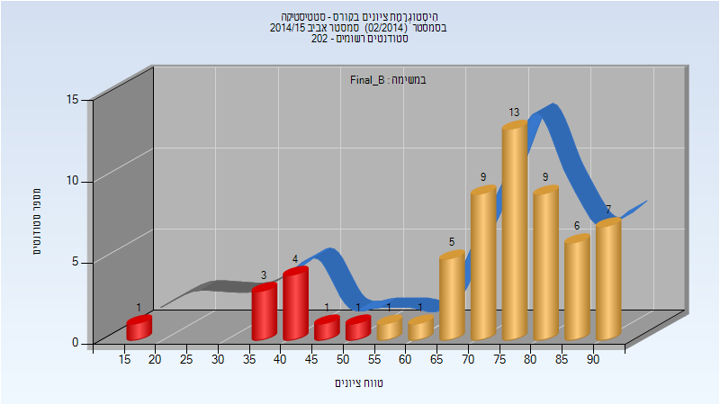

| סטודנטים | עברו/נכשלו | אחוז עוברים | ציון מינימלי | ציון מקסימלי | ממוצע | חציון |
| ---- | ---- | ---- | ---- | ---- | ---- | ---- |
| 61 | 51/10 | 84 | 15 | 94 | 72.098 | 76 |

### סופי

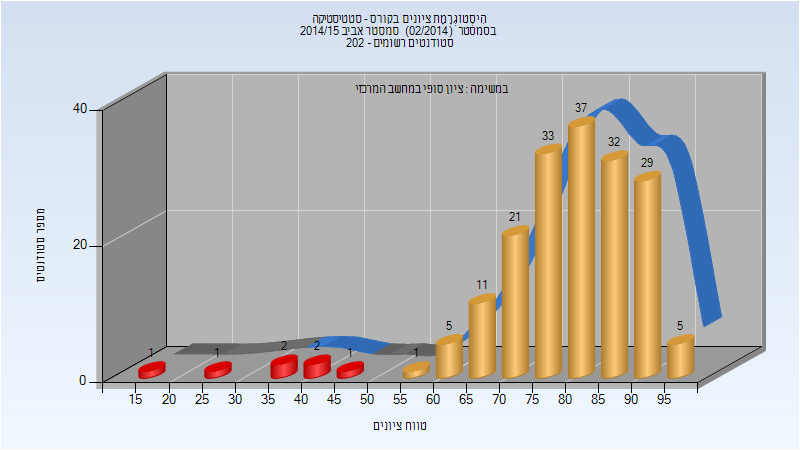

| סטודנטים | עברו/נכשלו | אחוז עוברים | ציון מינימלי | ציון מקסימלי | ממוצע | חציון |
| ---- | ---- | ---- | ---- | ---- | ---- | ---- |
| 181 | 174/7 | 96 | 15 | 96 | 79.326 | 81 |

## קיץ 2015

| איש סגל | תפקיד |
| ---- | ---- |
| לוין אלה | מרצה - אחראי מקצוע |
| וידר ציפורה | סגל מנהלי - עם הרשאות מרצה אחראי |
| קובלר קרן | סגל מנהלי - עם הרשאות מרצה אחראי |

### סופי

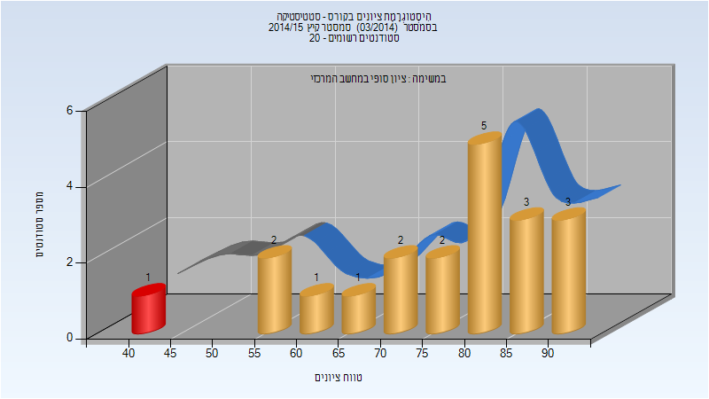

| סטודנטים | עברו/נכשלו | אחוז עוברים | ציון מינימלי | ציון מקסימלי | ממוצע | חציון |
| ---- | ---- | ---- | ---- | ---- | ---- | ---- |
| 20 | 19/1 | 95 | 43 | 92 | 76.5 | 81 |

## חורף 2015-2016

| איש סגל | תפקיד |
| ---- | ---- |
| פישביין ברק | מרצה - אחראי מקצוע |

### סופי מועד א'

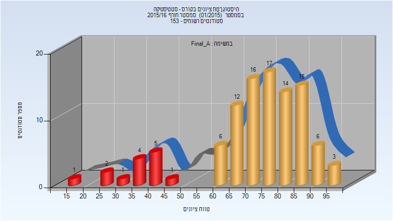

| סטודנטים | עברו/נכשלו | אחוז עוברים | ציון מינימלי | ציון מקסימלי | ממוצע | חציון |
| ---- | ---- | ---- | ---- | ---- | ---- | ---- |
| 103 | 89/14 | 86 | 17 | 98 | 72.01 | 75 |

### סופי מועד ב'

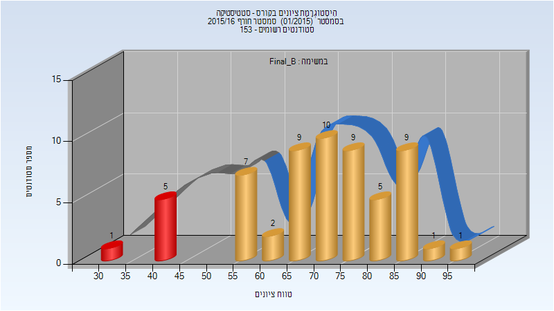

| סטודנטים | עברו/נכשלו | אחוז עוברים | ציון מינימלי | ציון מקסימלי | ממוצע | חציון |
| ---- | ---- | ---- | ---- | ---- | ---- | ---- |
| 59 | 53/6 | 90 | 30 | 98 | 70.051 | 72 |

### סופי

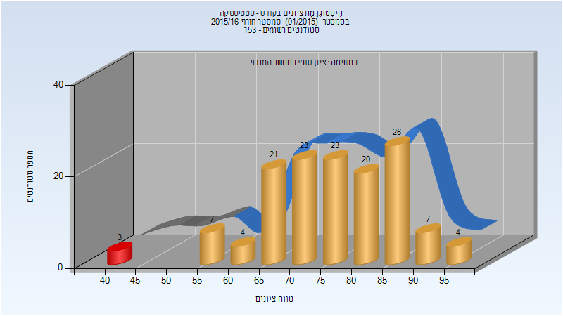

| סטודנטים | עברו/נכשלו | אחוז עוברים | ציון מינימלי | ציון מקסימלי | ממוצע | חציון |
| ---- | ---- | ---- | ---- | ---- | ---- | ---- |
| 139 | 136/3 | 98 | 41 | 98 | 76.051 | 76 |

## חורף 2016-2017

| איש סגל | תפקיד |
| ---- | ---- |
| פישביין ברק | מרצה - אחראי מקצוע |
| חן שמעון | מתרגל - עם הרשאות מרצה אחראי |

### מבחן מועד א'

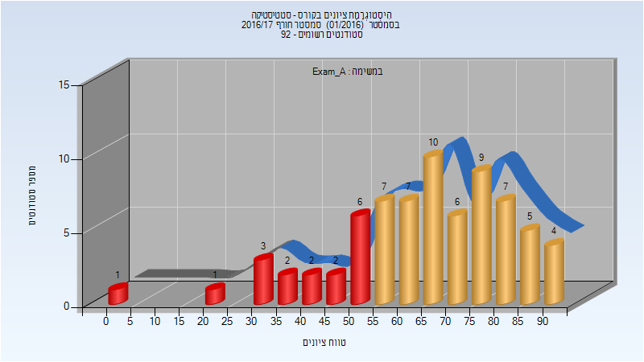

| סטודנטים | עברו/נכשלו | אחוז עוברים | ציון מינימלי | ציון מקסימלי | ממוצע | חציון |
| ---- | ---- | ---- | ---- | ---- | ---- | ---- |
| 72 | 55/17 | 76 | 0 | 94 | 64.931 | 67 |

### סופי מועד א'

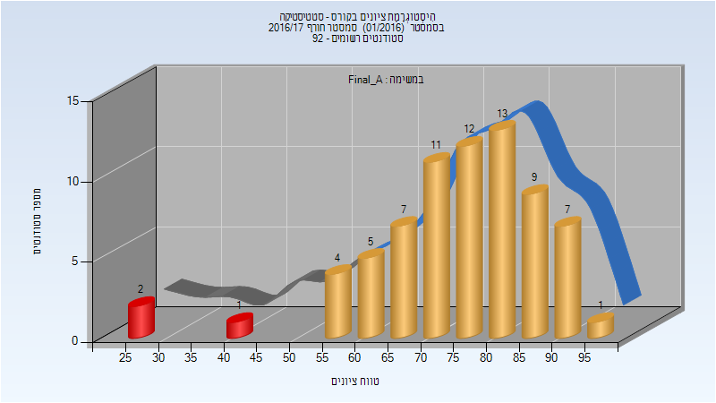

| סטודנטים | עברו/נכשלו | אחוז עוברים | ציון מינימלי | ציון מקסימלי | ממוצע | חציון |
| ---- | ---- | ---- | ---- | ---- | ---- | ---- |
| 72 | 69/3 | 96 | 28.586 | 95.15 | 75.798 | 78.4715 |

### מבחן מועד ב'

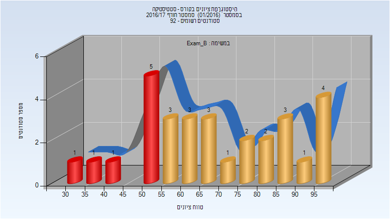

| סטודנטים | עברו/נכשלו | אחוז עוברים | ציון מינימלי | ציון מקסימלי | ממוצע | חציון |
| ---- | ---- | ---- | ---- | ---- | ---- | ---- |
| 30 | 22/8 | 73 | 32 | 99 | 69.367 | 66 |

### סופי מועד ב'

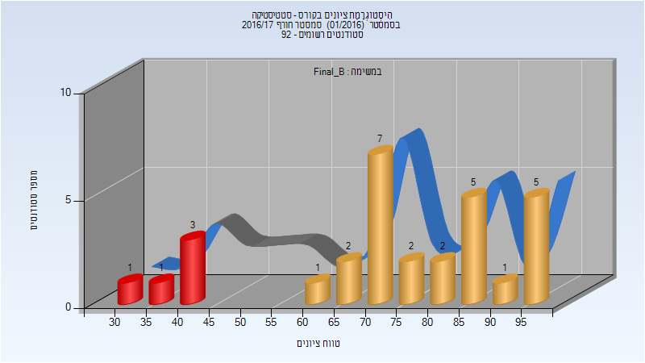

| סטודנטים | עברו/נכשלו | אחוז עוברים | ציון מינימלי | ציון מקסימלי | ממוצע | חציון |
| ---- | ---- | ---- | ---- | ---- | ---- | ---- |
| 30 | 25/5 | 83 | 32 | 99 | 74.4 | 75 |

### סופי

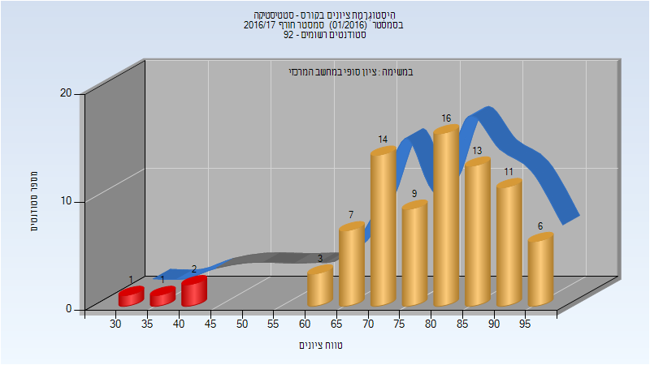

| סטודנטים | עברו/נכשלו | אחוז עוברים | ציון מינימלי | ציון מקסימלי | ממוצע | חציון |
| ---- | ---- | ---- | ---- | ---- | ---- | ---- |
| 83 | 79/4 | 95 | 32 | 99 | 78.928 | 81 |

## אביב 2017

| איש סגל | תפקיד |
| ---- | ---- |
| פישביין ברק | מרצה - אחראי מקצוע |
| חן שמעון | מתרגל |

### סופי מועד א'

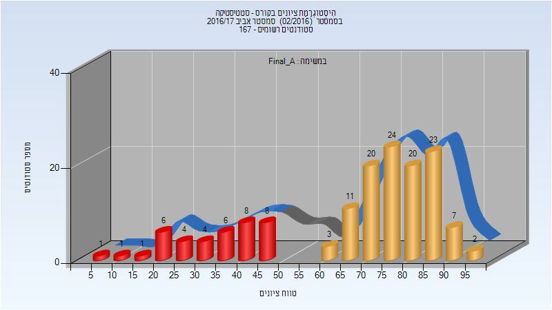

| סטודנטים | עברו/נכשלו | אחוז עוברים | ציון מינימלי | ציון מקסימלי | ממוצע | חציון |
| ---- | ---- | ---- | ---- | ---- | ---- | ---- |
| 149 | 110/39 | 74 | 6 | 97 | 67.423 | 75 |

### סופי מועד ב'

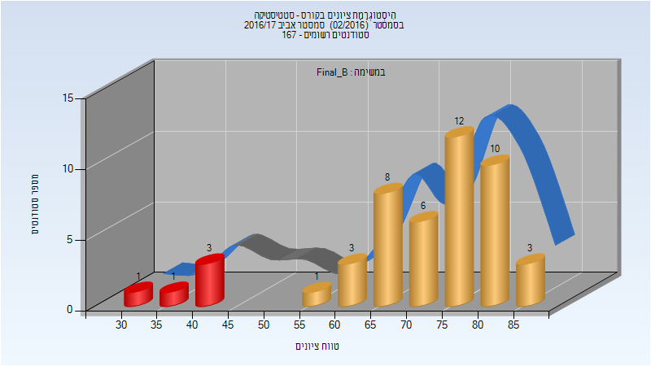

| סטודנטים | עברו/נכשלו | אחוז עוברים | ציון מינימלי | ציון מקסימלי | ממוצע | חציון |
| ---- | ---- | ---- | ---- | ---- | ---- | ---- |
| 48 | 43/5 | 90 | 33 | 88 | 71 | 75 |

### סופי

| סטודנטים | עברו/נכשלו | אחוז עוברים | ציון מינימלי | ציון מקסימלי | ממוצע | חציון |
| ---- | ---- | ---- | ---- | ---- | ---- | ---- |
| 161 | 151/10 | 94 | 6 | 97 | 75.124 | 78 |

## חורף 2017-2018

| איש סגל | תפקיד |
| ---- | ---- |
| פישביין ברק | מרצה - אחראי מקצוע |
| חן שמעון | מתרגל - עם הרשאות מרצה אחראי |

### מבחן מועד א'

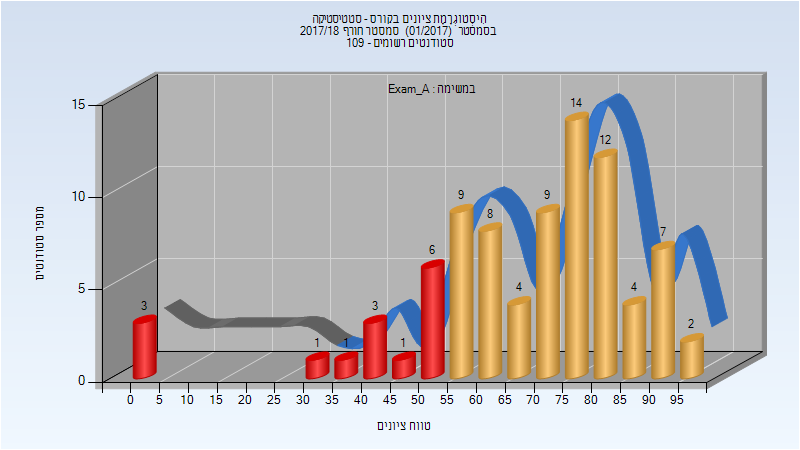

| סטודנטים | עברו/נכשלו | אחוז עוברים | ציון מינימלי | ציון מקסימלי | ממוצע | חציון |
| ---- | ---- | ---- | ---- | ---- | ---- | ---- |
| 84 | 69/15 | 82 | 0 | 96 | 68.202 | 72.5 |

### סופי מועד א'

| סטודנטים | עברו/נכשלו | אחוז עוברים | ציון מינימלי | ציון מקסימלי | ממוצע | חציון |
| ---- | ---- | ---- | ---- | ---- | ---- | ---- |
| 84 | 74/10 | 88 | 0 | 97 | 75.774 | 82 |

### סופי מועד ב'

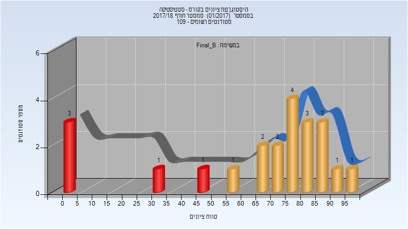

| סטודנטים | עברו/נכשלו | אחוז עוברים | ציון מינימלי | ציון מקסימלי | ממוצע | חציון |
| ---- | ---- | ---- | ---- | ---- | ---- | ---- |
| 22 | 17/5 | 77 | 0 | 97 | 64.318 | 76 |

### סופי

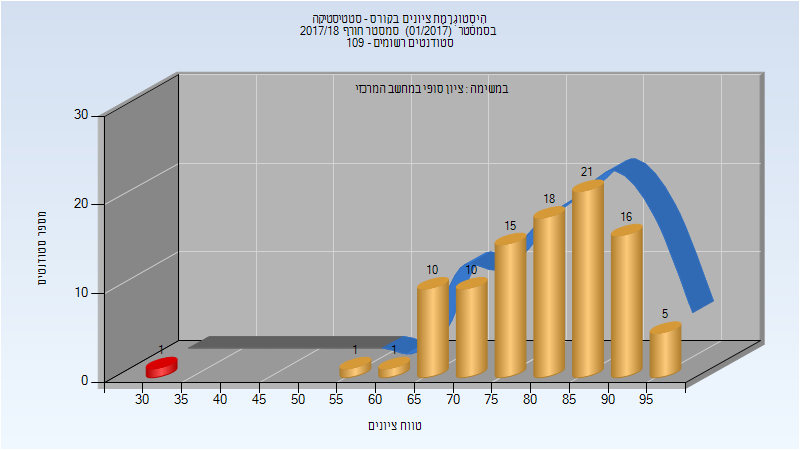

| סטודנטים | עברו/נכשלו | אחוז עוברים | ציון מינימלי | ציון מקסימלי | ממוצע | חציון |
| ---- | ---- | ---- | ---- | ---- | ---- | ---- |
| 98 | 97/1 | 99 | 32 | 97 | 81 | 83 |

## אביב 2018

| איש סגל | תפקיד |
| ---- | ---- |
| פישביין ברק | מרצה - אחראי מקצוע |
| חן שמעון | מתרגל |

### סופי מועד א'

| סטודנטים | עברו/נכשלו | אחוז עוברים | ציון מינימלי | ציון מקסימלי | ממוצע | חציון |
| ---- | ---- | ---- | ---- | ---- | ---- | ---- |
| 158 | 152/6 | 96 | 22 | 100 | 81.057 | 84 |

### סופי מועד ב'

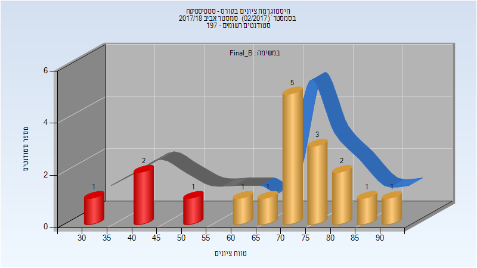

| סטודנטים | עברו/נכשלו | אחוז עוברים | ציון מינימלי | ציון מקסימלי | ממוצע | חציון |
| ---- | ---- | ---- | ---- | ---- | ---- | ---- |
| 18 | 14/4 | 78 | 31 | 92 | 68.222 | 73 |

### סופי

| סטודנטים | עברו/נכשלו | אחוז עוברים | ציון מינימלי | ציון מקסימלי | ממוצע | חציון |
| ---- | ---- | ---- | ---- | ---- | ---- | ---- |
| 188 | 185/3 | 98 | 28 | 100 | 81.181 | 82 |

## חורף 2018-2019

| איש סגל | תפקיד |
| ---- | ---- |
| רגב אמיר | מרצה - אחראי מקצוע |

### מבחן מועד א'

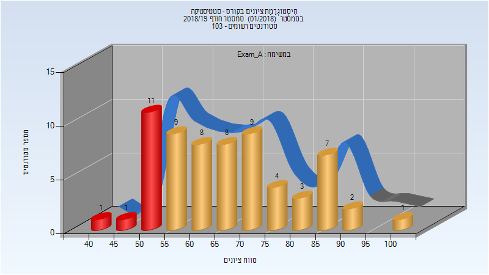

| סטודנטים | עברו/נכשלו | אחוז עוברים | ציון מינימלי | ציון מקסימלי | ממוצע | חציון |
| ---- | ---- | ---- | ---- | ---- | ---- | ---- |
| 64 | 51/13 | 80 | 43 | 101 | 67.312 | 66 |

### סופי מועד א'

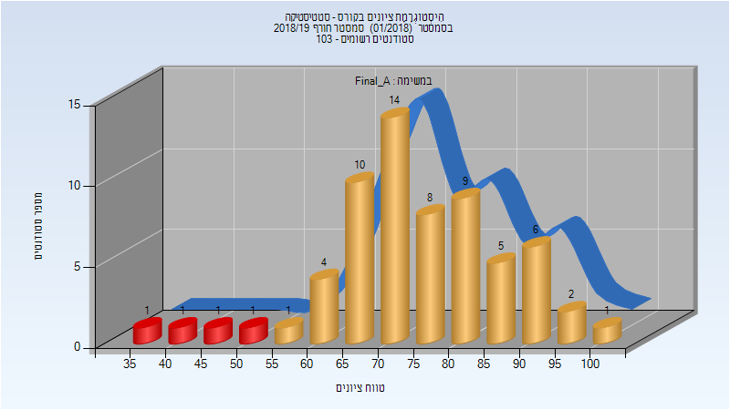

| סטודנטים | עברו/נכשלו | אחוז עוברים | ציון מינימלי | ציון מקסימלי | ממוצע | חציון |
| ---- | ---- | ---- | ---- | ---- | ---- | ---- |
| 64 | 60/4 | 94 | 35 | 100 | 74.73 | 74.1 |

### מבחן מועד ב'

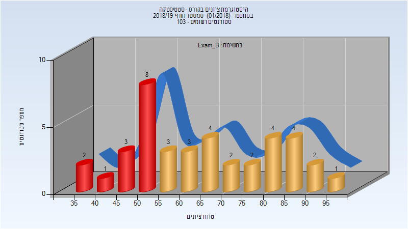

| סטודנטים | עברו/נכשלו | אחוז עוברים | ציון מינימלי | ציון מקסימלי | ממוצע | חציון |
| ---- | ---- | ---- | ---- | ---- | ---- | ---- |
| 39 | 25/14 | 64 | 37 | 97 | 65.385 | 61 |

### סופי מועד ב'

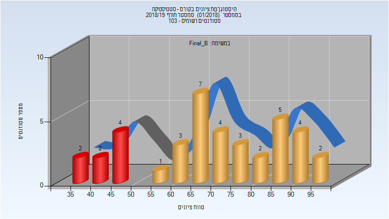

| סטודנטים | עברו/נכשלו | אחוז עוברים | ציון מינימלי | ציון מקסימלי | ממוצע | חציון |
| ---- | ---- | ---- | ---- | ---- | ---- | ---- |
| 39 | 31/8 | 79 | 37 | 95.9 | 70.432 | 69.05 |

### סופי

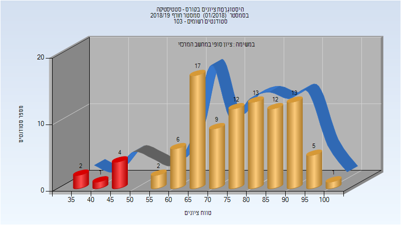

| סטודנטים | עברו/נכשלו | אחוז עוברים | ציון מינימלי | ציון מקסימלי | ממוצע | חציון |
| ---- | ---- | ---- | ---- | ---- | ---- | ---- |
| 99 | 92/7 | 93 | 37 | 100 | 75.818 | 77 |

## אביב 2019

| איש סגל | תפקיד |
| ---- | ---- |
| פישביין ברק | מרצה - אחראי מקצוע |

### מבחן מועד א'

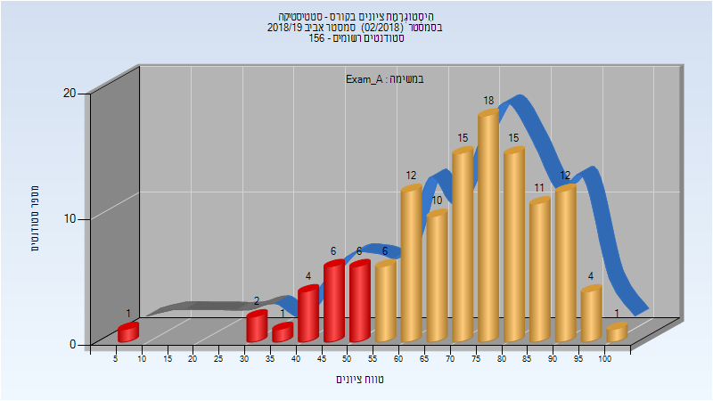

| סטודנטים | עברו/נכשלו | אחוז עוברים | ציון מינימלי | ציון מקסימלי | ממוצע | חציון |
| ---- | ---- | ---- | ---- | ---- | ---- | ---- |
| 124 | 104/20 | 84 | 9 | 100 | 71.298 | 74 |

### סופי מועד א'

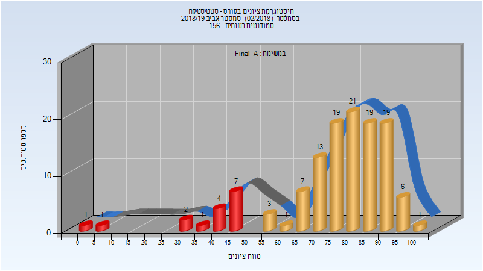

| סטודנטים | עברו/נכשלו | אחוז עוברים | ציון מינימלי | ציון מקסימלי | ממוצע | חציון |
| ---- | ---- | ---- | ---- | ---- | ---- | ---- |
| 125 | 109/16 | 87 | 0 | 100 | 76.575 | 81.8 |

### מבחן מועד ב'

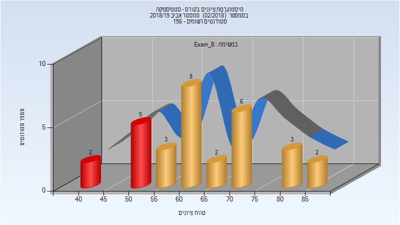

| סטודנטים | עברו/נכשלו | אחוז עוברים | ציון מינימלי | ציון מקסימלי | ממוצע | חציון |
| ---- | ---- | ---- | ---- | ---- | ---- | ---- |
| 31 | 24/7 | 77 | 40 | 88 | 64.419 | 62 |

### סופי מועד ב'

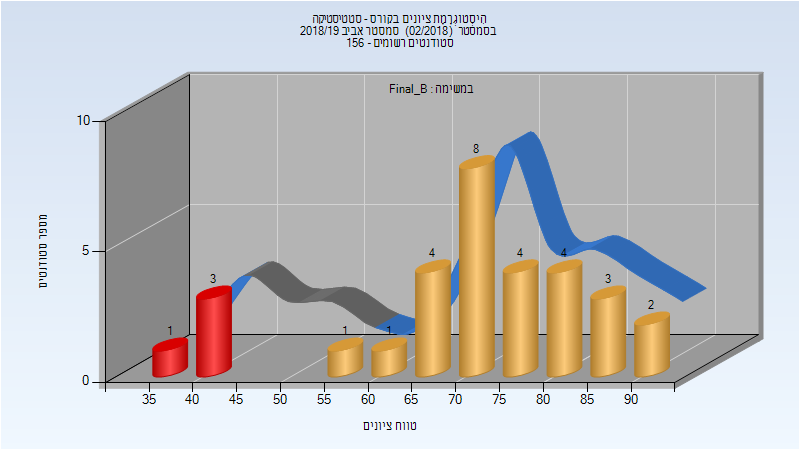

| סטודנטים | עברו/נכשלו | אחוז עוברים | ציון מינימלי | ציון מקסימלי | ממוצע | חציון |
| ---- | ---- | ---- | ---- | ---- | ---- | ---- |
| 31 | 27/4 | 87 | 37.8 | 91.6 | 71.201 | 73.28 |

### סופי

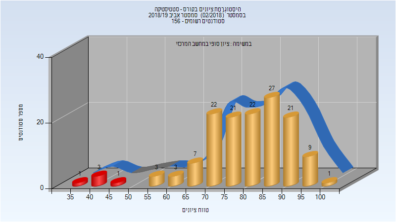

| סטודנטים | עברו/נכשלו | אחוז עוברים | ציון מינימלי | ציון מקסימלי | ממוצע | חציון |
| ---- | ---- | ---- | ---- | ---- | ---- | ---- |
| 141 | 136/5 | 96 | 38 | 100 | 80.064 | 82 |

## חורף 2019-2020

| איש סגל | תפקיד |
| ---- | ---- |
| רגב אמיר | מרצה - אחראי מקצוע |
| פישביין ברק | מרצה |

### מבחן מועד א'

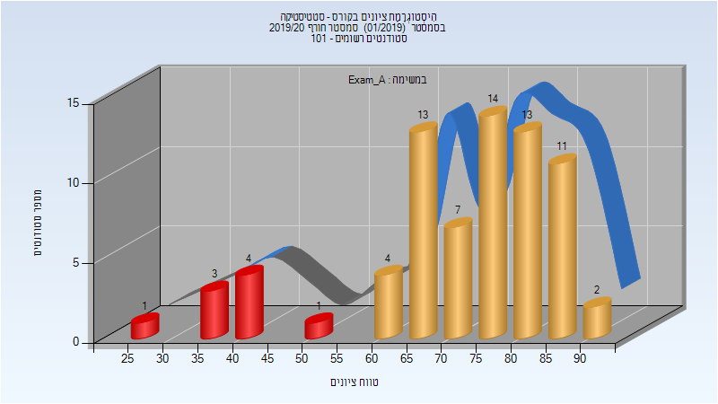

| סטודנטים | עברו/נכשלו | אחוז עוברים | ציון מינימלי | ציון מקסימלי | ממוצע | חציון |
| ---- | ---- | ---- | ---- | ---- | ---- | ---- |
| 73 | 64/9 | 88 | 29 | 93.6 | 72.702 | 75.967 |

### סופי מועד א'

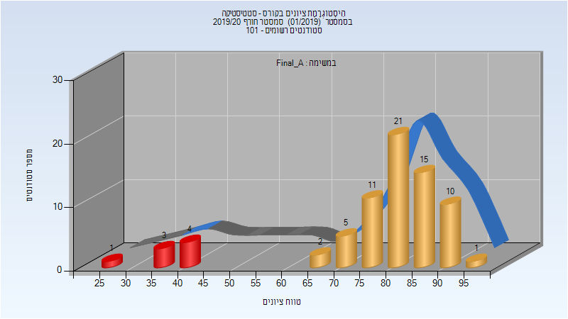

| סטודנטים | עברו/נכשלו | אחוז עוברים | ציון מינימלי | ציון מקסימלי | ממוצע | חציון |
| ---- | ---- | ---- | ---- | ---- | ---- | ---- |
| 73 | 65/8 | 89 | 29 | 95.52 | 78.551 | 82.64 |

### מבחן מועד ב'

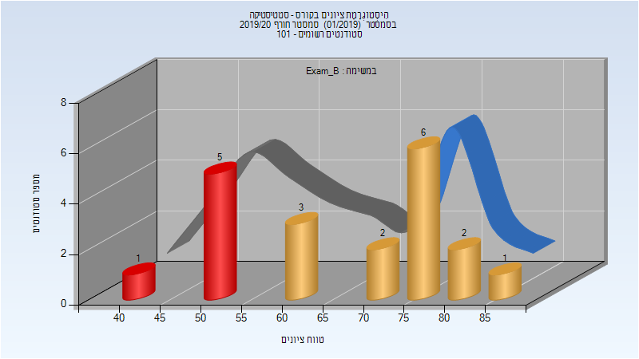

| סטודנטים | עברו/נכשלו | אחוז עוברים | ציון מינימלי | ציון מקסימלי | ממוצע | חציון |
| ---- | ---- | ---- | ---- | ---- | ---- | ---- |
| 20 | 14/6 | 70 | 41 | 89 | 66.55 | 72.5 |

### סופי מועד ב'

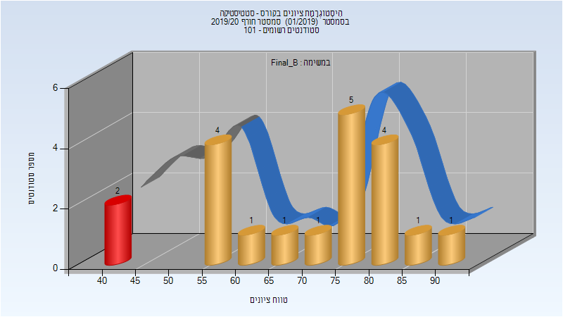

| סטודנטים | עברו/נכשלו | אחוז עוברים | ציון מינימלי | ציון מקסימלי | ממוצע | חציון |
| ---- | ---- | ---- | ---- | ---- | ---- | ---- |
| 20 | 18/2 | 90 | 41 | 91.2 | 71.293 | 77.5 |

### סופי

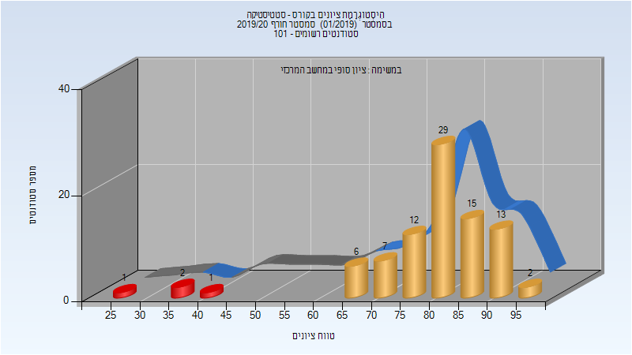

| סטודנטים | עברו/נכשלו | אחוז עוברים | ציון מינימלי | ציון מקסימלי | ממוצע | חציון |
| ---- | ---- | ---- | ---- | ---- | ---- | ---- |
| 88 | 84/4 | 95 | 29 | 96 | 80.602 | 83 |

## אביב 2020

| איש סגל | תפקיד |
| ---- | ---- |
| פישביין ברק | מרצה - אחראי מקצוע |
| מלכה אופירה | סגל מנהלי - עם הרשאות מרצה אחראי |
| קובלר קרן | סגל מנהלי - עם הרשאות מרצה אחראי |

### מבחן מועד א'

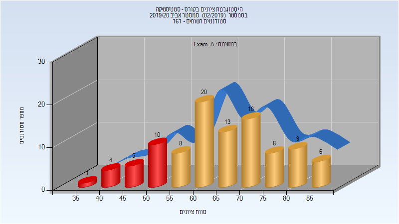

| סטודנטים | עברו/נכשלו | אחוז עוברים | ציון מינימלי | ציון מקסימלי | ממוצע | חציון |
| ---- | ---- | ---- | ---- | ---- | ---- | ---- |
| 100 | 80/20 | 80 | 37.5 | 86.25 | 65.238 | 65 |

### סופי מועד א'

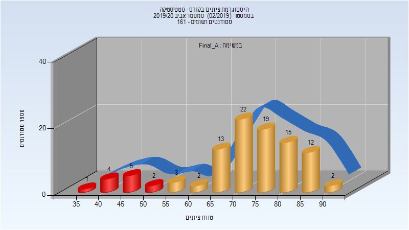

| סטודנטים | עברו/נכשלו | אחוז עוברים | ציון מינימלי | ציון מקסימלי | ממוצע | חציון |
| ---- | ---- | ---- | ---- | ---- | ---- | ---- |
| 100 | 88/12 | 88 | 37.5 | 90.375 | 72.482 | 74.625 |

### מבחן מועד ב'

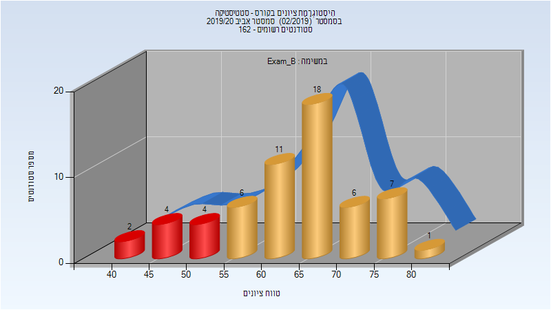

| סטודנטים | עברו/נכשלו | אחוז עוברים | ציון מינימלי | ציון מקסימלי | ממוצע | חציון |
| ---- | ---- | ---- | ---- | ---- | ---- | ---- |
| 59 | 49/10 | 83 | 42.5 | 80 | 62.924 | 65 |

### סופי מועד ב'

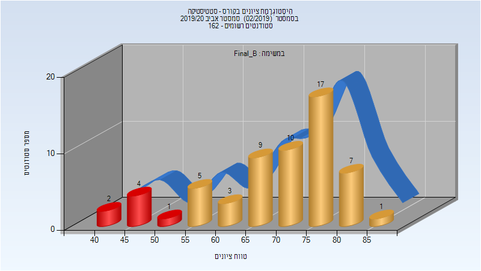

| סטודנטים | עברו/נכשלו | אחוז עוברים | ציון מינימלי | ציון מקסימלי | ממוצע | חציון |
| ---- | ---- | ---- | ---- | ---- | ---- | ---- |
| 59 | 52/7 | 88 | 42.5 | 85.27 | 69.321 | 71.375 |

### סופי

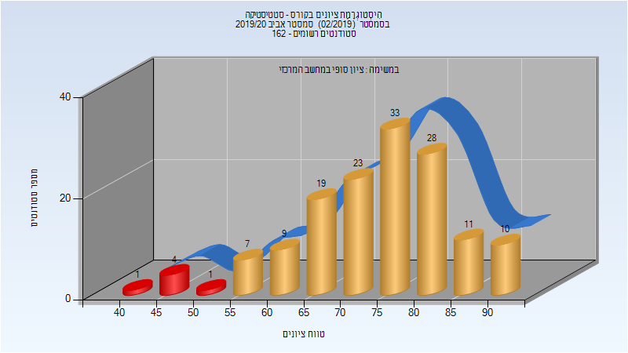

| סטודנטים | עברו/נכשלו | אחוז עוברים | ציון מינימלי | ציון מקסימלי | ממוצע | חציון |
| ---- | ---- | ---- | ---- | ---- | ---- | ---- |
| 146 | 140/6 | 96 | 43 | 93 | 74.705 | 76 |

## חורף 2020-2021

| איש סגל | תפקיד |
| ---- | ---- |
| פישביין ברק | מרצה - אחראי מקצוע |
| קובלר קרן | סגל מנהלי - עם הרשאות מרצה אחראי |
| מלכה אופירה | סגל מנהלי - עם הרשאות מרצה אחראי |

### מבחן מועד א'

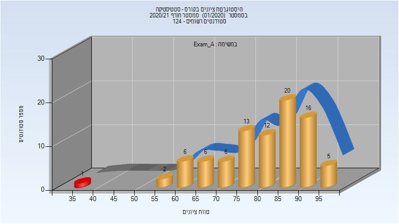

| סטודנטים | עברו/נכשלו | אחוז עוברים | ציון מינימלי | ציון מקסימלי | ממוצע | חציון |
| ---- | ---- | ---- | ---- | ---- | ---- | ---- |
| 87 | 86/1 | 99 | 39 | 98 | 80.851 | 82 |

### סופי מועד א'

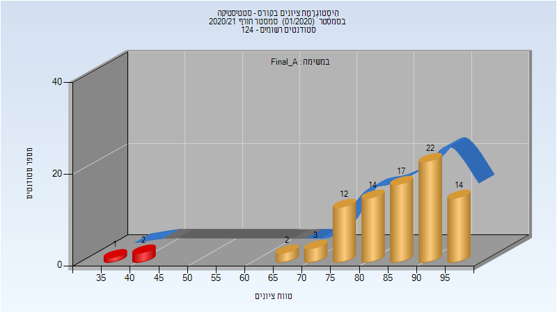

| סטודנטים | עברו/נכשלו | אחוז עוברים | ציון מינימלי | ציון מקסימלי | ממוצע | חציון |
| ---- | ---- | ---- | ---- | ---- | ---- | ---- |
| 87 | 84/3 | 97 | 39 | 99 | 85.149 | 87 |

### מבחן מועד ב'

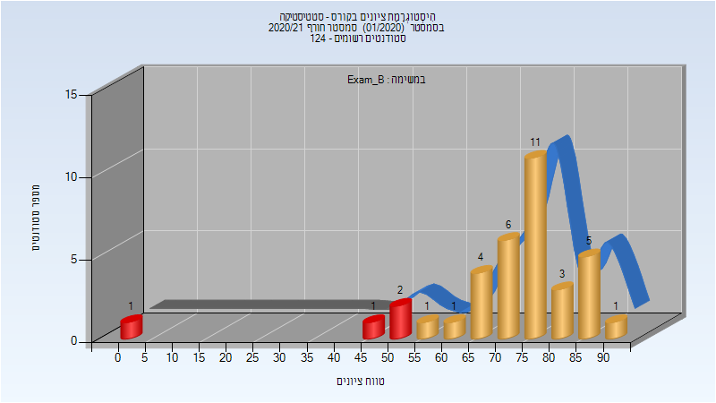

| סטודנטים | עברו/נכשלו | אחוז עוברים | ציון מינימלי | ציון מקסימלי | ממוצע | חציון |
| ---- | ---- | ---- | ---- | ---- | ---- | ---- |
| 36 | 32/4 | 89 | 3.917 | 90.207 | 72.815 | 76.2785 |

### סופי מועד ב'

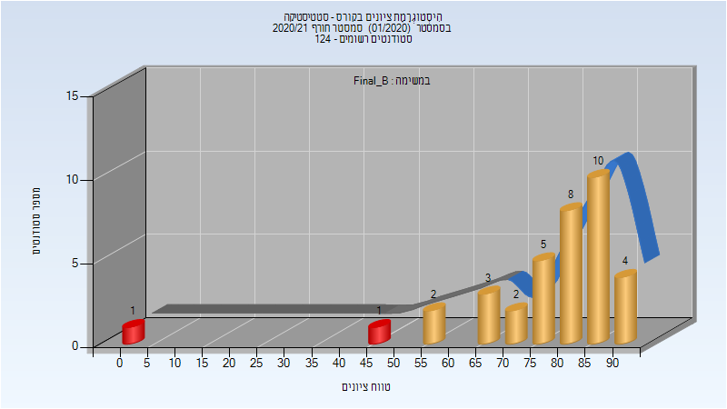

| סטודנטים | עברו/נכשלו | אחוז עוברים | ציון מינימלי | ציון מקסימלי | ממוצע | חציון |
| ---- | ---- | ---- | ---- | ---- | ---- | ---- |
| 36 | 34/2 | 94 | 3.917 | 93.145 | 77.872 | 82.2905 |

### סופי

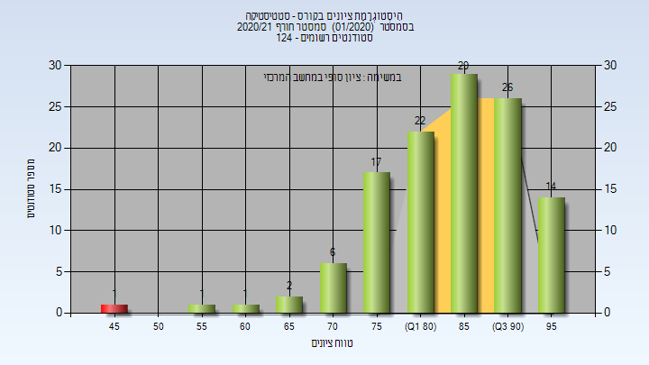

| סטודנטים | עברו/נכשלו | אחוז עוברים | ציון מינימלי | ציון מקסימלי | ממוצע | חציון |
| ---- | ---- | ---- | ---- | ---- | ---- | ---- |
| 119 | 118/1 | 99 | 49 | 99 | 84.966 | 86 |

