# 014006 - מבוא לשיטות נומריות

## אביב 2016

| איש סגל | תפקיד |
| ---- | ---- |
| טולדו תומר | מרצה - אחראי מקצוע |

### סופי מועד א'

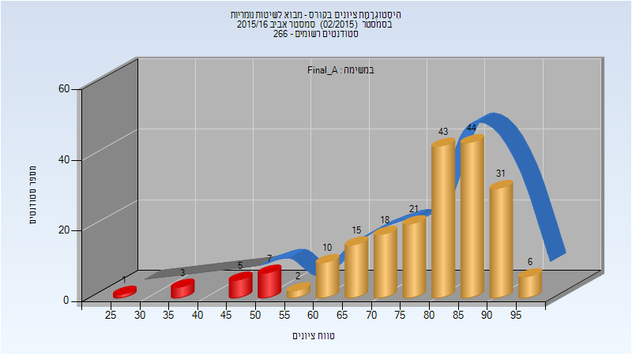

| סטודנטים | עברו/נכשלו | אחוז עוברים | ציון מינימלי | ציון מקסימלי | ממוצע | חציון |
| ---- | ---- | ---- | ---- | ---- | ---- | ---- |
| 206 | 190/16 | 92 | 26 | 99 | 78.515 | 82 |

### סופי מועד ב'

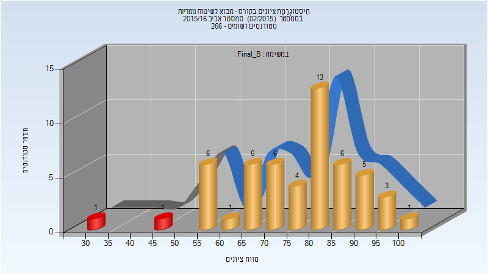

| סטודנטים | עברו/נכשלו | אחוז עוברים | ציון מינימלי | ציון מקסימלי | ממוצע | חציון |
| ---- | ---- | ---- | ---- | ---- | ---- | ---- |
| 16 | 15/1 | 94 | 40 | 91 | 75.062 | 78.5 |

### סופי

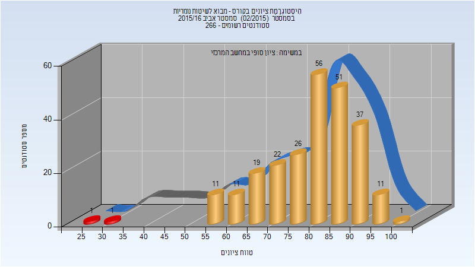

| סטודנטים | עברו/נכשלו | אחוז עוברים | ציון מינימלי | ציון מקסימלי | ממוצע | חציון |
| ---- | ---- | ---- | ---- | ---- | ---- | ---- |
| 25 | 24/1 | 96 | 40 | 91 | 76.88 | 79 |

## אביב 2017

| איש סגל | תפקיד |
| ---- | ---- |
| דגני אמיר | מרצה - אחראי מקצוע |
| הלל רוני | מתרגל - עם הרשאות מרצה אחראי |

### סופי מועד א'

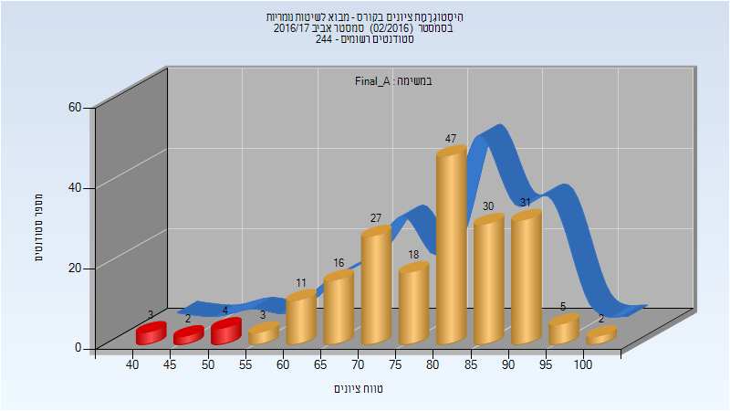

| סטודנטים | עברו/נכשלו | אחוז עוברים | ציון מינימלי | ציון מקסימלי | ממוצע | חציון |
| ---- | ---- | ---- | ---- | ---- | ---- | ---- |
| 199 | 190/9 | 95 | 42 | 100 | 79.239 | 81.6 |

### סופי מועד ב'

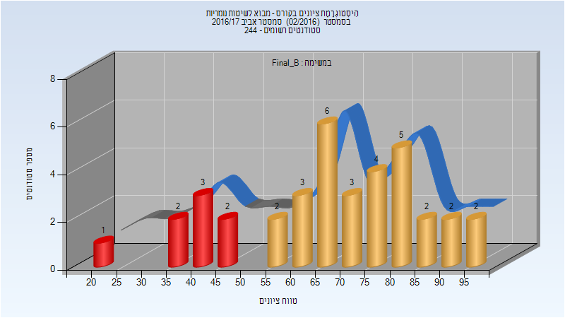

| סטודנטים | עברו/נכשלו | אחוז עוברים | ציון מינימלי | ציון מקסימלי | ממוצע | חציון |
| ---- | ---- | ---- | ---- | ---- | ---- | ---- |
| 37 | 29/8 | 78 | 24 | 95 | 67.514 | 69 |

### סופי

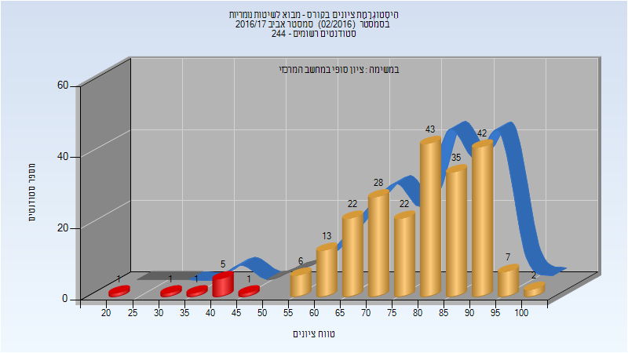

| סטודנטים | עברו/נכשלו | אחוז עוברים | ציון מינימלי | ציון מקסימלי | ממוצע | חציון |
| ---- | ---- | ---- | ---- | ---- | ---- | ---- |
| 229 | 220/9 | 96 | 24 | 100 | 78.437 | 81 |

## חורף 2017-2018

| איש סגל | תפקיד |
| ---- | ---- |
| טולדו תומר | מרצה - אחראי מקצוע |
| הלל רוני | מתרגל - עם הרשאות מרצה אחראי |

### סופי מועד א'

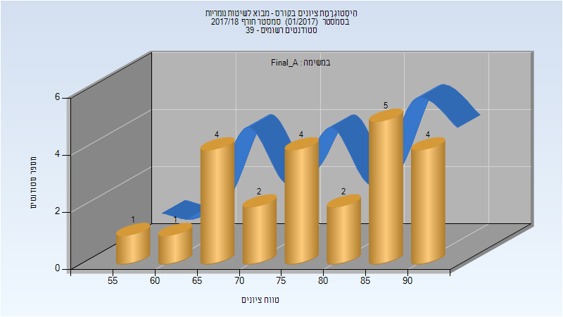

| סטודנטים | עברו/נכשלו | אחוז עוברים | ציון מינימלי | ציון מקסימלי | ממוצע | חציון |
| ---- | ---- | ---- | ---- | ---- | ---- | ---- |
| 23 | 23/0 | 100 | 56 | 94 | 78.826 | 78 |

### סופי מועד ב'

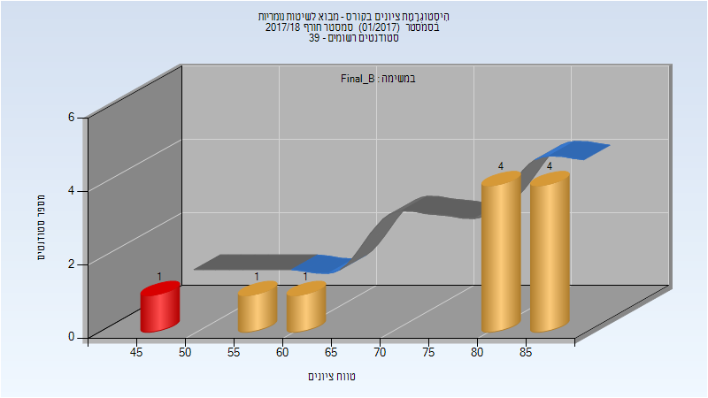

| סטודנטים | עברו/נכשלו | אחוז עוברים | ציון מינימלי | ציון מקסימלי | ממוצע | חציון |
| ---- | ---- | ---- | ---- | ---- | ---- | ---- |
| 11 | 10/1 | 91 | 48 | 89 | 76.545 | 81 |

### סופי

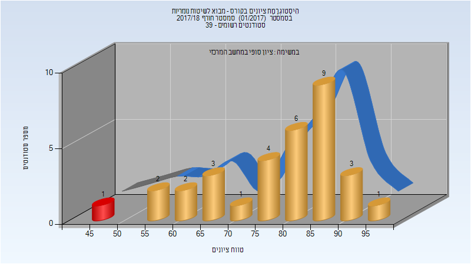

| סטודנטים | עברו/נכשלו | אחוז עוברים | ציון מינימלי | ציון מקסימלי | ממוצע | חציון |
| ---- | ---- | ---- | ---- | ---- | ---- | ---- |
| 32 | 31/1 | 97 | 48 | 95 | 78.656 | 82 |

## אביב 2018

| איש סגל | תפקיד |
| ---- | ---- |
| דגני אמיר | מרצה - אחראי מקצוע |
| טולדו תומר | מרצה |
| הלל רוני | מתרגל - עם הרשאות מרצה אחראי |

### סופי מועד א'

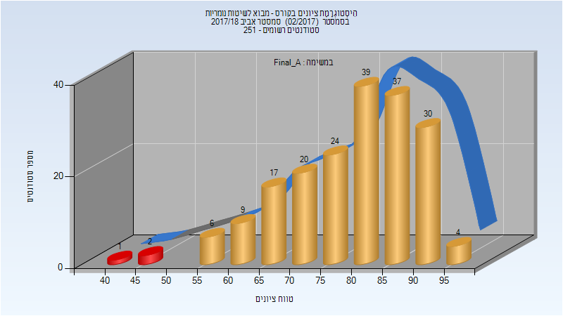

| סטודנטים | עברו/נכשלו | אחוז עוברים | ציון מינימלי | ציון מקסימלי | ממוצע | חציון |
| ---- | ---- | ---- | ---- | ---- | ---- | ---- |
| 189 | 186/3 | 98 | 42 | 99 | 79.566 | 82 |

### סופי מועד ב'

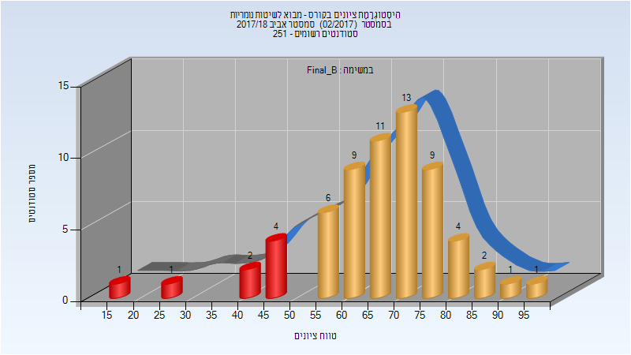

| סטודנטים | עברו/נכשלו | אחוז עוברים | ציון מינימלי | ציון מקסימלי | ממוצע | חציון |
| ---- | ---- | ---- | ---- | ---- | ---- | ---- |
| 64 | 56/8 | 88 | 19 | 95 | 66.828 | 69 |

### סופי

| סטודנטים | עברו/נכשלו | אחוז עוברים | ציון מינימלי | ציון מקסימלי | ממוצע | חציון |
| ---- | ---- | ---- | ---- | ---- | ---- | ---- |
| 243 | 235/8 | 97 | 19 | 99 | 77.42 | 79 |

## חורף 2018-2019

| איש סגל | תפקיד |
| ---- | ---- |
| טולדו תומר | מרצה - אחראי מקצוע |
| סגל רחלי | סגל מנהלי - עם הרשאות מרצה אחראי |
| קובלר קרן | סגל מנהלי - עם הרשאות מרצה אחראי |

### סופי מועד א'

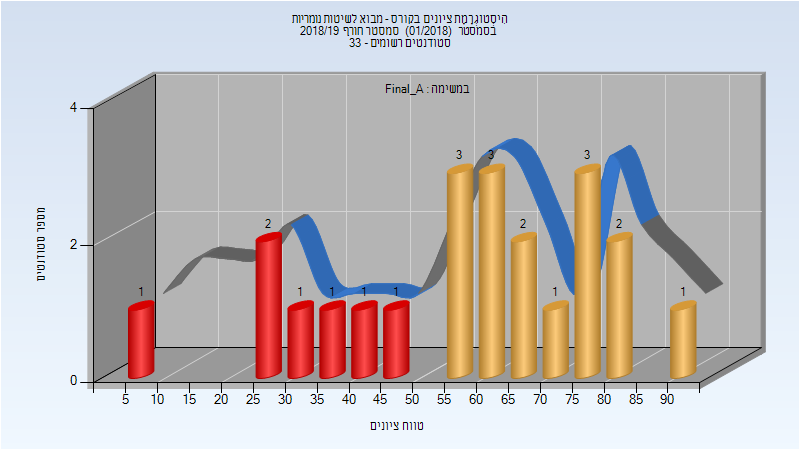

| סטודנטים | עברו/נכשלו | אחוז עוברים | ציון מינימלי | ציון מקסימלי | ממוצע | חציון |
| ---- | ---- | ---- | ---- | ---- | ---- | ---- |
| 22 | 15/7 | 68 | 9 | 90 | 57.773 | 63 |

### סופי מועד ב'

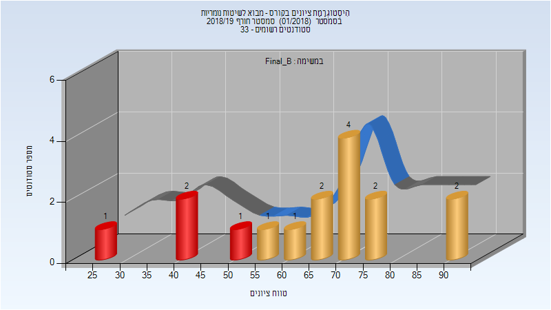

| סטודנטים | עברו/נכשלו | אחוז עוברים | ציון מינימלי | ציון מקסימלי | ממוצע | חציון |
| ---- | ---- | ---- | ---- | ---- | ---- | ---- |
| 16 | 12/4 | 75 | 28 | 91 | 64.75 | 68 |

### סופי

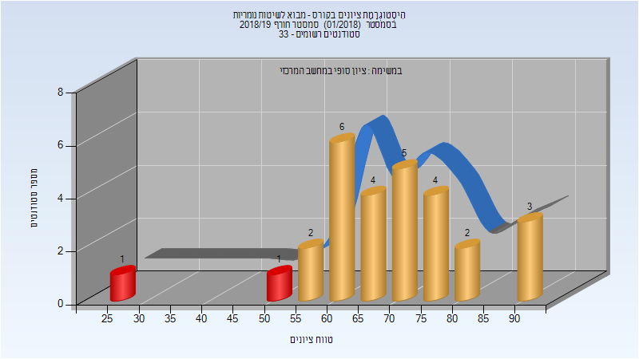

| סטודנטים | עברו/נכשלו | אחוז עוברים | ציון מינימלי | ציון מקסימלי | ממוצע | חציון |
| ---- | ---- | ---- | ---- | ---- | ---- | ---- |
| 28 | 26/2 | 93 | 28 | 91 | 69.214 | 69.5 |

## אביב 2019

| איש סגל | תפקיד |
| ---- | ---- |
| דגני אמיר | מרצה - אחראי מקצוע |
| הלל רוני | מתרגל - עם הרשאות מרצה אחראי |

### סופי מועד א'

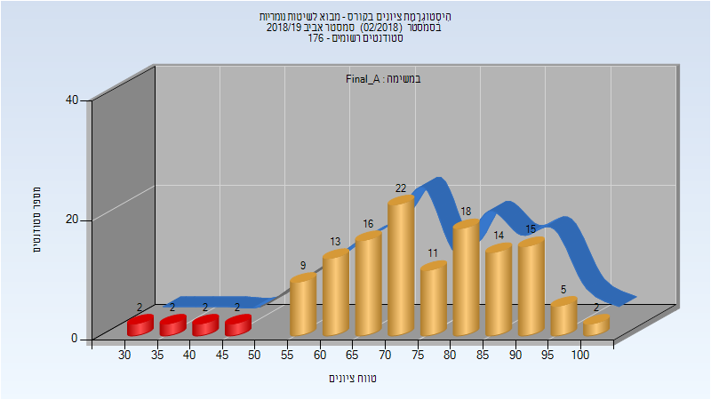

| סטודנטים | עברו/נכשלו | אחוז עוברים | ציון מינימלי | ציון מקסימלי | ממוצע | חציון |
| ---- | ---- | ---- | ---- | ---- | ---- | ---- |
| 133 | 125/8 | 94 | 30 | 100 | 74.271 | 74 |

### סופי מועד ב'

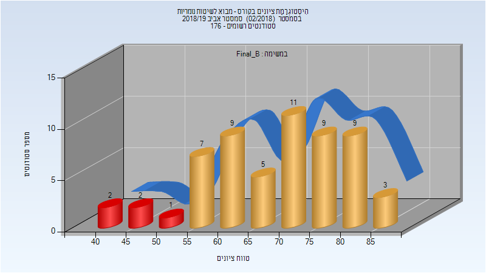

| סטודנטים | עברו/נכשלו | אחוז עוברים | ציון מינימלי | ציון מקסימלי | ממוצע | חציון |
| ---- | ---- | ---- | ---- | ---- | ---- | ---- |
| 58 | 53/5 | 91 | 40 | 89 | 69.034 | 71 |

### סופי

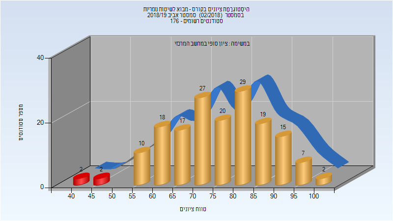

| סטודנטים | עברו/נכשלו | אחוז עוברים | ציון מינימלי | ציון מקסימלי | ממוצע | חציון |
| ---- | ---- | ---- | ---- | ---- | ---- | ---- |
| 168 | 164/4 | 98 | 40 | 100 | 75.994 | 76 |

## חורף 2019-2020

| איש סגל | תפקיד |
| ---- | ---- |
| טולדו תומר | מרצה - אחראי מקצוע |
| פריגוזין עמית | מתרגל - עם הרשאות מרצה אחראי |
| סגל רחלי | סגל מנהלי - עם הרשאות מרצה אחראי |
| קובלר קרן | סגל מנהלי - עם הרשאות מרצה אחראי |

### סופי מועד א'

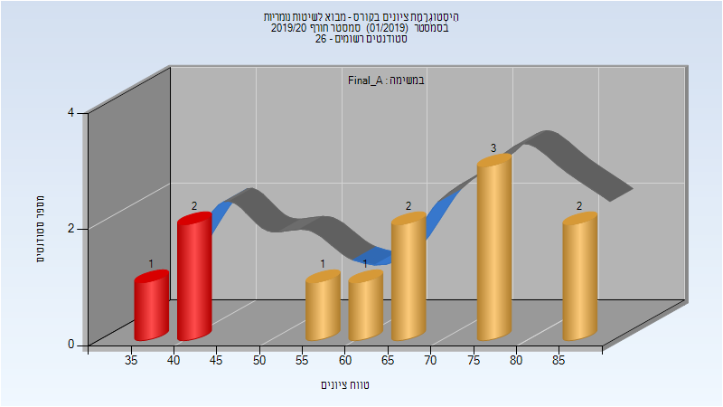

| סטודנטים | עברו/נכשלו | אחוז עוברים | ציון מינימלי | ציון מקסימלי | ממוצע | חציון |
| ---- | ---- | ---- | ---- | ---- | ---- | ---- |
| 12 | 9/3 | 75 | 39 | 89 | 65 | 66.5 |

### סופי

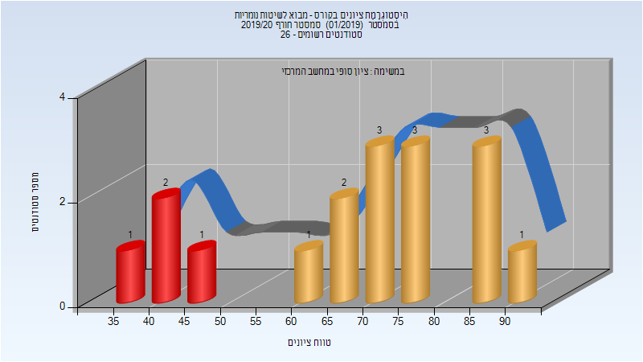

| סטודנטים | עברו/נכשלו | אחוז עוברים | ציון מינימלי | ציון מקסימלי | ממוצע | חציון |
| ---- | ---- | ---- | ---- | ---- | ---- | ---- |
| 17 | 13/4 | 76 | 39 | 94 | 68.529 | 72 |

## אביב 2020

| איש סגל | תפקיד |
| ---- | ---- |
| טולדו תומר | מרצה - אחראי מקצוע |
| הלל רוני | מתרגל - עם הרשאות מרצה אחראי |
| קובלר קרן | סגל מנהלי - עם הרשאות מרצה אחראי |
| מלכה אופירה | סגל מנהלי - עם הרשאות מרצה אחראי |

### סופי מועד א'

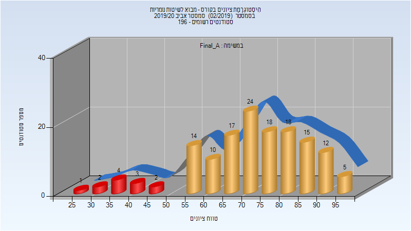

| סטודנטים | עברו/נכשלו | אחוז עוברים | ציון מינימלי | ציון מקסימלי | ממוצע | חציון |
| ---- | ---- | ---- | ---- | ---- | ---- | ---- |
| 145 | 133/12 | 92 | 29 | 97 | 72.448 | 73 |

### סופי מועד ב'

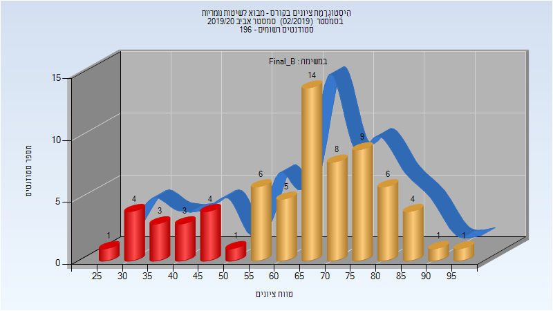

| סטודנטים | עברו/נכשלו | אחוז עוברים | ציון מינימלי | ציון מקסימלי | ממוצע | חציון |
| ---- | ---- | ---- | ---- | ---- | ---- | ---- |
| 70 | 54/16 | 77 | 27 | 96 | 64.357 | 67.5 |

### סופי

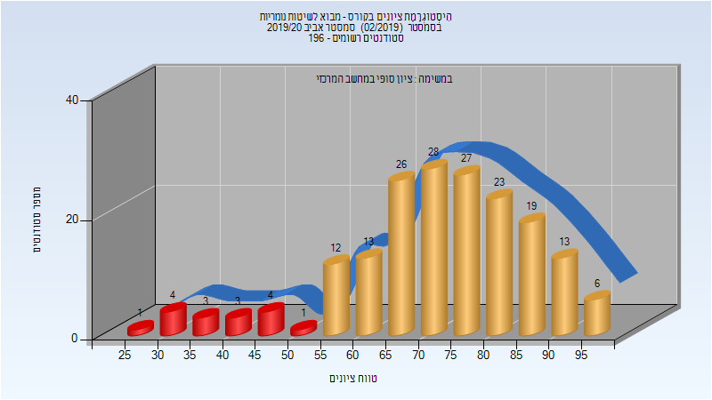

| סטודנטים | עברו/נכשלו | אחוז עוברים | ציון מינימלי | ציון מקסימלי | ממוצע | חציון |
| ---- | ---- | ---- | ---- | ---- | ---- | ---- |
| 183 | 168/15 | 92 | 27 | 97 | 72.727 | 74 |

## חורף 2020-2021

| איש סגל | תפקיד |
| ---- | ---- |
| טולדו תומר | מרצה - אחראי מקצוע |
| קובלר קרן | סגל מנהלי - עם הרשאות מרצה אחראי |
| מלכה אופירה | סגל מנהלי - עם הרשאות מרצה אחראי |

### סופי מועד א'

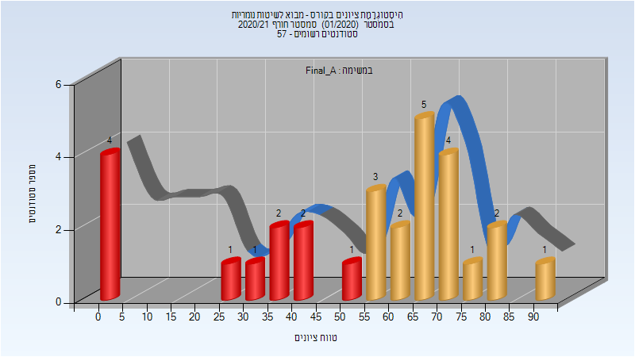

| סטודנטים | עברו/נכשלו | אחוז עוברים | ציון מינימלי | ציון מקסימלי | ממוצע | חציון |
| ---- | ---- | ---- | ---- | ---- | ---- | ---- |
| 29 | 18/11 | 62 | 0 | 94 | 52.172 | 62 |

### סופי מועד ב'

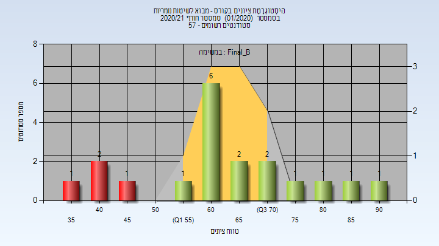

| סטודנטים | עברו/נכשלו | אחוז עוברים | ציון מינימלי | ציון מקסימלי | ממוצע | חציון |
| ---- | ---- | ---- | ---- | ---- | ---- | ---- |
| 19 | 15/4 | 79 | 37 | 91 | 64 | 62 |

### סופי

| סטודנטים | עברו/נכשלו | אחוז עוברים | ציון מינימלי | ציון מקסימלי | ממוצע | חציון |
| ---- | ---- | ---- | ---- | ---- | ---- | ---- |
| 39 | 33/6 | 85 | 37 | 94 | 65.59 | 65 |

## אביב 2021

| איש סגל | תפקיד |
| ---- | ---- |
| דגני אמיר | מרצה - אחראי מקצוע |
| קבלאוי מחמוד | מתרגל - עם הרשאות מרצה אחראי |
| קובלר קרן | סגל מנהלי - עם הרשאות מרצה אחראי |
| מלכה אופירה | סגל מנהלי - עם הרשאות מרצה אחראי |

