# 014103 - מבוא למכניקה הנדסית

## אביב 2013

| איש סגל | תפקיד |
| ---- | ---- |
| ג'בארין מחמוד | מרצה - אחראי מקצוע |

## חורף 2013-2014

| איש סגל | תפקיד |
| ---- | ---- |
| ינקלבסקי דוד | מרצה - אחראי מקצוע |

## אביב 2014

| איש סגל | תפקיד |
| ---- | ---- |
| ג'בארין מחמוד | מרצה - אחראי מקצוע |

## חורף 2014-2015

| איש סגל | תפקיד |
| ---- | ---- |
| ינקלבסקי דוד | מרצה - אחראי מקצוע |

### סופי

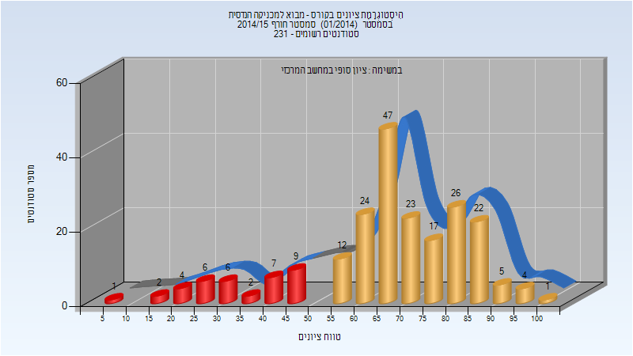

| סטודנטים | עברו/נכשלו | אחוז עוברים | ציון מינימלי | ציון מקסימלי | ממוצע | חציון |
| ---- | ---- | ---- | ---- | ---- | ---- | ---- |
| 218 | 181/37 | 83 | 5 | 100 | 66.761 | 68 |

## אביב 2015

### סופי

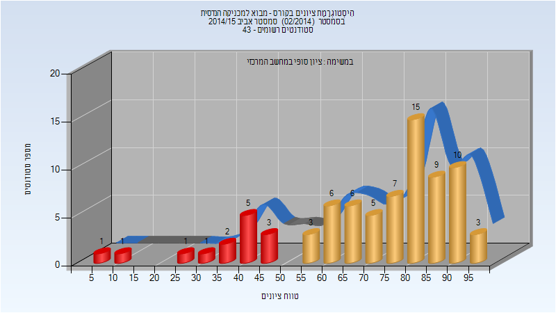

| סטודנטים | עברו/נכשלו | אחוז עוברים | ציון מינימלי | ציון מקסימלי | ממוצע | חציון |
| ---- | ---- | ---- | ---- | ---- | ---- | ---- |
| 78 | 64/14 | 82 | 7 | 98 | 71.603 | 78.5 |

## חורף 2015-2016

| איש סגל | תפקיד |
| ---- | ---- |
| ג'בארין מחמוד | מרצה - אחראי מקצוע |

### סופי

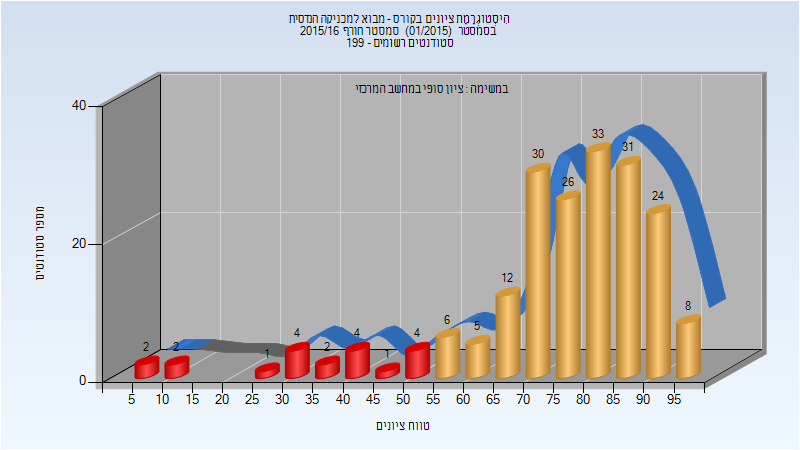

| סטודנטים | עברו/נכשלו | אחוז עוברים | ציון מינימלי | ציון מקסימלי | ממוצע | חציון |
| ---- | ---- | ---- | ---- | ---- | ---- | ---- |
| 195 | 175/20 | 90 | 5 | 99 | 75.344 | 79 |

## אביב 2016

| איש סגל | תפקיד |
| ---- | ---- |
| אלקיים איתי | מרצה |
| פלדפוגל שי | מתרגל |
| מאס יורם | מתרגל |

### מבחן מועד א'

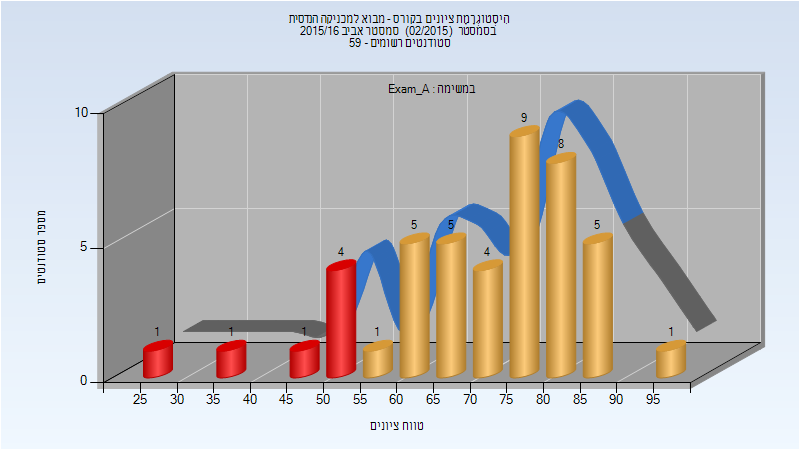

| סטודנטים | עברו/נכשלו | אחוז עוברים | ציון מינימלי | ציון מקסימלי | ממוצע | חציון |
| ---- | ---- | ---- | ---- | ---- | ---- | ---- |
| 45 | 38/7 | 84 | 26 | 97 | 71.044 | 75 |

### סופי מועד א'

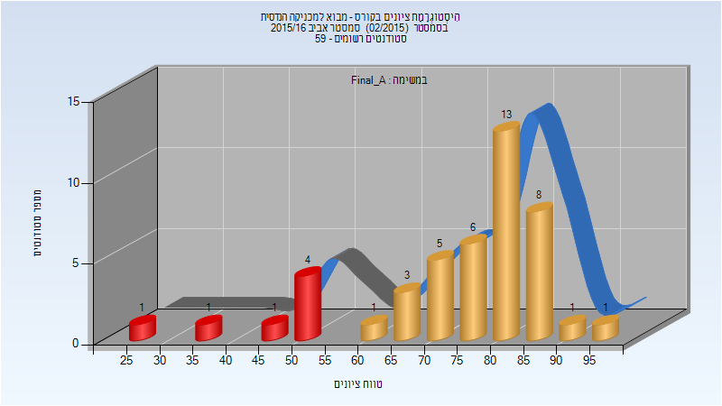

| סטודנטים | עברו/נכשלו | אחוז עוברים | ציון מינימלי | ציון מקסימלי | ממוצע | חציון |
| ---- | ---- | ---- | ---- | ---- | ---- | ---- |
| 45 | 38/7 | 84 | 26 | 97 | 74.578 | 80 |

### מבחן מועד ב'

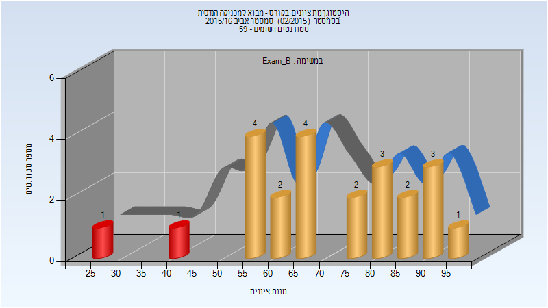

| סטודנטים | עברו/נכשלו | אחוז עוברים | ציון מינימלי | ציון מקסימלי | ממוצע | חציון |
| ---- | ---- | ---- | ---- | ---- | ---- | ---- |
| 23 | 21/2 | 91 | 27 | 97 | 71.261 | 67 |

### סופי מועד ב'

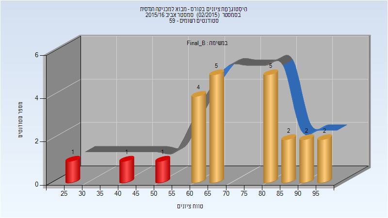

| סטודנטים | עברו/נכשלו | אחוז עוברים | ציון מינימלי | ציון מקסימלי | ממוצע | חציון |
| ---- | ---- | ---- | ---- | ---- | ---- | ---- |
| 23 | 20/3 | 87 | 27 | 97 | 72.043 | 68 |

### סופי

| סטודנטים | עברו/נכשלו | אחוז עוברים | ציון מינימלי | ציון מקסימלי | ממוצע | חציון |
| ---- | ---- | ---- | ---- | ---- | ---- | ---- |
| 57 | 55/2 | 96 | 27 | 97 | 77.667 | 81 |

## חורף 2016-2017

| איש סגל | תפקיד |
| ---- | ---- |
| ג'בארין מחמוד | מרצה - אחראי מקצוע |

### מבחן מועד א'

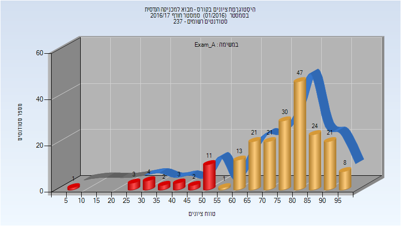

| סטודנטים | עברו/נכשלו | אחוז עוברים | ציון מינימלי | ציון מקסימלי | ממוצע | חציון |
| ---- | ---- | ---- | ---- | ---- | ---- | ---- |
| 212 | 186/26 | 88 | 9 | 99 | 74.708 | 78 |

### סופי מועד א'

| סטודנטים | עברו/נכשלו | אחוז עוברים | ציון מינימלי | ציון מקסימלי | ממוצע | חציון |
| ---- | ---- | ---- | ---- | ---- | ---- | ---- |
| 212 | 186/26 | 88 | 9 | 99 | 74.708 | 78 |

### סופי מועד ב'

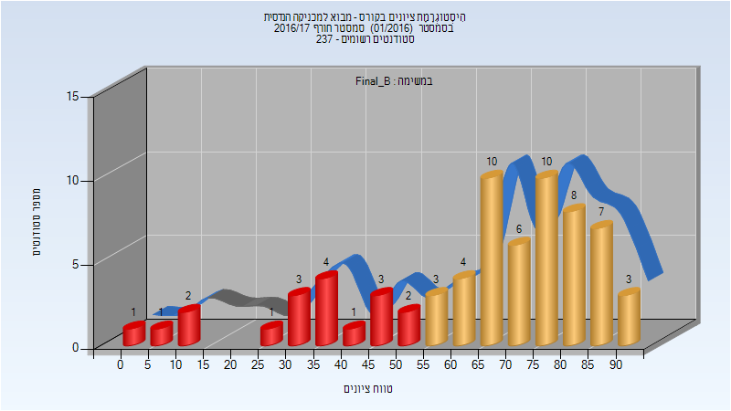

| סטודנטים | עברו/נכשלו | אחוז עוברים | ציון מינימלי | ציון מקסימלי | ממוצע | חציון |
| ---- | ---- | ---- | ---- | ---- | ---- | ---- |
| 69 | 51/18 | 74 | 0 | 92 | 63.681 | 68 |

### סופי

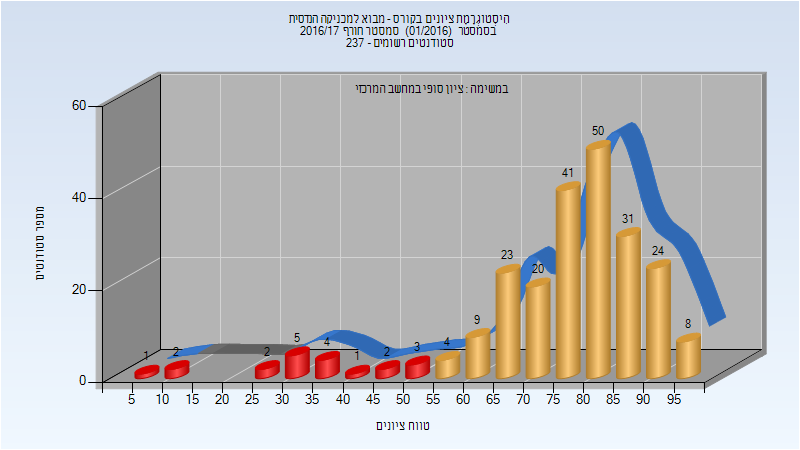

| סטודנטים | עברו/נכשלו | אחוז עוברים | ציון מינימלי | ציון מקסימלי | ממוצע | חציון |
| ---- | ---- | ---- | ---- | ---- | ---- | ---- |
| 230 | 210/20 | 91 | 9 | 99 | 75.526 | 79 |

## אביב 2017

| איש סגל | תפקיד |
| ---- | ---- |
| אלקיים איתי | מרצה - אחראי מקצוע |

### מבחן מועד א'

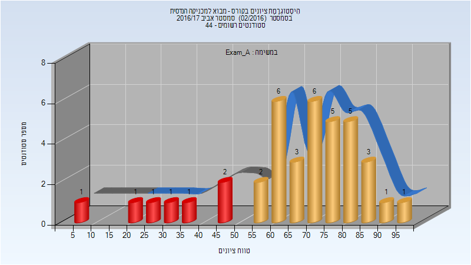

| סטודנטים | עברו/נכשלו | אחוז עוברים | ציון מינימלי | ציון מקסימלי | ממוצע | חציון |
| ---- | ---- | ---- | ---- | ---- | ---- | ---- |
| 39 | 32/7 | 82 | 5 | 95 | 65.949 | 70 |

### סופי מועד א'

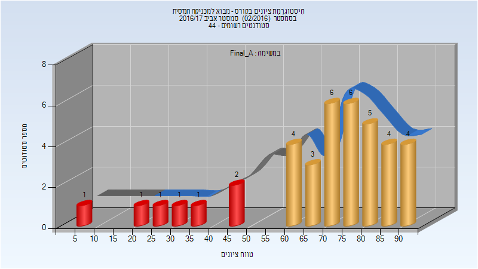

| סטודנטים | עברו/נכשלו | אחוז עוברים | ציון מינימלי | ציון מקסימלי | ממוצע | חציון |
| ---- | ---- | ---- | ---- | ---- | ---- | ---- |
| 39 | 32/7 | 82 | 5 | 94 | 68.897 | 73 |

### מבחן מועד ב'

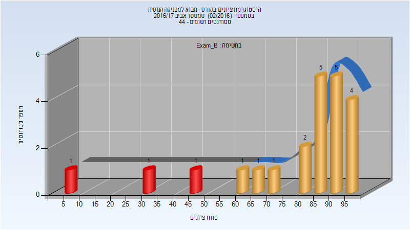

| סטודנטים | עברו/נכשלו | אחוז עוברים | ציון מינימלי | ציון מקסימלי | ממוצע | חציון |
| ---- | ---- | ---- | ---- | ---- | ---- | ---- |
| 22 | 19/3 | 86 | 5 | 99 | 78.727 | 88 |

### סופי מועד ב'

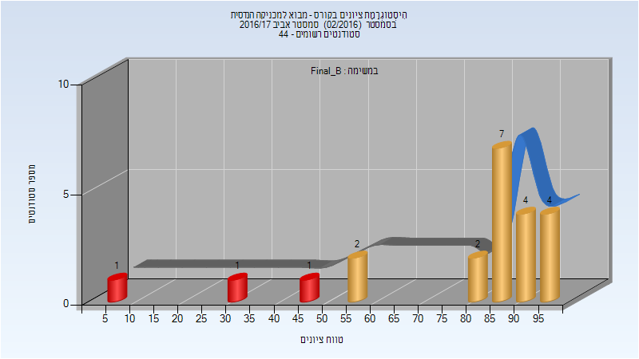

| סטודנטים | עברו/נכשלו | אחוז עוברים | ציון מינימלי | ציון מקסימלי | ממוצע | חציון |
| ---- | ---- | ---- | ---- | ---- | ---- | ---- |
| 22 | 19/3 | 86 | 5 | 99 | 78.636 | 88 |

### סופי

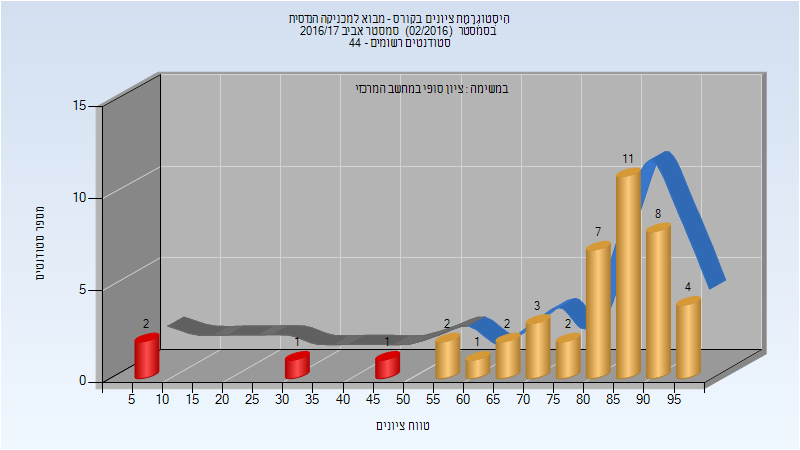

| סטודנטים | עברו/נכשלו | אחוז עוברים | ציון מינימלי | ציון מקסימלי | ממוצע | חציון |
| ---- | ---- | ---- | ---- | ---- | ---- | ---- |
| 44 | 40/4 | 91 | 5 | 99 | 77.864 | 85 |

## חורף 2017-2018

| איש סגל | תפקיד |
| ---- | ---- |
| ג'בארין מחמוד | מרצה - אחראי מקצוע |

### סופי מועד א'

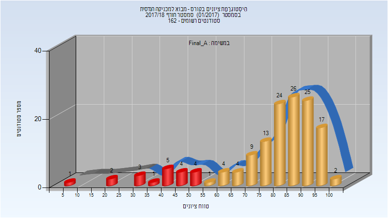

| סטודנטים | עברו/נכשלו | אחוז עוברים | ציון מינימלי | ציון מקסימלי | ממוצע | חציון |
| ---- | ---- | ---- | ---- | ---- | ---- | ---- |
| 145 | 125/20 | 86 | 7 | 100 | 78.676 | 84 |

### סופי מועד ב'

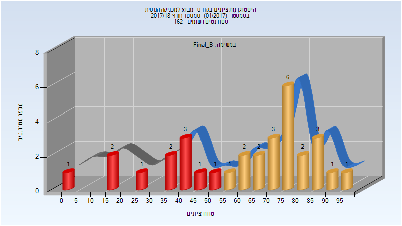

| סטודנטים | עברו/נכשלו | אחוז עוברים | ציון מינימלי | ציון מקסימלי | ממוצע | חציון |
| ---- | ---- | ---- | ---- | ---- | ---- | ---- |
| 32 | 21/11 | 66 | 0 | 99 | 61.625 | 69.5 |

### סופי

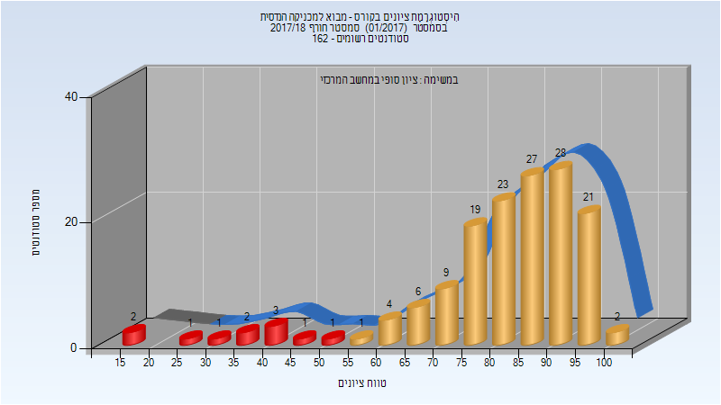

| סטודנטים | עברו/נכשלו | אחוז עוברים | ציון מינימלי | ציון מקסימלי | ממוצע | חציון |
| ---- | ---- | ---- | ---- | ---- | ---- | ---- |
| 151 | 140/11 | 93 | 16 | 100 | 81.344 | 85 |

## אביב 2018

| איש סגל | תפקיד |
| ---- | ---- |
| אלקיים איתי | מרצה |

### מבחן מועד א'

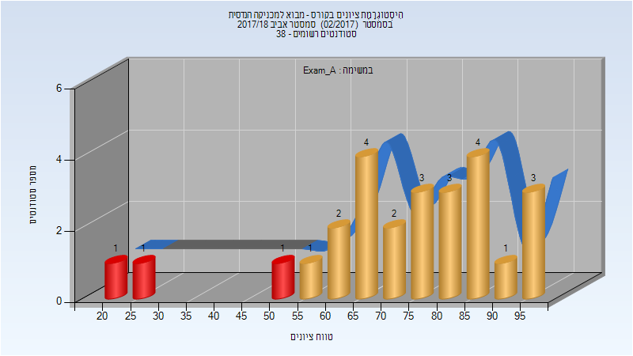

| סטודנטים | עברו/נכשלו | אחוז עוברים | ציון מינימלי | ציון מקסימלי | ממוצע | חציון |
| ---- | ---- | ---- | ---- | ---- | ---- | ---- |
| 26 | 23/3 | 88 | 24 | 99.5 | 73.346 | 76.25 |

### סופי מועד א'

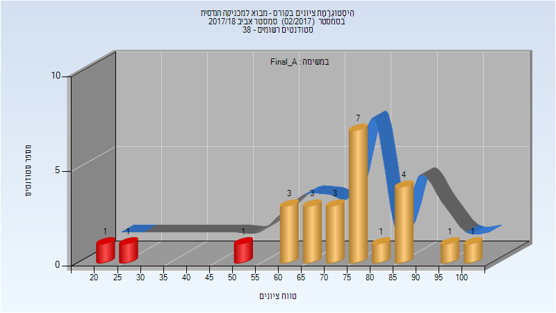

| סטודנטים | עברו/נכשלו | אחוז עוברים | ציון מינימלי | ציון מקסימלי | ממוצע | חציון |
| ---- | ---- | ---- | ---- | ---- | ---- | ---- |
| 26 | 23/3 | 88 | 24 | 100 | 72.231 | 76.5 |

### מבחן מועד ב'

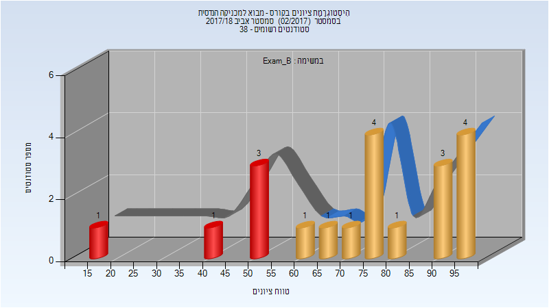

| סטודנטים | עברו/נכשלו | אחוז עוברים | ציון מינימלי | ציון מקסימלי | ממוצע | חציון |
| ---- | ---- | ---- | ---- | ---- | ---- | ---- |
| 20 | 15/5 | 75 | 19 | 99 | 73.95 | 76.5 |

### סופי מועד ב'

| סטודנטים | עברו/נכשלו | אחוז עוברים | ציון מינימלי | ציון מקסימלי | ממוצע | חציון |
| ---- | ---- | ---- | ---- | ---- | ---- | ---- |
| 20 | 18/2 | 90 | 19 | 99 | 75.55 | 80 |

### סופי

| סטודנטים | עברו/נכשלו | אחוז עוברים | ציון מינימלי | ציון מקסימלי | ממוצע | חציון |
| ---- | ---- | ---- | ---- | ---- | ---- | ---- |
| 35 | 33/2 | 94 | 19 | 100 | 80.286 | 83 |

## חורף 2018-2019

| איש סגל | תפקיד |
| ---- | ---- |
| ברודסקי אלכס | מרצה - אחראי מקצוע |
| שביט שרית | סגל מנהלי - עם הרשאות מרצה אחראי |
| צאצאשוילי תמי | סגל מנהלי - עם הרשאות מרצה אחראי |

### סופי מועד א'

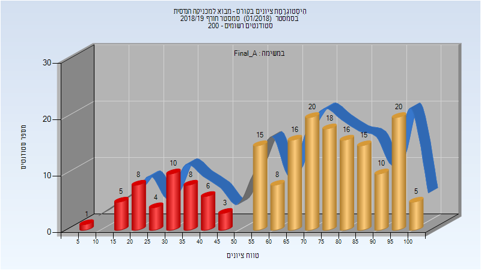

| סטודנטים | עברו/נכשלו | אחוז עוברים | ציון מינימלי | ציון מקסימלי | ממוצע | חציון |
| ---- | ---- | ---- | ---- | ---- | ---- | ---- |
| 188 | 143/45 | 76 | 8 | 100 | 66.952 | 73 |

### סופי מועד ב'

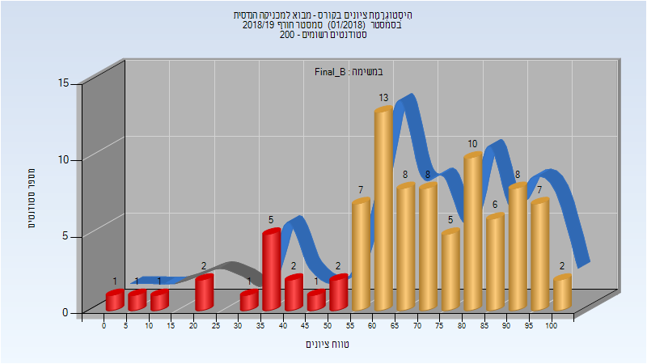

| סטודנטים | עברו/נכשלו | אחוז עוברים | ציון מינימלי | ציון מקסימלי | ממוצע | חציון |
| ---- | ---- | ---- | ---- | ---- | ---- | ---- |
| 90 | 74/16 | 82 | 4 | 100 | 68.733 | 71 |

### סופי

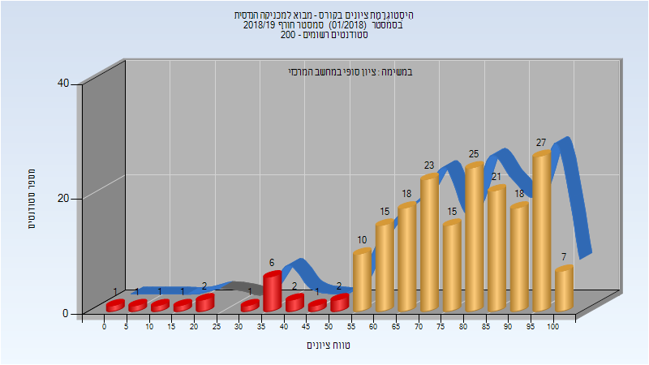

| סטודנטים | עברו/נכשלו | אחוז עוברים | ציון מינימלי | ציון מקסימלי | ממוצע | חציון |
| ---- | ---- | ---- | ---- | ---- | ---- | ---- |
| 197 | 179/18 | 91 | 4 | 100 | 75.954 | 79 |

## אביב 2019

| איש סגל | תפקיד |
| ---- | ---- |
| אלקיים איתי | מרצה - אחראי מקצוע |
| ארודיתה סליג'י | מרצה |

### מבחן מועד א'

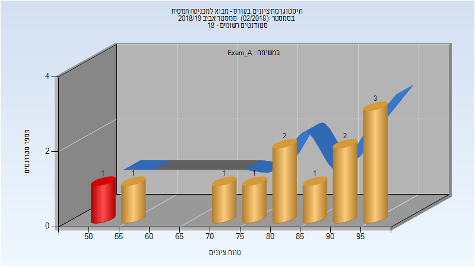

| סטודנטים | עברו/נכשלו | אחוז עוברים | ציון מינימלי | ציון מקסימלי | ממוצע | חציון |
| ---- | ---- | ---- | ---- | ---- | ---- | ---- |
| 12 | 11/1 | 92 | 52.5 | 99.5 | 82.625 | 83.75 |

### סופי מועד א'

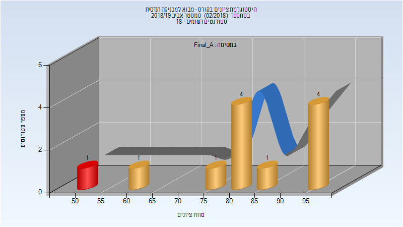

| סטודנטים | עברו/נכשלו | אחוז עוברים | ציון מינימלי | ציון מקסימלי | ממוצע | חציון |
| ---- | ---- | ---- | ---- | ---- | ---- | ---- |
| 12 | 11/1 | 92 | 53 | 99 | 83.167 | 83 |

### סופי

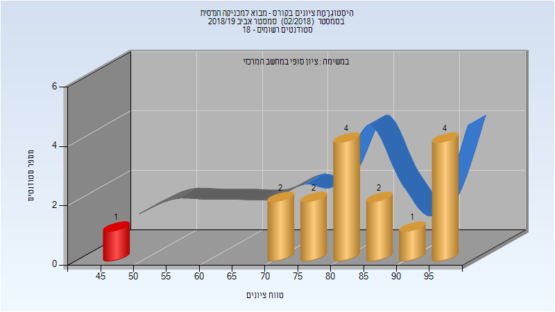

| סטודנטים | עברו/נכשלו | אחוז עוברים | ציון מינימלי | ציון מקסימלי | ממוצע | חציון |
| ---- | ---- | ---- | ---- | ---- | ---- | ---- |
| 16 | 15/1 | 94 | 47 | 99 | 82.938 | 83.5 |

## חורף 2019-2020

| איש סגל | תפקיד |
| ---- | ---- |
| ג'בארין מחמוד | מרצה - אחראי מקצוע |

### סופי מועד א'

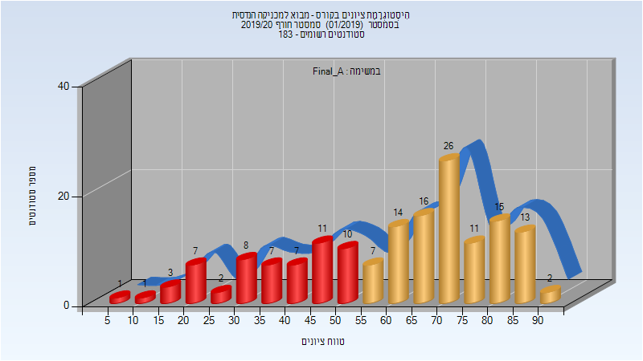

| סטודנטים | עברו/נכשלו | אחוז עוברים | ציון מינימלי | ציון מקסימלי | ממוצע | חציון |
| ---- | ---- | ---- | ---- | ---- | ---- | ---- |
| 161 | 104/57 | 65 | 7 | 92 | 60.385 | 65 |

### סופי מועד ב'

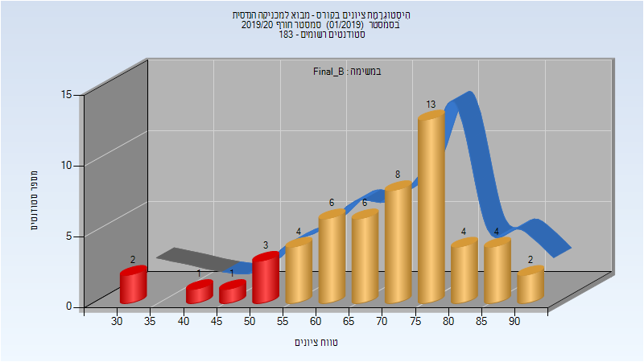

| סטודנטים | עברו/נכשלו | אחוז עוברים | ציון מינימלי | ציון מקסימלי | ממוצע | חציון |
| ---- | ---- | ---- | ---- | ---- | ---- | ---- |
| 54 | 47/7 | 87 | 30 | 91 | 69.556 | 73.5 |

### סופי

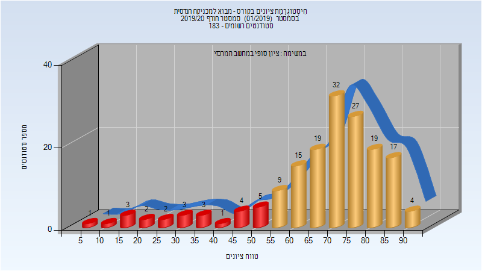

| סטודנטים | עברו/נכשלו | אחוז עוברים | ציון מינימלי | ציון מקסימלי | ממוצע | חציון |
| ---- | ---- | ---- | ---- | ---- | ---- | ---- |
| 173 | 150/23 | 87 | 5 | 96 | 69.387 | 73 |

## אביב 2020

| איש סגל | תפקיד |
| ---- | ---- |
| שביט שרית | סגל מנהלי - עם הרשאות מרצה אחראי |
| צאצאשוילי תמי | סגל מנהלי - עם הרשאות מרצה אחראי |

### סופי

| סטודנטים | עברו/נכשלו | אחוז עוברים | ציון מינימלי | ציון מקסימלי | ממוצע | חציון |
| ---- | ---- | ---- | ---- | ---- | ---- | ---- |
| 20 | 19/1 | 95 | 27 | 96 | 77.05 | 76 |

## חורף 2020-2021

| איש סגל | תפקיד |
| ---- | ---- |
| ג'בארין מחמוד | מרצה - אחראי מקצוע |
| שביט שרית | סגל מנהלי - עם הרשאות מרצה אחראי |
| צאצאשוילי תמי | סגל מנהלי - עם הרשאות מרצה אחראי |

### סופי מועד א'

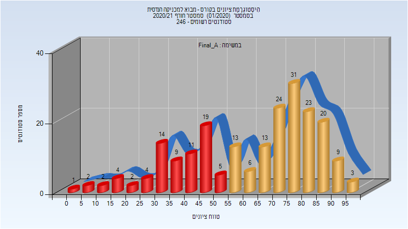

| סטודנטים | עברו/נכשלו | אחוז עוברים | ציון מינימלי | ציון מקסימלי | ממוצע | חציון |
| ---- | ---- | ---- | ---- | ---- | ---- | ---- |
| 215 | 142/73 | 66 | 3 | 97 | 62.688 | 70 |

### סופי מועד ב'

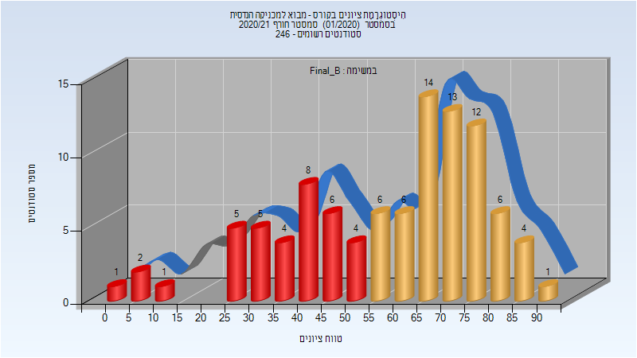

| סטודנטים | עברו/נכשלו | אחוז עוברים | ציון מינימלי | ציון מקסימלי | ממוצע | חציון |
| ---- | ---- | ---- | ---- | ---- | ---- | ---- |
| 98 | 62/36 | 63 | 0 | 90 | 58.378 | 65 |

### סופי

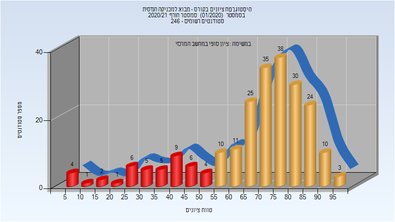

| סטודנטים | עברו/נכשלו | אחוז עוברים | ציון מינימלי | ציון מקסימלי | ממוצע | חציון |
| ---- | ---- | ---- | ---- | ---- | ---- | ---- |
| 230 | 186/44 | 81 | 6 | 97 | 67.878 | 73 |

