# 014104 - תורת החוזק 1

## חורף 2014-2015

| איש סגל | תפקיד |
| ---- | ---- |
| קרינסקי יורי | מרצה - אחראי מקצוע |

### סופי

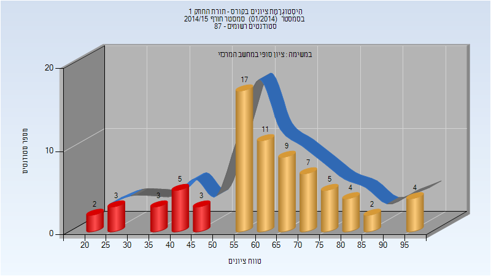

| סטודנטים | עברו/נכשלו | אחוז עוברים | ציון מינימלי | ציון מקסימלי | ממוצע | חציון |
| ---- | ---- | ---- | ---- | ---- | ---- | ---- |
| 75 | 59/16 | 79 | 23 | 99 | 61.12 | 60 |

## אביב 2015

| איש סגל | תפקיד |
| ---- | ---- |
| רבינוביץ' עודד | מרצה - אחראי מקצוע |

### סופי מועד א'

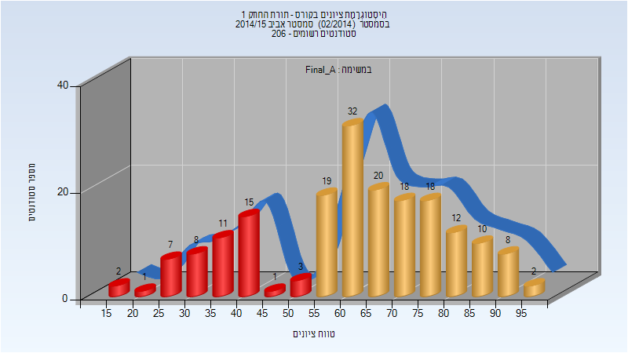

| סטודנטים | עברו/נכשלו | אחוז עוברים | ציון מינימלי | ציון מקסימלי | ממוצע | חציון |
| ---- | ---- | ---- | ---- | ---- | ---- | ---- |
| 187 | 139/48 | 74 | 18 | 96 | 62.198 | 63 |

### סופי מועד ב'

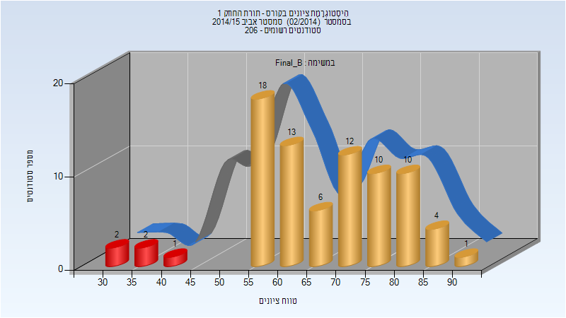

| סטודנטים | עברו/נכשלו | אחוז עוברים | ציון מינימלי | ציון מקסימלי | ממוצע | חציון |
| ---- | ---- | ---- | ---- | ---- | ---- | ---- |
| 79 | 74/5 | 94 | 30 | 91 | 67.165 | 67 |

### סופי

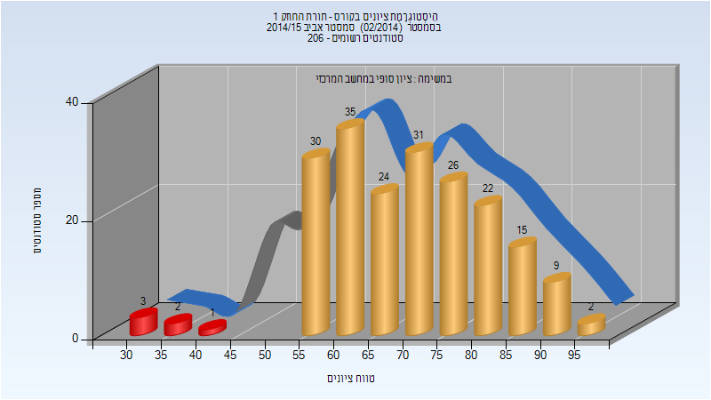

| סטודנטים | עברו/נכשלו | אחוז עוברים | ציון מינימלי | ציון מקסימלי | ממוצע | חציון |
| ---- | ---- | ---- | ---- | ---- | ---- | ---- |
| 200 | 194/6 | 97 | 30 | 97 | 70.35 | 71 |

## אביב 2016

| איש סגל | תפקיד |
| ---- | ---- |
| איזנברגר משה | מרצה - אחראי מקצוע |

### סופי מועד א'

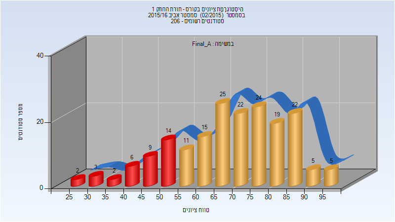

| סטודנטים | עברו/נכשלו | אחוז עוברים | ציון מינימלי | ציון מקסימלי | ממוצע | חציון |
| ---- | ---- | ---- | ---- | ---- | ---- | ---- |
| 184 | 148/36 | 80 | 25 | 98 | 69.125 | 71 |

### סופי מועד ב'

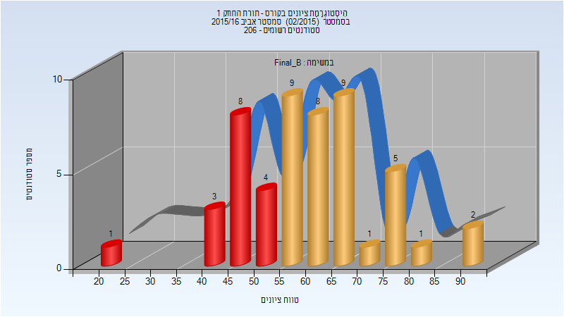

| סטודנטים | עברו/נכשלו | אחוז עוברים | ציון מינימלי | ציון מקסימלי | ממוצע | חציון |
| ---- | ---- | ---- | ---- | ---- | ---- | ---- |
| 51 | 35/16 | 69 | 22 | 92 | 59.804 | 59 |

### סופי

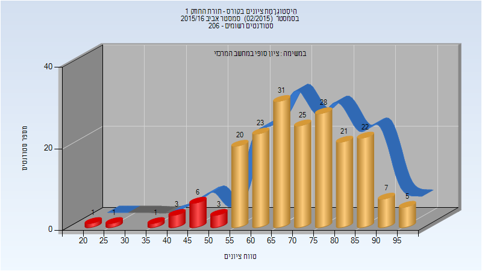

| סטודנטים | עברו/נכשלו | אחוז עוברים | ציון מינימלי | ציון מקסימלי | ממוצע | חציון |
| ---- | ---- | ---- | ---- | ---- | ---- | ---- |
| 197 | 182/15 | 92 | 22 | 98 | 70.995 | 71 |

## קיץ 2016

| איש סגל | תפקיד |
| ---- | ---- |
| קרינסקי יורי | מרצה - אחראי מקצוע |
| צאצאשוילי תמי | סגל מנהלי - עם הרשאות מרצה אחראי |
| שביט שרית | סגל מנהלי - עם הרשאות מרצה אחראי |

### סופי מועד א'

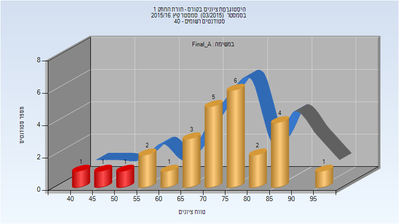

| סטודנטים | עברו/נכשלו | אחוז עוברים | ציון מינימלי | ציון מקסימלי | ממוצע | חציון |
| ---- | ---- | ---- | ---- | ---- | ---- | ---- |
| 27 | 24/3 | 89 | 44 | 96 | 71.852 | 72 |

### סופי מועד ב'

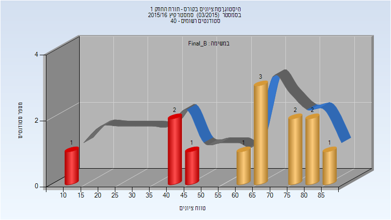

| סטודנטים | עברו/נכשלו | אחוז עוברים | ציון מינימלי | ציון מקסימלי | ממוצע | חציון |
| ---- | ---- | ---- | ---- | ---- | ---- | ---- |
| 13 | 9/4 | 69 | 11 | 88 | 62.462 | 67 |

### סופי

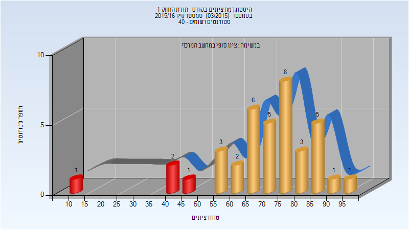

| סטודנטים | עברו/נכשלו | אחוז עוברים | ציון מינימלי | ציון מקסימלי | ממוצע | חציון |
| ---- | ---- | ---- | ---- | ---- | ---- | ---- |
| 38 | 34/4 | 89 | 11 | 96 | 70.289 | 73.5 |

## אביב 2017

| איש סגל | תפקיד |
| ---- | ---- |
| איזנברגר משה | מרצה - אחראי מקצוע |

### סופי מועד א'

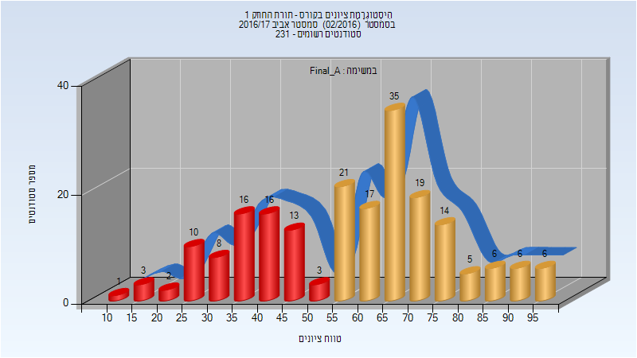

| סטודנטים | עברו/נכשלו | אחוז עוברים | ציון מינימלי | ציון מקסימלי | ממוצע | חציון |
| ---- | ---- | ---- | ---- | ---- | ---- | ---- |
| 201 | 129/72 | 64 | 13 | 99 | 58.704 | 62.7 |

### סופי מועד ב'

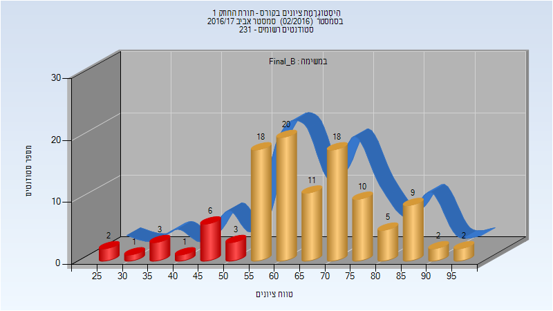

| סטודנטים | עברו/נכשלו | אחוז עוברים | ציון מינימלי | ציון מקסימלי | ממוצע | חציון |
| ---- | ---- | ---- | ---- | ---- | ---- | ---- |
| 111 | 95/16 | 86 | 25.483 | 96.15 | 66.046 | 65 |

### סופי

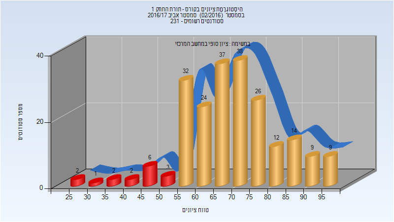

| סטודנטים | עברו/נכשלו | אחוז עוברים | ציון מינימלי | ציון מקסימלי | ממוצע | חציון |
| ---- | ---- | ---- | ---- | ---- | ---- | ---- |
| 217 | 201/16 | 93 | 25 | 99 | 69.369 | 69 |

## קיץ 2017

| איש סגל | תפקיד |
| ---- | ---- |
| קרינסקי יורי | מרצה - אחראי מקצוע |
| בן-סימון ציפורה | סגל מנהלי - עם הרשאות מרצה אחראי |
| שביט שרית | סגל מנהלי - עם הרשאות מרצה אחראי |
| צאצאשוילי תמי | סגל מנהלי - עם הרשאות מרצה אחראי |

### סופי מועד א'

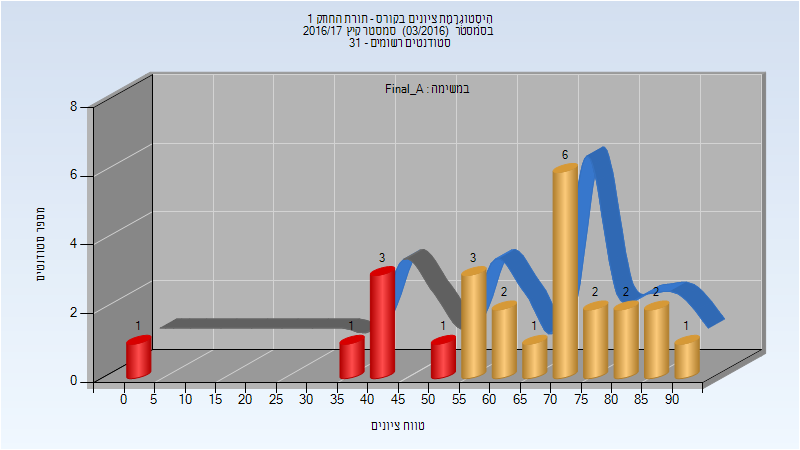

| סטודנטים | עברו/נכשלו | אחוז עוברים | ציון מינימלי | ציון מקסימלי | ממוצע | חציון |
| ---- | ---- | ---- | ---- | ---- | ---- | ---- |
| 25 | 19/6 | 76 | 0 | 91 | 63.999 | 70 |

### סופי

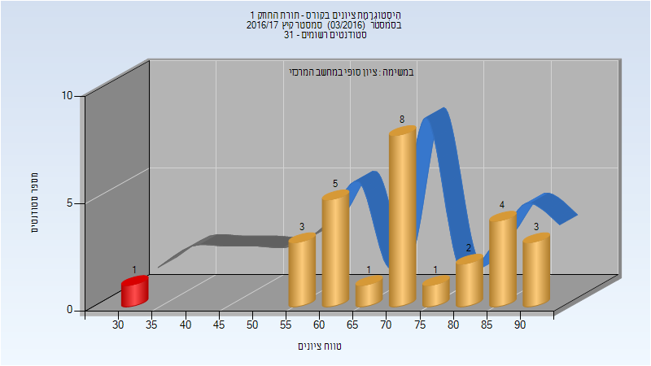

| סטודנטים | עברו/נכשלו | אחוז עוברים | ציון מינימלי | ציון מקסימלי | ממוצע | חציון |
| ---- | ---- | ---- | ---- | ---- | ---- | ---- |
| 28 | 27/1 | 96 | 34 | 92 | 71.571 | 71.5 |

## אביב 2018

| איש סגל | תפקיד |
| ---- | ---- |
| איזנברגר משה | מרצה - אחראי מקצוע |

### סופי מועד א'

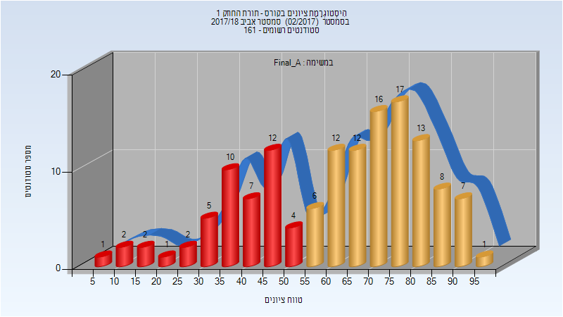

| סטודנטים | עברו/נכשלו | אחוז עוברים | ציון מינימלי | ציון מקסימלי | ממוצע | חציון |
| ---- | ---- | ---- | ---- | ---- | ---- | ---- |
| 138 | 92/46 | 67 | 6 | 95.129 | 62.34 | 66.7 |

### סופי מועד ב'

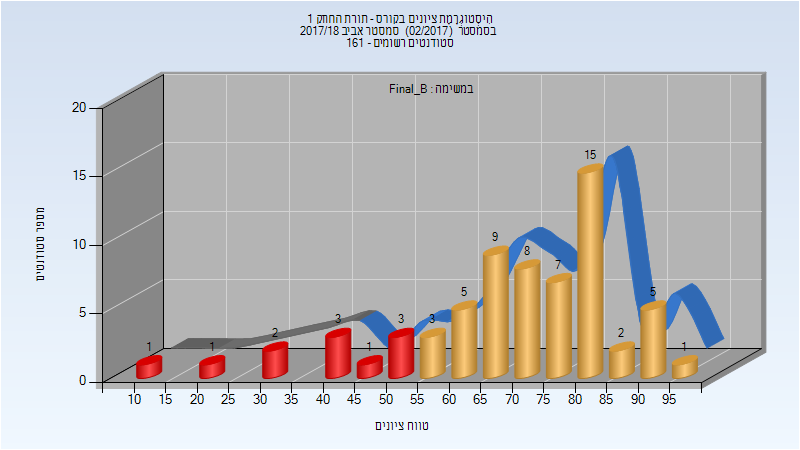

| סטודנטים | עברו/נכשלו | אחוז עוברים | ציון מינימלי | ציון מקסימלי | ממוצע | חציון |
| ---- | ---- | ---- | ---- | ---- | ---- | ---- |
| 66 | 55/11 | 83 | 10 | 97.3 | 70.101 | 72.1 |

### סופי

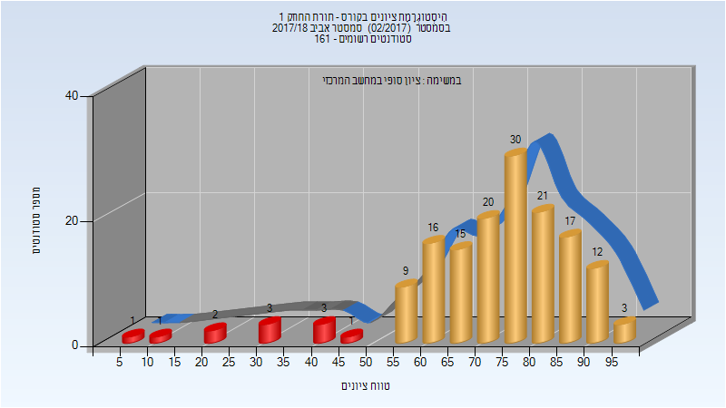

| סטודנטים | עברו/נכשלו | אחוז עוברים | ציון מינימלי | ציון מקסימלי | ממוצע | חציון |
| ---- | ---- | ---- | ---- | ---- | ---- | ---- |
| 154 | 143/11 | 93 | 6 | 97 | 72.506 | 76 |

## קיץ 2018

| איש סגל | תפקיד |
| ---- | ---- |
| קרינסקי יורי | מרצה - אחראי מקצוע |
| שביט שרית | סגל מנהלי - עם הרשאות מרצה אחראי |
| צאצאשוילי תמי | סגל מנהלי - עם הרשאות מרצה אחראי |

### סופי מועד א'

| סטודנטים | עברו/נכשלו | אחוז עוברים | ציון מינימלי | ציון מקסימלי | ממוצע | חציון |
| ---- | ---- | ---- | ---- | ---- | ---- | ---- |
| 19 | 19/0 | 100 | 60 | 100 | 79.737 | 76 |

### סופי

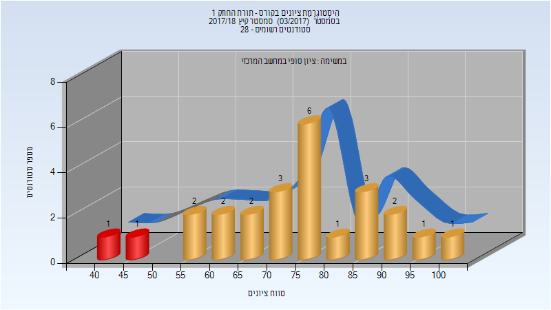

| סטודנטים | עברו/נכשלו | אחוז עוברים | ציון מינימלי | ציון מקסימלי | ממוצע | חציון |
| ---- | ---- | ---- | ---- | ---- | ---- | ---- |
| 25 | 23/2 | 92 | 44 | 100 | 74.64 | 75 |

## חורף 2018-2019

| איש סגל | תפקיד |
| ---- | ---- |
| פלדפוגל שי | מרצה - אחראי מקצוע |
| ארודיתה סליג'י | מרצה |

### סופי

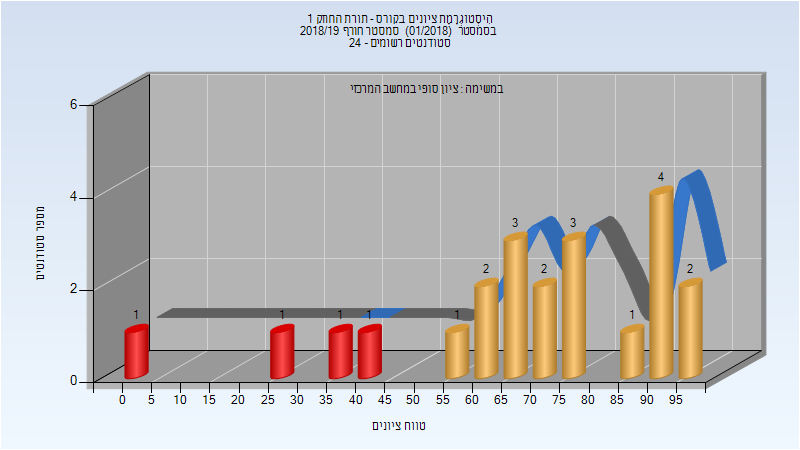

| סטודנטים | עברו/נכשלו | אחוז עוברים | ציון מינימלי | ציון מקסימלי | ממוצע | חציון |
| ---- | ---- | ---- | ---- | ---- | ---- | ---- |
| 22 | 18/4 | 82 | 2 | 99 | 68.591 | 72 |

## אביב 2019

| איש סגל | תפקיד |
| ---- | ---- |
| איזנברגר משה | מרצה - אחראי מקצוע |

### סופי מועד א'

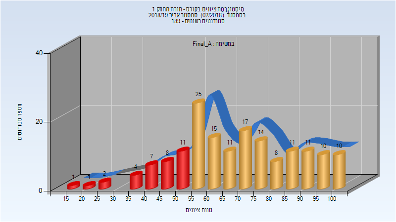

| סטודנטים | עברו/נכשלו | אחוז עוברים | ציון מינימלי | ציון מקסימלי | ממוצע | חציון |
| ---- | ---- | ---- | ---- | ---- | ---- | ---- |
| 166 | 132/34 | 80 | 18.6 | 100 | 69.334 | 69.2 |

### סופי מועד ב'

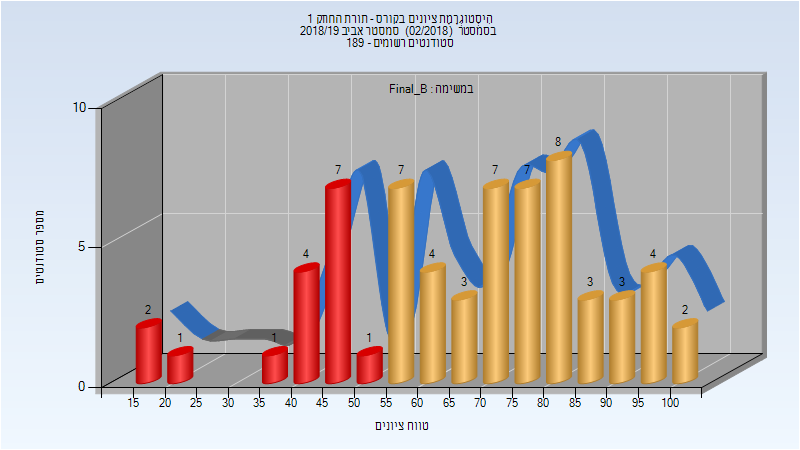

| סטודנטים | עברו/נכשלו | אחוז עוברים | ציון מינימלי | ציון מקסימלי | ממוצע | חציון |
| ---- | ---- | ---- | ---- | ---- | ---- | ---- |
| 64 | 48/16 | 75 | 18.1 | 100 | 67.83 | 71.2 |

### סופי

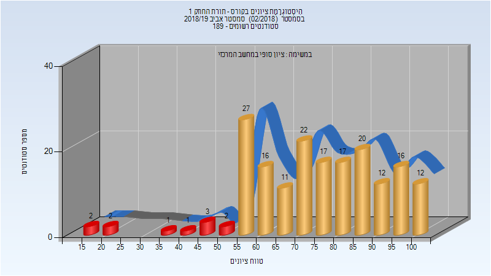

| סטודנטים | עברו/נכשלו | אחוז עוברים | ציון מינימלי | ציון מקסימלי | ממוצע | חציון |
| ---- | ---- | ---- | ---- | ---- | ---- | ---- |
| 181 | 170/11 | 94 | 18 | 100 | 74.74 | 75 |

## קיץ 2019

| איש סגל | תפקיד |
| ---- | ---- |
| קרינסקי יורי | מרצה - אחראי מקצוע |
| צאצאשוילי תמי | סגל מנהלי - עם הרשאות מרצה אחראי |
| שביט שרית | סגל מנהלי - עם הרשאות מרצה אחראי |

### סופי

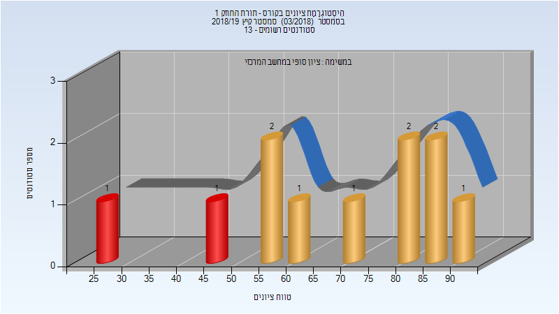

| סטודנטים | עברו/נכשלו | אחוז עוברים | ציון מינימלי | ציון מקסימלי | ממוצע | חציון |
| ---- | ---- | ---- | ---- | ---- | ---- | ---- |
| 11 | 9/2 | 82 | 26 | 90 | 68.273 | 64 |

## חורף 2019-2020

| איש סגל | תפקיד |
| ---- | ---- |
| פלדפוגל שי | מרצה - אחראי מקצוע |
| ארודיתה סליג'י | מרצה |

### סופי

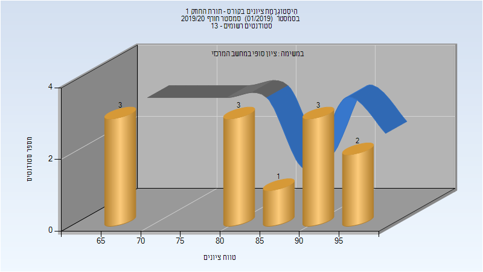

| סטודנטים | עברו/נכשלו | אחוז עוברים | ציון מינימלי | ציון מקסימלי | ממוצע | חציון |
| ---- | ---- | ---- | ---- | ---- | ---- | ---- |
| 12 | 12/0 | 100 | 67 | 97 | 83.917 | 85.5 |

## אביב 2020

| איש סגל | תפקיד |
| ---- | ---- |
| איזנברגר משה | מרצה - אחראי מקצוע |
| שביט שרית | סגל מנהלי - עם הרשאות מרצה אחראי |
| צאצאשוילי תמי | סגל מנהלי - עם הרשאות מרצה אחראי |

### סופי מועד א'

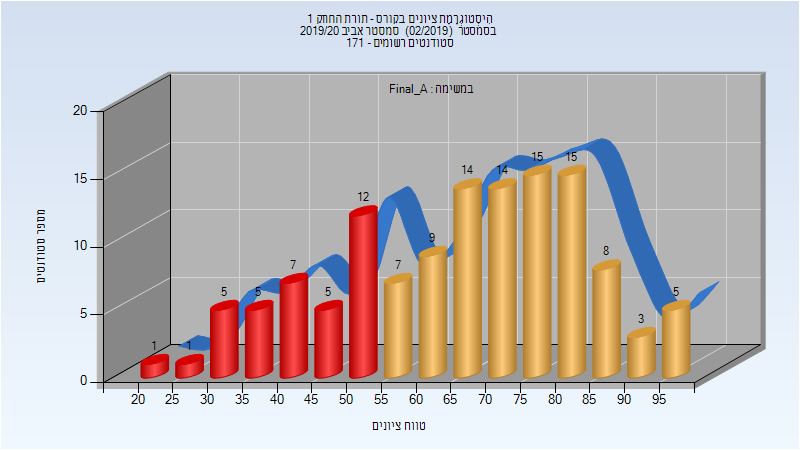

| סטודנטים | עברו/נכשלו | אחוז עוברים | ציון מינימלי | ציון מקסימלי | ממוצע | חציון |
| ---- | ---- | ---- | ---- | ---- | ---- | ---- |
| 126 | 90/36 | 71 | 20 | 97 | 65.357 | 68 |

### סופי מועד ב'

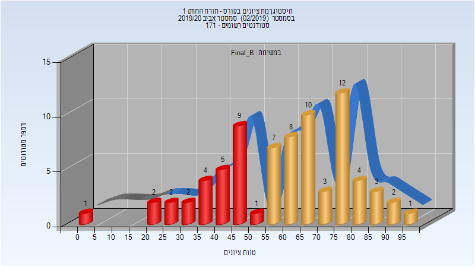

| סטודנטים | עברו/נכשלו | אחוז עוברים | ציון מינימלי | ציון מקסימלי | ממוצע | חציון |
| ---- | ---- | ---- | ---- | ---- | ---- | ---- |
| 76 | 50/26 | 66 | 0 | 99.7 | 60.075 | 63.1875 |

### סופי

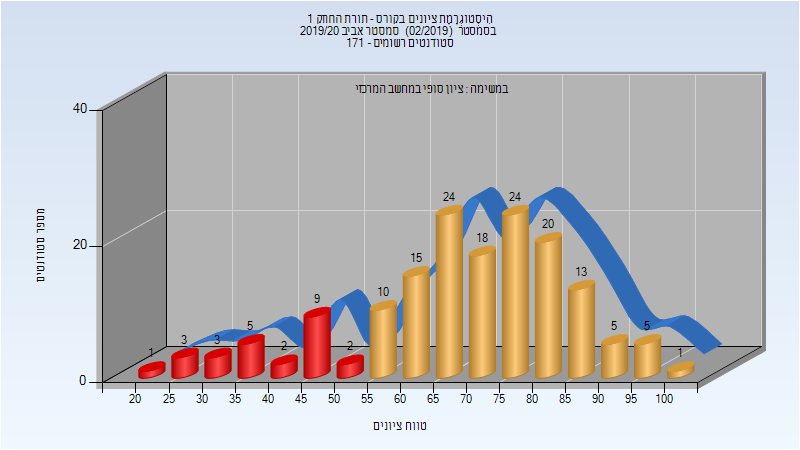

| סטודנטים | עברו/נכשלו | אחוז עוברים | ציון מינימלי | ציון מקסימלי | ממוצע | חציון |
| ---- | ---- | ---- | ---- | ---- | ---- | ---- |
| 160 | 135/25 | 84 | 20 | 100 | 68.731 | 72 |

## קיץ 2020

| איש סגל | תפקיד |
| ---- | ---- |
| קרינסקי יורי | מרצה - אחראי מקצוע |
| צאצאשוילי תמי | סגל מנהלי - עם הרשאות מרצה אחראי |
| שביט שרית | סגל מנהלי - עם הרשאות מרצה אחראי |

### סופי מועד א'

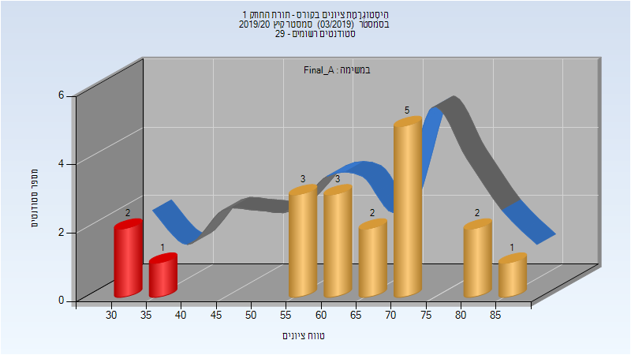

| סטודנטים | עברו/נכשלו | אחוז עוברים | ציון מינימלי | ציון מקסימלי | ממוצע | חציון |
| ---- | ---- | ---- | ---- | ---- | ---- | ---- |
| 19 | 16/3 | 84 | 32 | 85 | 63.316 | 60 |

### סופי

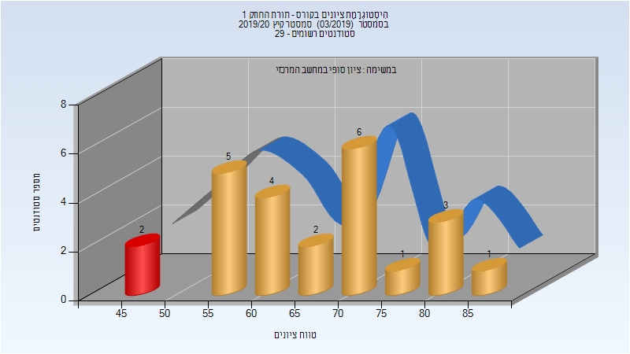

| סטודנטים | עברו/נכשלו | אחוז עוברים | ציון מינימלי | ציון מקסימלי | ממוצע | חציון |
| ---- | ---- | ---- | ---- | ---- | ---- | ---- |
| 24 | 22/2 | 92 | 45 | 85 | 66.458 | 68 |

## חורף 2020-2021

| איש סגל | תפקיד |
| ---- | ---- |
| בשארה דאנא | מרצה - אחראי מקצוע |

### סופי מועד א'

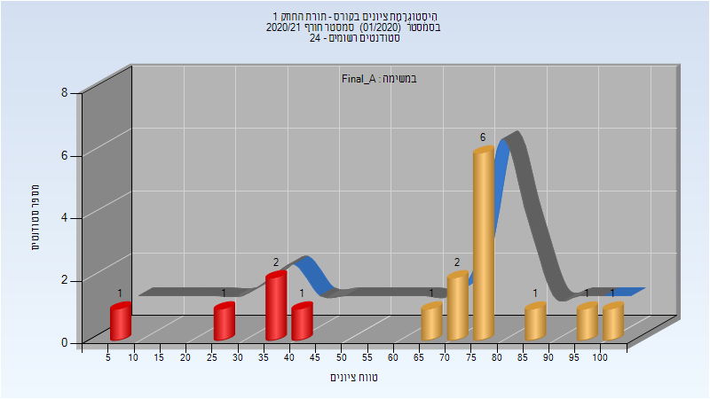

| סטודנטים | עברו/נכשלו | אחוז עוברים | ציון מינימלי | ציון מקסימלי | ממוצע | חציון |
| ---- | ---- | ---- | ---- | ---- | ---- | ---- |
| 17 | 12/5 | 71 | 7 | 100 | 64.706 | 75 |

### סופי מועד ב'

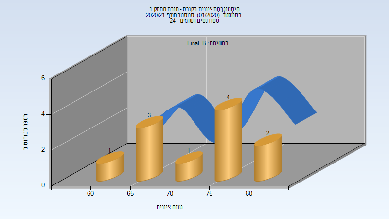

| סטודנטים | עברו/נכשלו | אחוז עוברים | ציון מינימלי | ציון מקסימלי | ממוצע | חציון |
| ---- | ---- | ---- | ---- | ---- | ---- | ---- |
| 11 | 11/0 | 100 | 62 | 82 | 73 | 72 |

### סופי

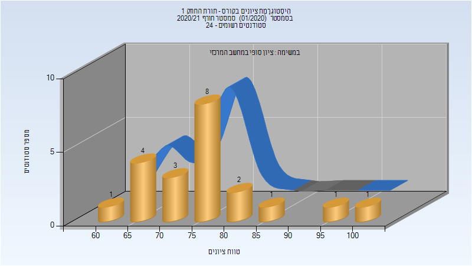

| סטודנטים | עברו/נכשלו | אחוז עוברים | ציון מינימלי | ציון מקסימלי | ממוצע | חציון |
| ---- | ---- | ---- | ---- | ---- | ---- | ---- |
| 21 | 21/0 | 100 | 62 | 100 | 76.143 | 75 |

