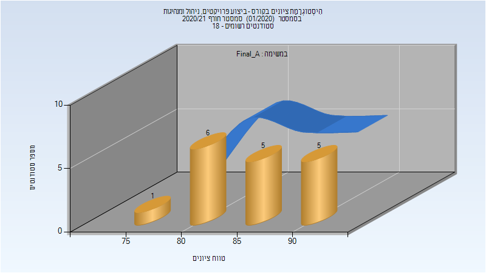

# 014616 - ביצוע פרויקטים, ניהול ומנהיגות

## חורף 2020-2021

| איש סגל | תפקיד |
| ---- | ---- |
| בן-עוז חנן | מרצה - אחראי מקצוע |
| שביט שרית | סגל מנהלי - עם הרשאות מרצה אחראי |
| צאצאשוילי תמי | סגל מנהלי - עם הרשאות מרצה אחראי |

### סופי מועד א'

| סטודנטים | עברו/נכשלו | אחוז עוברים | ציון מינימלי | ציון מקסימלי | ממוצע | חציון |
| ---- | ---- | ---- | ---- | ---- | ---- | ---- |
| 17 | 17/0 | 100 | 78 | 92 | 85.706 | 88 |

