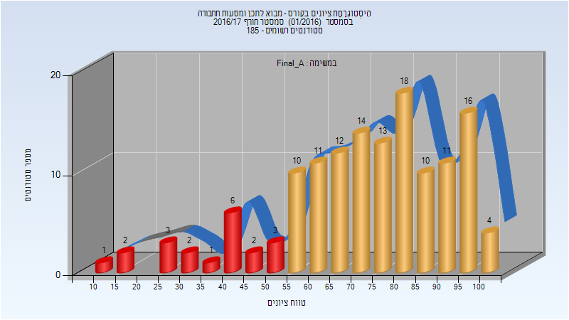
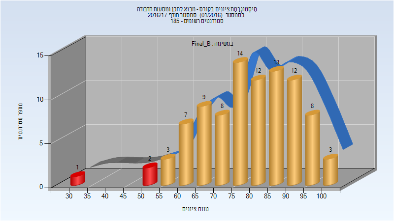
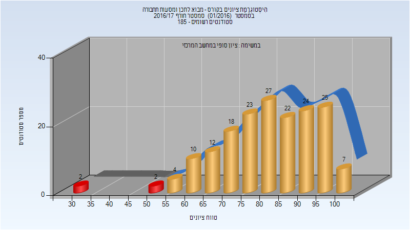

# 014718 - מבוא לתכן ומסעות תחבורה

## חורף 2016-2017

| איש סגל | תפקיד |
| ---- | ---- |
| קלר אסף | מרצה - אחראי מקצוע |

### סופי מועד א'

| סטודנטים | עברו/נכשלו | אחוז עוברים | ציון מינימלי | ציון מקסימלי | ממוצע | חציון |
| ---- | ---- | ---- | ---- | ---- | ---- | ---- |
| 139 | 119/20 | 86 | 14 | 100 | 72.719 | 75 |

### סופי מועד ב'

| סטודנטים | עברו/נכשלו | אחוז עוברים | ציון מינימלי | ציון מקסימלי | ממוצע | חציון |
| ---- | ---- | ---- | ---- | ---- | ---- | ---- |
| 92 | 89/3 | 97 | 33 | 100 | 79.076 | 80 |

### סופי

| סטודנטים | עברו/נכשלו | אחוז עוברים | ציון מינימלי | ציון מקסימלי | ממוצע | חציון |
| ---- | ---- | ---- | ---- | ---- | ---- | ---- |
| 176 | 172/4 | 98 | 33 | 100 | 81.443 | 82 |

