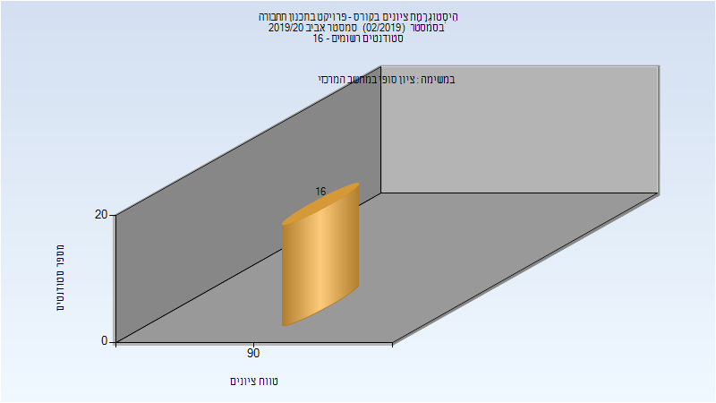

# 014721 - פרויקט בתכנון תחבורה

## חורף 2019-2020

| איש סגל | תפקיד |
| ---- | ---- |
| אסחאק רוברט | מרצה - אחראי מקצוע |
| בן-סימון ציפורה | סגל מנהלי - עם הרשאות מרצה אחראי |

## אביב 2020

| איש סגל | תפקיד |
| ---- | ---- |
| אסחאק רוברט | מרצה - אחראי מקצוע |
| בן-סימון ציפורה | סגל מנהלי - עם הרשאות מרצה אחראי |
| לוינסקי יעל | סגל מנהלי - עם הרשאות מרצה אחראי |

### סופי

| סטודנטים | עברו/נכשלו | אחוז עוברים | ציון מינימלי | ציון מקסימלי | ממוצע | חציון |
| ---- | ---- | ---- | ---- | ---- | ---- | ---- |
| 16 | 16/0 | 100 | 90 | 94 | 92 | 93 |

## חורף 2020-2021

| איש סגל | תפקיד |
| ---- | ---- |
| אסחאק רוברט | מרצה - אחראי מקצוע |
| בן-סימון ציפורה | סגל מנהלי - עם הרשאות מרצה אחראי |

