# 014841 - יסודות המיפוי והמדידה 1

## אביב 2016

| איש סגל | תפקיד |
| ---- | ---- |
| דליות שגיא | מרצה - אחראי מקצוע |
| אלנאשף בשאר | מתרגל |
| חוראני ורד | מתרגל |
| וידרו יוליה | מתרגל |
| מוז'ייבה סופיה | מתרגל |
| ג'לג'ולה רובא | מתרגל |
| בשותי אליאנה | מתרגל |
| קבלאוי מחמוד | מתרגל |
| כהן אחיטוב | מתרגל |
| בינסקי נועה | מתרגל |
| שחף מרדכי עודד | מתרגל |
| מסד עדו | מתרגל |

### סופי מועד א'

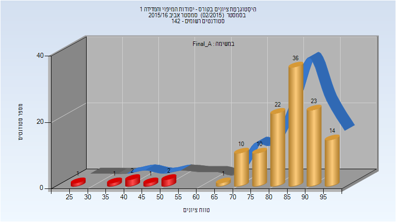

| סטודנטים | עברו/נכשלו | אחוז עוברים | ציון מינימלי | ציון מקסימלי | ממוצע | חציון |
| ---- | ---- | ---- | ---- | ---- | ---- | ---- |
| 123 | 116/7 | 94 | 27 | 99 | 83.634 | 86 |

### סופי מועד ב'

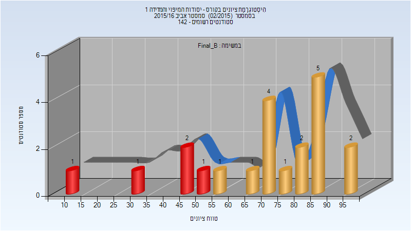

| סטודנטים | עברו/נכשלו | אחוז עוברים | ציון מינימלי | ציון מקסימלי | ממוצע | חציון |
| ---- | ---- | ---- | ---- | ---- | ---- | ---- |
| 21 | 16/5 | 76 | 14 | 97 | 69.857 | 74 |

### סופי

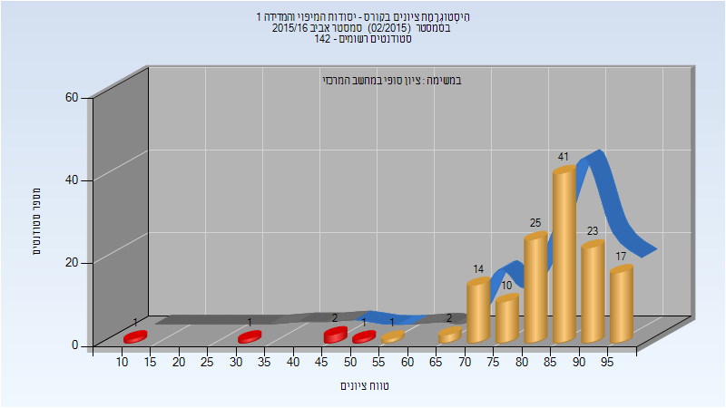

| סטודנטים | עברו/נכשלו | אחוז עוברים | ציון מינימלי | ציון מקסימלי | ממוצע | חציון |
| ---- | ---- | ---- | ---- | ---- | ---- | ---- |
| 138 | 133/5 | 96 | 14 | 99 | 83.71 | 86 |

## חורף 2016-2017

| איש סגל | תפקיד |
| ---- | ---- |
| דליות שגיא | מרצה - אחראי מקצוע |
| ג'לג'ולה רובא | מתרגל |
| בשותי אליאנה | מתרגל |
| וידרו יוליה | מתרגל |
| שחף מרדכי עודד | מתרגל |
| כהן אחיטוב | מתרגל |
| שכטר מור | מתרגל |
| פור ירין | מתרגל |
| טופל לאה | מתרגל - עם הרשאות מרצה אחראי |

### סופי מועד א'

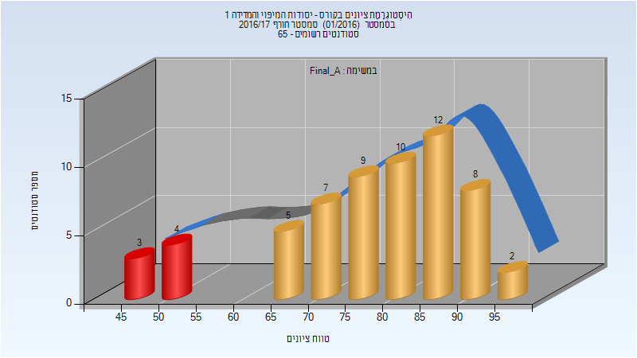

| סטודנטים | עברו/נכשלו | אחוז עוברים | ציון מינימלי | ציון מקסימלי | ממוצע | חציון |
| ---- | ---- | ---- | ---- | ---- | ---- | ---- |
| 60 | 53/7 | 88 | 47 | 99 | 78.033 | 80 |

### סופי

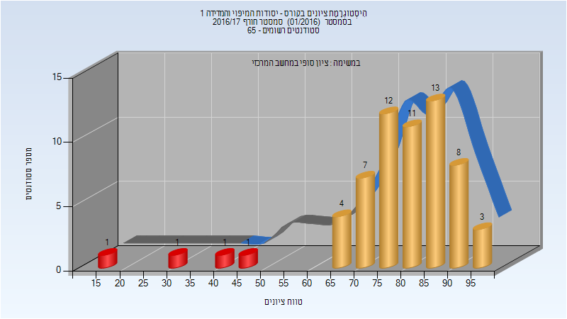

| סטודנטים | עברו/נכשלו | אחוז עוברים | ציון מינימלי | ציון מקסימלי | ממוצע | חציון |
| ---- | ---- | ---- | ---- | ---- | ---- | ---- |
| 62 | 58/4 | 94 | 18 | 99 | 79.129 | 81.5 |

## אביב 2017

| איש סגל | תפקיד |
| ---- | ---- |
| דליות שגיא | מרצה - אחראי מקצוע |
| וידרו יוליה | מתרגל |
| בשותי אליאנה | מתרגל |
| שחף מרדכי עודד | מתרגל |
| עיסאוי אליאס | מתרגל |
| לדין-גייניץ יואל | מתרגל |
| ג'לג'ולה רובא | מתרגל |
| שכטר מור | מתרגל |
| כהן אחיטוב | מתרגל |
| קלר מוריה | מתרגל |
| מסד עדו | מתרגל |
| שכטר חן | מתרגל |

### סופי מועד א'

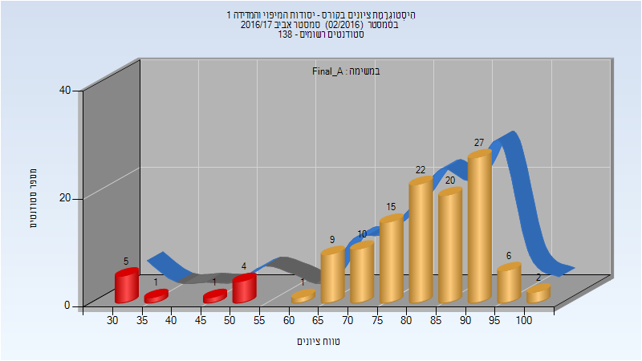

| סטודנטים | עברו/נכשלו | אחוז עוברים | ציון מינימלי | ציון מקסימלי | ממוצע | חציון |
| ---- | ---- | ---- | ---- | ---- | ---- | ---- |
| 123 | 112/11 | 91 | 30 | 100 | 79.724 | 83 |

### סופי מועד ב'

| סטודנטים | עברו/נכשלו | אחוז עוברים | ציון מינימלי | ציון מקסימלי | ממוצע | חציון |
| ---- | ---- | ---- | ---- | ---- | ---- | ---- |
| 23 | 20/3 | 87 | 40 | 95 | 74.087 | 77 |

### סופי

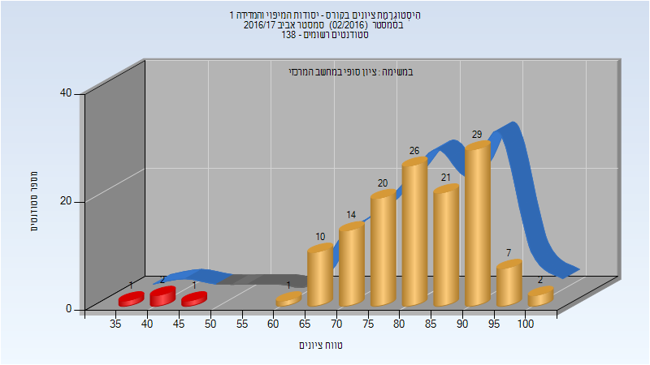

| סטודנטים | עברו/נכשלו | אחוז עוברים | ציון מינימלי | ציון מקסימלי | ממוצע | חציון |
| ---- | ---- | ---- | ---- | ---- | ---- | ---- |
| 134 | 130/4 | 97 | 38 | 100 | 81.776 | 83 |

## חורף 2017-2018

| איש סגל | תפקיד |
| ---- | ---- |
| דליות שגיא | מרצה - אחראי מקצוע |
| בינסקי נועה | מתרגל |
| מסד עדו | מתרגל |
| שכטר חן | מתרגל |
| שכטר מור | מתרגל |
| כהן אחיטוב | מתרגל |
| ג'לג'ולה רובא | מתרגל |

### סופי מועד א'

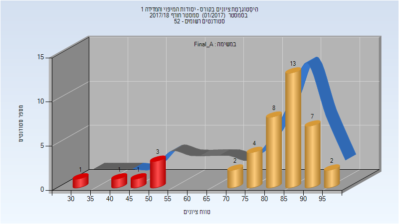

| סטודנטים | עברו/נכשלו | אחוז עוברים | ציון מינימלי | ציון מקסימלי | ממוצע | חציון |
| ---- | ---- | ---- | ---- | ---- | ---- | ---- |
| 42 | 36/6 | 86 | 32 | 97 | 80.167 | 85 |

### סופי מועד ב'

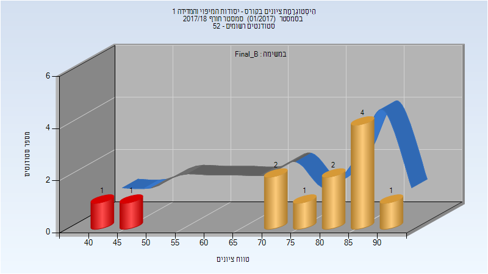

| סטודנטים | עברו/נכשלו | אחוז עוברים | ציון מינימלי | ציון מקסימלי | ממוצע | חציון |
| ---- | ---- | ---- | ---- | ---- | ---- | ---- |
| 12 | 10/2 | 83 | 44 | 92 | 76 | 81 |

### סופי

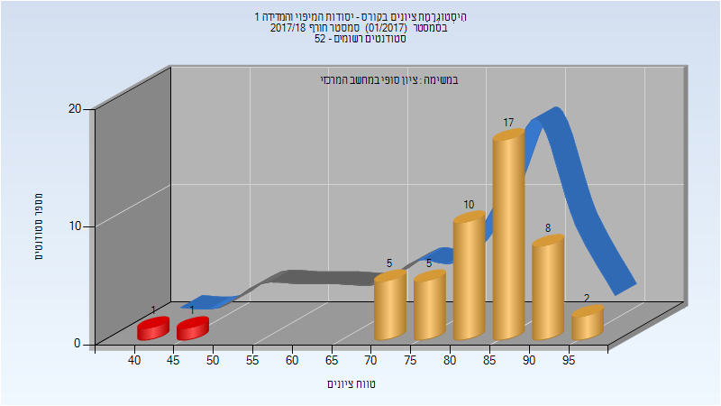

| סטודנטים | עברו/נכשלו | אחוז עוברים | ציון מינימלי | ציון מקסימלי | ממוצע | חציון |
| ---- | ---- | ---- | ---- | ---- | ---- | ---- |
| 49 | 47/2 | 96 | 44 | 97 | 83.082 | 85 |

## אביב 2018

| איש סגל | תפקיד |
| ---- | ---- |
| דליות שגיא | מרצה - אחראי מקצוע |
| כהן אחיטוב | מתרגל |
| בינסקי נועה | מתרגל |
| שכטר חן | מתרגל |
| אבו ג'בל אמיר | מתרגל |
| זרייק סאמר | מתרגל |
| מסד עדו | מתרגל |
| שכטר מור | מתרגל |
| אפריים ליטל | מתרגל |
| בשותי אליאנה | מתרגל |
| אבו נסאר איליא | מתרגל |
| דרור טליה | מתרגל |

### סופי מועד א'

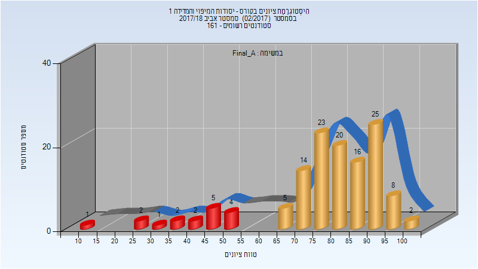

| סטודנטים | עברו/נכשלו | אחוז עוברים | ציון מינימלי | ציון מקסימלי | ממוצע | חציון |
| ---- | ---- | ---- | ---- | ---- | ---- | ---- |
| 130 | 113/17 | 87 | 10 | 104 | 77.646 | 80 |

### סופי מועד ב'

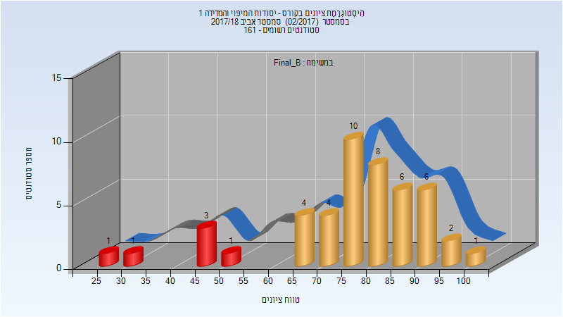

| סטודנטים | עברו/נכשלו | אחוז עוברים | ציון מינימלי | ציון מקסימלי | ממוצע | חציון |
| ---- | ---- | ---- | ---- | ---- | ---- | ---- |
| 47 | 41/6 | 87 | 26 | 101 | 76.83 | 77 |

### סופי

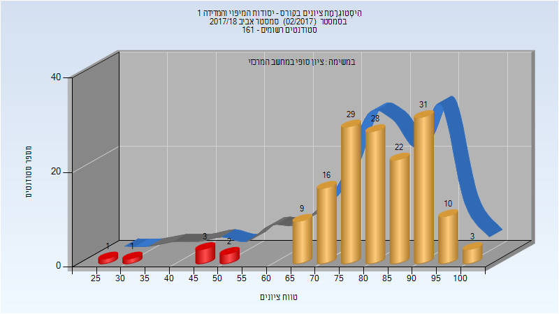

| סטודנטים | עברו/נכשלו | אחוז עוברים | ציון מינימלי | ציון מקסימלי | ממוצע | חציון |
| ---- | ---- | ---- | ---- | ---- | ---- | ---- |
| 155 | 148/7 | 95 | 26 | 100 | 81.368 | 82 |

## חורף 2018-2019

| איש סגל | תפקיד |
| ---- | ---- |
| דליות שגיא | מרצה - אחראי מקצוע |
| כהן אחיטוב | מתרגל |
| שכטר חן | מתרגל |
| לדין-גייניץ יואל | מתרגל |
| ג'לג'ולה רובא | מתרגל |
| וידרו יוליה | מתרגל |
| שכטר מור | מתרגל |
| בלסברג עליזה | סגל מנהלי - עם הרשאות מרצה אחראי |

### מבחן מועד א'

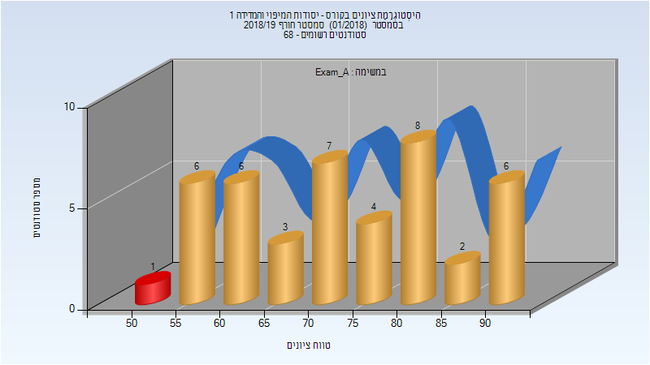

| סטודנטים | עברו/נכשלו | אחוז עוברים | ציון מינימלי | ציון מקסימלי | ממוצע | חציון |
| ---- | ---- | ---- | ---- | ---- | ---- | ---- |
| 43 | 42/1 | 98 | 50 | 94 | 73.488 | 73 |

### סופי מועד א'

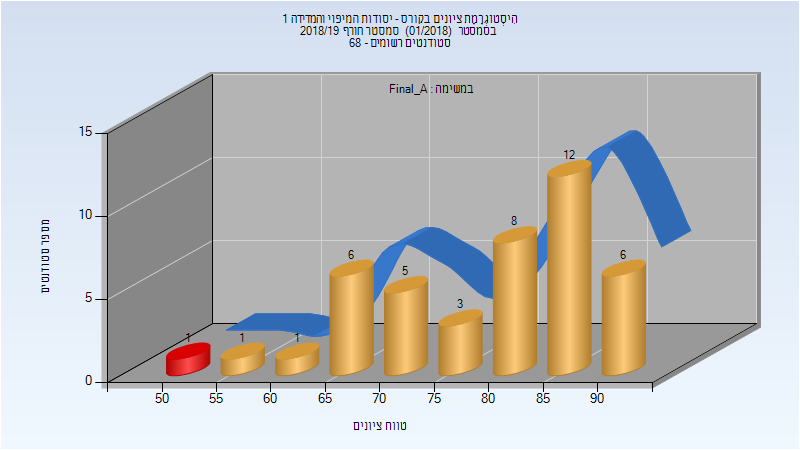

| סטודנטים | עברו/נכשלו | אחוז עוברים | ציון מינימלי | ציון מקסימלי | ממוצע | חציון |
| ---- | ---- | ---- | ---- | ---- | ---- | ---- |
| 43 | 42/1 | 98 | 50 | 94 | 79.488 | 82 |

### מבחן מועד ב'

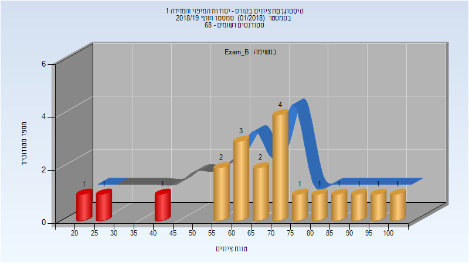

| סטודנטים | עברו/נכשלו | אחוז עוברים | ציון מינימלי | ציון מקסימלי | ממוצע | חציון |
| ---- | ---- | ---- | ---- | ---- | ---- | ---- |
| 20 | 17/3 | 85 | 24 | 102 | 67.5 | 69.5 |

### סופי מועד ב'

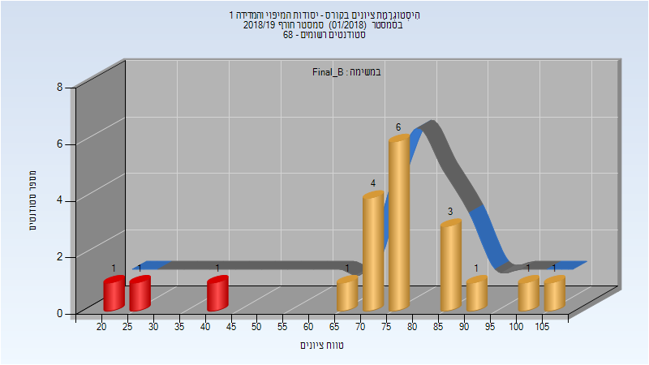

| סטודנטים | עברו/נכשלו | אחוז עוברים | ציון מינימלי | ציון מקסימלי | ממוצע | חציון |
| ---- | ---- | ---- | ---- | ---- | ---- | ---- |
| 20 | 17/3 | 85 | 24 | 105 | 73.1 | 75.5 |

### סופי

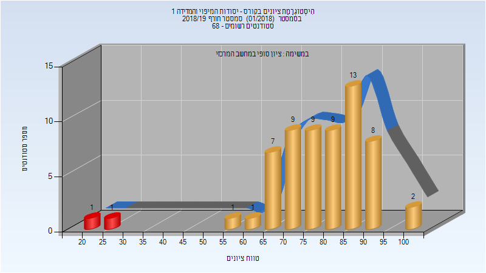

| סטודנטים | עברו/נכשלו | אחוז עוברים | ציון מינימלי | ציון מקסימלי | ממוצע | חציון |
| ---- | ---- | ---- | ---- | ---- | ---- | ---- |
| 61 | 59/2 | 97 | 24 | 100 | 78.393 | 80 |

## אביב 2019

| איש סגל | תפקיד |
| ---- | ---- |
| דליות שגיא | מרצה - אחראי מקצוע |
| חאג' יחיא שאדי | מתרגל |
| בהרב יהודה | מתרגל |
| אבו נסאר איליא | מתרגל |
| ג'לג'ולה רובא | מתרגל |
| עיסאוי אליאס | מתרגל |
| עווד רידא | מתרגל |
| וידרו יוליה | מתרגל |
| אלנאשף בשאר | מתרגל |
| דרור טליה | מתרגל |
| גנאים עלאא | מתרגל |
| בלנקי ילנה | מתרגל |
| בלסברג עליזה | סגל מנהלי - עם הרשאות מרצה אחראי |

### סופי מועד א'

| סטודנטים | עברו/נכשלו | אחוז עוברים | ציון מינימלי | ציון מקסימלי | ממוצע | חציון |
| ---- | ---- | ---- | ---- | ---- | ---- | ---- |
| 81 | 77/4 | 95 | 26 | 101 | 84.963 | 90 |

### סופי מועד ב'

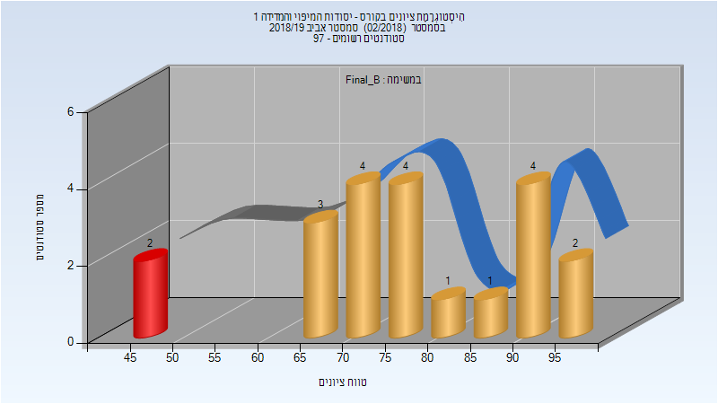

| סטודנטים | עברו/נכשלו | אחוז עוברים | ציון מינימלי | ציון מקסימלי | ממוצע | חציון |
| ---- | ---- | ---- | ---- | ---- | ---- | ---- |
| 21 | 19/2 | 90 | 46 | 96 | 77.667 | 78 |

### סופי

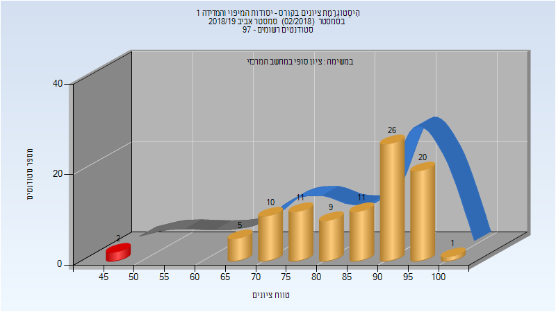

| סטודנטים | עברו/נכשלו | אחוז עוברים | ציון מינימלי | ציון מקסימלי | ממוצע | חציון |
| ---- | ---- | ---- | ---- | ---- | ---- | ---- |
| 95 | 93/2 | 98 | 46 | 100 | 85.6 | 89 |

## חורף 2019-2020

| איש סגל | תפקיד |
| ---- | ---- |
| דליות שגיא | מרצה - אחראי מקצוע |
| אבו האני ג'ואל | מתרגל |
| עווד רידא | מתרגל |
| מלג'אק איתמר | מתרגל |
| ג'לג'ולה רובא | מתרגל |
| דרור טליה | מתרגל |
| וידרו יוליה | מתרגל |
| גנאים עלאא | מתרגל |

### סופי מועד א'

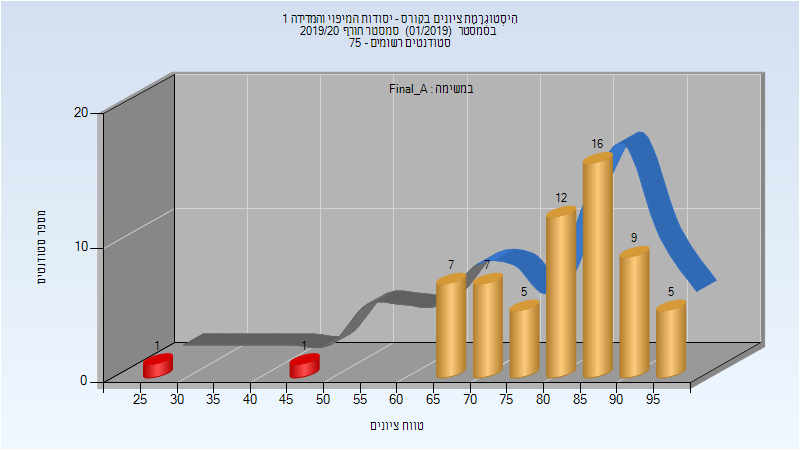

| סטודנטים | עברו/נכשלו | אחוז עוברים | ציון מינימלי | ציון מקסימלי | ממוצע | חציון |
| ---- | ---- | ---- | ---- | ---- | ---- | ---- |
| 63 | 61/2 | 97 | 27 | 98 | 81.302 | 83 |

### סופי מועד ב'

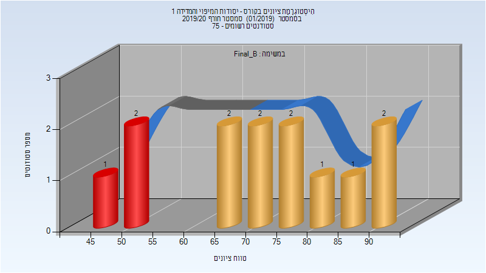

| סטודנטים | עברו/נכשלו | אחוז עוברים | ציון מינימלי | ציון מקסימלי | ממוצע | חציון |
| ---- | ---- | ---- | ---- | ---- | ---- | ---- |
| 13 | 10/3 | 77 | 48 | 94 | 71.769 | 73 |

### סופי

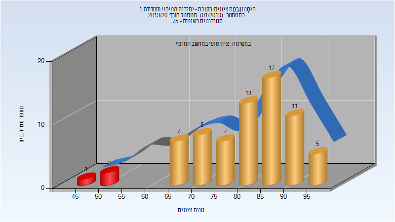

| סטודנטים | עברו/נכשלו | אחוז עוברים | ציון מינימלי | ציון מקסימלי | ממוצע | חציון |
| ---- | ---- | ---- | ---- | ---- | ---- | ---- |
| 72 | 69/3 | 96 | 48 | 98 | 81.194 | 83.5 |

## אביב 2020

| איש סגל | תפקיד |
| ---- | ---- |
| דליות שגיא | מרצה - אחראי מקצוע |
| עווד רידא | מתרגל |
| ג'לג'ולה רובא | מתרגל |
| גנאים עלאא | מתרגל |
| וידרו יוליה | מתרגל |
| דרור טליה | מתרגל |
| עזרן עדי | מתרגל |
| וייל שחף | מתרגל |
| אבו האני ג'ואל | מתרגל |
| קלר מוריה | מתרגל |
| אבו מפלח פיראס | מתרגל |
| בלסברג עליזה | סגל מנהלי - עם הרשאות מרצה אחראי |

### סופי מועד א'

| סטודנטים | עברו/נכשלו | אחוז עוברים | ציון מינימלי | ציון מקסימלי | ממוצע | חציון |
| ---- | ---- | ---- | ---- | ---- | ---- | ---- |
| 90 | 82/8 | 91 | 27 | 103 | 82.622 | 86 |

### סופי מועד ב'

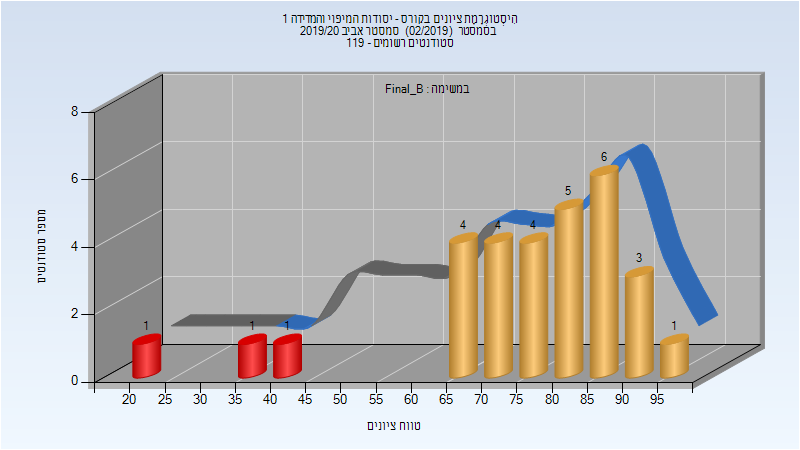

| סטודנטים | עברו/נכשלו | אחוז עוברים | ציון מינימלי | ציון מקסימלי | ממוצע | חציון |
| ---- | ---- | ---- | ---- | ---- | ---- | ---- |
| 30 | 27/3 | 90 | 22 | 95 | 75.6 | 79 |

### סופי

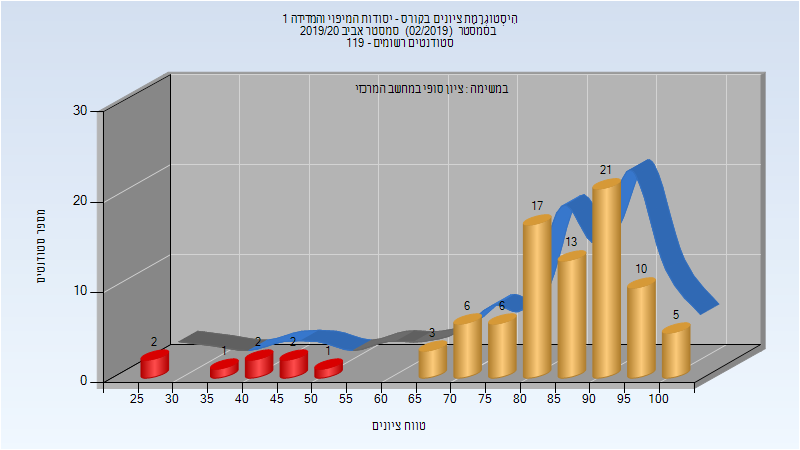

| סטודנטים | עברו/נכשלו | אחוז עוברים | ציון מינימלי | ציון מקסימלי | ממוצע | חציון |
| ---- | ---- | ---- | ---- | ---- | ---- | ---- |
| 112 | 108/4 | 96 | 22 | 100 | 83.509 | 85.5 |

## חורף 2020-2021

| איש סגל | תפקיד |
| ---- | ---- |
| דליות שגיא | מרצה - אחראי מקצוע |
| מלג'אק איתמר | מתרגל |
| וידרו יוליה | מתרגל |
| עווד רידא | מתרגל |
| ג'לג'ולה רובא | מתרגל |
| וייל שחף | מתרגל |
| כהן אחיטוב | מתרגל |
| בלסברג עליזה | סגל מנהלי - עם הרשאות מרצה אחראי |

### מבחן מועד א'

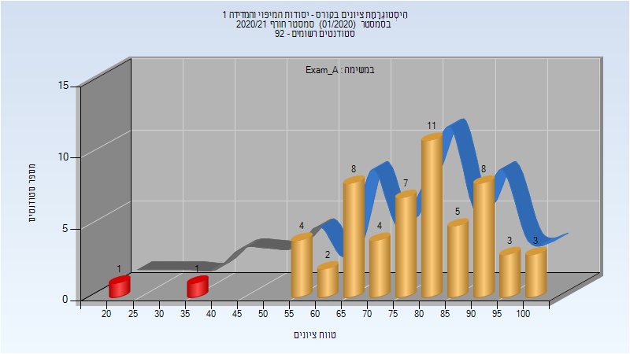

| סטודנטים | עברו/נכשלו | אחוז עוברים | ציון מינימלי | ציון מקסימלי | ממוצע | חציון |
| ---- | ---- | ---- | ---- | ---- | ---- | ---- |
| 57 | 55/2 | 96 | 21 | 103 | 78.018 | 81 |

### סופי מועד א'

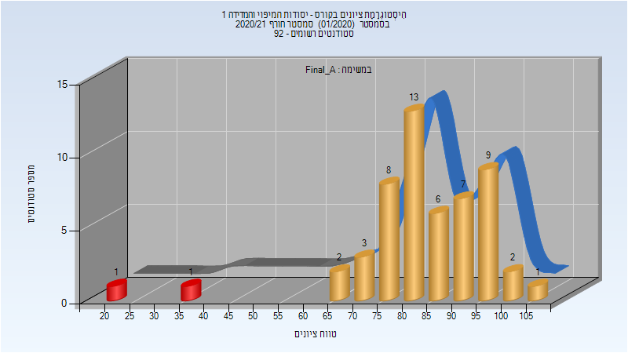

| סטודנטים | עברו/נכשלו | אחוז עוברים | ציון מינימלי | ציון מקסימלי | ממוצע | חציון |
| ---- | ---- | ---- | ---- | ---- | ---- | ---- |
| 57 | 55/2 | 96 | 21 | 106 | 83.93 | 84 |

### מבחן מועד ב'

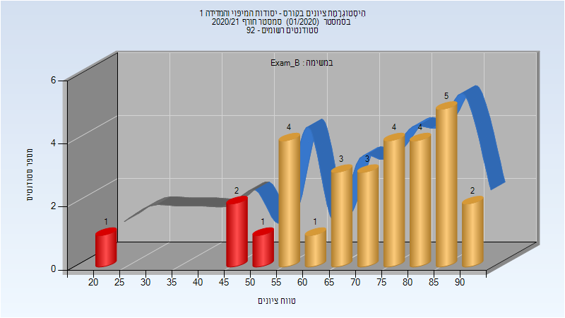

| סטודנטים | עברו/נכשלו | אחוז עוברים | ציון מינימלי | ציון מקסימלי | ממוצע | חציון |
| ---- | ---- | ---- | ---- | ---- | ---- | ---- |
| 30 | 26/4 | 87 | 20 | 92 | 70.833 | 73.5 |

### סופי מועד ב'

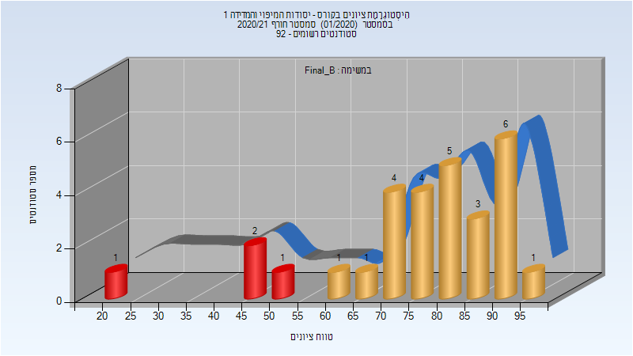

| סטודנטים | עברו/נכשלו | אחוז עוברים | ציון מינימלי | ציון מקסימלי | ממוצע | חציון |
| ---- | ---- | ---- | ---- | ---- | ---- | ---- |
| 30 | 26/4 | 87 | 20 | 95 | 76.333 | 80 |

### סופי

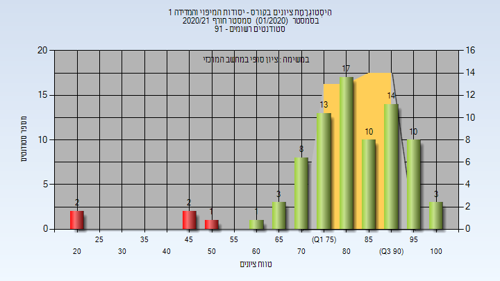

| סטודנטים | עברו/נכשלו | אחוז עוברים | ציון מינימלי | ציון מקסימלי | ממוצע | חציון |
| ---- | ---- | ---- | ---- | ---- | ---- | ---- |
| 83 | 78/5 | 94 | 20 | 100 | 81.735 | 84 |

