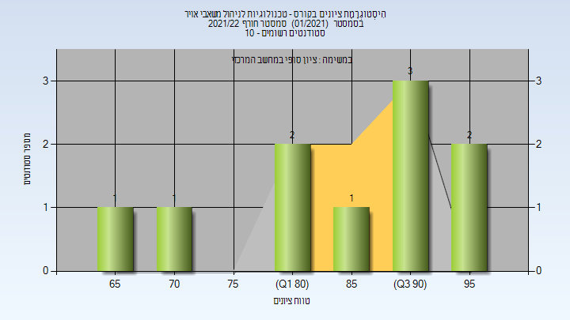

# 016336 - טכנולוגיות לניהול משאבי אויר

## חורף 2021-2022

| איש סגל | תפקיד |
| ---- | ---- |
| ברודאי דוד | מרצה - אחראי מקצוע |
| קובלר קרן | סגל מנהלי - עם הרשאות מרצה אחראי |
| מלכה אופירה | סגל מנהלי - עם הרשאות מרצה אחראי |

### סופי

| סטודנטים | עברו/נכשלו | אחוז עוברים | ציון מינימלי | ציון מקסימלי | ממוצע | חציון |
| ---- | ---- | ---- | ---- | ---- | ---- | ---- |
| 10 | 10/0 | 100 | 65 | 98 | 85.5 | 89 |

