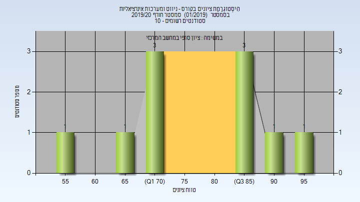
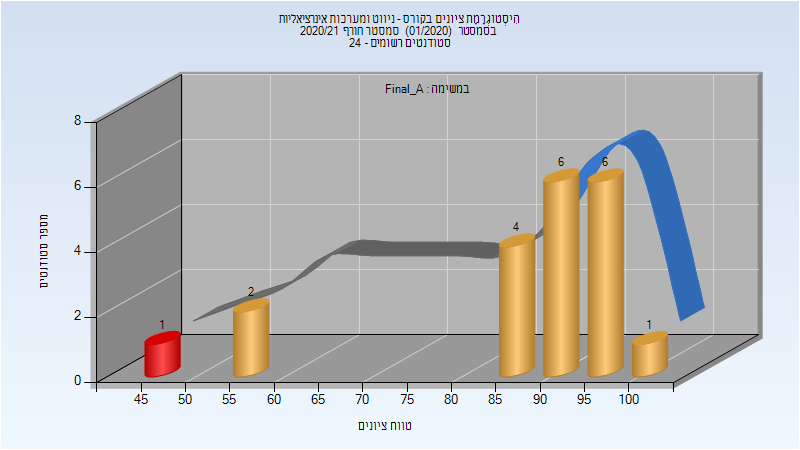

# 016832 - ניווט ומערכות אינרציאליות

## חורף 2019-2020

| איש סגל | תפקיד |
| ---- | ---- |
| קליין איציק | מרצה - אחראי מקצוע |

### סופי

| סטודנטים | עברו/נכשלו | אחוז עוברים | ציון מינימלי | ציון מקסימלי | ממוצע | חציון |
| ---- | ---- | ---- | ---- | ---- | ---- | ---- |
| 10 | 10/0 | 100 | 55 | 97 | 78.6 | 79.5 |

## חורף 2020-2021

| איש סגל | תפקיד |
| ---- | ---- |
| קליין איציק | מרצה - אחראי מקצוע |
| בלסברג עליזה | סגל מנהלי - עם הרשאות מרצה אחראי |

### סופי מועד א'

| סטודנטים | עברו/נכשלו | אחוז עוברים | ציון מינימלי | ציון מקסימלי | ממוצע | חציון |
| ---- | ---- | ---- | ---- | ---- | ---- | ---- |
| 20 | 19/1 | 95 | 47 | 100 | 87.05 | 94 |

