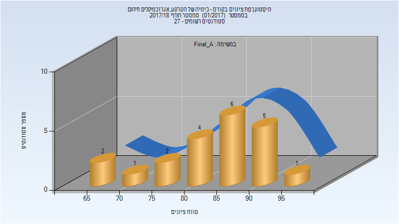
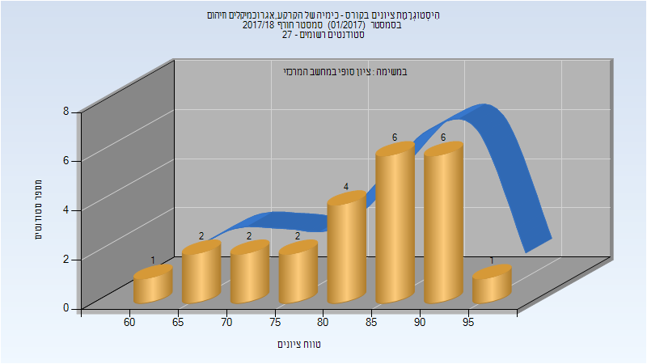

# 017008 - כימיה של הקרקע,אגרוכמיקלים וזיהום

## חורף 2017-2018

| איש סגל | תפקיד |
| ---- | ---- |
| איש עם - רדי עדי | מרצה - אחראי מקצוע |

### סופי מועד א'

| סטודנטים | עברו/נכשלו | אחוז עוברים | ציון מינימלי | ציון מקסימלי | ממוצע | חציון |
| ---- | ---- | ---- | ---- | ---- | ---- | ---- |
| 21 | 21/0 | 100 | 66 | 95 | 84.286 | 86 |

### סופי

| סטודנטים | עברו/נכשלו | אחוז עוברים | ציון מינימלי | ציון מקסימלי | ממוצע | חציון |
| ---- | ---- | ---- | ---- | ---- | ---- | ---- |
| 24 | 24/0 | 100 | 62 | 95 | 83.167 | 85.5 |

