# 027401

**הערה**: מאגר ההיסטוגרמות הוקם עבור [CheeseFork](https://cheesefork.cf/), כלי בניית מערכת שעות עבור סטודנטים בטכניון. באתר בו אתם גולשים ניתן לעיין בהיסטוגרמות, אך הדרך היותר נוחה היא לעיין בהיסטוגרמות, ובמידע נוסף כגון חוות דעת של סטודנטים, באתר CheeseFork.

* [אביב 2021](#202002)
  * [מבחן מועד א'](#202002-Exam_A)
  * [סופי מועד א'](#202002-Final_A)
  * [מבחן מועד ב'](#202002-Exam_B)
  * [סופי מועד ב'](#202002-Final_B)
  * [סופי](#202002-Finals)
* [חורף 2021-2022](#202101)
  * [מבחן מועד א'](#202101-Exam_A)
  * [סופי מועד א'](#202101-Final_A)
  * [סופי](#202101-Finals)
* [אביב 2022](#202102)
  * [מבחן מועד א'](#202102-Exam_A)
  * [סופי מועד א'](#202102-Final_A)
  * [מבחן מועד ב'](#202102-Exam_B)
  * [סופי מועד ב'](#202102-Final_B)
  * [סופי](#202102-Finals)
* [חורף 2022-2023](#202201)
  * [מבחן מועד א'](#202201-Exam_A)
  * [סופי מועד א'](#202201-Final_A)
  * [מבחן מועד ב'](#202201-Exam_B)
  * [סופי מועד ב'](#202201-Final_B)
  * [סופי](#202201-Finals)
* [אביב 2023](#202202)
  * [מבחן מועד א'](#202202-Exam_A)
  * [סופי מועד א'](#202202-Final_A)
  * [סופי](#202202-Finals)

<h2 id="202002">אביב 2021</h2>

| איש סגל | תפקיד |
| ---- | ---- |
| חסון פלג | מרצה - אחראי מקצוע |
| דייטשמן רויטל | סגל מנהלי - עם הרשאות מרצה אחראי |
| מאיר קובה אילנית | סגל מנהלי - עם הרשאות מרצה אחראי |
| איינשטיין ליאת | סגל מנהלי - עם הרשאות מרצה אחראי |
| רגב עירית | סגל מנהלי - עם הרשאות מרצה אחראי |
| גמליאל חוה | סגל מנהלי - עם הרשאות מרצה אחראי |
| כהן שרית | סגל מנהלי - עם הרשאות מרצה אחראי |
| אהרון אברהם קארין | סגל מנהלי - עם הרשאות מרצה אחראי |
| שפורן שירי | סגל מנהלי - עם הרשאות מרצה אחראי |

<h3 id="202002-Exam_A">מבחן מועד א'</h3>

| סטודנטים | עברו/נכשלו | אחוז עוברים | ציון מינימלי | ציון מקסימלי | ממוצע | חציון |
| ---- | ---- | ---- | ---- | ---- | ---- | ---- |
| 95 | 94/1 | 99 | 38 | 98 | 79.653 | 80 |

<h3 id="202002-Final_A">סופי מועד א'</h3>

| סטודנטים | עברו/נכשלו | אחוז עוברים | ציון מינימלי | ציון מקסימלי | ממוצע | חציון |
| ---- | ---- | ---- | ---- | ---- | ---- | ---- |
| 95 | 94/1 | 99 | 45 | 98 | 82.2 | 82 |

<h3 id="202002-Exam_B">מבחן מועד ב'</h3>

| סטודנטים | עברו/נכשלו | אחוז עוברים | ציון מינימלי | ציון מקסימלי | ממוצע | חציון |
| ---- | ---- | ---- | ---- | ---- | ---- | ---- |
| 21 | 19/2 | 90 | 50 | 98 | 72.429 | 73 |

<h3 id="202002-Final_B">סופי מועד ב'</h3>

| סטודנטים | עברו/נכשלו | אחוז עוברים | ציון מינימלי | ציון מקסימלי | ממוצע | חציון |
| ---- | ---- | ---- | ---- | ---- | ---- | ---- |
| 21 | 19/2 | 90 | 50 | 96 | 74.905 | 76 |

<h3 id="202002-Finals">סופי</h3>

| סטודנטים | עברו/נכשלו | אחוז עוברים | ציון מינימלי | ציון מקסימלי | ממוצע | חציון |
| ---- | ---- | ---- | ---- | ---- | ---- | ---- |
| 109 | 107/2 | 98 | 50 | 98 | 81.596 | 82 |

<h2 id="202101">חורף 2021-2022</h2>

| איש סגל | תפקיד |
| ---- | ---- |
| קאפמן מיכאל | מרצה - אחראי מקצוע |
| כהן שרית | סגל מנהלי - עם הרשאות מרצה אחראי |
| שפורן שירי | סגל מנהלי - עם הרשאות מרצה אחראי |
| אהרון אברהם קארין | סגל מנהלי - עם הרשאות מרצה אחראי |
| מאיר קובה אילנית | סגל מנהלי - עם הרשאות מרצה אחראי |
| איינשטיין ליאת | סגל מנהלי - עם הרשאות מרצה אחראי |
| דייטשמן רויטל | סגל מנהלי - עם הרשאות מרצה אחראי |
| רגב עירית | סגל מנהלי - עם הרשאות מרצה אחראי |
| גמליאל חוה | סגל מנהלי - עם הרשאות מרצה אחראי |

<h3 id="202101-Exam_A">מבחן מועד א'</h3>

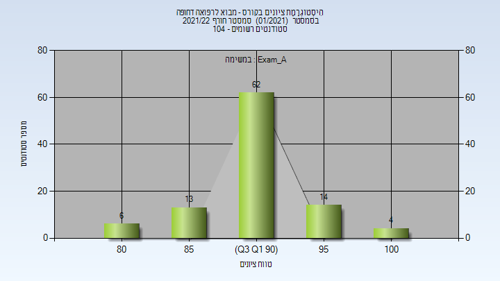

| סטודנטים | עברו/נכשלו | אחוז עוברים | ציון מינימלי | ציון מקסימלי | ממוצע | חציון |
| ---- | ---- | ---- | ---- | ---- | ---- | ---- |
| 99 | 99/0 | 100 | 80 | 100 | 91.485 | 93 |

<h3 id="202101-Final_A">סופי מועד א'</h3>

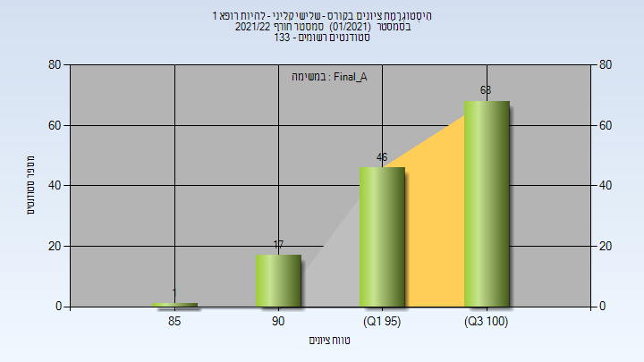

| סטודנטים | עברו/נכשלו | אחוז עוברים | ציון מינימלי | ציון מקסימלי | ממוצע | חציון |
| ---- | ---- | ---- | ---- | ---- | ---- | ---- |
| 132 | 132/0 | 100 | 85 | 100 | 97.242 | 100 |

<h3 id="202101-Finals">סופי</h3>

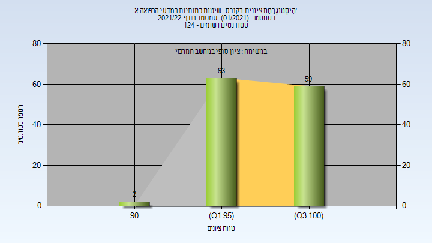

| סטודנטים | עברו/נכשלו | אחוז עוברים | ציון מינימלי | ציון מקסימלי | ממוצע | חציון |
| ---- | ---- | ---- | ---- | ---- | ---- | ---- |
| 133 | 133/0 | 100 | 90 | 100 | 97.534 | 100 |

<h2 id="202102">אביב 2022</h2>

| איש סגל | תפקיד |
| ---- | ---- |
| קפלן נעם | מרצה - אחראי מקצוע |
| שפורן שירי | סגל מנהלי - עם הרשאות מרצה אחראי |
| אהרון אברהם קארין | סגל מנהלי - עם הרשאות מרצה אחראי |
| רגב עירית | סגל מנהלי - עם הרשאות מרצה אחראי |
| גמליאל חוה | סגל מנהלי - עם הרשאות מרצה אחראי |
| דייטשמן רויטל | סגל מנהלי - עם הרשאות מרצה אחראי |
| איינשטיין ליאת | סגל מנהלי - עם הרשאות מרצה אחראי |
| כהן שרית | סגל מנהלי - עם הרשאות מרצה אחראי |

<h3 id="202102-Exam_A">מבחן מועד א'</h3>

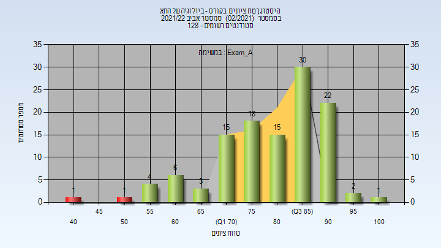

| סטודנטים | עברו/נכשלו | אחוז עוברים | ציון מינימלי | ציון מקסימלי | ממוצע | חציון |
| ---- | ---- | ---- | ---- | ---- | ---- | ---- |
| 126 | 124/2 | 98 | 40 | 104 | 86.444 | 88 |

<h3 id="202102-Final_A">סופי מועד א'</h3>

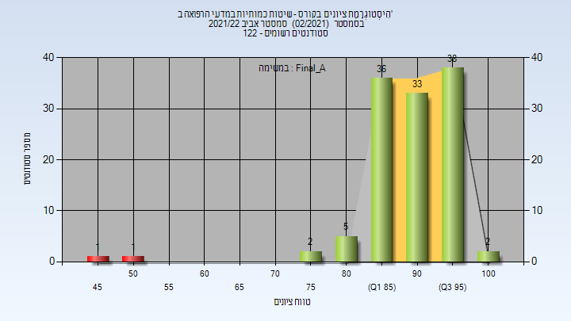

| סטודנטים | עברו/נכשלו | אחוז עוברים | ציון מינימלי | ציון מקסימלי | ממוצע | חציון |
| ---- | ---- | ---- | ---- | ---- | ---- | ---- |
| 126 | 124/2 | 98 | 40 | 100 | 88.151 | 90 |

<h3 id="202102-Exam_B">מבחן מועד ב'</h3>

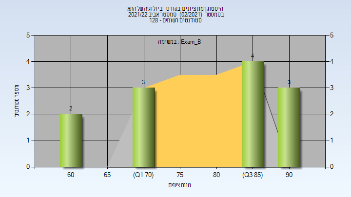

| סטודנטים | עברו/נכשלו | אחוז עוברים | ציון מינימלי | ציון מקסימלי | ממוצע | חציון |
| ---- | ---- | ---- | ---- | ---- | ---- | ---- |
| 12 | 12/0 | 100 | 64 | 94 | 81 | 86.5 |

<h3 id="202102-Final_B">סופי מועד ב'</h3>

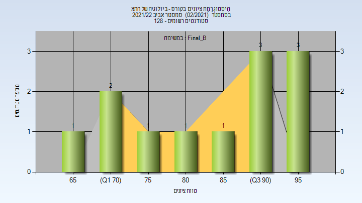

| סטודנטים | עברו/נכשלו | אחוז עוברים | ציון מינימלי | ציון מקסימלי | ממוצע | חציון |
| ---- | ---- | ---- | ---- | ---- | ---- | ---- |
| 12 | 12/0 | 100 | 68 | 98 | 85.333 | 89.5 |

<h3 id="202102-Finals">סופי</h3>

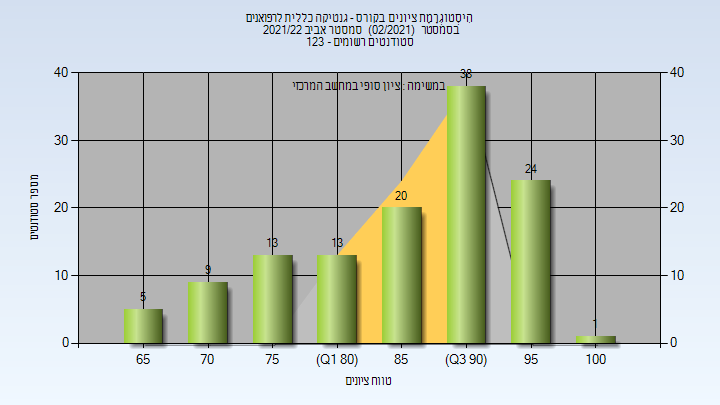

| סטודנטים | עברו/נכשלו | אחוז עוברים | ציון מינימלי | ציון מקסימלי | ממוצע | חציון |
| ---- | ---- | ---- | ---- | ---- | ---- | ---- |
| 126 | 125/1 | 99 | 40 | 100 | 88.476 | 90 |

<h2 id="202201">חורף 2022-2023</h2>

| איש סגל | תפקיד |
| ---- | ---- |
| חסון פלג | מרצה - אחראי מקצוע |
| איינשטיין ליאת | סגל מנהלי - עם הרשאות מרצה אחראי |
| דייטשמן רויטל | סגל מנהלי - עם הרשאות מרצה אחראי |
| רגב עירית | סגל מנהלי - עם הרשאות מרצה אחראי |
| גמליאל חוה | סגל מנהלי - עם הרשאות מרצה אחראי |
| כהן שרית | סגל מנהלי - עם הרשאות מרצה אחראי |
| אהרון אברהם קארין | סגל מנהלי - עם הרשאות מרצה אחראי |
| שפורן שירי | סגל מנהלי - עם הרשאות מרצה אחראי |

<h3 id="202201-Exam_A">מבחן מועד א'</h3>

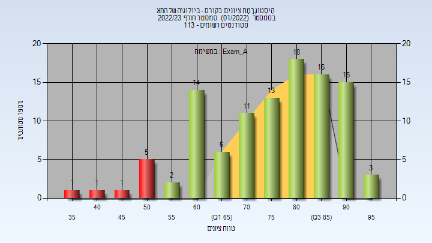

| סטודנטים | עברו/נכשלו | אחוז עוברים | ציון מינימלי | ציון מקסימלי | ממוצע | חציון |
| ---- | ---- | ---- | ---- | ---- | ---- | ---- |
| 106 | 98/8 | 92 | 36 | 98 | 76.472 | 79 |

<h3 id="202201-Final_A">סופי מועד א'</h3>

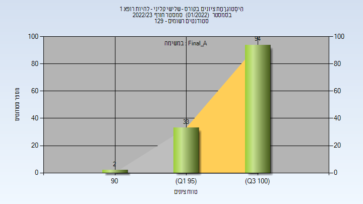

| סטודנטים | עברו/נכשלו | אחוז עוברים | ציון מינימלי | ציון מקסימלי | ממוצע | חציון |
| ---- | ---- | ---- | ---- | ---- | ---- | ---- |
| 98 | 98/0 | 100 | 62 | 98 | 81.582 | 83.5 |

<h3 id="202201-Exam_B">מבחן מועד ב'</h3>

| סטודנטים | עברו/נכשלו | אחוז עוברים | ציון מינימלי | ציון מקסימלי | ממוצע | חציון |
| ---- | ---- | ---- | ---- | ---- | ---- | ---- |
| 24 | 20/4 | 83 | 43 | 100 | 71.792 | 72.5 |

<h3 id="202201-Final_B">סופי מועד ב'</h3>

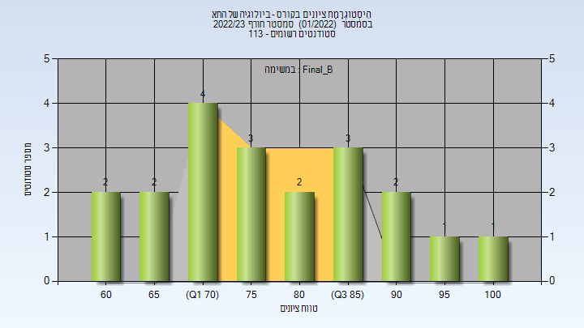

| סטודנטים | עברו/נכשלו | אחוז עוברים | ציון מינימלי | ציון מקסימלי | ממוצע | חציון |
| ---- | ---- | ---- | ---- | ---- | ---- | ---- |
| 20 | 20/0 | 100 | 62 | 100 | 79.2 | 77.5 |

<h3 id="202201-Finals">סופי</h3>

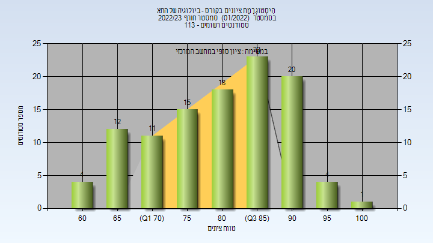

| סטודנטים | עברו/נכשלו | אחוז עוברים | ציון מינימלי | ציון מקסימלי | ממוצע | חציון |
| ---- | ---- | ---- | ---- | ---- | ---- | ---- |
| 108 | 108/0 | 100 | 62 | 100 | 81.759 | 84 |

<h2 id="202202">אביב 2023</h2>

| איש סגל | תפקיד |
| ---- | ---- |
| קפלן נעם | מרצה - אחראי מקצוע |
| דייטשמן רויטל | סגל מנהלי - עם הרשאות מרצה אחראי |
| גמליאל חוה | סגל מנהלי - עם הרשאות מרצה אחראי |
| רגב עירית | סגל מנהלי - עם הרשאות מרצה אחראי |
| איינשטיין ליאת | סגל מנהלי - עם הרשאות מרצה אחראי |
| אהרון אברהם קארין | סגל מנהלי - עם הרשאות מרצה אחראי |
| כהן שרית | סגל מנהלי - עם הרשאות מרצה אחראי |
| שפורן שירי | סגל מנהלי - עם הרשאות מרצה אחראי |

<h3 id="202202-Exam_A">מבחן מועד א'</h3>

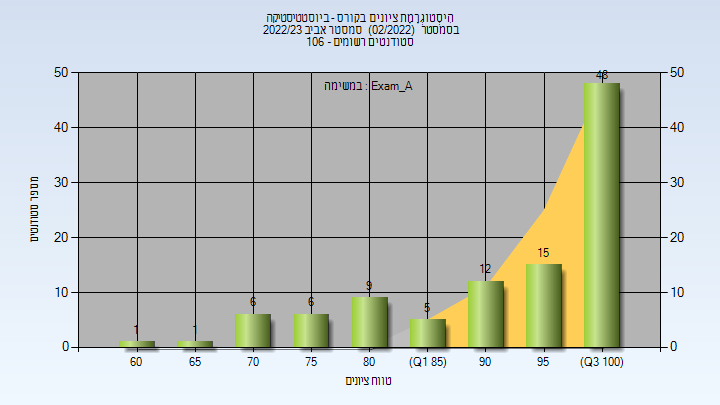

| סטודנטים | עברו/נכשלו | אחוז עוברים | ציון מינימלי | ציון מקסימלי | ממוצע | חציון |
| ---- | ---- | ---- | ---- | ---- | ---- | ---- |
| 103 | 103/0 | 100 | 60 | 100 | 92.699 | 96 |

<h3 id="202202-Final_A">סופי מועד א'</h3>

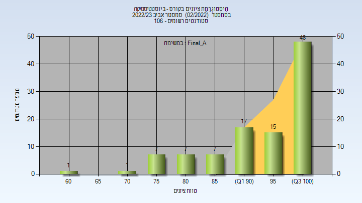

| סטודנטים | עברו/נכשלו | אחוז עוברים | ציון מינימלי | ציון מקסימלי | ממוצע | חציון |
| ---- | ---- | ---- | ---- | ---- | ---- | ---- |
| 103 | 103/0 | 100 | 64 | 100 | 93.748 | 97 |

<h3 id="202202-Finals">סופי</h3>

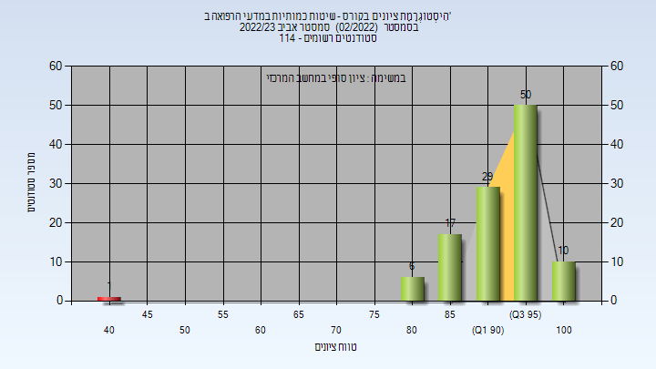

| סטודנטים | עברו/נכשלו | אחוז עוברים | ציון מינימלי | ציון מקסימלי | ממוצע | חציון |
| ---- | ---- | ---- | ---- | ---- | ---- | ---- |
| 105 | 105/0 | 100 | 64 | 100 | 93.857 | 97 |

