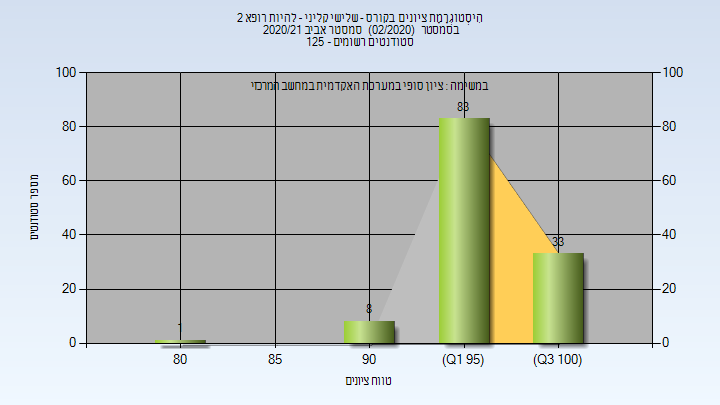

# 02740143 - שלישי קליני - להיות רופא 2

**הערה**: מאגר ההיסטוגרמות הוקם עבור [CheeseFork](https://cheesefork.cf/), כלי בניית מערכת שעות עבור סטודנטים בטכניון. באתר בו אתם גולשים ניתן לעיין בהיסטוגרמות, אך הדרך היותר נוחה היא לעיין בהיסטוגרמות, ובמידע נוסף כגון חוות דעת של סטודנטים, באתר CheeseFork.

* [אביב 2025](#202402)
  * [סופי מועד א'](#202402-Final_A)
  * [סופי](#202402-Finals)
* [אביב 2024](#202302)
  * [סופי מועד א'](#202302-Final_A)
  * [סופי](#202302-Finals)
* [אביב 2023](#202202)
  * [סופי מועד א'](#202202-Final_A)
  * [סופי](#202202-Finals)
* [אביב 2022](#202102)
  * [סופי מועד א'](#202102-Final_A)
  * [סופי](#202102-Finals)
* [אביב 2021](#202002)
  * [סופי מועד א'](#202002-Final_A)
  * [סופי](#202002-Finals)
* [אביב 2020](#201902)
  * [סופי מועד א'](#201902-Final_A)
  * [סופי](#201902-Finals)
* [אביב 2019](#201802)
  * [סופי מועד א'](#201802-Final_A)
  * [סופי](#201802-Finals)

<h2 id="202402">אביב 2025</h2>

| איש סגל | תפקיד |
| ---- | ---- |
| פולק שירלי | מרצה - אחראי מקצוע |
| דייטשמן רויטל | סגל מנהלי - עם הרשאות מרצה אחראי |
| כהן גלית | סגל מנהלי - עם הרשאות מרצה אחראי |
| כהן שרית | סגל מנהלי - עם הרשאות מרצה אחראי |
| אהרון אברהם קרין | סגל מנהלי - עם הרשאות מרצה אחראי |

<h3 id="202402-Final_A">סופי מועד א'</h3>

| סטודנטים | עברו/נכשלו | אחוז עוברים | ציון מינימלי | ציון מקסימלי | ממוצע | חציון |
| ---- | ---- | ---- | ---- | ---- | ---- | ---- |
| 171 | 171/0 | 100 | 80 | 100 | 99.766 | 100 |

<h3 id="202402-Finals">סופי</h3>

| סטודנטים | עברו/נכשלו | אחוז עוברים | ציון מינימלי | ציון מקסימלי | ממוצע | חציון |
| ---- | ---- | ---- | ---- | ---- | ---- | ---- |
| 171 | 171/0 | 100 | 80 | 100 | 99.766 | 100 |

<h2 id="202302">אביב 2024</h2>

| איש סגל | תפקיד |
| ---- | ---- |
| פולק שירלי | מדריך מעבדה - עם הרשאות מרצה אחראי |
| שפורן שירי | סגל מנהלי - עם הרשאות מרצה אחראי |
| אהרון אברהם קרין | סגל מנהלי - עם הרשאות מרצה אחראי |
| איינשטיין ליאת | סגל מנהלי - עם הרשאות מרצה אחראי |
| כהן שרית | סגל מנהלי - עם הרשאות מרצה אחראי |
| גמליאל חוה | סגל מנהלי - עם הרשאות מרצה אחראי |
| רגב עירית | סגל מנהלי - עם הרשאות מרצה אחראי |
| דייטשמן רויטל | סגל מנהלי - עם הרשאות מרצה אחראי |

<h3 id="202302-Final_A">סופי מועד א'</h3>

| סטודנטים | עברו/נכשלו | אחוז עוברים | ציון מינימלי | ציון מקסימלי | ממוצע | חציון |
| ---- | ---- | ---- | ---- | ---- | ---- | ---- |
| 175 | 175/0 | 100 | 82 | 100 | 99.469 | 100 |

<h3 id="202302-Finals">סופי</h3>

| סטודנטים | עברו/נכשלו | אחוז עוברים | ציון מינימלי | ציון מקסימלי | ממוצע | חציון |
| ---- | ---- | ---- | ---- | ---- | ---- | ---- |
| 178 | 178/0 | 100 | 82 | 100 | 99.478 | 100 |

<h2 id="202202">אביב 2023</h2>

| איש סגל | תפקיד |
| ---- | ---- |
| שנקר עופר | מרצה - אחראי מקצוע |
| גמליאל חוה | סגל מנהלי - עם הרשאות מרצה אחראי |
| שפורן שירי | סגל מנהלי - עם הרשאות מרצה אחראי |
| רגב עירית | סגל מנהלי - עם הרשאות מרצה אחראי |
| אהרון אברהם קרין | סגל מנהלי - עם הרשאות מרצה אחראי |
| כהן שרית | סגל מנהלי - עם הרשאות מרצה אחראי |
| איינשטיין ליאת | סגל מנהלי - עם הרשאות מרצה אחראי |
| דייטשמן רויטל | סגל מנהלי - עם הרשאות מרצה אחראי |

<h3 id="202202-Final_A">סופי מועד א'</h3>

| סטודנטים | עברו/נכשלו | אחוז עוברים | ציון מינימלי | ציון מקסימלי | ממוצע | חציון |
| ---- | ---- | ---- | ---- | ---- | ---- | ---- |
| 126 | 126/0 | 100 | 95 | 100 | 99.611 | 100 |

<h3 id="202202-Finals">סופי</h3>

| סטודנטים | עברו/נכשלו | אחוז עוברים | ציון מינימלי | ציון מקסימלי | ממוצע | חציון |
| ---- | ---- | ---- | ---- | ---- | ---- | ---- |
| 127 | 127/0 | 100 | 95 | 100 | 99.74 | 100 |

<h2 id="202102">אביב 2022</h2>

| איש סגל | תפקיד |
| ---- | ---- |
| ריסקין אריה | מרצה - אחראי מקצוע |
| אהרון אברהם קארין | סגל מנהלי - עם הרשאות מרצה אחראי |
| כהן שרית | סגל מנהלי - עם הרשאות מרצה אחראי |
| שפורן שירי | סגל מנהלי - עם הרשאות מרצה אחראי |
| דייטשמן רויטל | סגל מנהלי - עם הרשאות מרצה אחראי |
| רגב עירית | סגל מנהלי - עם הרשאות מרצה אחראי |
| גמליאל חוה | סגל מנהלי - עם הרשאות מרצה אחראי |
| איינשטיין ליאת | סגל מנהלי - עם הרשאות מרצה אחראי |

<h3 id="202102-Final_A">סופי מועד א'</h3>

| סטודנטים | עברו/נכשלו | אחוז עוברים | ציון מינימלי | ציון מקסימלי | ממוצע | חציון |
| ---- | ---- | ---- | ---- | ---- | ---- | ---- |
| 130 | 130/0 | 100 | 96 | 100 | 99.669 | 100 |

<h3 id="202102-Finals">סופי</h3>

| סטודנטים | עברו/נכשלו | אחוז עוברים | ציון מינימלי | ציון מקסימלי | ממוצע | חציון |
| ---- | ---- | ---- | ---- | ---- | ---- | ---- |
| 132 | 132/0 | 100 | 96 | 100 | 99.674 | 100 |

<h2 id="202002">אביב 2021</h2>

| איש סגל | תפקיד |
| ---- | ---- |
| ריסקין אריה | מרצה - אחראי מקצוע |
| רגב עירית | סגל מנהלי - עם הרשאות מרצה אחראי |
| איינשטיין ליאת | סגל מנהלי - עם הרשאות מרצה אחראי |
| דייטשמן רויטל | סגל מנהלי - עם הרשאות מרצה אחראי |
| מאיר קובה אילנית | סגל מנהלי - עם הרשאות מרצה אחראי |
| גמליאל חוה | סגל מנהלי - עם הרשאות מרצה אחראי |
| שפורן שירי | סגל מנהלי - עם הרשאות מרצה אחראי |
| כהן שרית | סגל מנהלי - עם הרשאות מרצה אחראי |
| אהרון אברהם קרין | סגל מנהלי - עם הרשאות מרצה אחראי |

<h3 id="202002-Final_A">סופי מועד א'</h3>

| סטודנטים | עברו/נכשלו | אחוז עוברים | ציון מינימלי | ציון מקסימלי | ממוצע | חציון |
| ---- | ---- | ---- | ---- | ---- | ---- | ---- |
| 124 | 124/0 | 100 | 84 | 100 | 97.395 | 98 |

<h3 id="202002-Finals">סופי</h3>

| סטודנטים | עברו/נכשלו | אחוז עוברים | ציון מינימלי | ציון מקסימלי | ממוצע | חציון |
| ---- | ---- | ---- | ---- | ---- | ---- | ---- |
| 125 | 125/0 | 100 | 84 | 100 | 97.472 | 98 |

<h2 id="201902">אביב 2020</h2>

| איש סגל | תפקיד |
| ---- | ---- |
| קאפמן מיכאל | מרצה - אחראי מקצוע |
| שפורן שירי | סגל מנהלי - עם הרשאות מרצה אחראי |
| כהן שרית | סגל מנהלי - עם הרשאות מרצה אחראי |
| בוניאל מורן | סגל מנהלי - עם הרשאות מרצה אחראי |
| איינשטיין ליאת | סגל מנהלי - עם הרשאות מרצה אחראי |
| גרשקוביץ ממן רינת שרית | סגל מנהלי - עם הרשאות מרצה אחראי |

<h3 id="201902-Final_A">סופי מועד א'</h3>

| סטודנטים | עברו/נכשלו | אחוז עוברים | ציון מינימלי | ציון מקסימלי | ממוצע | חציון |
| ---- | ---- | ---- | ---- | ---- | ---- | ---- |
| 105 | 105/0 | 100 | 95 | 100 | 98.819 | 100 |

<h3 id="201902-Finals">סופי</h3>

| סטודנטים | עברו/נכשלו | אחוז עוברים | ציון מינימלי | ציון מקסימלי | ממוצע | חציון |
| ---- | ---- | ---- | ---- | ---- | ---- | ---- |
| 105 | 105/0 | 100 | 95 | 100 | 98.819 | 100 |

<h2 id="201802">אביב 2019</h2>

| איש סגל | תפקיד |
| ---- | ---- |
| קאפמן מיכאל | מרצה - אחראי מקצוע |

<h3 id="201802-Final_A">סופי מועד א'</h3>

| סטודנטים | עברו/נכשלו | אחוז עוברים | ציון מינימלי | ציון מקסימלי | ממוצע | חציון |
| ---- | ---- | ---- | ---- | ---- | ---- | ---- |
| 99 | 99/0 | 100 | 60 | 100 | 98 | 100 |

<h3 id="201802-Finals">סופי</h3>

| סטודנטים | עברו/נכשלו | אחוז עוברים | ציון מינימלי | ציון מקסימלי | ממוצע | חציון |
| ---- | ---- | ---- | ---- | ---- | ---- | ---- |
| 100 | 100/0 | 100 | 60 | 100 | 98.07 | 100 |

