# 034010 - דינמיקה

## אביב 2013

| איש סגל | תפקיד |
| ---- | ---- |
| גנדלמן אולג | מרצה - אחראי מקצוע |

### סופי מועד א'

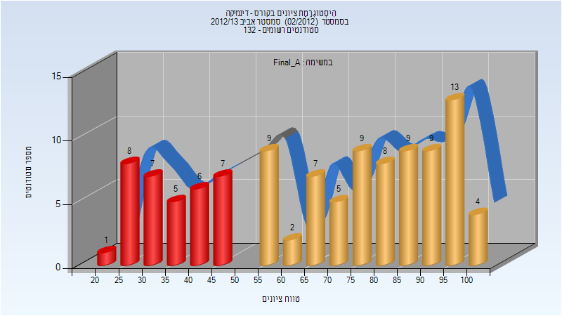

| סטודנטים | עברו/נכשלו | אחוז עוברים | ציון מינימלי | ציון מקסימלי | ממוצע | חציון |
| ---- | ---- | ---- | ---- | ---- | ---- | ---- |
| 109 | 75/34 | 69 | 20 | 100 | 67.083 | 72 |

### סופי מועד ב'

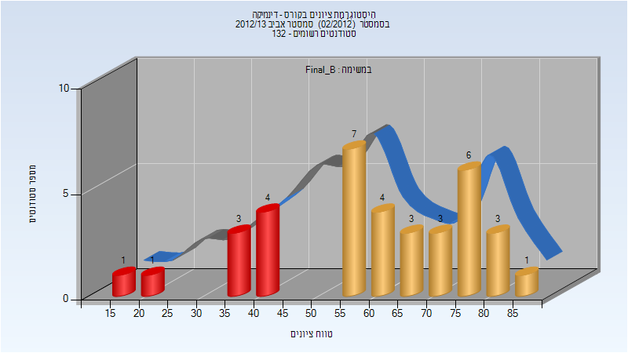

| סטודנטים | עברו/נכשלו | אחוז עוברים | ציון מינימלי | ציון מקסימלי | ממוצע | חציון |
| ---- | ---- | ---- | ---- | ---- | ---- | ---- |
| 36 | 27/9 | 75 | 16 | 87 | 60.194 | 60.5 |

## אביב 2015

| איש סגל | תפקיד |
| ---- | ---- |
| רובין מילס | מרצה - אחראי מקצוע |

### מבחן מועד א'

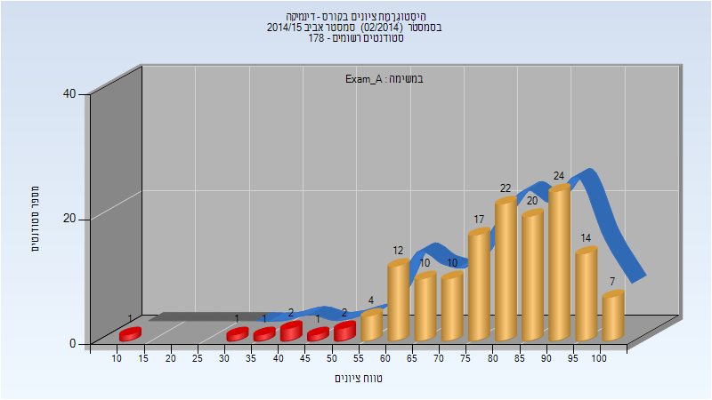

| סטודנטים | עברו/נכשלו | אחוז עוברים | ציון מינימלי | ציון מקסימלי | ממוצע | חציון |
| ---- | ---- | ---- | ---- | ---- | ---- | ---- |
| 148 | 140/8 | 95 | 14.5 | 100 | 79.976 | 83.75 |

### סופי מועד א'

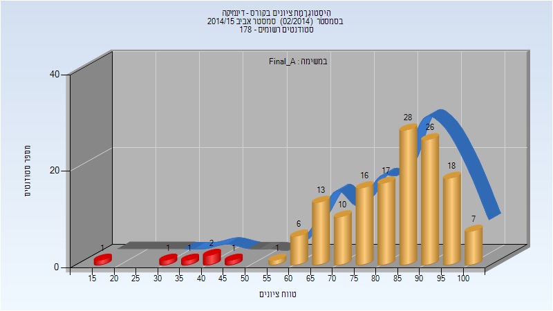

| סטודנטים | עברו/נכשלו | אחוז עוברים | ציון מינימלי | ציון מקסימלי | ממוצע | חציון |
| ---- | ---- | ---- | ---- | ---- | ---- | ---- |
| 148 | 142/6 | 96 | 15 | 100 | 82.061 | 86 |

### מבחן מועד ב'

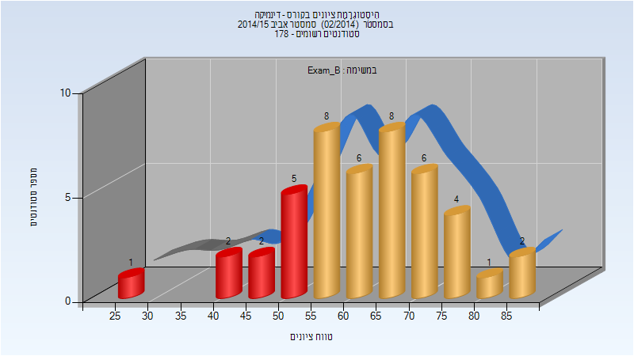

| סטודנטים | עברו/נכשלו | אחוז עוברים | ציון מינימלי | ציון מקסימלי | ממוצע | חציון |
| ---- | ---- | ---- | ---- | ---- | ---- | ---- |
| 45 | 35/10 | 78 | 25 | 85 | 61.75 | 63.75 |

### סופי מועד ב'

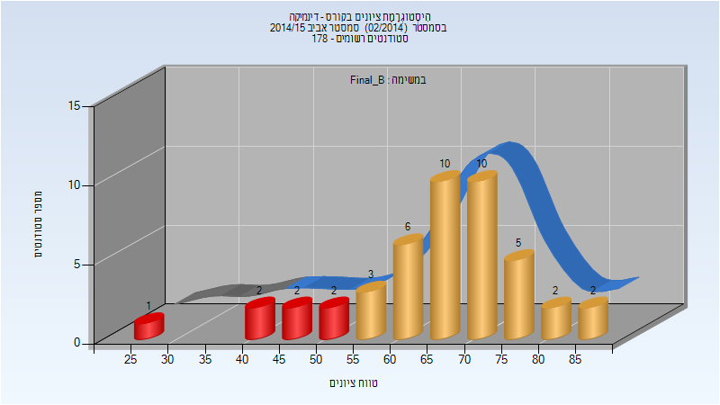

| סטודנטים | עברו/נכשלו | אחוז עוברים | ציון מינימלי | ציון מקסימלי | ממוצע | חציון |
| ---- | ---- | ---- | ---- | ---- | ---- | ---- |
| 45 | 38/7 | 84 | 25 | 88 | 65.689 | 68 |

### סופי

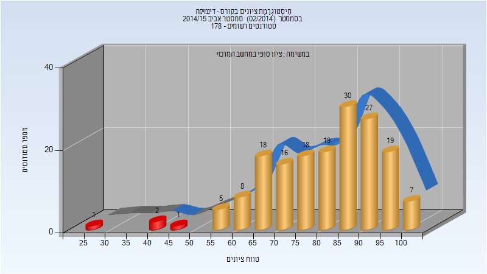

| סטודנטים | עברו/נכשלו | אחוז עוברים | ציון מינימלי | ציון מקסימלי | ממוצע | חציון |
| ---- | ---- | ---- | ---- | ---- | ---- | ---- |
| 171 | 167/4 | 98 | 25 | 100 | 81.135 | 84 |

## אביב 2016

## חורף 2016-2017

| איש סגל | תפקיד |
| ---- | ---- |
| אור יזהר | מרצה - אחראי מקצוע |
| גרינברג ענבר | מתרגל - עם הרשאות מרצה אחראי |
| ויזל אורן | מתרגל - עם הרשאות מרצה אחראי |

### מבחן מועד א'

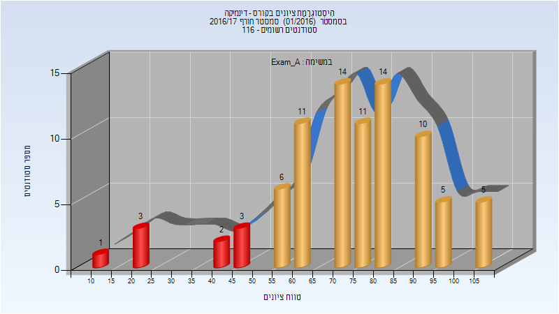

| סטודנטים | עברו/נכשלו | אחוז עוברים | ציון מינימלי | ציון מקסימלי | ממוצע | חציון |
| ---- | ---- | ---- | ---- | ---- | ---- | ---- |
| 85 | 76/9 | 89 | 14 | 105 | 73.753 | 77 |

### סופי מועד א'

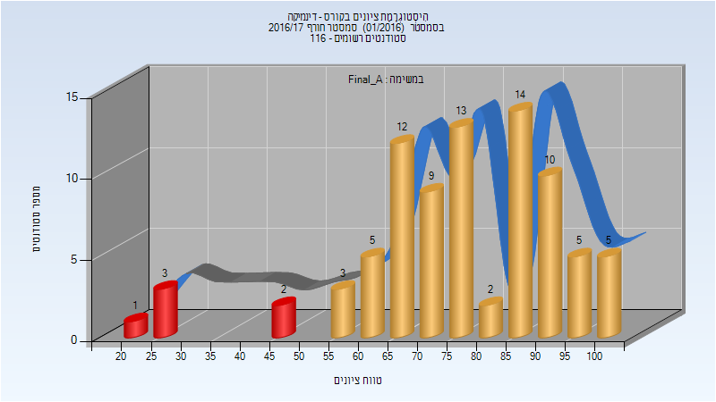

| סטודנטים | עברו/נכשלו | אחוז עוברים | ציון מינימלי | ציון מקסימלי | ממוצע | חציון |
| ---- | ---- | ---- | ---- | ---- | ---- | ---- |
| 84 | 78/6 | 93 | 23 | 100 | 76.571 | 79 |

### מבחן מועד ב'

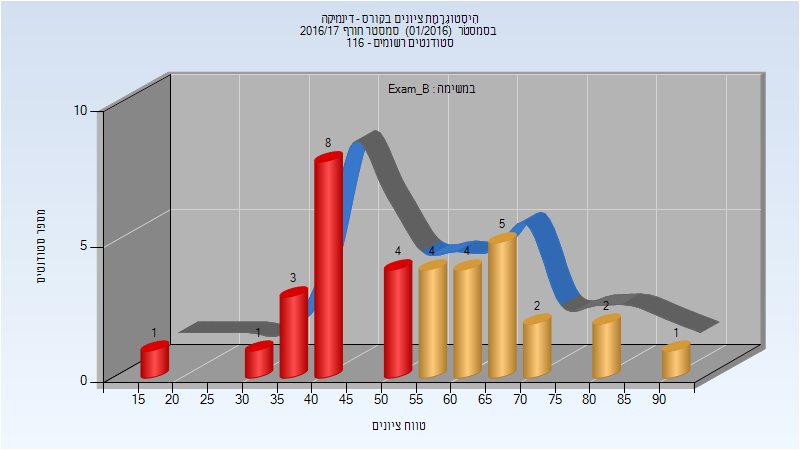

| סטודנטים | עברו/נכשלו | אחוז עוברים | ציון מינימלי | ציון מקסימלי | ממוצע | חציון |
| ---- | ---- | ---- | ---- | ---- | ---- | ---- |
| 35 | 18/17 | 51 | 17 | 91 | 55.086 | 54 |

### סופי מועד ב'

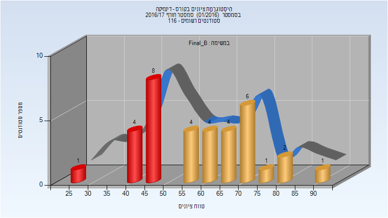

| סטודנטים | עברו/נכשלו | אחוז עוברים | ציון מינימלי | ציון מקסימלי | ממוצע | חציון |
| ---- | ---- | ---- | ---- | ---- | ---- | ---- |
| 35 | 22/13 | 63 | 25 | 92 | 59.314 | 59 |

### סופי

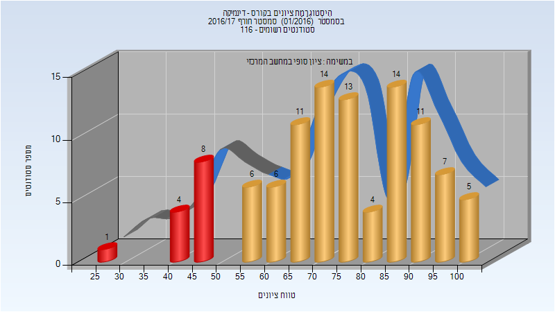

| סטודנטים | עברו/נכשלו | אחוז עוברים | ציון מינימלי | ציון מקסימלי | ממוצע | חציון |
| ---- | ---- | ---- | ---- | ---- | ---- | ---- |
| 104 | 91/13 | 88 | 25 | 100 | 74.75 | 77 |

## אביב 2017

| איש סגל | תפקיד |
| ---- | ---- |
| שמואל גל | מרצה - אחראי מקצוע |
| קיסלובסקי ויקטור | מתרגל - עם הרשאות מרצה אחראי |
| שטיין יונתן | מתרגל - עם הרשאות מרצה אחראי |
| ויזל אורן | מתרגל - עם הרשאות מרצה אחראי |

### מבחן מועד א'

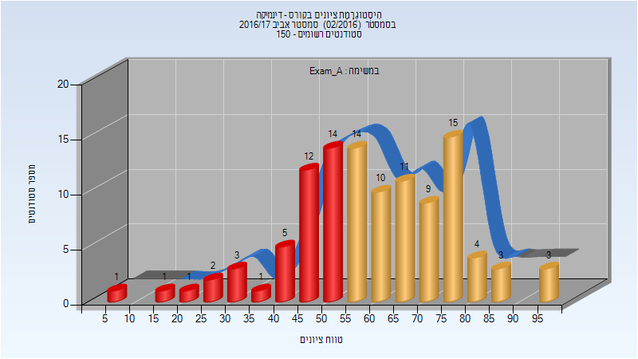

| סטודנטים | עברו/נכשלו | אחוז עוברים | ציון מינימלי | ציון מקסימלי | ממוצע | חציון |
| ---- | ---- | ---- | ---- | ---- | ---- | ---- |
| 109 | 69/40 | 63 | 8 | 99 | 60.44 | 60 |

### סופי מועד א'

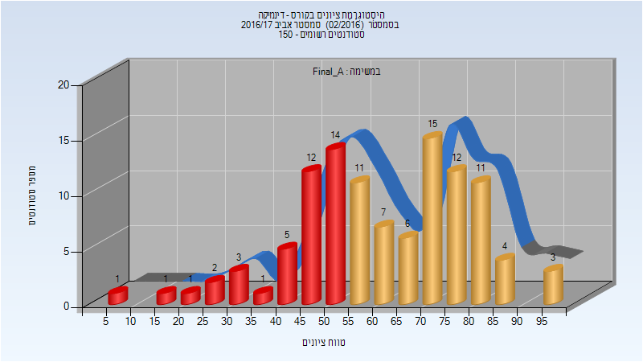

| סטודנטים | עברו/נכשלו | אחוז עוברים | ציון מינימלי | ציון מקסימלי | ממוצע | חציון |
| ---- | ---- | ---- | ---- | ---- | ---- | ---- |
| 109 | 69/40 | 63 | 8 | 99.2 | 62.196 | 62.8 |

### מבחן מועד ב'

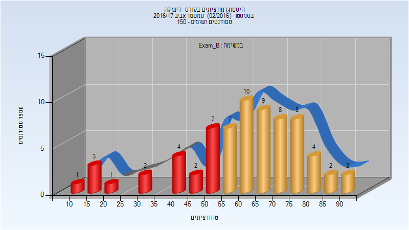

| סטודנטים | עברו/נכשלו | אחוז עוברים | ציון מינימלי | ציון מקסימלי | ממוצע | חציון |
| ---- | ---- | ---- | ---- | ---- | ---- | ---- |
| 70 | 50/20 | 71 | 12 | 93 | 61.343 | 63 |

### סופי מועד ב'

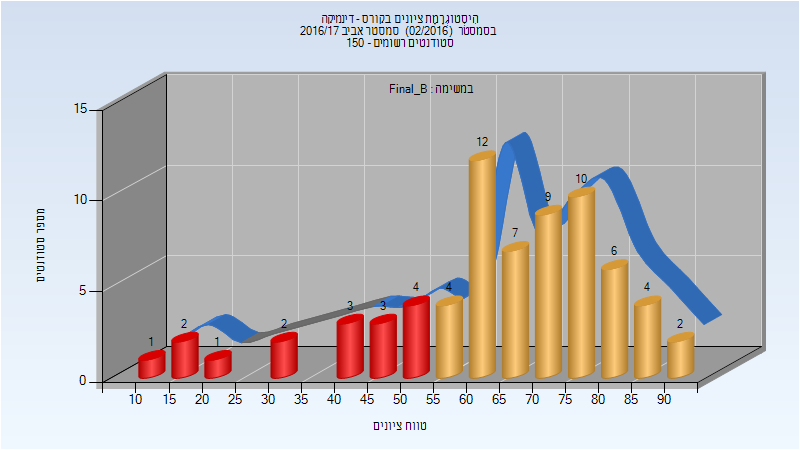

| סטודנטים | עברו/נכשלו | אחוז עוברים | ציון מינימלי | ציון מקסימלי | ממוצע | חציון |
| ---- | ---- | ---- | ---- | ---- | ---- | ---- |
| 70 | 54/16 | 77 | 12 | 93 | 64.129 | 65.5 |

### סופי

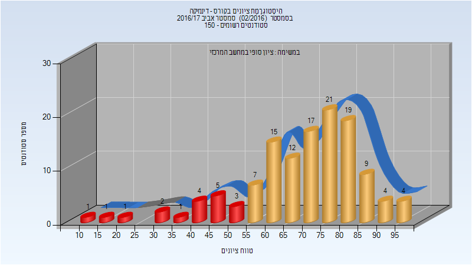

| סטודנטים | עברו/נכשלו | אחוז עוברים | ציון מינימלי | ציון מקסימלי | ממוצע | חציון |
| ---- | ---- | ---- | ---- | ---- | ---- | ---- |
| 126 | 108/18 | 86 | 12 | 99 | 69.675 | 73 |

## חורף 2017-2018

| איש סגל | תפקיד |
| ---- | ---- |
| אור יזהר | מרצה - אחראי מקצוע |
| ויזל אורן | מתרגל - עם הרשאות מרצה אחראי |
| סאלם ליאור | מתרגל - עם הרשאות מרצה אחראי |

### מבחן מועד א'

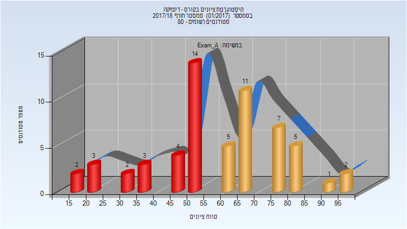

| סטודנטים | עברו/נכשלו | אחוז עוברים | ציון מינימלי | ציון מקסימלי | ממוצע | חציון |
| ---- | ---- | ---- | ---- | ---- | ---- | ---- |
| 59 | 31/28 | 53 | 15 | 98 | 58.797 | 60 |

### סופי מועד א'

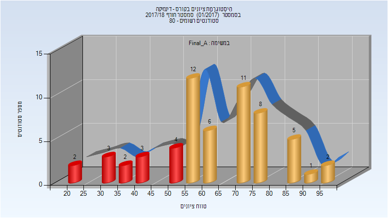

| סטודנטים | עברו/נכשלו | אחוז עוברים | ציון מינימלי | ציון מקסימלי | ממוצע | חציון |
| ---- | ---- | ---- | ---- | ---- | ---- | ---- |
| 59 | 45/14 | 76 | 24 | 98 | 63.593 | 63 |

### מבחן מועד ב'

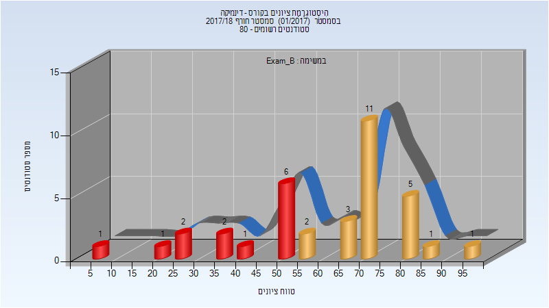

| סטודנטים | עברו/נכשלו | אחוז עוברים | ציון מינימלי | ציון מקסימלי | ממוצע | חציון |
| ---- | ---- | ---- | ---- | ---- | ---- | ---- |
| 36 | 23/13 | 64 | 5 | 95 | 60.625 | 68.75 |

### סופי מועד ב'

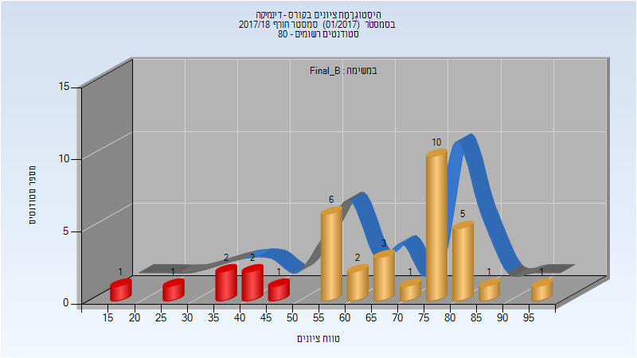

| סטודנטים | עברו/נכשלו | אחוז עוברים | ציון מינימלי | ציון מקסימלי | ממוצע | חציון |
| ---- | ---- | ---- | ---- | ---- | ---- | ---- |
| 36 | 29/7 | 81 | 15 | 96 | 64.444 | 69.5 |

### סופי

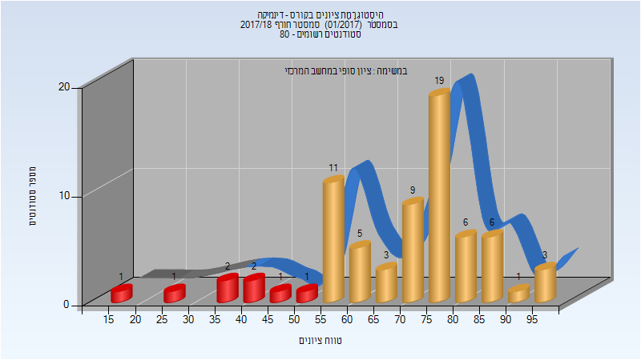

| סטודנטים | עברו/נכשלו | אחוז עוברים | ציון מינימלי | ציון מקסימלי | ממוצע | חציון |
| ---- | ---- | ---- | ---- | ---- | ---- | ---- |
| 71 | 63/8 | 89 | 15 | 98 | 69.324 | 74 |

## אביב 2018

| איש סגל | תפקיד |
| ---- | ---- |
| שמואל גל | מרצה - אחראי מקצוע |
| סאלם ליאור | מתרגל - עם הרשאות מרצה אחראי |
| ויזל אורן | מתרגל - עם הרשאות מרצה אחראי |
| קיסלובסקי ויקטור | מתרגל - עם הרשאות מרצה אחראי |

### מבחן מועד א'

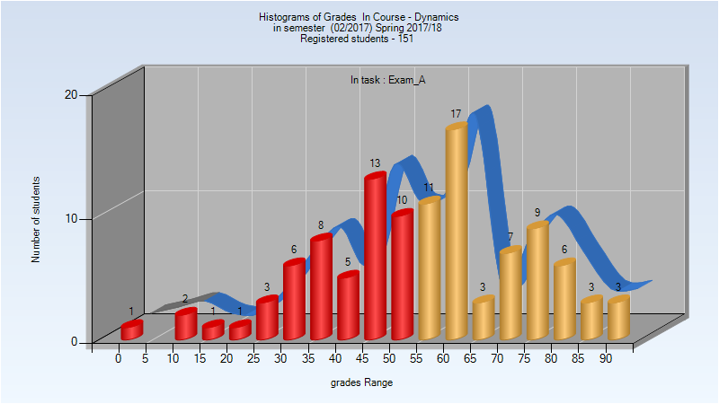

| סטודנטים | עברו/נכשלו | אחוז עוברים | ציון מינימלי | ציון מקסימלי | ממוצע | חציון |
| ---- | ---- | ---- | ---- | ---- | ---- | ---- |
| 109 | 59/50 | 54 | 4 | 92 | 55.963 | 57 |

### סופי מועד א'

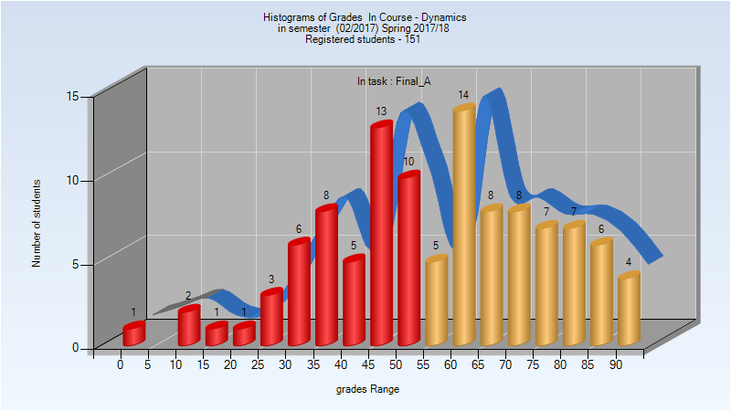

| סטודנטים | עברו/נכשלו | אחוז עוברים | ציון מינימלי | ציון מקסימלי | ממוצע | חציון |
| ---- | ---- | ---- | ---- | ---- | ---- | ---- |
| 109 | 59/50 | 54 | 4 | 94 | 57.385 | 59 |

### מבחן מועד ב'

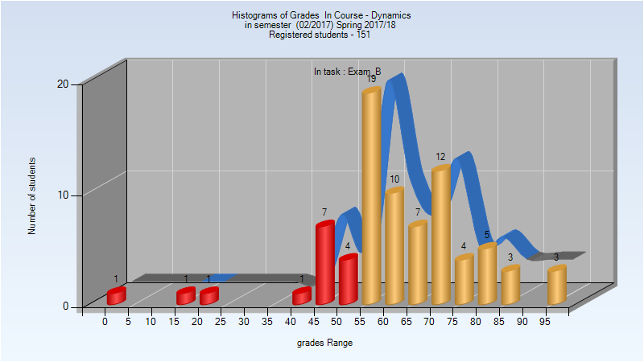

| סטודנטים | עברו/נכשלו | אחוז עוברים | ציון מינימלי | ציון מקסימלי | ממוצע | חציון |
| ---- | ---- | ---- | ---- | ---- | ---- | ---- |
| 78 | 63/15 | 81 | 3 | 97 | 63.038 | 62 |

### סופי מועד ב'

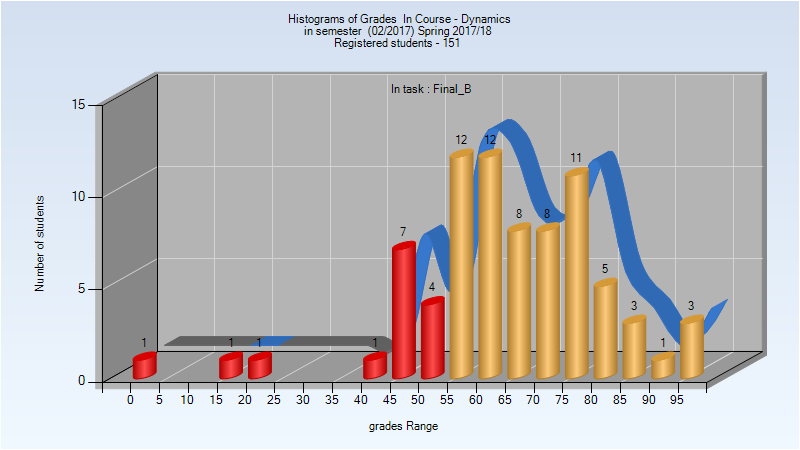

| סטודנטים | עברו/נכשלו | אחוז עוברים | ציון מינימלי | ציון מקסימלי | ממוצע | חציון |
| ---- | ---- | ---- | ---- | ---- | ---- | ---- |
| 78 | 63/15 | 81 | 3 | 97 | 64.615 | 64.5 |

### סופי

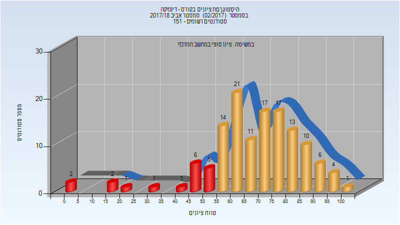

| סטודנטים | עברו/נכשלו | אחוז עוברים | ציון מינימלי | ציון מקסימלי | ממוצע | חציון |
| ---- | ---- | ---- | ---- | ---- | ---- | ---- |
| 132 | 114/18 | 86 | 3 | 100 | 68.235 | 70 |

## חורף 2018-2019

| איש סגל | תפקיד |
| ---- | ---- |
| גנדלמן אולג | מרצה - אחראי מקצוע |
| ויזל אורן | מתרגל - עם הרשאות מרצה אחראי |
| שירוקי יצחק | מתרגל - עם הרשאות מרצה אחראי |

### מבחן מועד א'

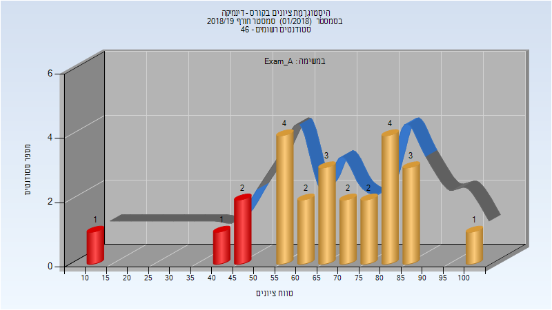

| סטודנטים | עברו/נכשלו | אחוז עוברים | ציון מינימלי | ציון מקסימלי | ממוצע | חציון |
| ---- | ---- | ---- | ---- | ---- | ---- | ---- |
| 25 | 21/4 | 84 | 10 | 100 | 66.96 | 69 |

### סופי מועד א'

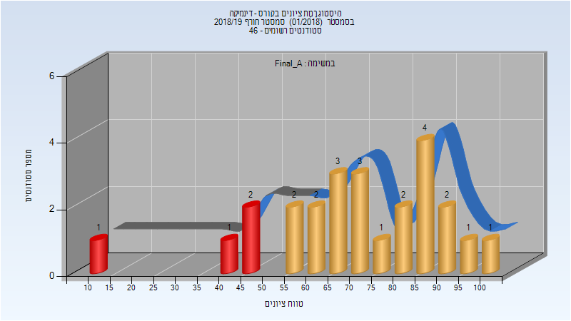

| סטודנטים | עברו/נכשלו | אחוז עוברים | ציון מינימלי | ציון מקסימלי | ממוצע | חציון |
| ---- | ---- | ---- | ---- | ---- | ---- | ---- |
| 25 | 21/4 | 84 | 10 | 100 | 71.08 | 72 |

### מבחן מועד ב'

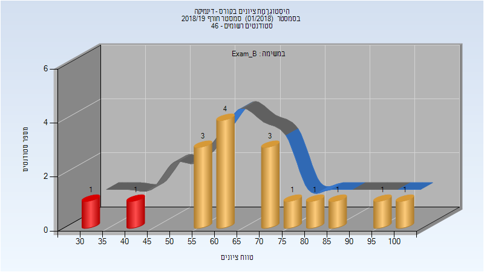

| סטודנטים | עברו/נכשלו | אחוז עוברים | ציון מינימלי | ציון מקסימלי | ממוצע | חציון |
| ---- | ---- | ---- | ---- | ---- | ---- | ---- |
| 17 | 15/2 | 88 | 33 | 100 | 67.824 | 63 |

### סופי מועד ב'

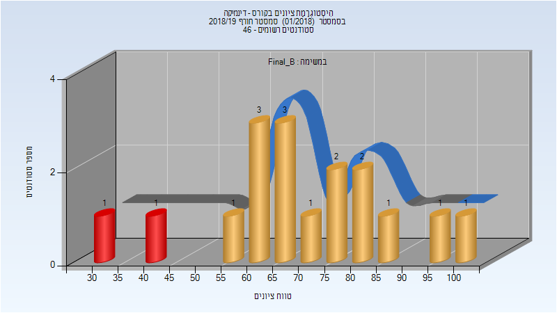

| סטודנטים | עברו/נכשלו | אחוז עוברים | ציון מינימלי | ציון מקסימלי | ממוצע | חציון |
| ---- | ---- | ---- | ---- | ---- | ---- | ---- |
| 17 | 15/2 | 88 | 33 | 100 | 70.353 | 66 |

### סופי

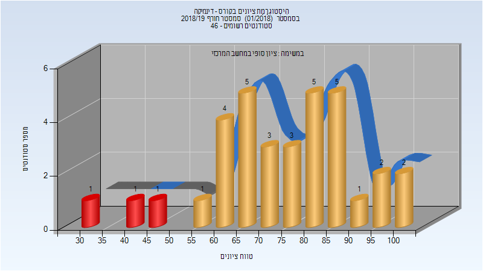

| סטודנטים | עברו/נכשלו | אחוז עוברים | ציון מינימלי | ציון מקסימלי | ממוצע | חציון |
| ---- | ---- | ---- | ---- | ---- | ---- | ---- |
| 34 | 31/3 | 91 | 33 | 100 | 74.941 | 75.5 |

## אביב 2019

| איש סגל | תפקיד |
| ---- | ---- |
| שמואל גל | מרצה - אחראי מקצוע |
| ויזל אורן | מתרגל - עם הרשאות מרצה אחראי |
| אהרוני זיו | מתרגל - עם הרשאות מרצה אחראי |
| סאלם ליאור | מתרגל - עם הרשאות מרצה אחראי |

### מבחן מועד א'

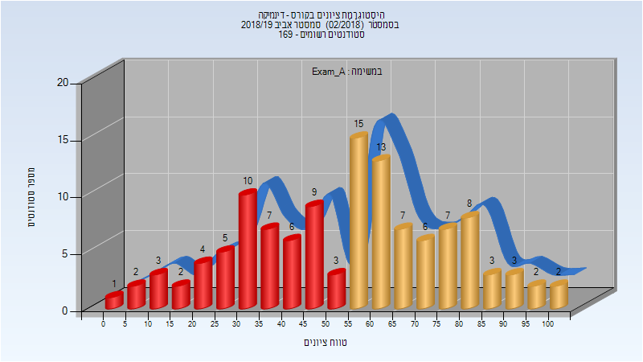

| סטודנטים | עברו/נכשלו | אחוז עוברים | ציון מינימלי | ציון מקסימלי | ממוצע | חציון |
| ---- | ---- | ---- | ---- | ---- | ---- | ---- |
| 118 | 66/52 | 56 | 1 | 100 | 54.136 | 56 |

### סופי מועד א'

| סטודנטים | עברו/נכשלו | אחוז עוברים | ציון מינימלי | ציון מקסימלי | ממוצע | חציון |
| ---- | ---- | ---- | ---- | ---- | ---- | ---- |
| 118 | 66/52 | 56 | 1 | 100 | 54.678 | 58 |

### סופי מועד ב'

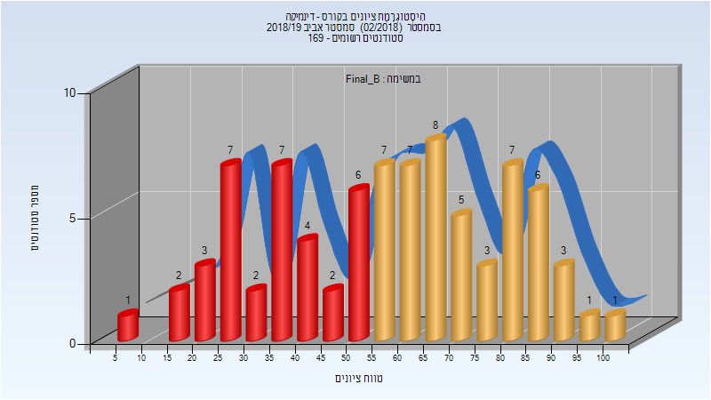

| סטודנטים | עברו/נכשלו | אחוז עוברים | ציון מינימלי | ציון מקסימלי | ממוצע | חציון |
| ---- | ---- | ---- | ---- | ---- | ---- | ---- |
| 82 | 48/34 | 59 | 7 | 100 | 57.171 | 59 |

### סופי

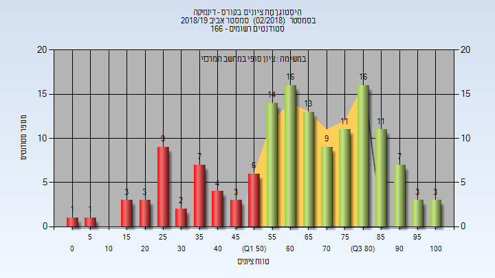

| סטודנטים | עברו/נכשלו | אחוז עוברים | ציון מינימלי | ציון מקסימלי | ממוצע | חציון |
| ---- | ---- | ---- | ---- | ---- | ---- | ---- |
| 142 | 103/39 | 73 | 1 | 100 | 62.908 | 65 |

## אביב 2020

| איש סגל | תפקיד |
| ---- | ---- |
| סטרוסבצקי יולי | מרצה - אחראי מקצוע |
| רוזנשטוק דוד | מתרגל - עם הרשאות מרצה אחראי |
| אהרוני זיו | מתרגל - עם הרשאות מרצה אחראי |
| רחמן גלינה | מתרגל - עם הרשאות מרצה אחראי |
| שטיינר מתן | מתרגל - עם הרשאות מרצה אחראי |

### מבחן מועד א'

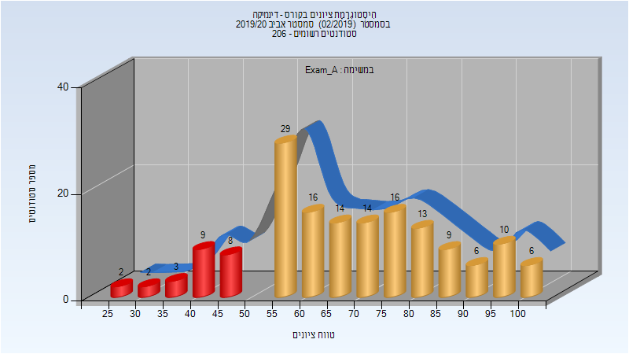

| סטודנטים | עברו/נכשלו | אחוז עוברים | ציון מינימלי | ציון מקסימלי | ממוצע | חציון |
| ---- | ---- | ---- | ---- | ---- | ---- | ---- |
| 157 | 133/24 | 85 | 29 | 100 | 68.857 | 68.8 |

### סופי מועד א'

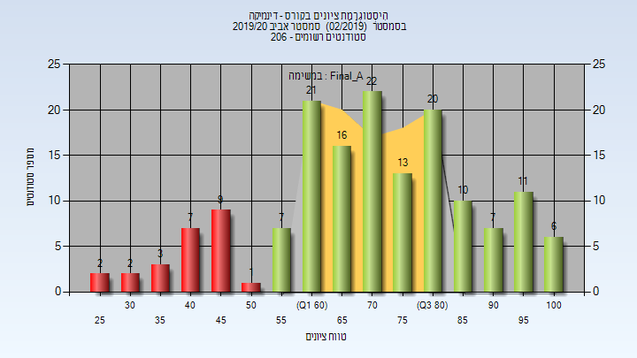

| סטודנטים | עברו/נכשלו | אחוז עוברים | ציון מינימלי | ציון מקסימלי | ממוצע | חציון |
| ---- | ---- | ---- | ---- | ---- | ---- | ---- |
| 157 | 133/24 | 85 | 29 | 100 | 71.363 | 73 |

### מבחן מועד ב'

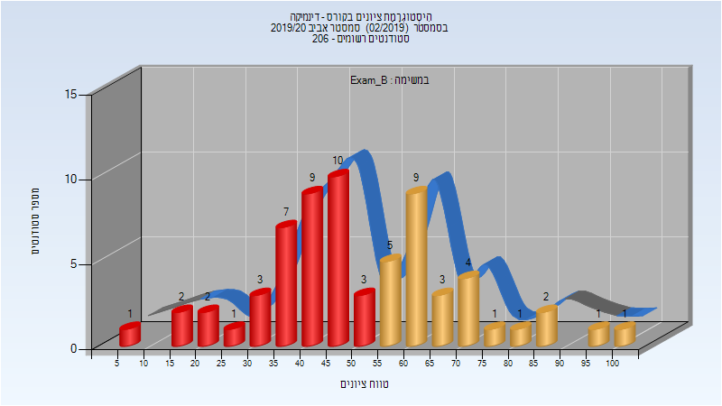

| סטודנטים | עברו/נכשלו | אחוז עוברים | ציון מינימלי | ציון מקסימלי | ממוצע | חציון |
| ---- | ---- | ---- | ---- | ---- | ---- | ---- |
| 65 | 27/38 | 42 | 6 | 100 | 51.015 | 47 |

### סופי מועד ב'

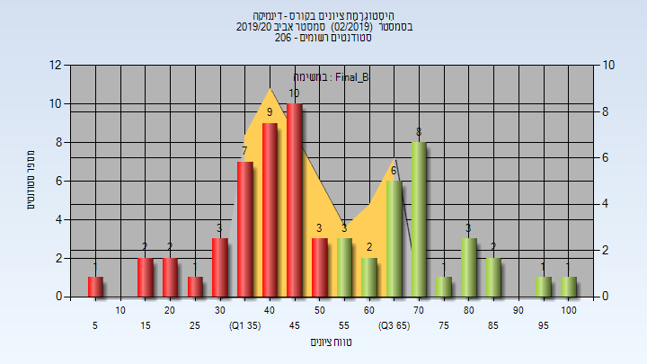

| סטודנטים | עברו/נכשלו | אחוז עוברים | ציון מינימלי | ציון מקסימלי | ממוצע | חציון |
| ---- | ---- | ---- | ---- | ---- | ---- | ---- |
| 65 | 27/38 | 42 | 6 | 100 | 52.877 | 47 |

### סופי

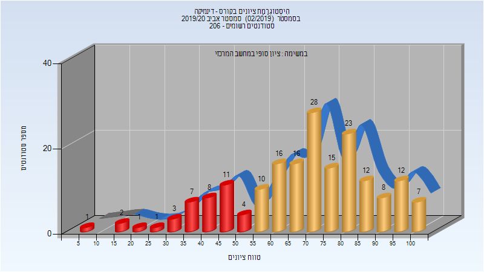

| סטודנטים | עברו/נכשלו | אחוז עוברים | ציון מינימלי | ציון מקסימלי | ממוצע | חציון |
| ---- | ---- | ---- | ---- | ---- | ---- | ---- |
| 185 | 146/39 | 79 | 6 | 100 | 69.346 | 72 |

## חורף 2020-2021

| איש סגל | תפקיד |
| ---- | ---- |
| ספדי מחמוד | מרצה - אחראי מקצוע |

