# 034013 - תורת הזרימה 1

## אביב 2015

| איש סגל | תפקיד |
| ---- | ---- |
| גת אמיר | מרצה - אחראי מקצוע |

### סופי מועד א'

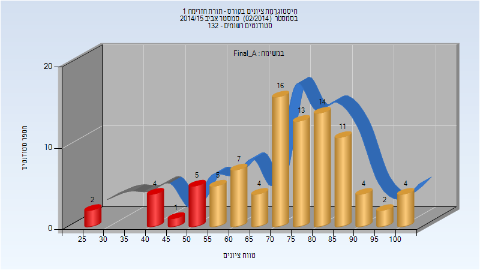

| סטודנטים | עברו/נכשלו | אחוז עוברים | ציון מינימלי | ציון מקסימלי | ממוצע | חציון |
| ---- | ---- | ---- | ---- | ---- | ---- | ---- |
| 92 | 80/12 | 87 | 27 | 100 | 73.25 | 76 |

### סופי מועד ב'

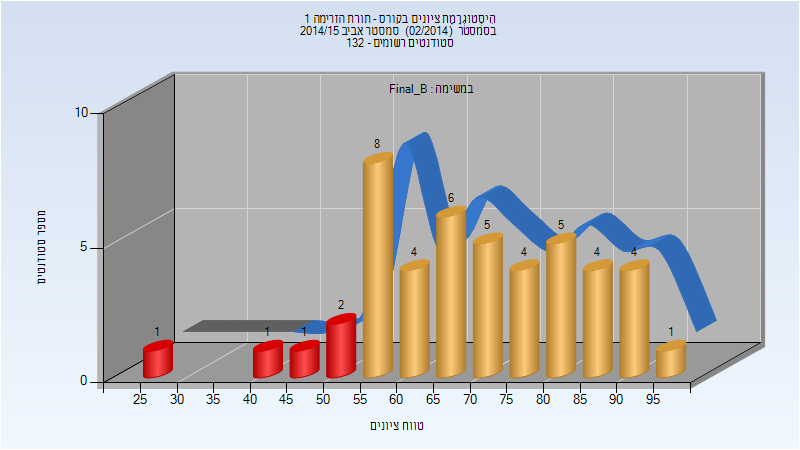

| סטודנטים | עברו/נכשלו | אחוז עוברים | ציון מינימלי | ציון מקסימלי | ממוצע | חציון |
| ---- | ---- | ---- | ---- | ---- | ---- | ---- |
| 46 | 41/5 | 89 | 26 | 95 | 69.957 | 70 |

### סופי

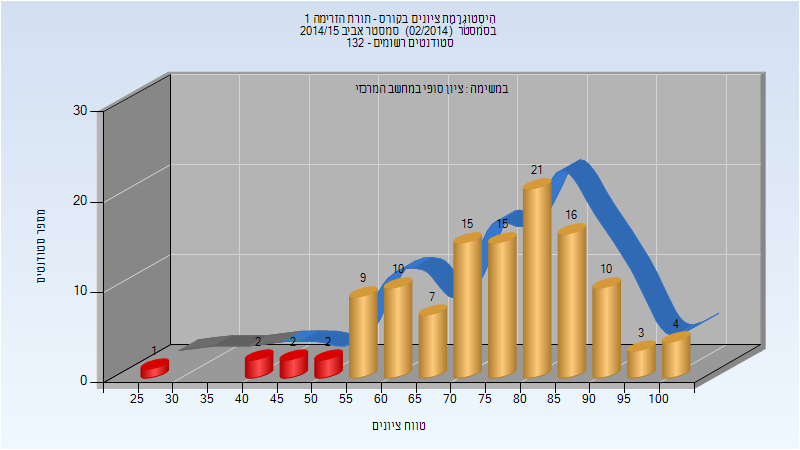

| סטודנטים | עברו/נכשלו | אחוז עוברים | ציון מינימלי | ציון מקסימלי | ממוצע | חציון |
| ---- | ---- | ---- | ---- | ---- | ---- | ---- |
| 117 | 110/7 | 94 | 26 | 100 | 75.701 | 79 |

## אביב 2016

| איש סגל | תפקיד |
| ---- | ---- |
| ברקוביץ מורן | מרצה - אחראי מקצוע |

### מבחן מועד א'

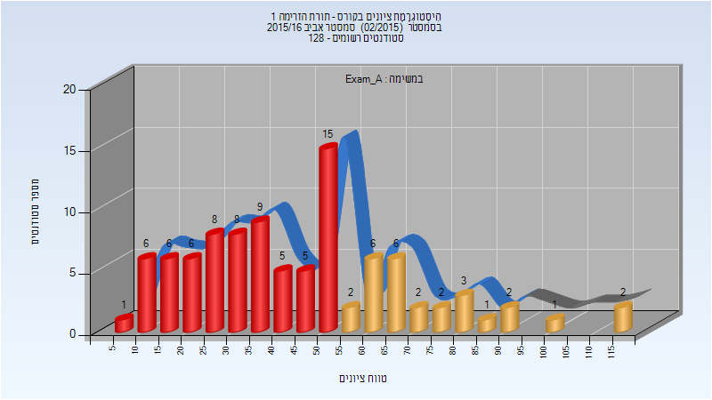

| סטודנטים | עברו/נכשלו | אחוז עוברים | ציון מינימלי | ציון מקסימלי | ממוצע | חציון |
| ---- | ---- | ---- | ---- | ---- | ---- | ---- |
| 96 | 27/69 | 28 | 9.1 | 118.3 | 46.055 | 42.9 |

### סופי מועד א'

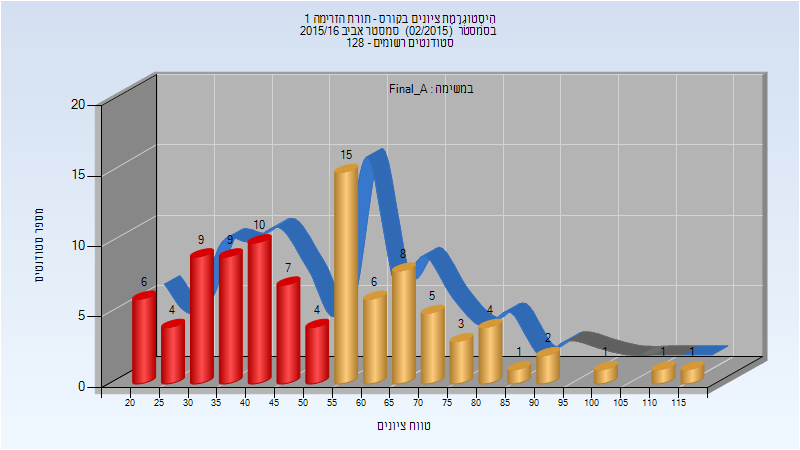

| סטודנטים | עברו/נכשלו | אחוז עוברים | ציון מינימלי | ציון מקסימלי | ממוצע | חציון |
| ---- | ---- | ---- | ---- | ---- | ---- | ---- |
| 96 | 47/49 | 49 | 20 | 115 | 53.281 | 51 |

### סופי מועד ב'

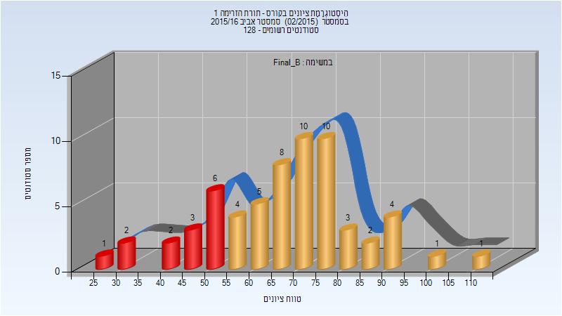

| סטודנטים | עברו/נכשלו | אחוז עוברים | ציון מינימלי | ציון מקסימלי | ממוצע | חציון |
| ---- | ---- | ---- | ---- | ---- | ---- | ---- |
| 62 | 48/14 | 77 | 29 | 113 | 67.823 | 70 |

### סופי

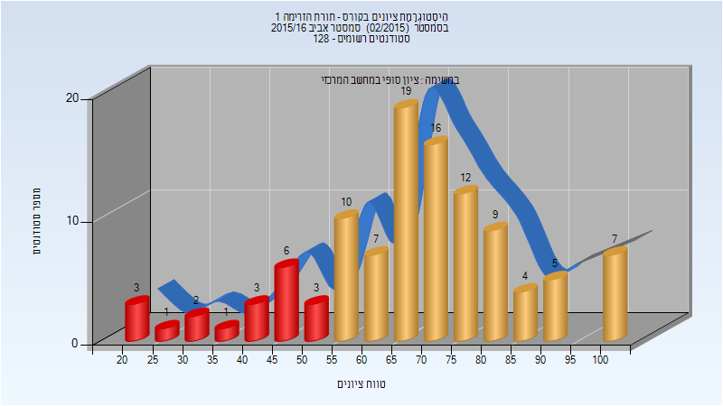

| סטודנטים | עברו/נכשלו | אחוז עוברים | ציון מינימלי | ציון מקסימלי | ממוצע | חציון |
| ---- | ---- | ---- | ---- | ---- | ---- | ---- |
| 108 | 89/19 | 82 | 22 | 100 | 68.213 | 68.5 |

## חורף 2016-2017

### סופי מועד א'

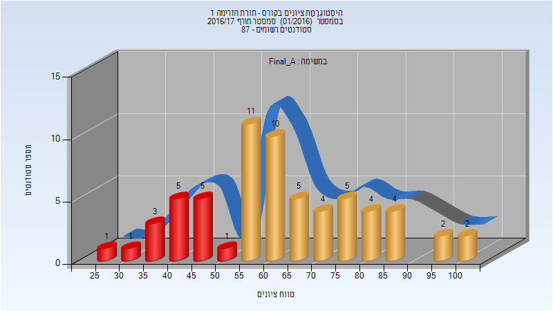

| סטודנטים | עברו/נכשלו | אחוז עוברים | ציון מינימלי | ציון מקסימלי | ממוצע | חציון |
| ---- | ---- | ---- | ---- | ---- | ---- | ---- |
| 63 | 47/16 | 75 | 26 | 100 | 63.302 | 61 |

### מבחן מועד ב'

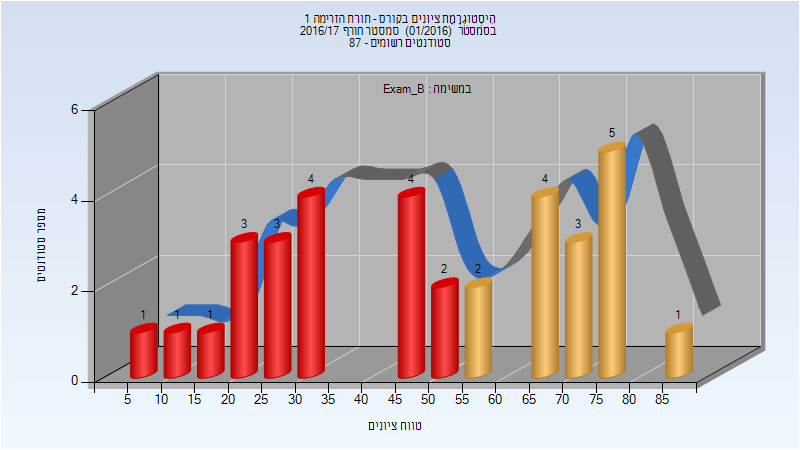

| סטודנטים | עברו/נכשלו | אחוז עוברים | ציון מינימלי | ציון מקסימלי | ממוצע | חציון |
| ---- | ---- | ---- | ---- | ---- | ---- | ---- |
| 34 | 15/19 | 44 | 6 | 87 | 49.529 | 49.5 |

### סופי מועד ב'

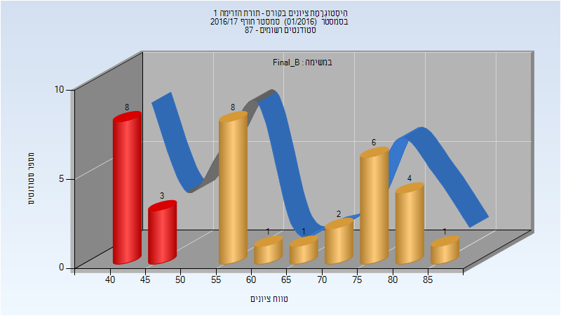

| סטודנטים | עברו/נכשלו | אחוז עוברים | ציון מינימלי | ציון מקסימלי | ממוצע | חציון |
| ---- | ---- | ---- | ---- | ---- | ---- | ---- |
| 34 | 23/11 | 68 | 40 | 88 | 60.735 | 55.5 |

### סופי

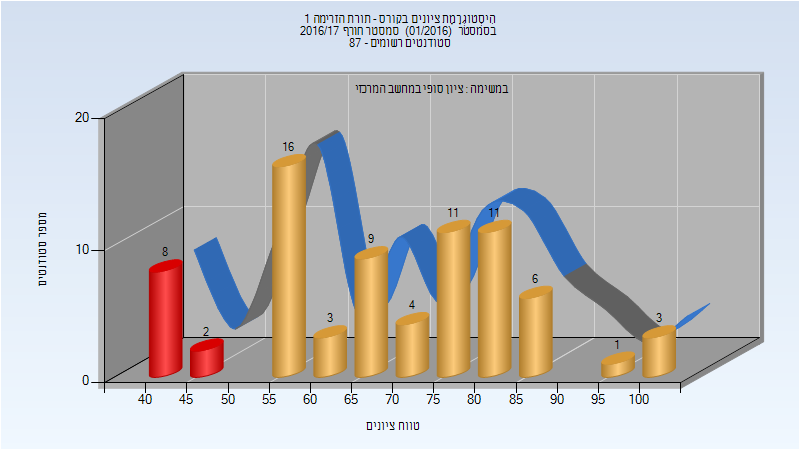

| סטודנטים | עברו/נכשלו | אחוז עוברים | ציון מינימלי | ציון מקסימלי | ממוצע | חציון |
| ---- | ---- | ---- | ---- | ---- | ---- | ---- |
| 74 | 64/10 | 86 | 40 | 100 | 68.297 | 68.5 |

## אביב 2017

| איש סגל | תפקיד |
| ---- | ---- |
| ברקוביץ מורן | מרצה - אחראי מקצוע |
| נוף אלירם | מתרגל - עם הרשאות מרצה אחראי |
| בויקו יבגני | מתרגל - עם הרשאות מרצה אחראי |

### מבחן מועד א'

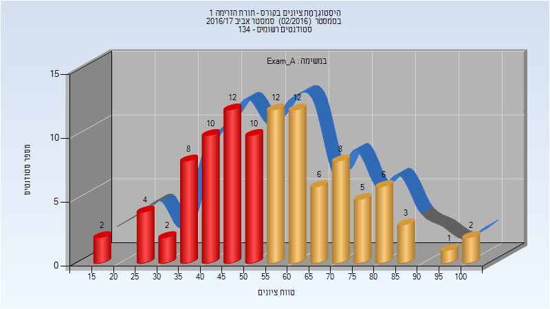

| סטודנטים | עברו/נכשלו | אחוז עוברים | ציון מינימלי | ציון מקסימלי | ממוצע | חציון |
| ---- | ---- | ---- | ---- | ---- | ---- | ---- |
| 103 | 55/48 | 53 | 16 | 100 | 56.583 | 55 |

### סופי מועד א'

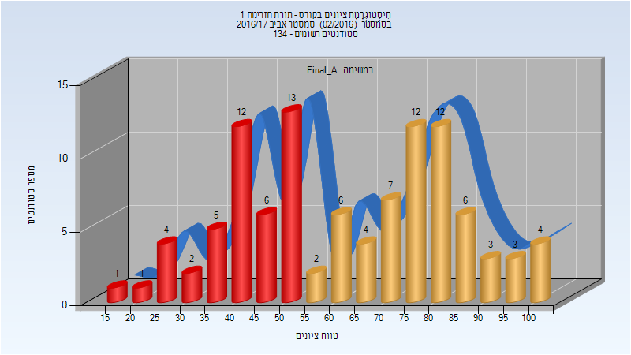

| סטודנטים | עברו/נכשלו | אחוז עוברים | ציון מינימלי | ציון מקסימלי | ממוצע | חציון |
| ---- | ---- | ---- | ---- | ---- | ---- | ---- |
| 103 | 59/44 | 57 | 18 | 100 | 63.019 | 62 |

### סופי מועד ב'

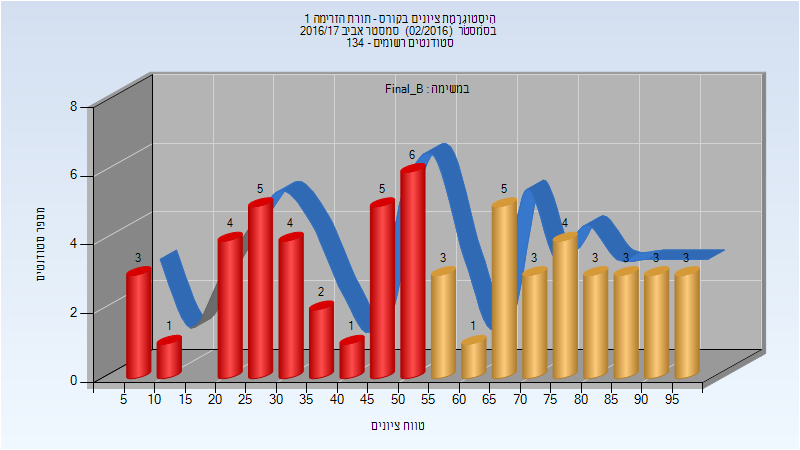

| סטודנטים | עברו/נכשלו | אחוז עוברים | ציון מינימלי | ציון מקסימלי | ממוצע | חציון |
| ---- | ---- | ---- | ---- | ---- | ---- | ---- |
| 59 | 28/31 | 47 | 7 | 99 | 54.237 | 53 |

### סופי

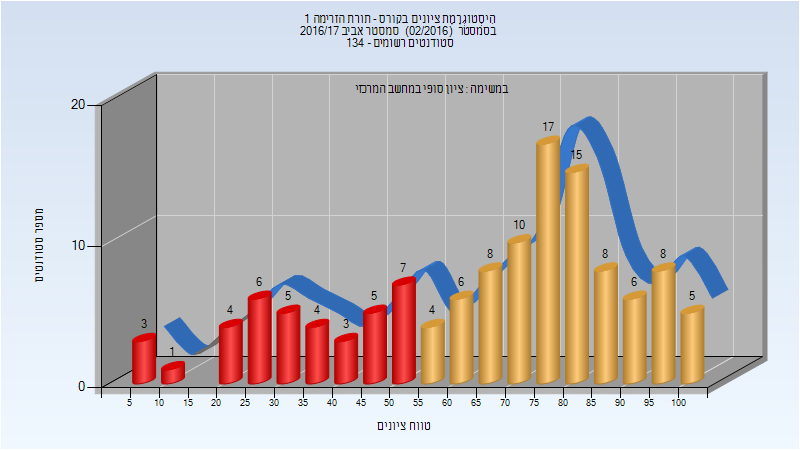

| סטודנטים | עברו/נכשלו | אחוז עוברים | ציון מינימלי | ציון מקסימלי | ממוצע | חציון |
| ---- | ---- | ---- | ---- | ---- | ---- | ---- |
| 125 | 87/38 | 70 | 7 | 100 | 65.64 | 73 |

## חורף 2017-2018

| איש סגל | תפקיד |
| ---- | ---- |
| ברקוביץ מורן | מרצה - אחראי מקצוע |
| בויקו יבגני | מתרגל - עם הרשאות מרצה אחראי |
| רופמן ברוך | מתרגל - עם הרשאות מרצה אחראי |
| נוף אלירם | מתרגל - עם הרשאות מרצה אחראי |

### מבחן מועד א'

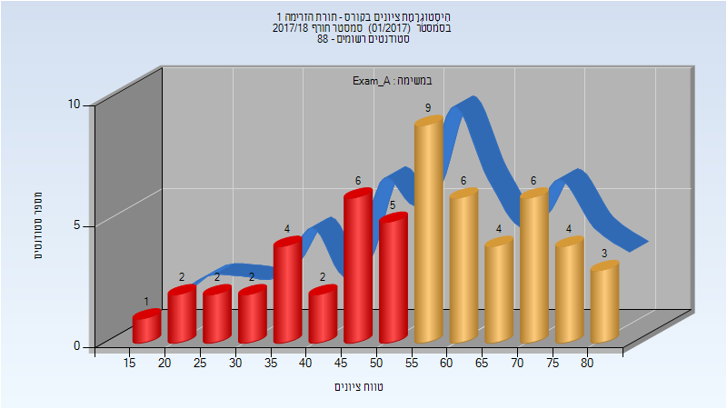

| סטודנטים | עברו/נכשלו | אחוז עוברים | ציון מינימלי | ציון מקסימלי | ממוצע | חציון |
| ---- | ---- | ---- | ---- | ---- | ---- | ---- |
| 56 | 32/24 | 57 | 15 | 83 | 54.929 | 57 |

### סופי מועד א'

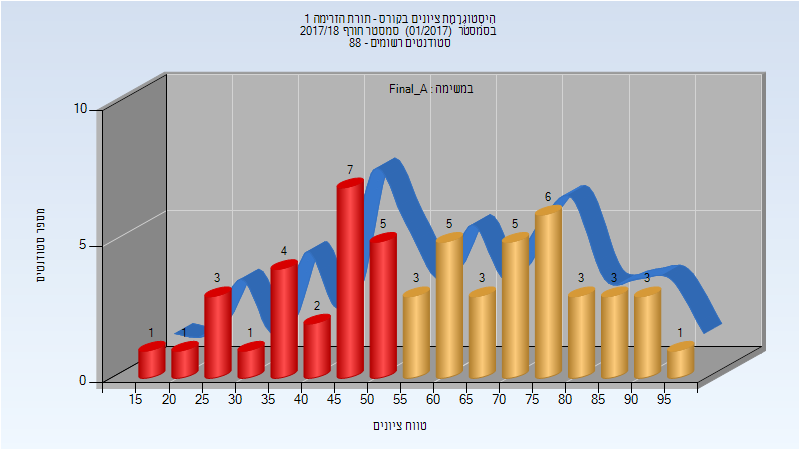

| סטודנטים | עברו/נכשלו | אחוז עוברים | ציון מינימלי | ציון מקסימלי | ממוצע | חציון |
| ---- | ---- | ---- | ---- | ---- | ---- | ---- |
| 56 | 32/24 | 57 | 17 | 95 | 60 | 60.5 |

### מבחן מועד ב'

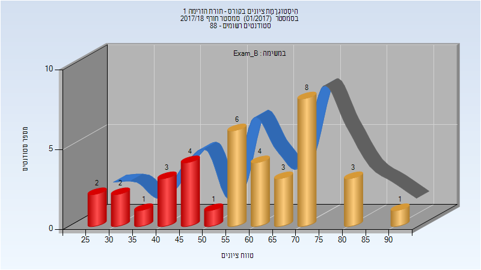

| סטודנטים | עברו/נכשלו | אחוז עוברים | ציון מינימלי | ציון מקסימלי | ממוצע | חציון |
| ---- | ---- | ---- | ---- | ---- | ---- | ---- |
| 38 | 25/13 | 66 | 27 | 93 | 58.132 | 60.5 |

### סופי מועד ב'

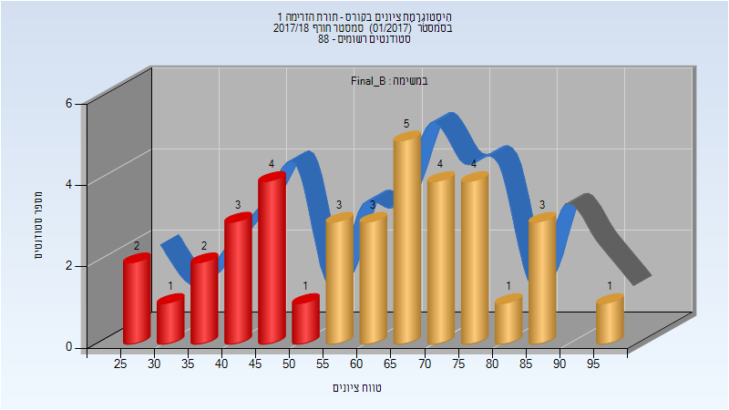

| סטודנטים | עברו/נכשלו | אחוז עוברים | ציון מינימלי | ציון מקסימלי | ממוצע | חציון |
| ---- | ---- | ---- | ---- | ---- | ---- | ---- |
| 37 | 24/13 | 65 | 28 | 98 | 60.865 | 64 |

### סופי

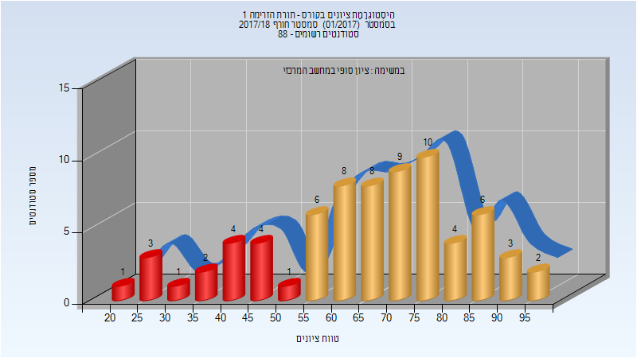

| סטודנטים | עברו/נכשלו | אחוז עוברים | ציון מינימלי | ציון מקסימלי | ממוצע | חציון |
| ---- | ---- | ---- | ---- | ---- | ---- | ---- |
| 72 | 56/16 | 78 | 22 | 98 | 65.736 | 68.5 |

## אביב 2018

| איש סגל | תפקיד |
| ---- | ---- |
| ברקוביץ מורן | מרצה - אחראי מקצוע |
| גבאי ישראל | מתרגל - עם הרשאות מרצה אחראי |
| אשל רן | מתרגל - עם הרשאות מרצה אחראי |
| בויקו יבגני | מתרגל - עם הרשאות מרצה אחראי |

### מבחן מועד א'

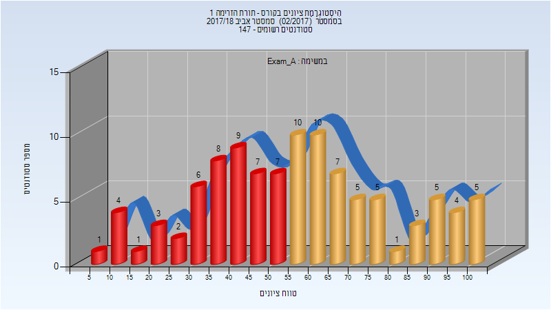

| סטודנטים | עברו/נכשלו | אחוז עוברים | ציון מינימלי | ציון מקסימלי | ממוצע | חציון |
| ---- | ---- | ---- | ---- | ---- | ---- | ---- |
| 103 | 55/48 | 53 | 5 | 100 | 56.864 | 55 |

### סופי מועד א'

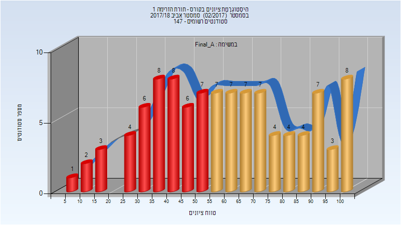

| סטודנטים | עברו/נכשלו | אחוז עוברים | ציון מינימלי | ציון מקסימלי | ממוצע | חציון |
| ---- | ---- | ---- | ---- | ---- | ---- | ---- |
| 103 | 58/45 | 56 | 7 | 100 | 60.087 | 59 |

### מבחן מועד ב'

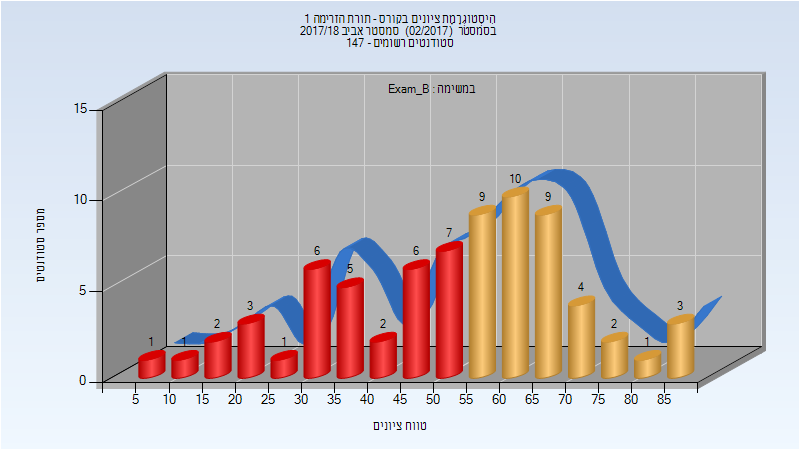

| סטודנטים | עברו/נכשלו | אחוז עוברים | ציון מינימלי | ציון מקסימלי | ממוצע | חציון |
| ---- | ---- | ---- | ---- | ---- | ---- | ---- |
| 72 | 38/34 | 53 | 8 | 88 | 52.417 | 56 |

### סופי מועד ב'

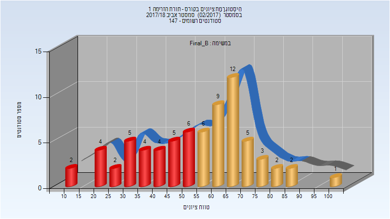

| סטודנטים | עברו/נכשלו | אחוז עוברים | ציון מינימלי | ציון מקסימלי | ממוצע | חציון |
| ---- | ---- | ---- | ---- | ---- | ---- | ---- |
| 72 | 40/32 | 56 | 10 | 100 | 54.333 | 57.5 |

### סופי

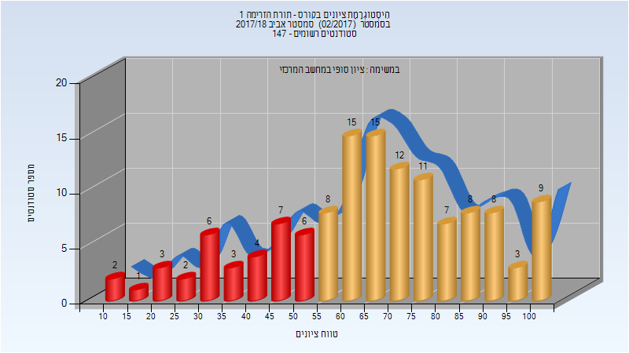

| סטודנטים | עברו/נכשלו | אחוז עוברים | ציון מינימלי | ציון מקסימלי | ממוצע | חציון |
| ---- | ---- | ---- | ---- | ---- | ---- | ---- |
| 130 | 96/34 | 74 | 10 | 100 | 65.823 | 66 |

## חורף 2018-2019

| איש סגל | תפקיד |
| ---- | ---- |
| גת אמיר | מרצה - אחראי מקצוע |
| בויקו יבגני | מתרגל - עם הרשאות מרצה אחראי |
| גבאי ישראל | מתרגל - עם הרשאות מרצה אחראי |

### מבחן מועד א'

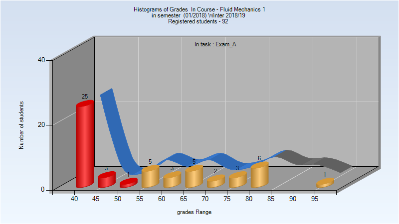

| סטודנטים | עברו/נכשלו | אחוז עוברים | ציון מינימלי | ציון מקסימלי | ממוצע | חציון |
| ---- | ---- | ---- | ---- | ---- | ---- | ---- |
| 54 | 25/29 | 46 | 40 | 98 | 54.944 | 47 |

### סופי מועד א'

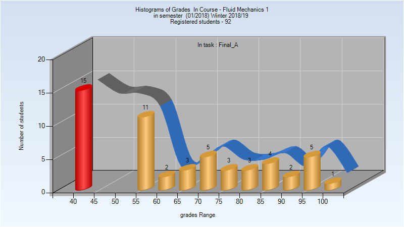

| סטודנטים | עברו/נכשלו | אחוז עוברים | ציון מינימלי | ציון מקסימלי | ממוצע | חציון |
| ---- | ---- | ---- | ---- | ---- | ---- | ---- |
| 54 | 39/15 | 72 | 40 | 100 | 64.667 | 61.5 |

### מבחן מועד ב'

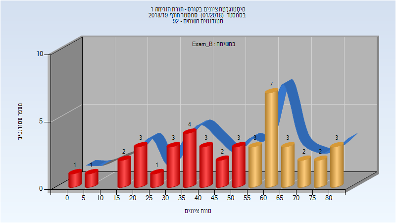

| סטודנטים | עברו/נכשלו | אחוז עוברים | ציון מינימלי | ציון מקסימלי | ממוצע | חציון |
| ---- | ---- | ---- | ---- | ---- | ---- | ---- |
| 43 | 20/23 | 47 | 0 | 83 | 49.116 | 52 |

### סופי מועד ב'

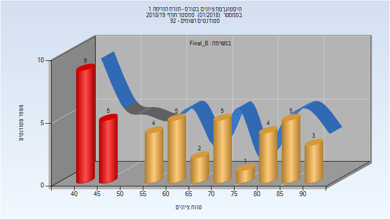

| סטודנטים | עברו/נכשלו | אחוז עוברים | ציון מינימלי | ציון מקסימלי | ממוצע | חציון |
| ---- | ---- | ---- | ---- | ---- | ---- | ---- |
| 43 | 29/14 | 67 | 40 | 93 | 63.628 | 63 |

### סופי

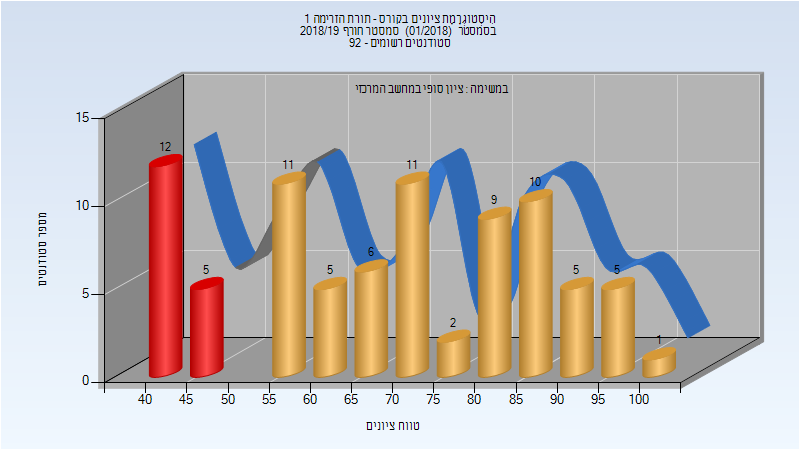

| סטודנטים | עברו/נכשלו | אחוז עוברים | ציון מינימלי | ציון מקסימלי | ממוצע | חציון |
| ---- | ---- | ---- | ---- | ---- | ---- | ---- |
| 82 | 66/16 | 80 | 40 | 100 | 68.854 | 70 |

## אביב 2019

| איש סגל | תפקיד |
| ---- | ---- |
| גרינבלט דוד | מרצה - אחראי מקצוע |
| בויקו יבגני | מתרגל - עם הרשאות מרצה אחראי |
| נוף אלירם | מתרגל - עם הרשאות מרצה אחראי |
| גבאי ישראל | מתרגל - עם הרשאות מרצה אחראי |

### מבחן מועד א'

| סטודנטים | עברו/נכשלו | אחוז עוברים | ציון מינימלי | ציון מקסימלי | ממוצע | חציון |
| ---- | ---- | ---- | ---- | ---- | ---- | ---- |
| 116 | 82/34 | 71 | 12 | 97 | 64.224 | 65.5 |

### סופי מועד א'

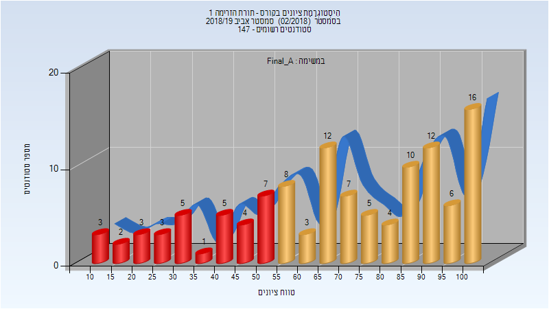

| סטודנטים | עברו/נכשלו | אחוז עוברים | ציון מינימלי | ציון מקסימלי | ממוצע | חציון |
| ---- | ---- | ---- | ---- | ---- | ---- | ---- |
| 116 | 83/33 | 72 | 12 | 100 | 68.931 | 71 |

### מבחן מועד ב'

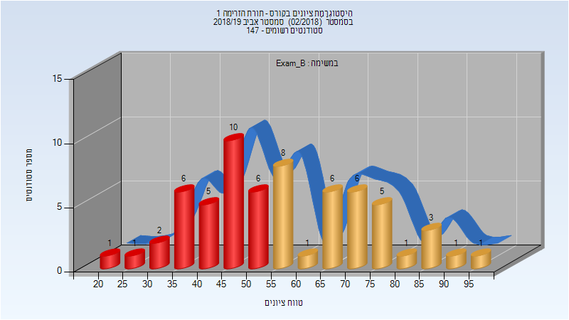

| סטודנטים | עברו/נכשלו | אחוז עוברים | ציון מינימלי | ציון מקסימלי | ממוצע | חציון |
| ---- | ---- | ---- | ---- | ---- | ---- | ---- |
| 63 | 32/31 | 51 | 24 | 96 | 57.27 | 53 |

### סופי מועד ב'

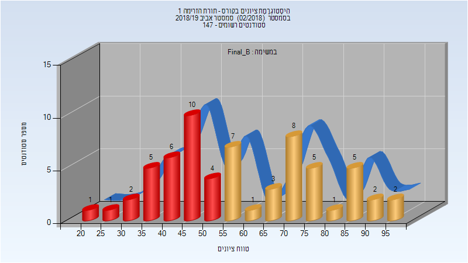

| סטודנטים | עברו/נכשלו | אחוז עוברים | ציון מינימלי | ציון מקסימלי | ממוצע | חציון |
| ---- | ---- | ---- | ---- | ---- | ---- | ---- |
| 63 | 34/29 | 54 | 24 | 98 | 59.698 | 55 |

### סופי

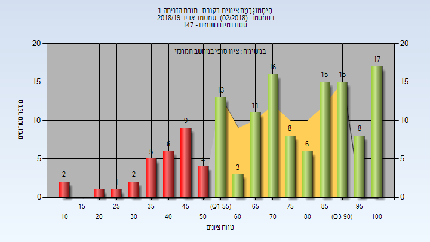

| סטודנטים | עברו/נכשלו | אחוז עוברים | ציון מינימלי | ציון מקסימלי | ממוצע | חציון |
| ---- | ---- | ---- | ---- | ---- | ---- | ---- |
| 142 | 112/30 | 79 | 12 | 100 | 72.606 | 74 |

## חורף 2019-2020

| איש סגל | תפקיד |
| ---- | ---- |
| אלפיסי דניאל | מרצה - אחראי מקצוע |
| פרנקל סטיבן | מרצה |

### מבחן מועד א'

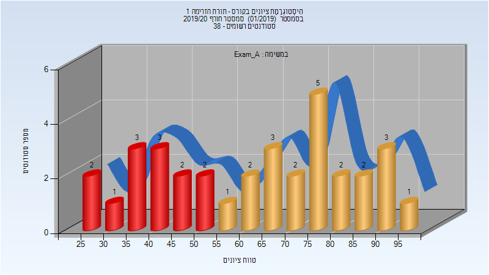

| סטודנטים | עברו/נכשלו | אחוז עוברים | ציון מינימלי | ציון מקסימלי | ממוצע | חציון |
| ---- | ---- | ---- | ---- | ---- | ---- | ---- |
| 34 | 21/13 | 62 | 28 | 97 | 63.529 | 66.5 |

### סופי מועד א'

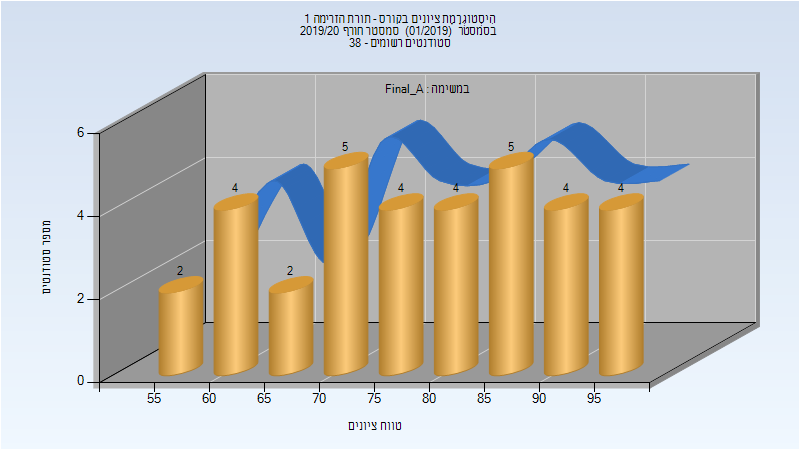

| סטודנטים | עברו/נכשלו | אחוז עוברים | ציון מינימלי | ציון מקסימלי | ממוצע | חציון |
| ---- | ---- | ---- | ---- | ---- | ---- | ---- |
| 34 | 34/0 | 100 | 57 | 97 | 78.735 | 79.5 |

### סופי

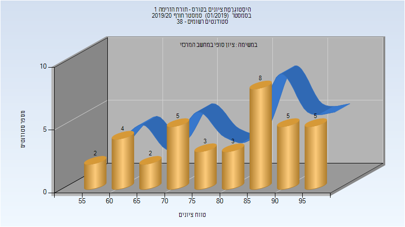

| סטודנטים | עברו/נכשלו | אחוז עוברים | ציון מינימלי | ציון מקסימלי | ממוצע | חציון |
| ---- | ---- | ---- | ---- | ---- | ---- | ---- |
| 37 | 37/0 | 100 | 57 | 97 | 80.27 | 82 |

## אביב 2020

| איש סגל | תפקיד |
| ---- | ---- |
| ברקוביץ מורן | מרצה - אחראי מקצוע |
| בויקו יבגני | מתרגל - עם הרשאות מרצה אחראי |
| אלגריסי מור | מתרגל - עם הרשאות מרצה אחראי |
| גבאי ישראל | מתרגל - עם הרשאות מרצה אחראי |
| אשל רן | מתרגל - עם הרשאות מרצה אחראי |

### סופי מועד א'

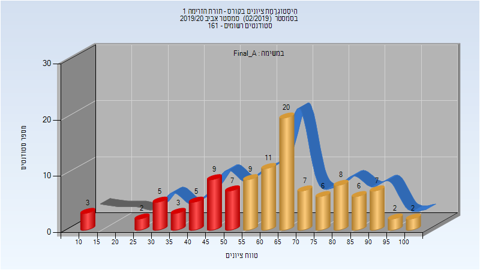

| סטודנטים | עברו/נכשלו | אחוז עוברים | ציון מינימלי | ציון מקסימלי | ממוצע | חציון |
| ---- | ---- | ---- | ---- | ---- | ---- | ---- |
| 112 | 78/34 | 70 | 12 | 100 | 63.438 | 65 |

### סופי מועד ב'

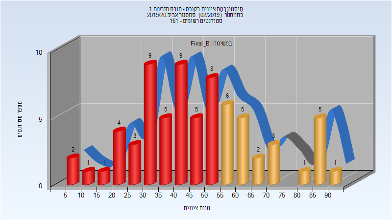

| סטודנטים | עברו/נכשלו | אחוז עוברים | ציון מינימלי | ציון מקסימלי | ממוצע | חציון |
| ---- | ---- | ---- | ---- | ---- | ---- | ---- |
| 71 | 24/47 | 34 | 7 | 90 | 47.197 | 44 |

### סופי

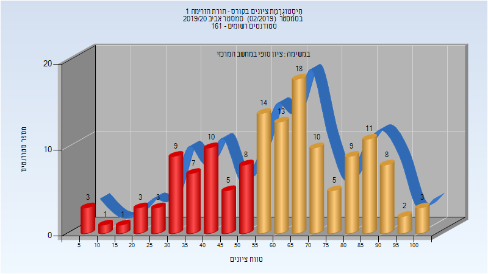

| סטודנטים | עברו/נכשלו | אחוז עוברים | ציון מינימלי | ציון מקסימלי | ממוצע | חציון |
| ---- | ---- | ---- | ---- | ---- | ---- | ---- |
| 144 | 97/47 | 67 | 7 | 100 | 61.243 | 63 |

## חורף 2020-2021

| איש סגל | תפקיד |
| ---- | ---- |
| גת אמיר | מרצה - אחראי מקצוע |
| אלגריסי מור | מרצה |
| פרץ אופק | מרצה |

### סופי מועד א'

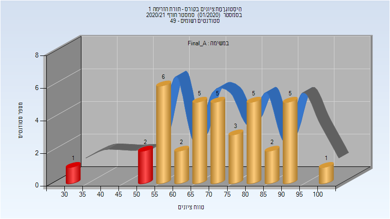

| סטודנטים | עברו/נכשלו | אחוז עוברים | ציון מינימלי | ציון מקסימלי | ממוצע | חציון |
| ---- | ---- | ---- | ---- | ---- | ---- | ---- |
| 37 | 34/3 | 92 | 34 | 100 | 71.676 | 70 |

### סופי

| סטודנטים | עברו/נכשלו | אחוז עוברים | ציון מינימלי | ציון מקסימלי | ממוצע | חציון |
| ---- | ---- | ---- | ---- | ---- | ---- | ---- |
| 42 | 38/4 | 90 | 41 | 100 | 70.095 | 69.5 |

