# 034015 - תכן מכני 1

## אביב 2013

| איש סגל | תפקיד |
| ---- | ---- |
| גרופר מורל | מרצה - אחראי מקצוע |
| מיטנוביצקי מיכאל | מתרגל |
| וייס עמרי | מתרגל |

### סופי מועד א'

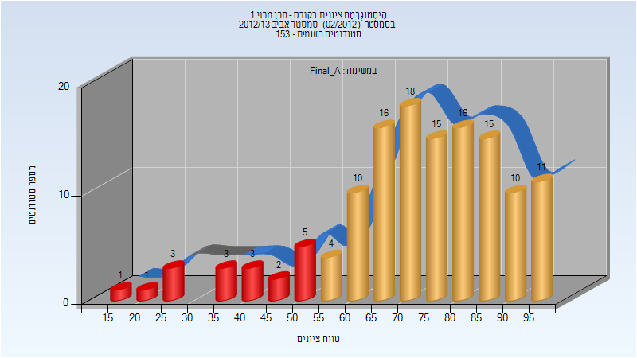

| סטודנטים | עברו/נכשלו | אחוז עוברים | ציון מינימלי | ציון מקסימלי | ממוצע | חציון |
| ---- | ---- | ---- | ---- | ---- | ---- | ---- |
| 133 | 115/18 | 86 | 17 | 98 | 72.744 | 75 |

### סופי מועד ב'

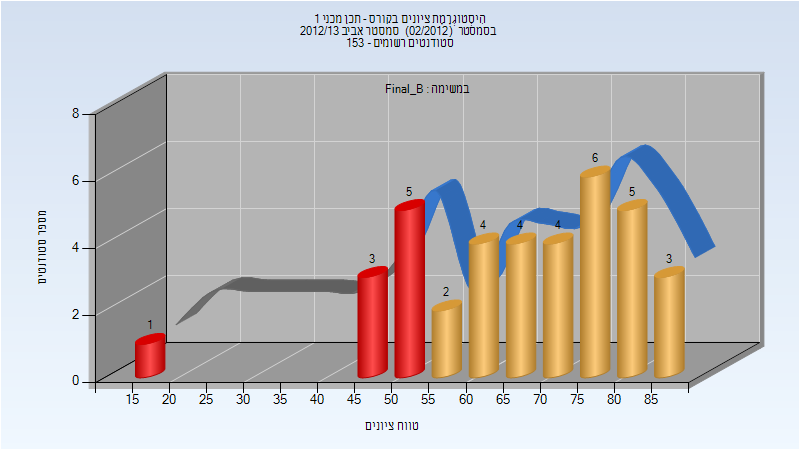

| סטודנטים | עברו/נכשלו | אחוז עוברים | ציון מינימלי | ציון מקסימלי | ממוצע | חציון |
| ---- | ---- | ---- | ---- | ---- | ---- | ---- |
| 37 | 28/9 | 76 | 19 | 88 | 67.081 | 69 |

## אביב 2015

| איש סגל | תפקיד |
| ---- | ---- |
| גרופר מורל | מרצה - אחראי מקצוע |

### סופי

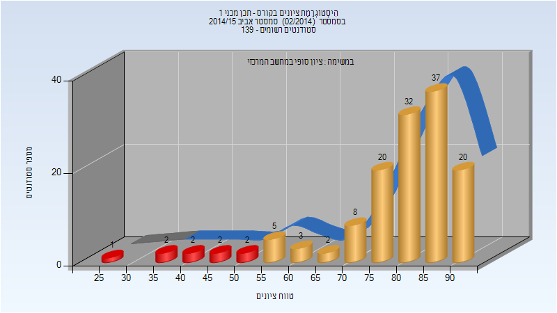

| סטודנטים | עברו/נכשלו | אחוז עוברים | ציון מינימלי | ציון מקסימלי | ממוצע | חציון |
| ---- | ---- | ---- | ---- | ---- | ---- | ---- |
| 136 | 127/9 | 93 | 29 | 94 | 79.044 | 82 |

## אביב 2016

| איש סגל | תפקיד |
| ---- | ---- |
| גרופר מורל | מרצה - אחראי מקצוע |
| זריהן נועם | מתרגל - עם הרשאות מרצה אחראי |

### סופי מועד א'

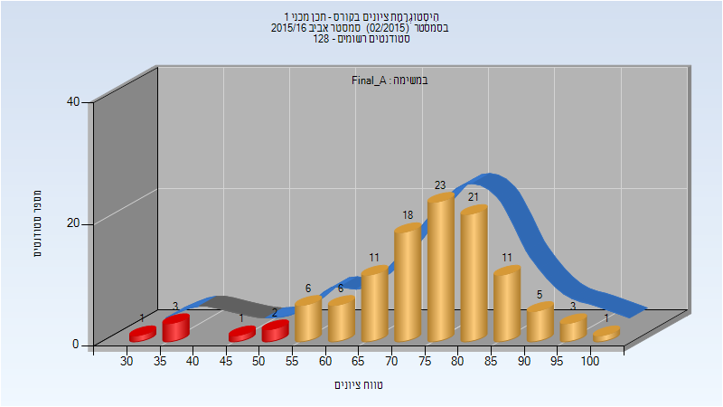

| סטודנטים | עברו/נכשלו | אחוז עוברים | ציון מינימלי | ציון מקסימלי | ממוצע | חציון |
| ---- | ---- | ---- | ---- | ---- | ---- | ---- |
| 112 | 105/7 | 94 | 32 | 100 | 74.366 | 76 |

### סופי מועד ב'

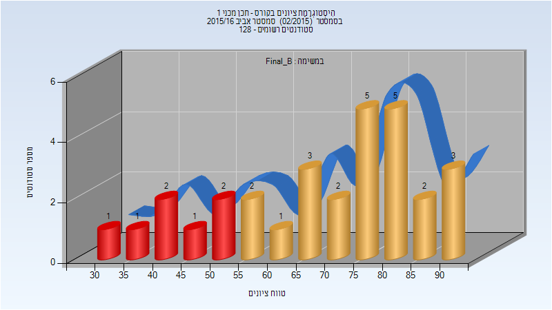

| סטודנטים | עברו/נכשלו | אחוז עוברים | ציון מינימלי | ציון מקסימלי | ממוצע | חציון |
| ---- | ---- | ---- | ---- | ---- | ---- | ---- |
| 30 | 23/7 | 77 | 33 | 91 | 69.033 | 75 |

### סופי

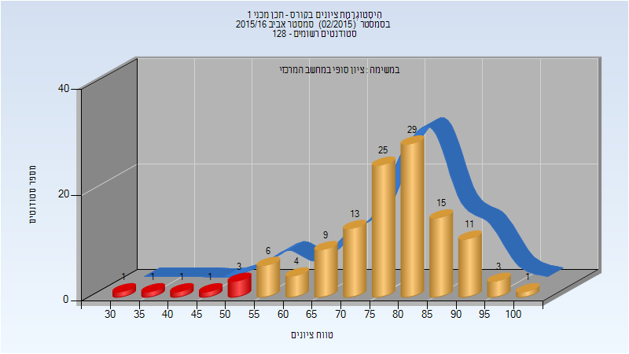

| סטודנטים | עברו/נכשלו | אחוז עוברים | ציון מינימלי | ציון מקסימלי | ממוצע | חציון |
| ---- | ---- | ---- | ---- | ---- | ---- | ---- |
| 123 | 116/7 | 94 | 33 | 100 | 76.78 | 78 |

## חורף 2016-2017

### סופי מועד א'

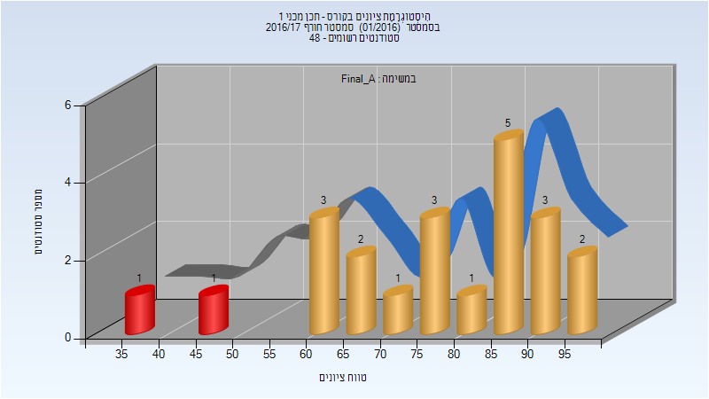

| סטודנטים | עברו/נכשלו | אחוז עוברים | ציון מינימלי | ציון מקסימלי | ממוצע | חציון |
| ---- | ---- | ---- | ---- | ---- | ---- | ---- |
| 22 | 20/2 | 91 | 35 | 98 | 77.136 | 80.5 |

### סופי מועד ב'

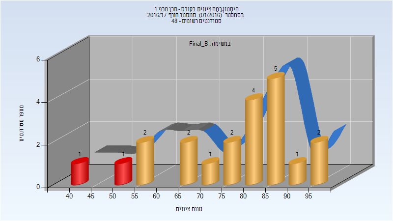

| סטודנטים | עברו/נכשלו | אחוז עוברים | ציון מינימלי | ציון מקסימלי | ממוצע | חציון |
| ---- | ---- | ---- | ---- | ---- | ---- | ---- |
| 21 | 19/2 | 90 | 44 | 98 | 76.429 | 80 |

### סופי

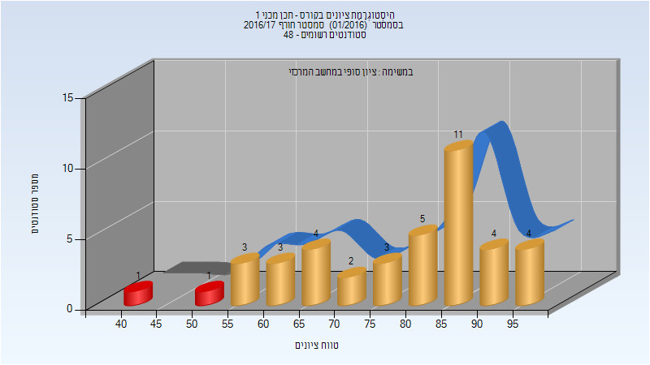

| סטודנטים | עברו/נכשלו | אחוז עוברים | ציון מינימלי | ציון מקסימלי | ממוצע | חציון |
| ---- | ---- | ---- | ---- | ---- | ---- | ---- |
| 41 | 39/2 | 95 | 44 | 98 | 78.317 | 82 |

## אביב 2017

| איש סגל | תפקיד |
| ---- | ---- |
| גוב פבל | מרצה - אחראי מקצוע |
| ניר רונן | מתרגל - עם הרשאות מרצה אחראי |
| בן-חיים גיא | מתרגל - עם הרשאות מרצה אחראי |
| זריהן נועם | מתרגל - עם הרשאות מרצה אחראי |

### סופי מועד א'

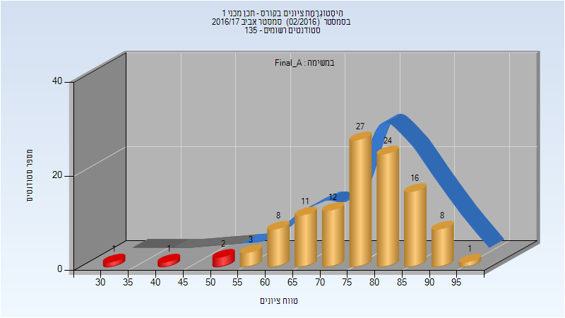

| סטודנטים | עברו/נכשלו | אחוז עוברים | ציון מינימלי | ציון מקסימלי | ממוצע | חציון |
| ---- | ---- | ---- | ---- | ---- | ---- | ---- |
| 114 | 110/4 | 96 | 33 | 96 | 76.465 | 78 |

### סופי מועד ב'

| סטודנטים | עברו/נכשלו | אחוז עוברים | ציון מינימלי | ציון מקסימלי | ממוצע | חציון |
| ---- | ---- | ---- | ---- | ---- | ---- | ---- |
| 25 | 21/4 | 84 | 41 | 96 | 74.16 | 80 |

### סופי

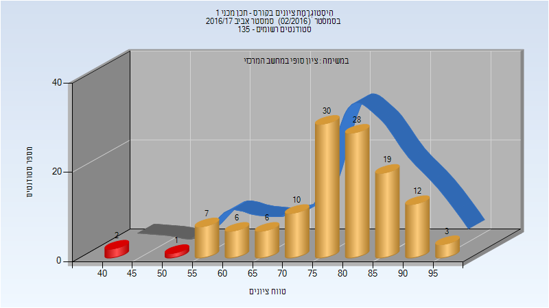

| סטודנטים | עברו/נכשלו | אחוז עוברים | ציון מינימלי | ציון מקסימלי | ממוצע | חציון |
| ---- | ---- | ---- | ---- | ---- | ---- | ---- |
| 124 | 121/3 | 98 | 41 | 96 | 78.048 | 79.5 |

## חורף 2017-2018

| איש סגל | תפקיד |
| ---- | ---- |
| ברנד מאיר | מרצה - אחראי מקצוע |
| זריהן נועם | מתרגל - עם הרשאות מרצה אחראי |
| ניר רונן | מתרגל - עם הרשאות מרצה אחראי |

### סופי מועד א'

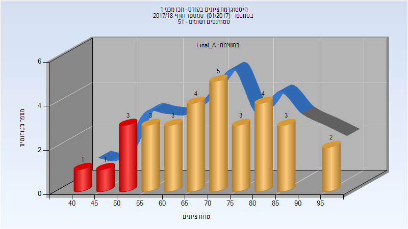

| סטודנטים | עברו/נכשלו | אחוז עוברים | ציון מינימלי | ציון מקסימלי | ממוצע | חציון |
| ---- | ---- | ---- | ---- | ---- | ---- | ---- |
| 32 | 27/5 | 84 | 43 | 98 | 69.938 | 70.5 |

### סופי מועד ב'

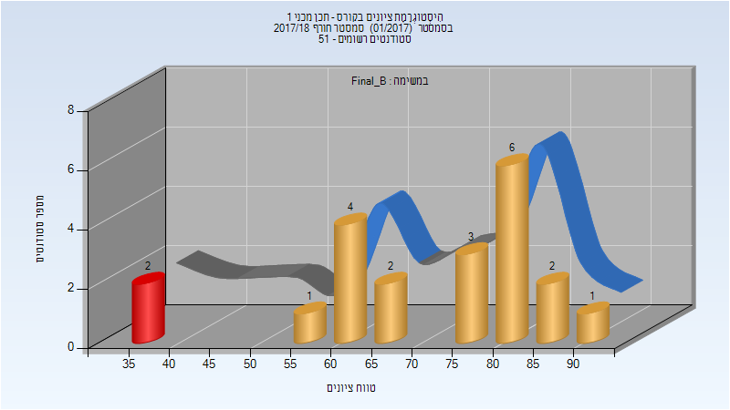

| סטודנטים | עברו/נכשלו | אחוז עוברים | ציון מינימלי | ציון מקסימלי | ממוצע | חציון |
| ---- | ---- | ---- | ---- | ---- | ---- | ---- |
| 21 | 19/2 | 90 | 35 | 92 | 71.333 | 77 |

### סופי

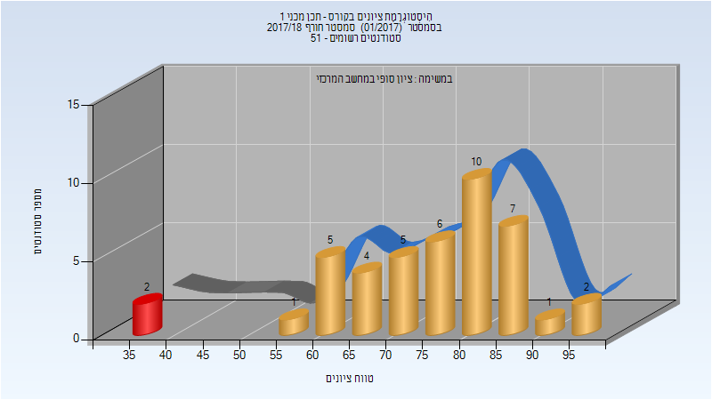

| סטודנטים | עברו/נכשלו | אחוז עוברים | ציון מינימלי | ציון מקסימלי | ממוצע | חציון |
| ---- | ---- | ---- | ---- | ---- | ---- | ---- |
| 43 | 41/2 | 95 | 35 | 98 | 75.14 | 77 |

## אביב 2018

| איש סגל | תפקיד |
| ---- | ---- |
| ברנד מאיר | מרצה - אחראי מקצוע |
| רופמן ברוך | מתרגל - עם הרשאות מרצה אחראי |
| זריהן נועם | מתרגל - עם הרשאות מרצה אחראי |
| ניר רונן | מתרגל - עם הרשאות מרצה אחראי |
| זידאן אחמד | מתרגל - עם הרשאות מרצה אחראי |

### סופי מועד א'

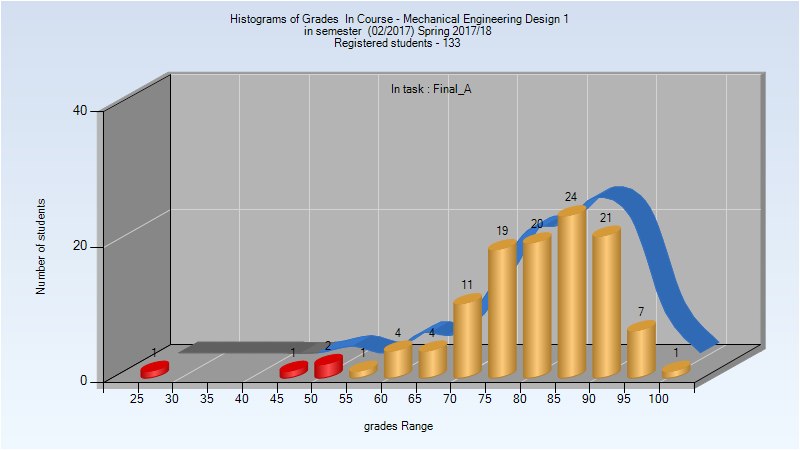

| סטודנטים | עברו/נכשלו | אחוז עוברים | ציון מינימלי | ציון מקסימלי | ממוצע | חציון |
| ---- | ---- | ---- | ---- | ---- | ---- | ---- |
| 116 | 112/4 | 97 | 26 | 100 | 81.328 | 83 |

### סופי מועד ב'

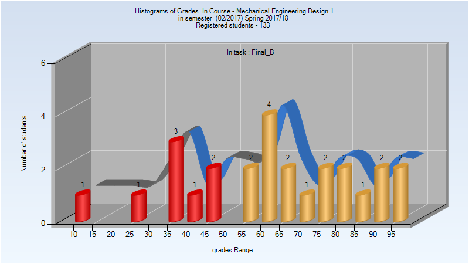

| סטודנטים | עברו/נכשלו | אחוז עוברים | ציון מינימלי | ציון מקסימלי | ממוצע | חציון |
| ---- | ---- | ---- | ---- | ---- | ---- | ---- |
| 26 | 18/8 | 69 | 10 | 97 | 62.769 | 62 |

### סופי

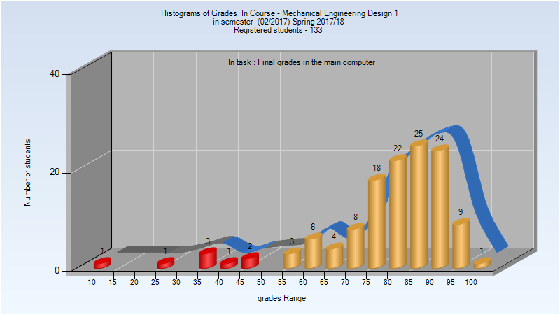

| סטודנטים | עברו/נכשלו | אחוז עוברים | ציון מינימלי | ציון מקסימלי | ממוצע | חציון |
| ---- | ---- | ---- | ---- | ---- | ---- | ---- |
| 128 | 120/8 | 94 | 10 | 100 | 79.773 | 83 |

## חורף 2018-2019

| איש סגל | תפקיד |
| ---- | ---- |
| ברנד מאיר | מרצה - אחראי מקצוע |
| ניר רונן | מתרגל - עם הרשאות מרצה אחראי |
| רופמן ברוך | מתרגל - עם הרשאות מרצה אחראי |

### סופי מועד א'

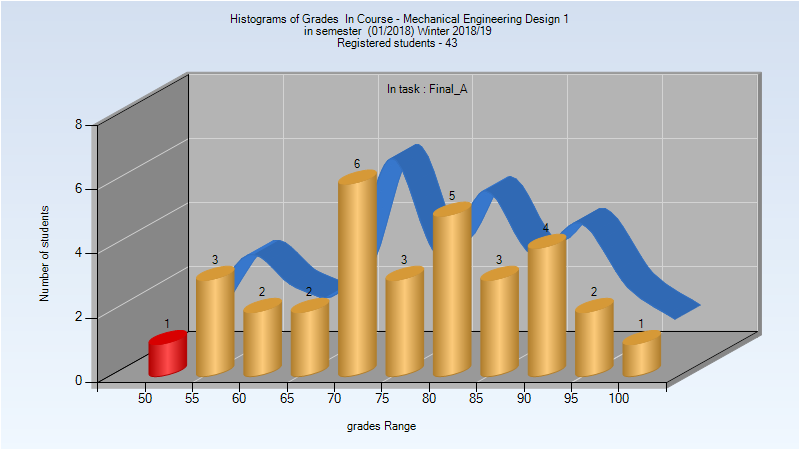

| סטודנטים | עברו/נכשלו | אחוז עוברים | ציון מינימלי | ציון מקסימלי | ממוצע | חציון |
| ---- | ---- | ---- | ---- | ---- | ---- | ---- |
| 32 | 31/1 | 97 | 50 | 100 | 77.219 | 79 |

### סופי מועד ב'

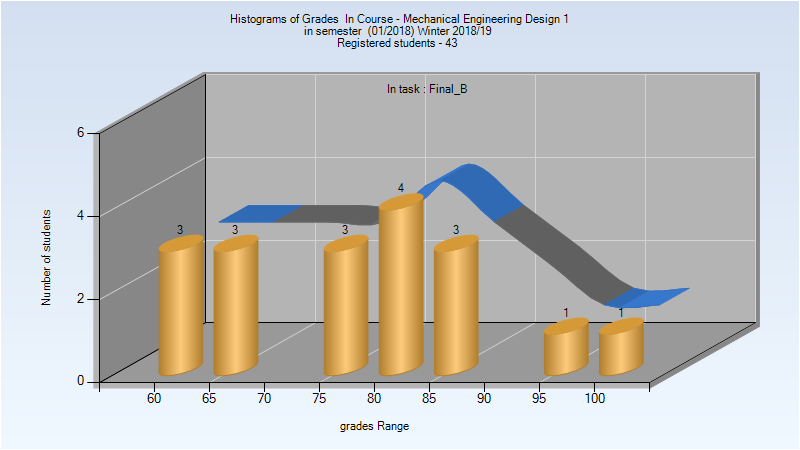

| סטודנטים | עברו/נכשלו | אחוז עוברים | ציון מינימלי | ציון מקסימלי | ממוצע | חציון |
| ---- | ---- | ---- | ---- | ---- | ---- | ---- |
| 18 | 18/0 | 100 | 60 | 100 | 77.667 | 79.5 |

### סופי

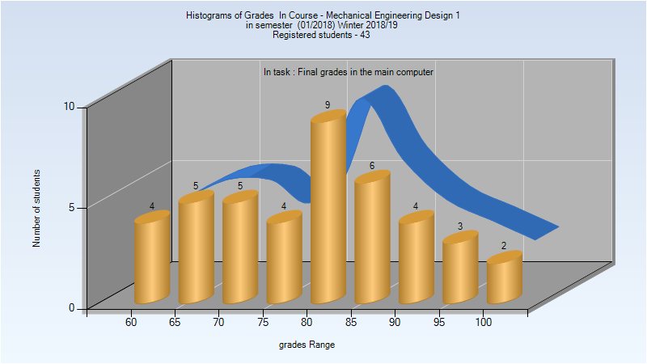

| סטודנטים | עברו/נכשלו | אחוז עוברים | ציון מינימלי | ציון מקסימלי | ממוצע | חציון |
| ---- | ---- | ---- | ---- | ---- | ---- | ---- |
| 42 | 42/0 | 100 | 60 | 100 | 79.929 | 80 |

## אביב 2019

| איש סגל | תפקיד |
| ---- | ---- |
| ברנד מאיר | מרצה - אחראי מקצוע |
| ניר רונן | מתרגל - עם הרשאות מרצה אחראי |
| שירוקי יצחק | מתרגל - עם הרשאות מרצה אחראי |
| רופמן ברוך | מתרגל - עם הרשאות מרצה אחראי |

### מבחן מועד א'

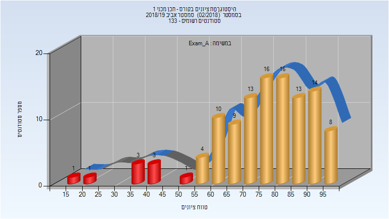

| סטודנטים | עברו/נכשלו | אחוז עוברים | ציון מינימלי | ציון מקסימלי | ממוצע | חציון |
| ---- | ---- | ---- | ---- | ---- | ---- | ---- |
| 112 | 103/9 | 92 | 17 | 99 | 75.33 | 78 |

### סופי מועד א'

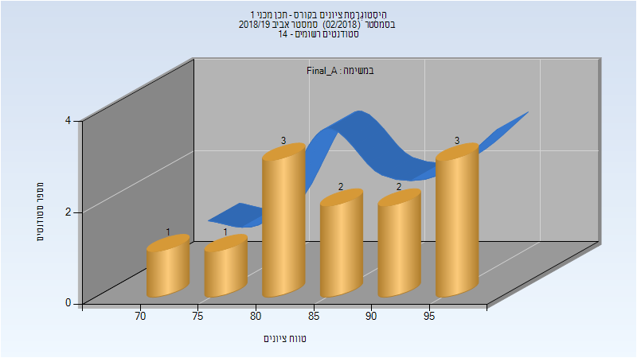

| סטודנטים | עברו/נכשלו | אחוז עוברים | ציון מינימלי | ציון מקסימלי | ממוצע | חציון |
| ---- | ---- | ---- | ---- | ---- | ---- | ---- |
| 112 | 103/9 | 92 | 20 | 99 | 78.259 | 81 |

### מבחן מועד ב'

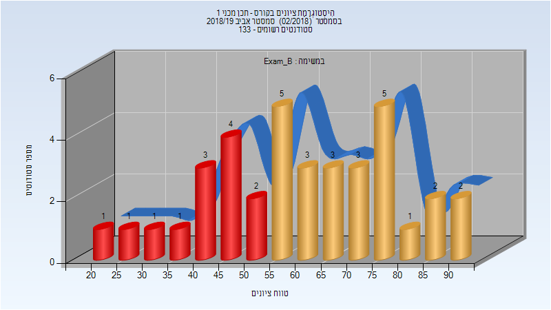

| סטודנטים | עברו/נכשלו | אחוז עוברים | ציון מינימלי | ציון מקסימלי | ממוצע | חציון |
| ---- | ---- | ---- | ---- | ---- | ---- | ---- |
| 37 | 24/13 | 65 | 23 | 90 | 60.865 | 63 |

### סופי מועד ב'

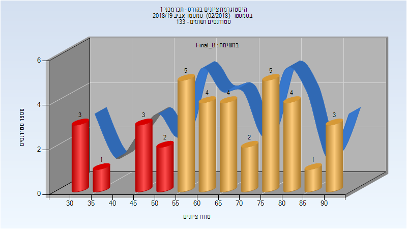

| סטודנטים | עברו/נכשלו | אחוז עוברים | ציון מינימלי | ציון מקסימלי | ממוצע | חציון |
| ---- | ---- | ---- | ---- | ---- | ---- | ---- |
| 37 | 28/9 | 76 | 32 | 91 | 64.514 | 66 |

### סופי

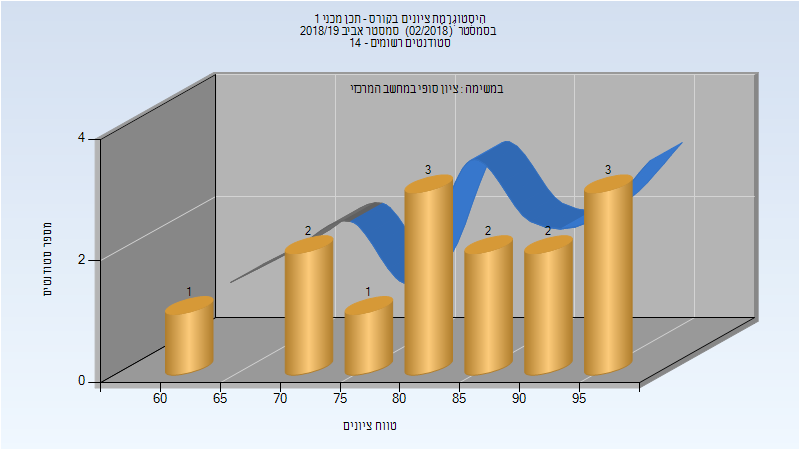

| סטודנטים | עברו/נכשלו | אחוז עוברים | ציון מינימלי | ציון מקסימלי | ממוצע | חציון |
| ---- | ---- | ---- | ---- | ---- | ---- | ---- |
| 129 | 120/9 | 93 | 32 | 99 | 78.14 | 81 |

## אביב 2020

| איש סגל | תפקיד |
| ---- | ---- |
| ברנד מאיר | מרצה - אחראי מקצוע |
| פוקשנסקי מיכאל | מתרגל - עם הרשאות מרצה אחראי |
| שירוקי יצחק | מתרגל - עם הרשאות מרצה אחראי |
| רופמן ברוך | מתרגל - עם הרשאות מרצה אחראי |

### סופי מועד א'

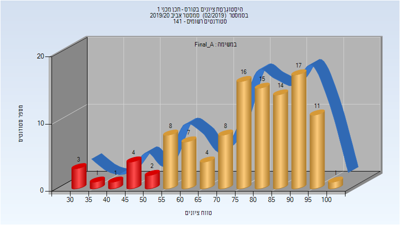

| סטודנטים | עברו/נכשלו | אחוז עוברים | ציון מינימלי | ציון מקסימלי | ממוצע | חציון |
| ---- | ---- | ---- | ---- | ---- | ---- | ---- |
| 112 | 101/11 | 90 | 30 | 100 | 76.812 | 81 |

### סופי מועד ב'

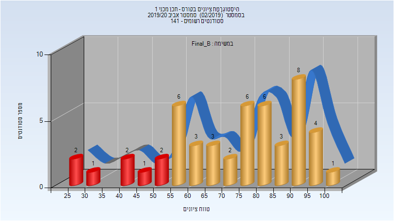

| סטודנטים | עברו/נכשלו | אחוז עוברים | ציון מינימלי | ציון מקסימלי | ממוצע | חציון |
| ---- | ---- | ---- | ---- | ---- | ---- | ---- |
| 50 | 42/8 | 84 | 26 | 100 | 72.46 | 77 |

### סופי

| סטודנטים | עברו/נכשלו | אחוז עוברים | ציון מינימלי | ציון מקסימלי | ממוצע | חציון |
| ---- | ---- | ---- | ---- | ---- | ---- | ---- |
| 133 | 125/8 | 94 | 26 | 100 | 79.647 | 83 |

## חורף 2020-2021

| איש סגל | תפקיד |
| ---- | ---- |
| אשבל ליאור | מרצה - אחראי מקצוע |

## אביב 2021

| איש סגל | תפקיד |
| ---- | ---- |
| ברנד מאיר | מרצה - אחראי מקצוע |
| רופמן ברוך | מתרגל - עם הרשאות מרצה אחראי |
| ורפמן בת חן | מתרגל - עם הרשאות מרצה אחראי |
| גרון ימית | מתרגל - עם הרשאות מרצה אחראי |

