# 034028 - מכניקת מוצקים 1

## אביב 2012

| איש סגל | תפקיד |
| ---- | ---- |
| גבלי יוסף | מרצה - אחראי מקצוע |

### מבחן מועד א'

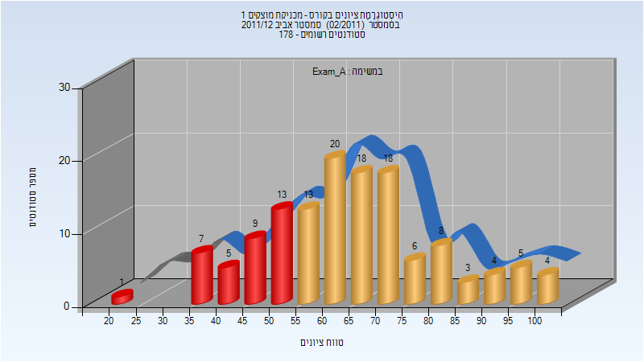

| סטודנטים | עברו/נכשלו | אחוז עוברים | ציון מינימלי | ציון מקסימלי | ממוצע | חציון |
| ---- | ---- | ---- | ---- | ---- | ---- | ---- |
| 134 | 99/35 | 74 | 23 | 100 | 64.716 | 63 |

### סופי מועד א'

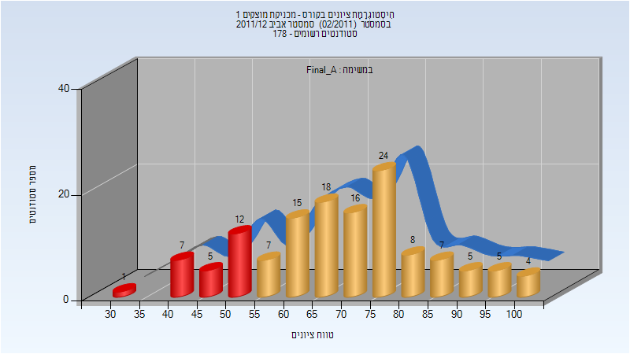

| סטודנטים | עברו/נכשלו | אחוז עוברים | ציון מינימלי | ציון מקסימלי | ממוצע | חציון |
| ---- | ---- | ---- | ---- | ---- | ---- | ---- |
| 134 | 109/25 | 81 | 30 | 100 | 69.776 | 70.5 |

## אביב 2014

| איש סגל | תפקיד |
| ---- | ---- |
| מרדכי דן | מרצה - אחראי מקצוע |
| פישר אריאל | מתרגל |

### סופי מועד א'

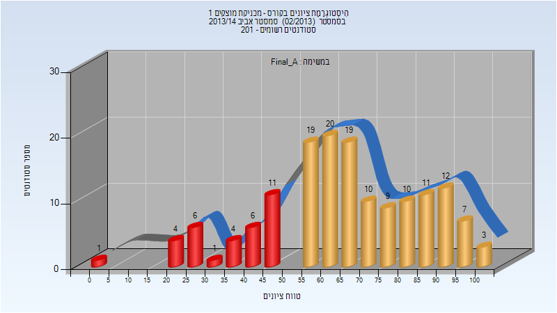

| סטודנטים | עברו/נכשלו | אחוז עוברים | ציון מינימלי | ציון מקסימלי | ממוצע | חציון |
| ---- | ---- | ---- | ---- | ---- | ---- | ---- |
| 153 | 120/33 | 78 | 3 | 100 | 65.745 | 65 |

### סופי מועד ב'

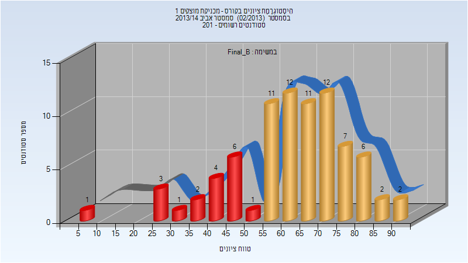

| סטודנטים | עברו/נכשלו | אחוז עוברים | ציון מינימלי | ציון מקסימלי | ממוצע | חציון |
| ---- | ---- | ---- | ---- | ---- | ---- | ---- |
| 81 | 63/18 | 78 | 5 | 92 | 62.296 | 64 |

## חורף 2014-2015

| איש סגל | תפקיד |
| ---- | ---- |
| גבלי יוסף | מרצה - אחראי מקצוע |

### סופי

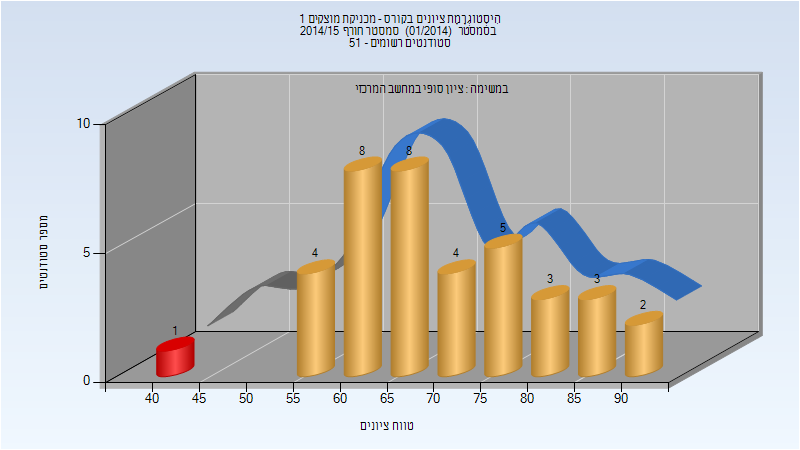

| סטודנטים | עברו/נכשלו | אחוז עוברים | ציון מינימלי | ציון מקסימלי | ממוצע | חציון |
| ---- | ---- | ---- | ---- | ---- | ---- | ---- |
| 38 | 37/1 | 97 | 41 | 94 | 70.132 | 68.5 |

## אביב 2015

| איש סגל | תפקיד |
| ---- | ---- |
| גבלי יוסף | מרצה - אחראי מקצוע |

### סופי מועד א'

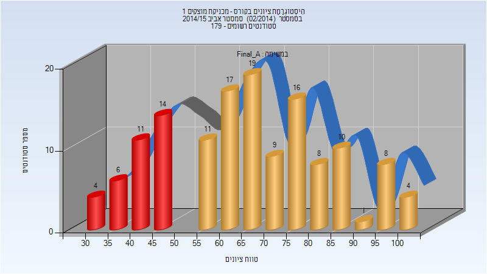

| סטודנטים | עברו/נכשלו | אחוז עוברים | ציון מינימלי | ציון מקסימלי | ממוצע | חציון |
| ---- | ---- | ---- | ---- | ---- | ---- | ---- |
| 138 | 103/35 | 75 | 31 | 100 | 65.884 | 67 |

### סופי מועד ב'

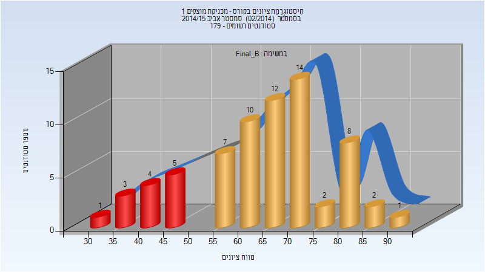

| סטודנטים | עברו/נכשלו | אחוז עוברים | ציון מינימלי | ציון מקסימלי | ממוצע | חציון |
| ---- | ---- | ---- | ---- | ---- | ---- | ---- |
| 69 | 56/13 | 81 | 33 | 91 | 64.493 | 65 |

### סופי

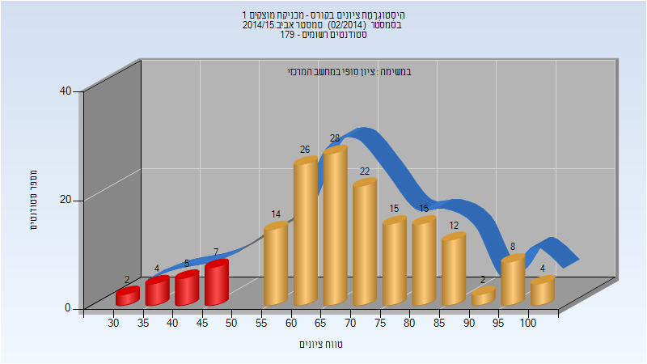

| סטודנטים | עברו/נכשלו | אחוז עוברים | ציון מינימלי | ציון מקסימלי | ממוצע | חציון |
| ---- | ---- | ---- | ---- | ---- | ---- | ---- |
| 164 | 146/18 | 89 | 33 | 100 | 69.5 | 69 |

## אביב 2016

| איש סגל | תפקיד |
| ---- | ---- |
| גבלי יוסף | מרצה - אחראי מקצוע |
| פישר אריאל | מתרגל - עם הרשאות מרצה אחראי |

### מבחן מועד א'

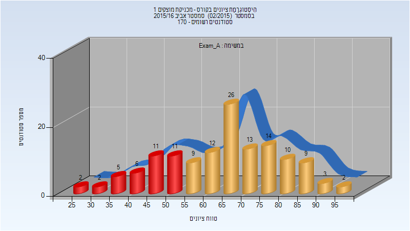

| סטודנטים | עברו/נכשלו | אחוז עוברים | ציון מינימלי | ציון מקסימלי | ממוצע | חציון |
| ---- | ---- | ---- | ---- | ---- | ---- | ---- |
| 135 | 98/37 | 73 | 26 | 98 | 64.563 | 67 |

### סופי מועד א'

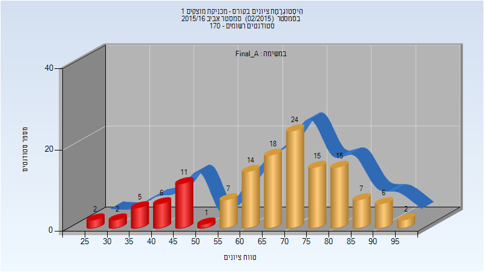

| סטודנטים | עברו/נכשלו | אחוז עוברים | ציון מינימלי | ציון מקסימלי | ממוצע | חציון |
| ---- | ---- | ---- | ---- | ---- | ---- | ---- |
| 135 | 108/27 | 80 | 26 | 99 | 66.993 | 70 |

### מבחן מועד ב'

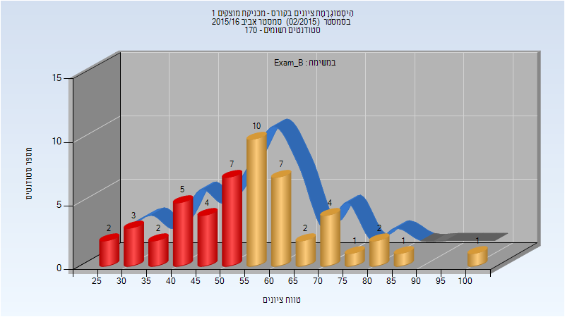

| סטודנטים | עברו/נכשלו | אחוז עוברים | ציון מינימלי | ציון מקסימלי | ממוצע | חציון |
| ---- | ---- | ---- | ---- | ---- | ---- | ---- |
| 51 | 28/23 | 55 | 29 | 100 | 55.706 | 55 |

### סופי מועד ב'

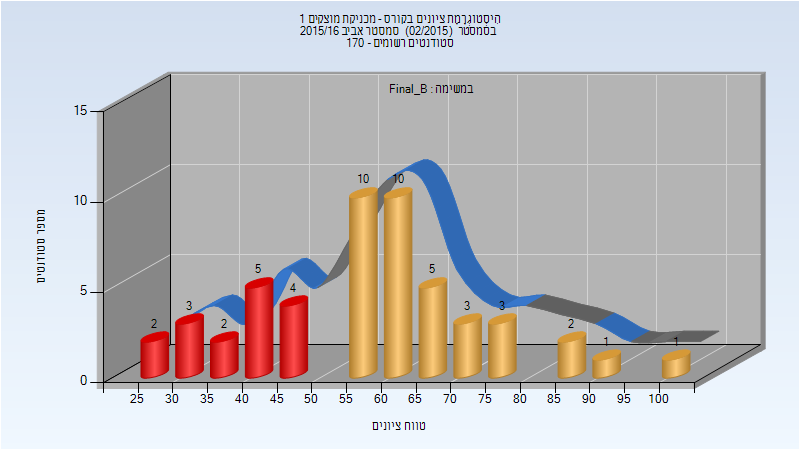

| סטודנטים | עברו/נכשלו | אחוז עוברים | ציון מינימלי | ציון מקסימלי | ממוצע | חציון |
| ---- | ---- | ---- | ---- | ---- | ---- | ---- |
| 51 | 35/16 | 69 | 29 | 100 | 58.373 | 59 |

### סופי

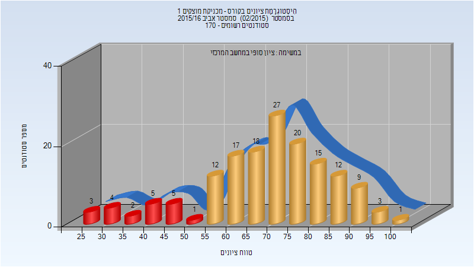

| סטודנטים | עברו/נכשלו | אחוז עוברים | ציון מינימלי | ציון מקסימלי | ממוצע | חציון |
| ---- | ---- | ---- | ---- | ---- | ---- | ---- |
| 154 | 134/20 | 87 | 26 | 100 | 69.396 | 72 |

## חורף 2016-2017

| איש סגל | תפקיד |
| ---- | ---- |
| צליל שלי | מרצה - אחראי מקצוע |
| חן שגיא | מתרגל - עם הרשאות מרצה אחראי |

### מבחן מועד א'

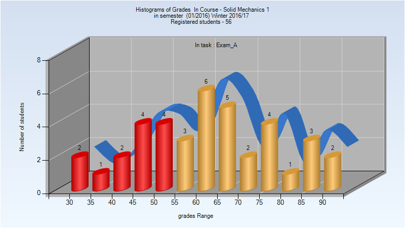

| סטודנטים | עברו/נכשלו | אחוז עוברים | ציון מינימלי | ציון מקסימלי | ממוצע | חציון |
| ---- | ---- | ---- | ---- | ---- | ---- | ---- |
| 39 | 26/13 | 67 | 30 | 91 | 62.487 | 62 |

### סופי מועד א'

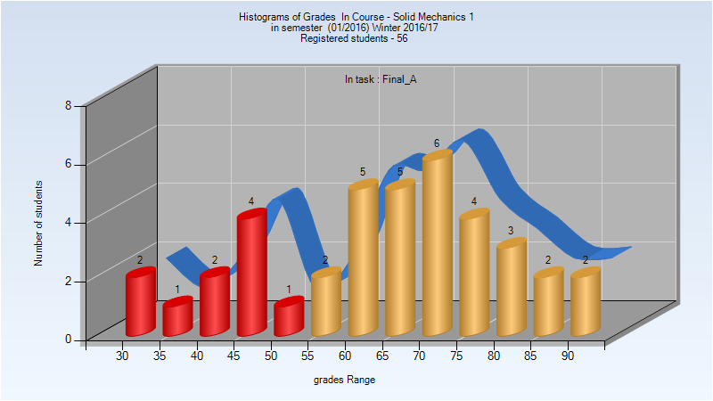

| סטודנטים | עברו/נכשלו | אחוז עוברים | ציון מינימלי | ציון מקסימלי | ממוצע | חציון |
| ---- | ---- | ---- | ---- | ---- | ---- | ---- |
| 39 | 29/10 | 74 | 30 | 91.9 | 65.062 | 65.8 |

### מבחן מועד ב'

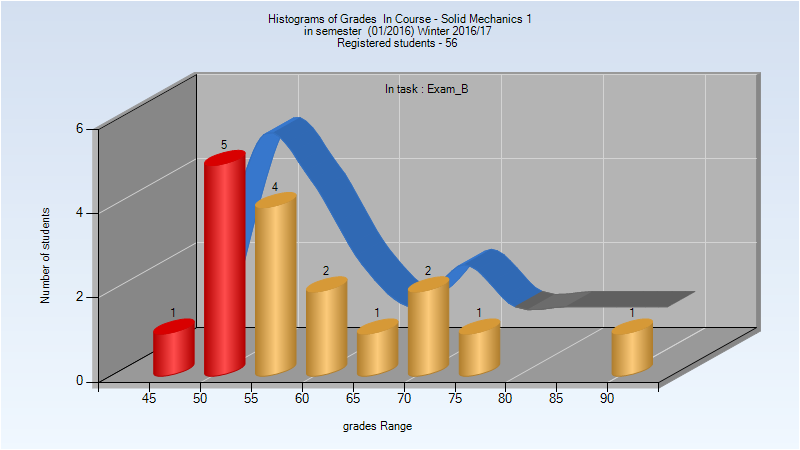

| סטודנטים | עברו/נכשלו | אחוז עוברים | ציון מינימלי | ציון מקסימלי | ממוצע | חציון |
| ---- | ---- | ---- | ---- | ---- | ---- | ---- |
| 17 | 11/6 | 65 | 46 | 90 | 61.235 | 58 |

### סופי מועד ב'

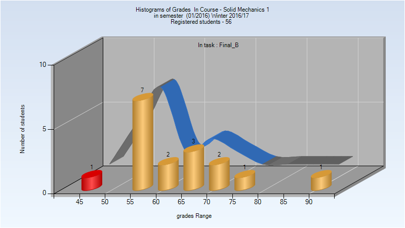

| סטודנטים | עברו/נכשלו | אחוז עוברים | ציון מינימלי | ציון מקסימלי | ממוצע | חציון |
| ---- | ---- | ---- | ---- | ---- | ---- | ---- |
| 17 | 16/1 | 94 | 46 | 91 | 64.524 | 62.2 |

### סופי

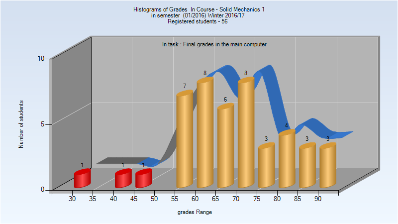

| סטודנטים | עברו/נכשלו | אחוז עוברים | ציון מינימלי | ציון מקסימלי | ממוצע | חציון |
| ---- | ---- | ---- | ---- | ---- | ---- | ---- |
| 45 | 42/3 | 93 | 30 | 92 | 68.289 | 67 |

## אביב 2017

| איש סגל | תפקיד |
| ---- | ---- |
| גבלי יוסף | מרצה - אחראי מקצוע |
| חן שגיא | מתרגל - עם הרשאות מרצה אחראי |
| כץ שמואל | מתרגל - עם הרשאות מרצה אחראי |
| ראוף קורבי | מתרגל - עם הרשאות מרצה אחראי |
| ברונשטיין אמיל | מתרגל - עם הרשאות מרצה אחראי |

### מבחן מועד א'

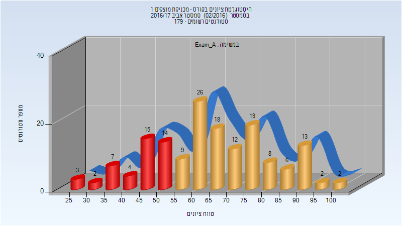

| סטודנטים | עברו/נכשלו | אחוז עוברים | ציון מינימלי | ציון מקסימלי | ממוצע | חציון |
| ---- | ---- | ---- | ---- | ---- | ---- | ---- |
| 160 | 115/45 | 72 | 27 | 100 | 64.994 | 64.5 |

### סופי מועד א'

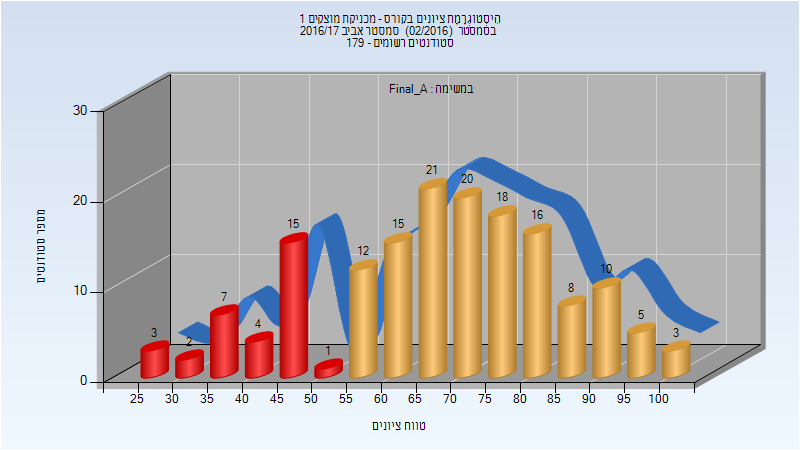

| סטודנטים | עברו/נכשלו | אחוז עוברים | ציון מינימלי | ציון מקסימלי | ממוצע | חציון |
| ---- | ---- | ---- | ---- | ---- | ---- | ---- |
| 160 | 128/32 | 80 | 27 | 100 | 68.012 | 69.5 |

### מבחן מועד ב'

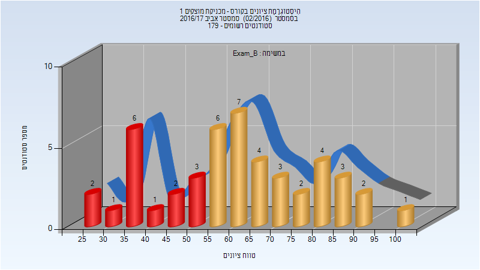

| סטודנטים | עברו/נכשלו | אחוז עוברים | ציון מינימלי | ציון מקסימלי | ממוצע | חציון |
| ---- | ---- | ---- | ---- | ---- | ---- | ---- |
| 47 | 32/15 | 68 | 26 | 100 | 61.043 | 61 |

### סופי מועד ב'

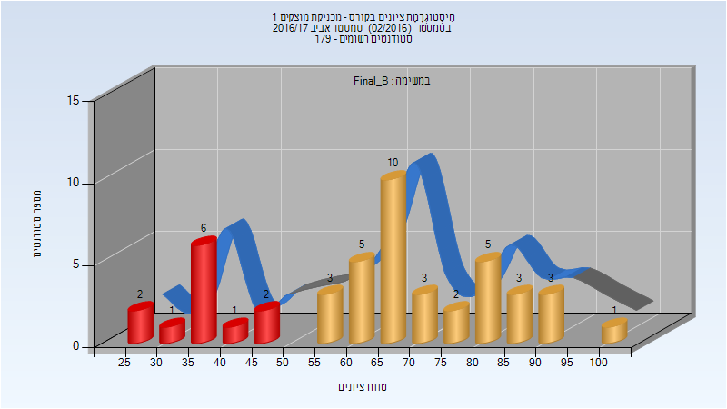

| סטודנטים | עברו/נכשלו | אחוז עוברים | ציון מינימלי | ציון מקסימלי | ממוצע | חציון |
| ---- | ---- | ---- | ---- | ---- | ---- | ---- |
| 47 | 35/12 | 74 | 26 | 100 | 63.638 | 65 |

### סופי

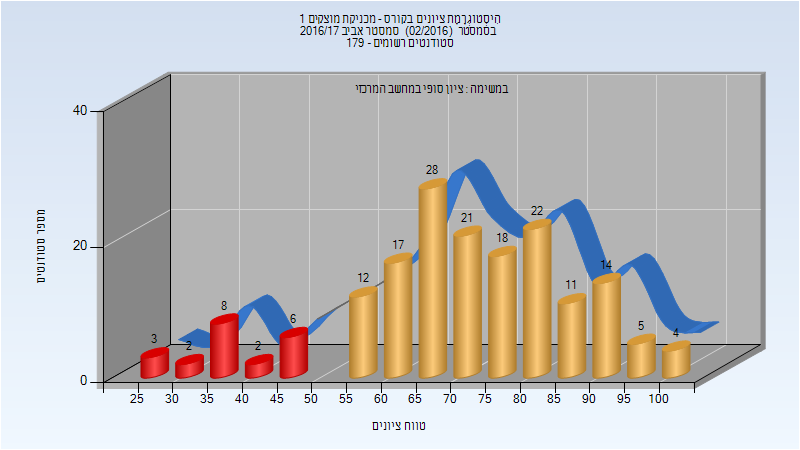

| סטודנטים | עברו/נכשלו | אחוז עוברים | ציון מינימלי | ציון מקסימלי | ממוצע | חציון |
| ---- | ---- | ---- | ---- | ---- | ---- | ---- |
| 173 | 152/21 | 88 | 26 | 100 | 70.734 | 72 |

## חורף 2017-2018

| איש סגל | תפקיד |
| ---- | ---- |
| צליל שלי | מרצה - אחראי מקצוע |
| חן שגיא | מתרגל - עם הרשאות מרצה אחראי |

### מבחן מועד א'

| סטודנטים | עברו/נכשלו | אחוז עוברים | ציון מינימלי | ציון מקסימלי | ממוצע | חציון |
| ---- | ---- | ---- | ---- | ---- | ---- | ---- |
| 30 | 25/5 | 83 | 43 | 83 | 61.767 | 60 |

### סופי מועד א'

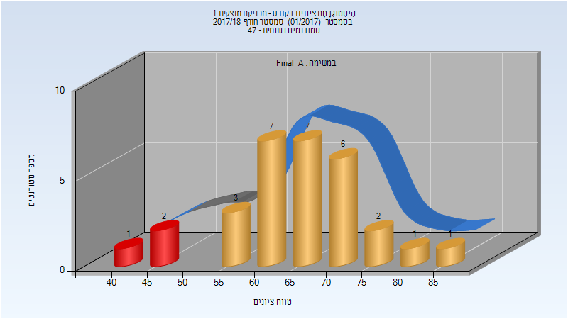

| סטודנטים | עברו/נכשלו | אחוז עוברים | ציון מינימלי | ציון מקסימלי | ממוצע | חציון |
| ---- | ---- | ---- | ---- | ---- | ---- | ---- |
| 30 | 27/3 | 90 | 43 | 85 | 65.9 | 67.5 |

### מבחן מועד ב'

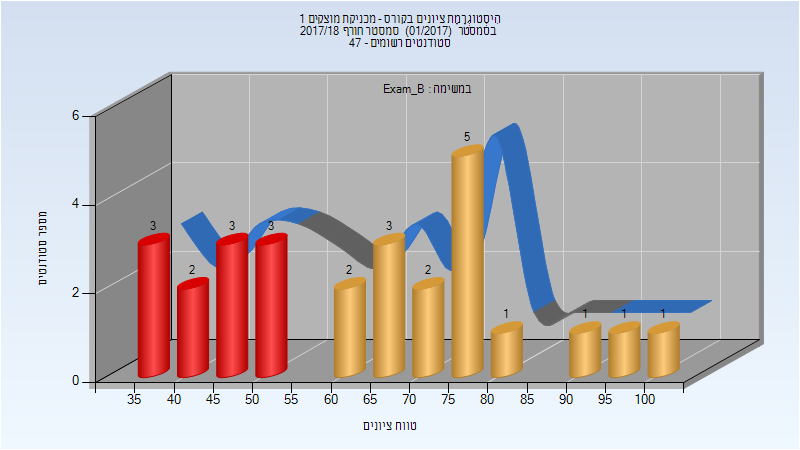

| סטודנטים | עברו/נכשלו | אחוז עוברים | ציון מינימלי | ציון מקסימלי | ממוצע | חציון |
| ---- | ---- | ---- | ---- | ---- | ---- | ---- |
| 27 | 16/11 | 59 | 38 | 100 | 64.148 | 64 |

### סופי מועד ב'

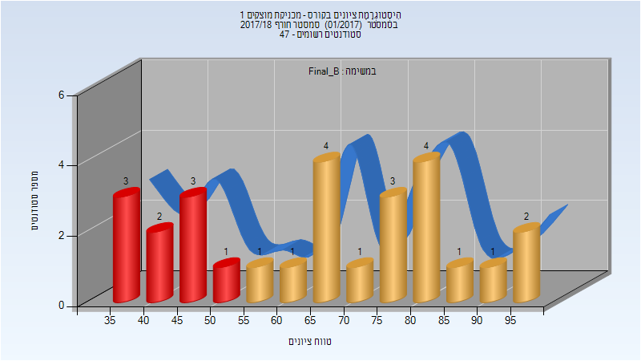

| סטודנטים | עברו/נכשלו | אחוז עוברים | ציון מינימלי | ציון מקסימלי | ממוצע | חציון |
| ---- | ---- | ---- | ---- | ---- | ---- | ---- |
| 27 | 18/9 | 67 | 38 | 99 | 66.333 | 68 |

### סופי

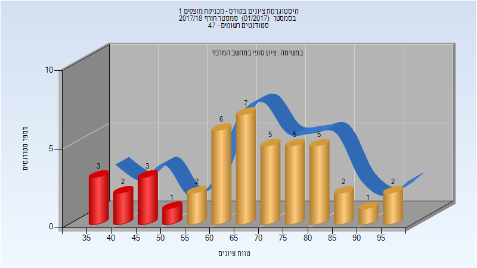

| סטודנטים | עברו/נכשלו | אחוז עוברים | ציון מינימלי | ציון מקסימלי | ממוצע | חציון |
| ---- | ---- | ---- | ---- | ---- | ---- | ---- |
| 44 | 35/9 | 80 | 38 | 99 | 67.659 | 69 |

## אביב 2018

| איש סגל | תפקיד |
| ---- | ---- |
| גבלי יוסף | מרצה - אחראי מקצוע |
| ניצן עידו | מתרגל - עם הרשאות מרצה אחראי |
| גזאל מג'די | מתרגל - עם הרשאות מרצה אחראי |
| ברונשטיין אמיל | מתרגל - עם הרשאות מרצה אחראי |
| כץ שמואל | מתרגל - עם הרשאות מרצה אחראי |
| חן שגיא | מתרגל - עם הרשאות מרצה אחראי |

### מבחן מועד א'

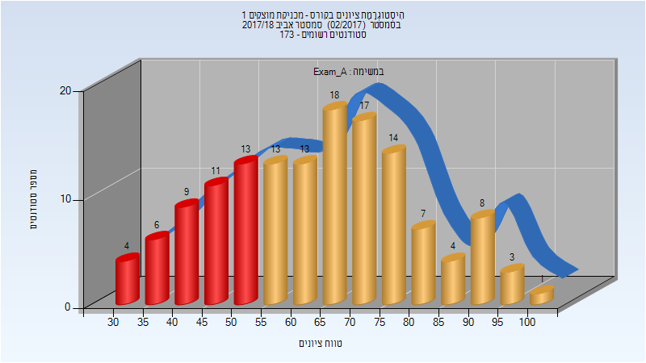

| סטודנטים | עברו/נכשלו | אחוז עוברים | ציון מינימלי | ציון מקסימלי | ממוצע | חציון |
| ---- | ---- | ---- | ---- | ---- | ---- | ---- |
| 141 | 98/43 | 70 | 32 | 100 | 63.773 | 65 |

### סופי מועד א'

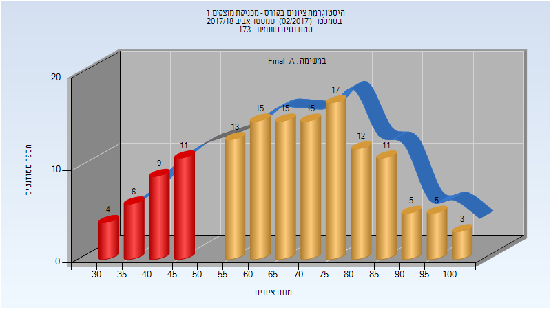

| סטודנטים | עברו/נכשלו | אחוז עוברים | ציון מינימלי | ציון מקסימלי | ממוצע | חציון |
| ---- | ---- | ---- | ---- | ---- | ---- | ---- |
| 141 | 111/30 | 79 | 32 | 100 | 67.156 | 69 |

### מבחן מועד ב'

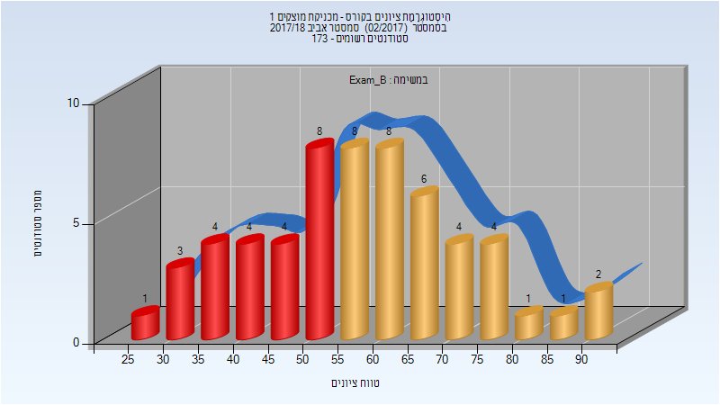

| סטודנטים | עברו/נכשלו | אחוז עוברים | ציון מינימלי | ציון מקסימלי | ממוצע | חציון |
| ---- | ---- | ---- | ---- | ---- | ---- | ---- |
| 58 | 34/24 | 59 | 27 | 90 | 57.621 | 58 |

### סופי מועד ב'

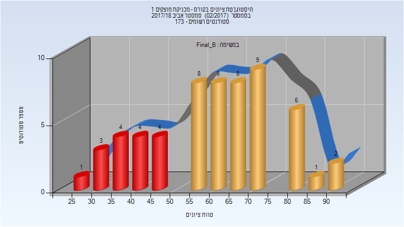

| סטודנטים | עברו/נכשלו | אחוז עוברים | ציון מינימלי | ציון מקסימלי | ממוצע | חציון |
| ---- | ---- | ---- | ---- | ---- | ---- | ---- |
| 58 | 42/16 | 72 | 27 | 91 | 60.517 | 63 |

### סופי

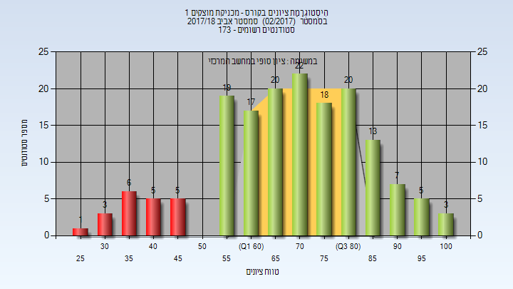

| סטודנטים | עברו/נכשלו | אחוז עוברים | ציון מינימלי | ציון מקסימלי | ממוצע | חציון |
| ---- | ---- | ---- | ---- | ---- | ---- | ---- |
| 164 | 144/20 | 88 | 27 | 100 | 69.598 | 71 |

## חורף 2018-2019

| איש סגל | תפקיד |
| ---- | ---- |
| פארן אילון | מרצה - אחראי מקצוע |
| נוף אלירם | מרצה |

### סופי מועד א'

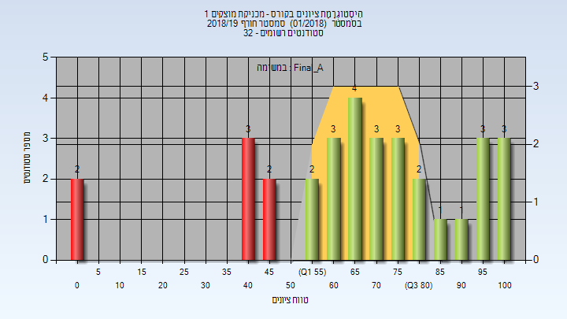

| סטודנטים | עברו/נכשלו | אחוז עוברים | ציון מינימלי | ציון מקסימלי | ממוצע | חציון |
| ---- | ---- | ---- | ---- | ---- | ---- | ---- |
| 32 | 25/7 | 78 | 0 | 100 | 67.719 | 69.5 |

### סופי מועד ב'

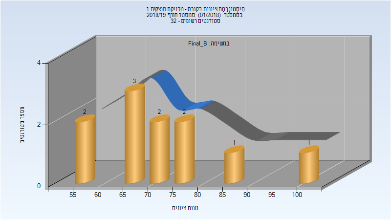

| סטודנטים | עברו/נכשלו | אחוז עוברים | ציון מינימלי | ציון מקסימלי | ממוצע | חציון |
| ---- | ---- | ---- | ---- | ---- | ---- | ---- |
| 11 | 11/0 | 100 | 55 | 100 | 72 | 67 |

### סופי

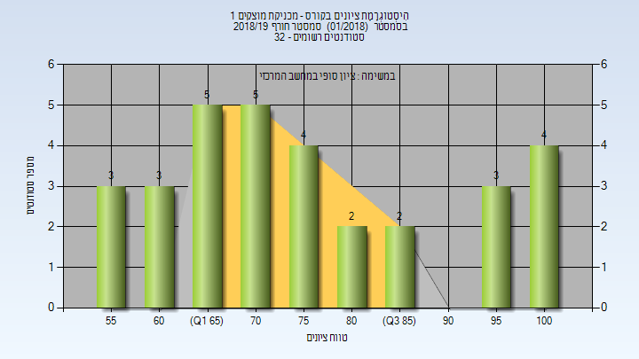

| סטודנטים | עברו/נכשלו | אחוז עוברים | ציון מינימלי | ציון מקסימלי | ממוצע | חציון |
| ---- | ---- | ---- | ---- | ---- | ---- | ---- |
| 31 | 31/0 | 100 | 55 | 100 | 76.774 | 71 |

## אביב 2019

| איש סגל | תפקיד |
| ---- | ---- |
| גבלי יוסף | מרצה - אחראי מקצוע |
| צליל שלי | מרצה |
| כץ שמואל | מתרגל - עם הרשאות מרצה אחראי |
| גזאל מג'די | מתרגל - עם הרשאות מרצה אחראי |
| חן שגיא | מתרגל - עם הרשאות מרצה אחראי |
| ניצן עידו | מתרגל - עם הרשאות מרצה אחראי |

### מבחן מועד א'

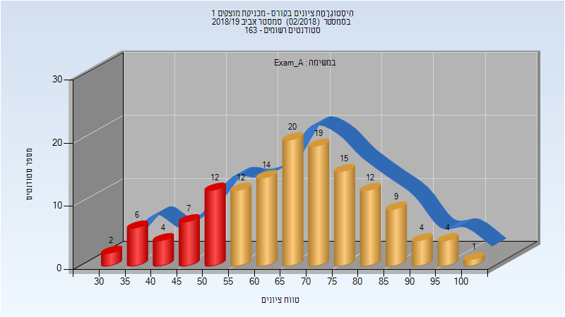

| סטודנטים | עברו/נכשלו | אחוז עוברים | ציון מינימלי | ציון מקסימלי | ממוצע | חציון |
| ---- | ---- | ---- | ---- | ---- | ---- | ---- |
| 141 | 110/31 | 78 | 33 | 100 | 66.681 | 67 |

### סופי מועד א'

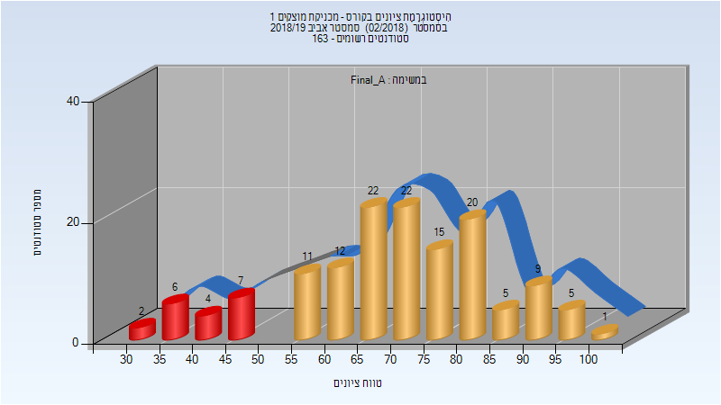

| סטודנטים | עברו/נכשלו | אחוז עוברים | ציון מינימלי | ציון מקסימלי | ממוצע | חציון |
| ---- | ---- | ---- | ---- | ---- | ---- | ---- |
| 141 | 122/19 | 87 | 33 | 100 | 69.809 | 71 |

### מבחן מועד ב'

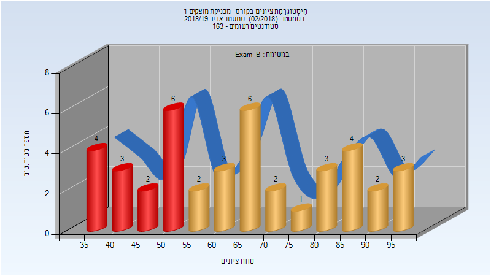

| סטודנטים | עברו/נכשלו | אחוז עוברים | ציון מינימלי | ציון מקסימלי | ממוצע | חציון |
| ---- | ---- | ---- | ---- | ---- | ---- | ---- |
| 41 | 26/15 | 63 | 35 | 96 | 65.293 | 65 |

### סופי מועד ב'

| סטודנטים | עברו/נכשלו | אחוז עוברים | ציון מינימלי | ציון מקסימלי | ממוצע | חציון |
| ---- | ---- | ---- | ---- | ---- | ---- | ---- |
| 41 | 31/10 | 76 | 35 | 97 | 67.366 | 66 |

### סופי

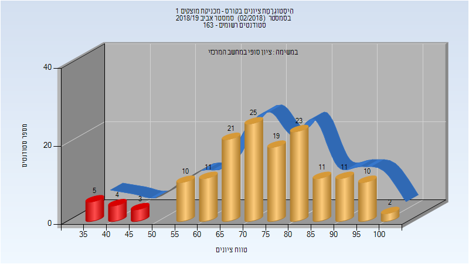

| סטודנטים | עברו/נכשלו | אחוז עוברים | ציון מינימלי | ציון מקסימלי | ממוצע | חציון |
| ---- | ---- | ---- | ---- | ---- | ---- | ---- |
| 155 | 143/12 | 92 | 35 | 100 | 73.723 | 74 |

## חורף 2019-2020

| איש סגל | תפקיד |
| ---- | ---- |
| פארן אילון | מרצה - אחראי מקצוע |
| דאנה אסף | מרצה |

## אביב 2020

| איש סגל | תפקיד |
| ---- | ---- |
| גבלי יוסף | מרצה - אחראי מקצוע |
| גזאל מג'די | מתרגל - עם הרשאות מרצה אחראי |
| שומינוב מאור | מתרגל - עם הרשאות מרצה אחראי |
| ברונשטיין אמיל | מתרגל - עם הרשאות מרצה אחראי |
| ניצן עידו | מתרגל - עם הרשאות מרצה אחראי |

### מבחן מועד א'

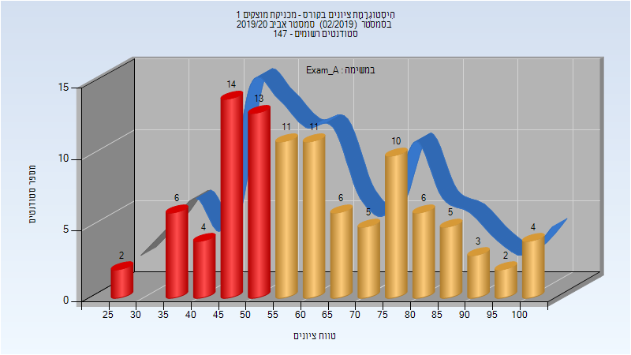

| סטודנטים | עברו/נכשלו | אחוז עוברים | ציון מינימלי | ציון מקסימלי | ממוצע | חציון |
| ---- | ---- | ---- | ---- | ---- | ---- | ---- |
| 106 | 64/42 | 60 | 25 | 100 | 62.623 | 60 |

### סופי מועד א'

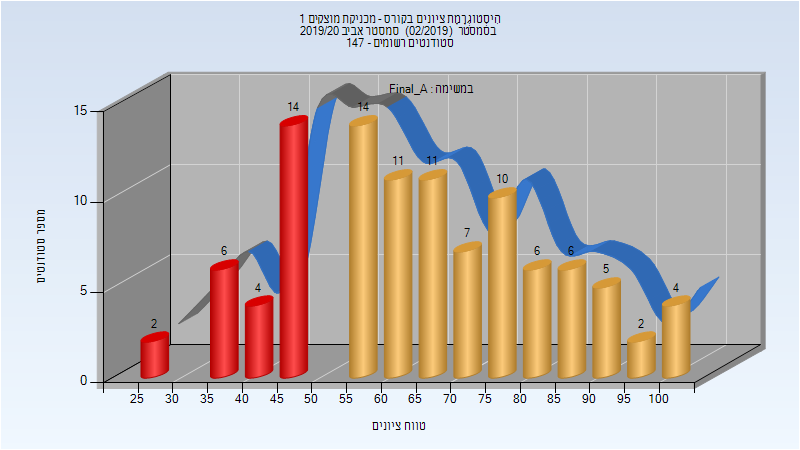

| סטודנטים | עברו/נכשלו | אחוז עוברים | ציון מינימלי | ציון מקסימלי | ממוצע | חציון |
| ---- | ---- | ---- | ---- | ---- | ---- | ---- |
| 106 | 78/28 | 74 | 25 | 100 | 64.774 | 63.5 |

### מבחן מועד ב'

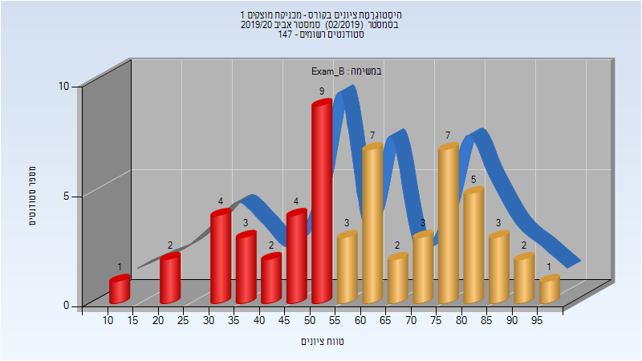

| סטודנטים | עברו/נכשלו | אחוז עוברים | ציון מינימלי | ציון מקסימלי | ממוצע | חציון |
| ---- | ---- | ---- | ---- | ---- | ---- | ---- |
| 58 | 33/25 | 57 | 14.6 | 95 | 60.055 | 62.6 |

### סופי מועד ב'

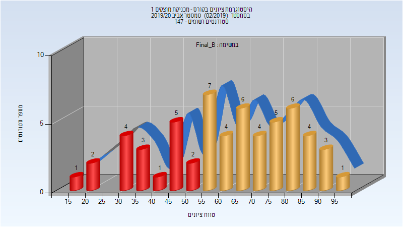

| סטודנטים | עברו/נכשלו | אחוז עוברים | ציון מינימלי | ציון מקסימלי | ממוצע | חציון |
| ---- | ---- | ---- | ---- | ---- | ---- | ---- |
| 58 | 40/18 | 69 | 15 | 95 | 62.121 | 64.5 |

### סופי

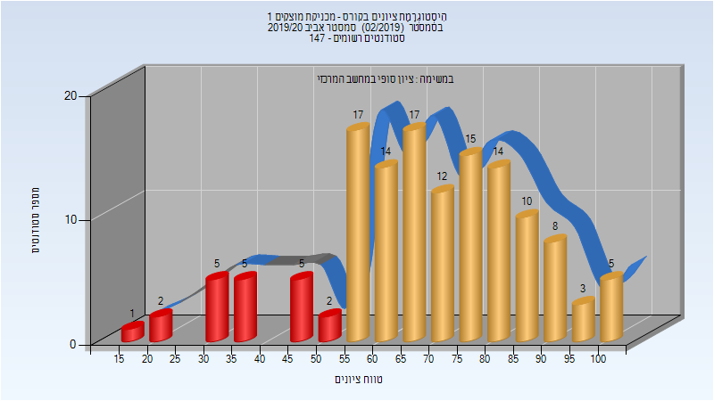

| סטודנטים | עברו/נכשלו | אחוז עוברים | ציון מינימלי | ציון מקסימלי | ממוצע | חציון |
| ---- | ---- | ---- | ---- | ---- | ---- | ---- |
| 135 | 115/20 | 85 | 15 | 100 | 68.585 | 68 |

## חורף 2020-2021

| איש סגל | תפקיד |
| ---- | ---- |
| פארן אילון | מרצה - אחראי מקצוע |
| ברונשטיין אמיל | מרצה |

### מבחן מועד א'

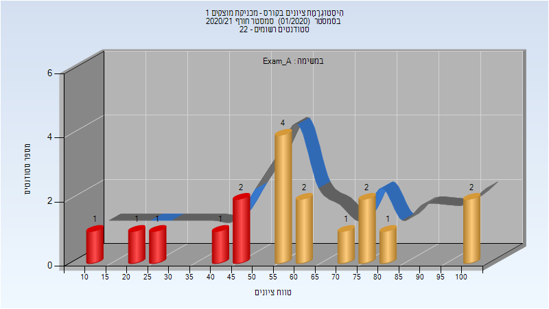

| סטודנטים | עברו/נכשלו | אחוז עוברים | ציון מינימלי | ציון מקסימלי | ממוצע | חציון |
| ---- | ---- | ---- | ---- | ---- | ---- | ---- |
| 18 | 12/6 | 67 | 14 | 100 | 59.389 | 59 |

### סופי מועד א'

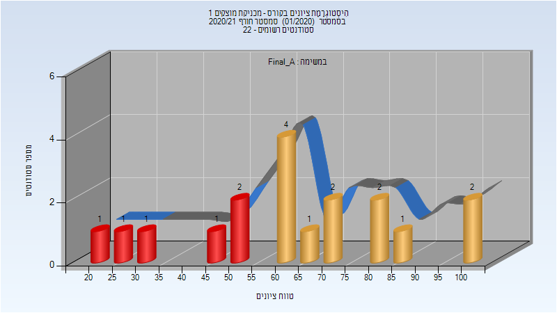

| סטודנטים | עברו/נכשלו | אחוז עוברים | ציון מינימלי | ציון מקסימלי | ממוצע | חציון |
| ---- | ---- | ---- | ---- | ---- | ---- | ---- |
| 18 | 12/6 | 67 | 23 | 100 | 63.667 | 63 |

## אביב 2021

| איש סגל | תפקיד |
| ---- | ---- |
| צליל שלי | מרצה - אחראי מקצוע |
| ברונשטיין אמיל | מתרגל - עם הרשאות מרצה אחראי |
| שומינוב מאור | מתרגל - עם הרשאות מרצה אחראי |
| ניצן עידו | מתרגל - עם הרשאות מרצה אחראי |

