# 034030 - תהליכי יצור

## חורף 2014-2015

| איש סגל | תפקיד |
| ---- | ---- |
| זוסמן איל | מרצה - אחראי מקצוע |

### סופי

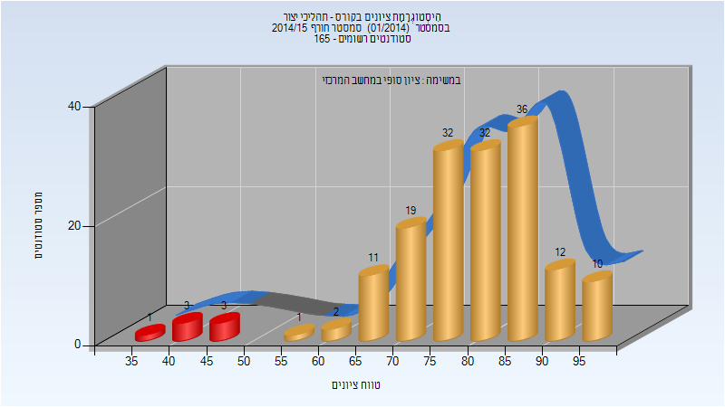

| סטודנטים | עברו/נכשלו | אחוז עוברים | ציון מינימלי | ציון מקסימלי | ממוצע | חציון |
| ---- | ---- | ---- | ---- | ---- | ---- | ---- |
| 162 | 155/7 | 96 | 35 | 99 | 79.432 | 81 |

## חורף 2015-2016

| איש סגל | תפקיד |
| ---- | ---- |
| זוסמן איל | מרצה - אחראי מקצוע |

### סופי מועד א'

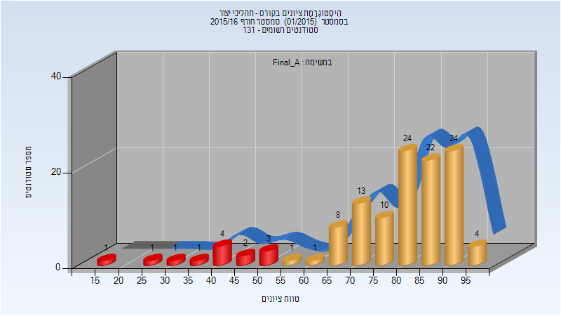

| סטודנטים | עברו/נכשלו | אחוז עוברים | ציון מינימלי | ציון מקסימלי | ממוצע | חציון |
| ---- | ---- | ---- | ---- | ---- | ---- | ---- |
| 120 | 107/13 | 89 | 17 | 96 | 78.075 | 83 |

### סופי מועד ב'

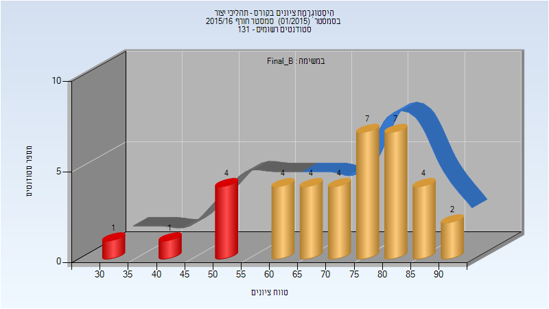

| סטודנטים | עברו/נכשלו | אחוז עוברים | ציון מינימלי | ציון מקסימלי | ממוצע | חציון |
| ---- | ---- | ---- | ---- | ---- | ---- | ---- |
| 38 | 32/6 | 84 | 33 | 92 | 72.184 | 75 |

### סופי

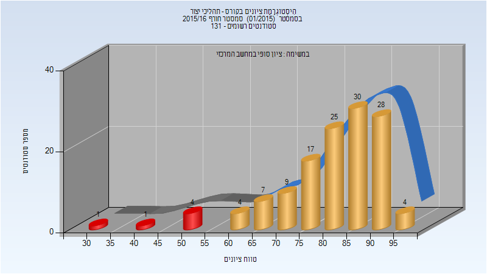

| סטודנטים | עברו/נכשלו | אחוז עוברים | ציון מינימלי | ציון מקסימלי | ממוצע | חציון |
| ---- | ---- | ---- | ---- | ---- | ---- | ---- |
| 130 | 124/6 | 95 | 33 | 96 | 81.385 | 84 |

## אביב 2017

| איש סגל | תפקיד |
| ---- | ---- |
| זוסמן איל | מרצה - אחראי מקצוע |
| מרום יוליה | מתרגל - עם הרשאות מרצה אחראי |
| קסה אדנה )דני( | מתרגל - עם הרשאות מרצה אחראי |

### סופי מועד א'

| סטודנטים | עברו/נכשלו | אחוז עוברים | ציון מינימלי | ציון מקסימלי | ממוצע | חציון |
| ---- | ---- | ---- | ---- | ---- | ---- | ---- |
| 77 | 65/12 | 84 | 33 | 96 | 69.974 | 70 |

### סופי מועד ב'

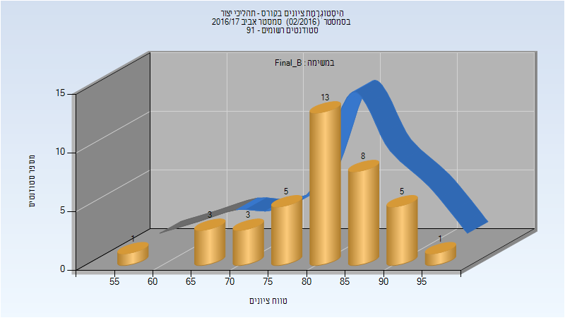

| סטודנטים | עברו/נכשלו | אחוז עוברים | ציון מינימלי | ציון מקסימלי | ממוצע | חציון |
| ---- | ---- | ---- | ---- | ---- | ---- | ---- |
| 39 | 39/0 | 100 | 59 | 95 | 81.667 | 83 |

### סופי

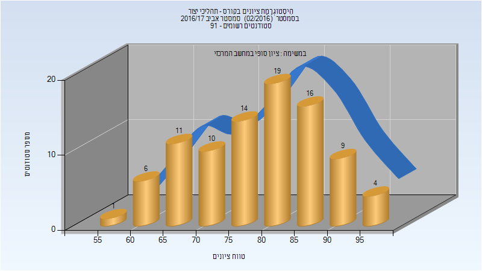

| סטודנטים | עברו/נכשלו | אחוז עוברים | ציון מינימלי | ציון מקסימלי | ממוצע | חציון |
| ---- | ---- | ---- | ---- | ---- | ---- | ---- |
| 90 | 90/0 | 100 | 59 | 96 | 79.178 | 81 |

## חורף 2017-2018

| איש סגל | תפקיד |
| ---- | ---- |
| זוסמן איל | מרצה - אחראי מקצוע |
| שוחאט שלום | מתרגל - עם הרשאות מרצה אחראי |

### סופי מועד א'

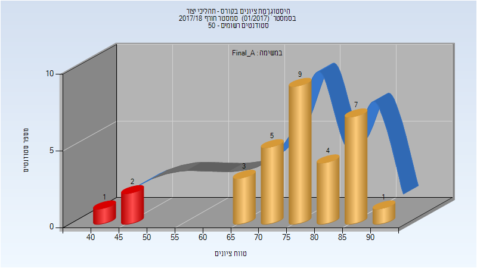

| סטודנטים | עברו/נכשלו | אחוז עוברים | ציון מינימלי | ציון מקסימלי | ממוצע | חציון |
| ---- | ---- | ---- | ---- | ---- | ---- | ---- |
| 32 | 29/3 | 91 | 41 | 90 | 75.656 | 78 |

### סופי מועד ב'

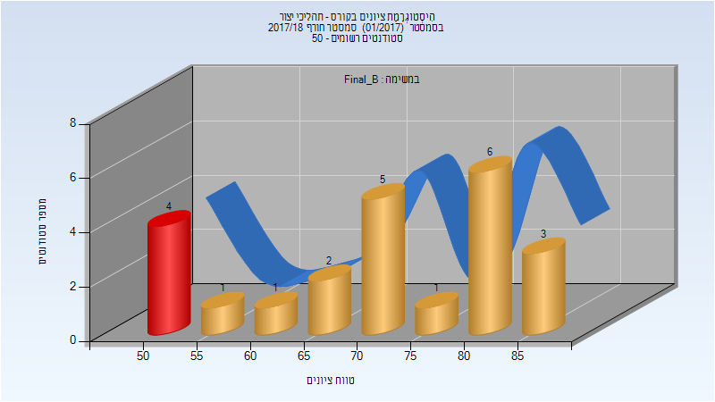

| סטודנטים | עברו/נכשלו | אחוז עוברים | ציון מינימלי | ציון מקסימלי | ממוצע | חציון |
| ---- | ---- | ---- | ---- | ---- | ---- | ---- |
| 23 | 19/4 | 83 | 51 | 88 | 72.087 | 73 |

### סופי

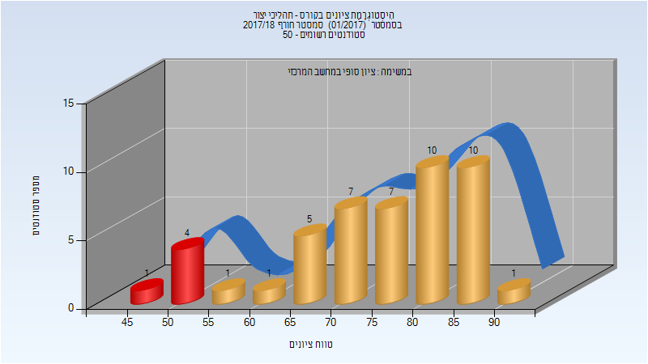

| סטודנטים | עברו/נכשלו | אחוז עוברים | ציון מינימלי | ציון מקסימלי | ממוצע | חציון |
| ---- | ---- | ---- | ---- | ---- | ---- | ---- |
| 47 | 42/5 | 89 | 47 | 90 | 75.383 | 78 |

## אביב 2018

| איש סגל | תפקיד |
| ---- | ---- |
| זוסמן איל | מרצה - אחראי מקצוע |
| קסה אדנה )דני( | מתרגל - עם הרשאות מרצה אחראי |
| מרום יוליה | מתרגל - עם הרשאות מרצה אחראי |
| שוחאט שלום | מתרגל - עם הרשאות מרצה אחראי |

### סופי מועד א'

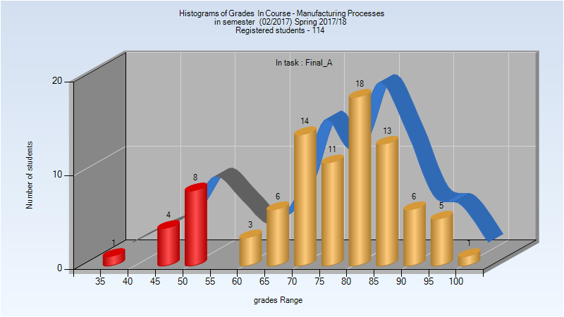

| סטודנטים | עברו/נכשלו | אחוז עוברים | ציון מינימלי | ציון מקסימלי | ממוצע | חציון |
| ---- | ---- | ---- | ---- | ---- | ---- | ---- |
| 90 | 77/13 | 86 | 39 | 100 | 76.278 | 79 |

### סופי מועד ב'

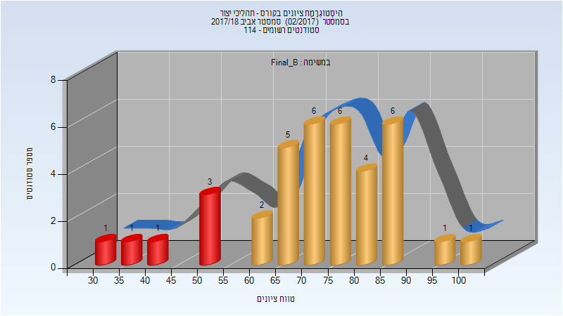

| סטודנטים | עברו/נכשלו | אחוז עוברים | ציון מינימלי | ציון מקסימלי | ממוצע | חציון |
| ---- | ---- | ---- | ---- | ---- | ---- | ---- |
| 37 | 31/6 | 84 | 30 | 100 | 72.081 | 74 |

### סופי

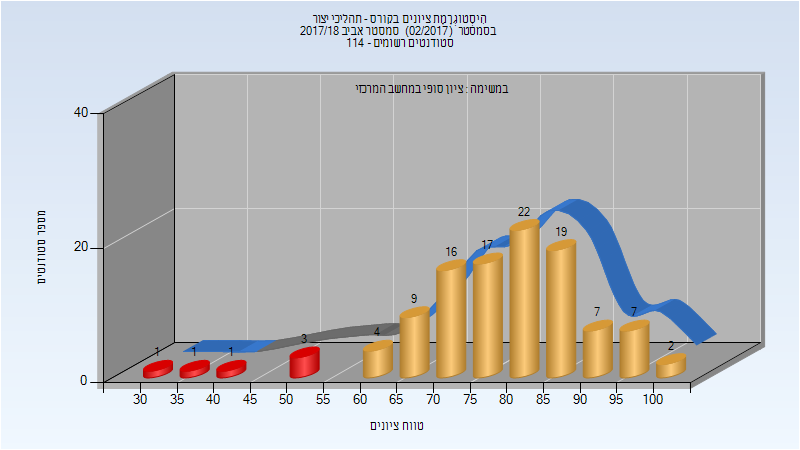

| סטודנטים | עברו/נכשלו | אחוז עוברים | ציון מינימלי | ציון מקסימלי | ממוצע | חציון |
| ---- | ---- | ---- | ---- | ---- | ---- | ---- |
| 109 | 103/6 | 94 | 30 | 100 | 78.706 | 80 |

## חורף 2018-2019

| איש סגל | תפקיד |
| ---- | ---- |
| זוסמן איל | מרצה - אחראי מקצוע |
| שוחאט שלום | מתרגל - עם הרשאות מרצה אחראי |
| מרום יוליה | מתרגל - עם הרשאות מרצה אחראי |

### סופי מועד א'

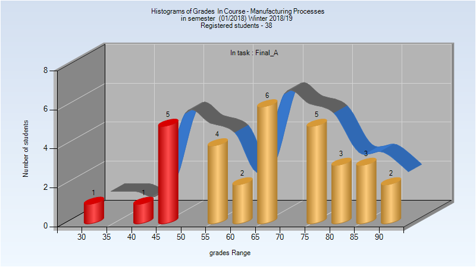

| סטודנטים | עברו/נכשלו | אחוז עוברים | ציון מינימלי | ציון מקסימלי | ממוצע | חציון |
| ---- | ---- | ---- | ---- | ---- | ---- | ---- |
| 32 | 25/7 | 78 | 34 | 92 | 66.531 | 66 |

### סופי מועד ב'

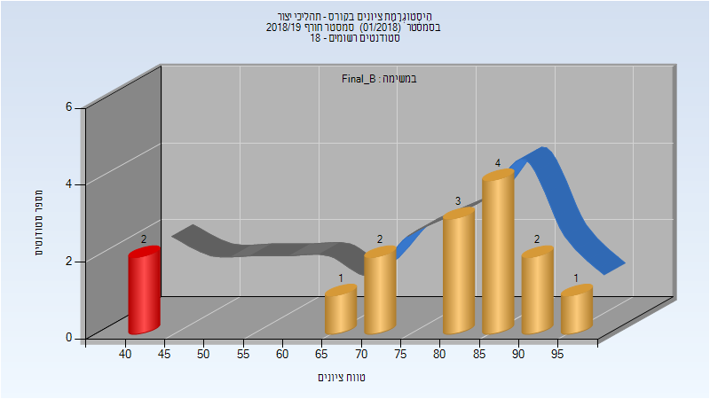

| סטודנטים | עברו/נכשלו | אחוז עוברים | ציון מינימלי | ציון מקסימלי | ממוצע | חציון |
| ---- | ---- | ---- | ---- | ---- | ---- | ---- |
| 14 | 11/3 | 79 | 25 | 92 | 65 | 64.5 |

### סופי

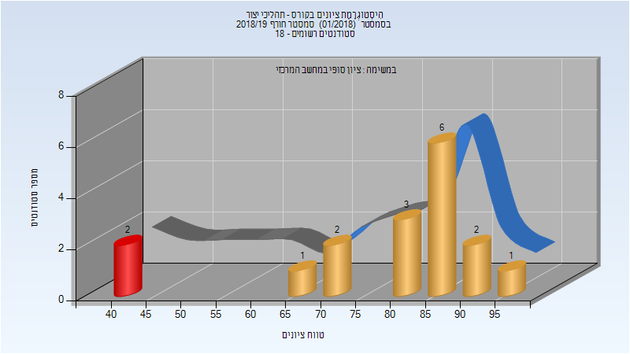

| סטודנטים | עברו/נכשלו | אחוז עוברים | ציון מינימלי | ציון מקסימלי | ממוצע | חציון |
| ---- | ---- | ---- | ---- | ---- | ---- | ---- |
| 37 | 31/6 | 84 | 25 | 92 | 68.73 | 69 |

## אביב 2019

| איש סגל | תפקיד |
| ---- | ---- |
| זוסמן איל | מרצה - אחראי מקצוע |
| שוחאט שלום | מתרגל - עם הרשאות מרצה אחראי |
| קסה אדנה )דני( | מתרגל - עם הרשאות מרצה אחראי |
| מרום יוליה | מתרגל - עם הרשאות מרצה אחראי |

### סופי מועד א'

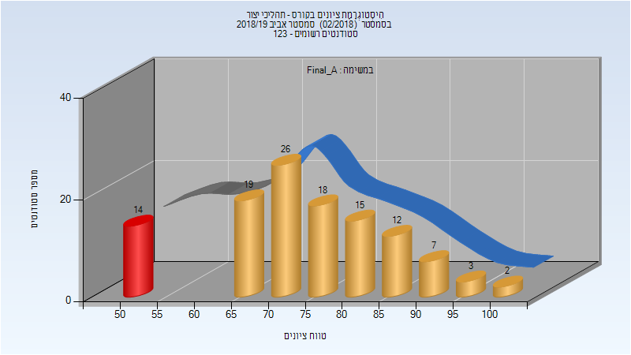

| סטודנטים | עברו/נכשלו | אחוז עוברים | ציון מינימלי | ציון מקסימלי | ממוצע | חציון |
| ---- | ---- | ---- | ---- | ---- | ---- | ---- |
| 116 | 102/14 | 88 | 54 | 100 | 74.672 | 74 |

### סופי מועד ב'

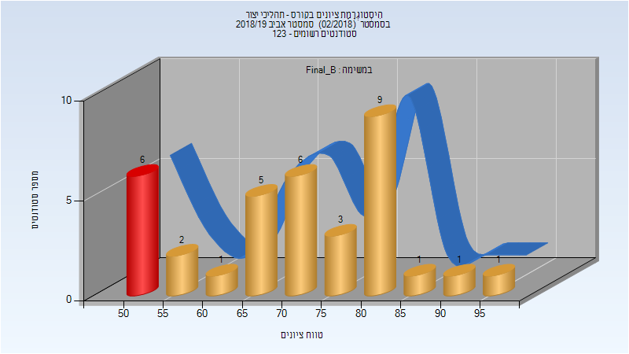

| סטודנטים | עברו/נכשלו | אחוז עוברים | ציון מינימלי | ציון מקסימלי | ממוצע | חציון |
| ---- | ---- | ---- | ---- | ---- | ---- | ---- |
| 35 | 29/6 | 83 | 53 | 97 | 71.743 | 71 |

### סופי

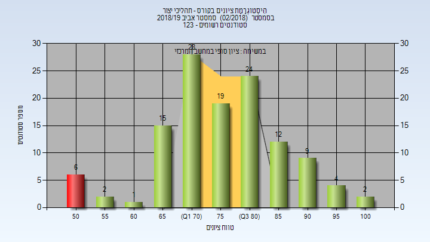

| סטודנטים | עברו/נכשלו | אחוז עוברים | ציון מינימלי | ציון מקסימלי | ממוצע | חציון |
| ---- | ---- | ---- | ---- | ---- | ---- | ---- |
| 122 | 116/6 | 95 | 53 | 100 | 76.926 | 77 |

## חורף 2019-2020

| איש סגל | תפקיד |
| ---- | ---- |
| זוסמן איל | מרצה - אחראי מקצוע |
| מרום יוליה | מתרגל - עם הרשאות מרצה אחראי |

### סופי מועד א'

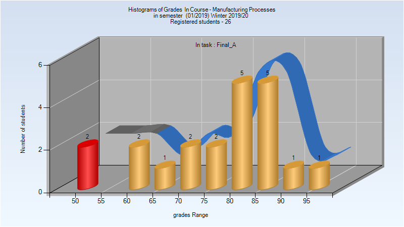

| סטודנטים | עברו/נכשלו | אחוז עוברים | ציון מינימלי | ציון מקסימלי | ממוצע | חציון |
| ---- | ---- | ---- | ---- | ---- | ---- | ---- |
| 21 | 19/2 | 90 | 54 | 96 | 77.571 | 80 |

### סופי

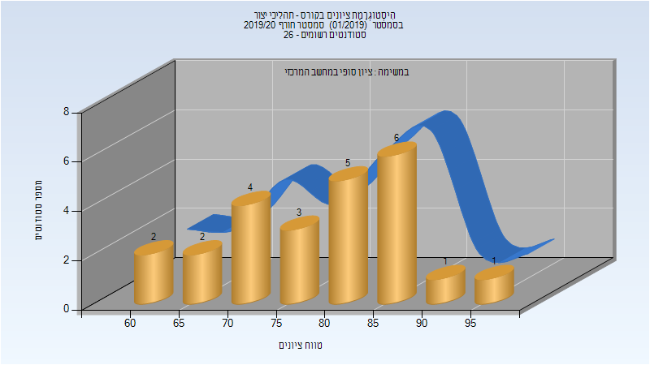

| סטודנטים | עברו/נכשלו | אחוז עוברים | ציון מינימלי | ציון מקסימלי | ממוצע | חציון |
| ---- | ---- | ---- | ---- | ---- | ---- | ---- |
| 24 | 24/0 | 100 | 62 | 96 | 79.167 | 80 |

## אביב 2020

| איש סגל | תפקיד |
| ---- | ---- |
| זוסמן איל | מרצה - אחראי מקצוע |
| קסה אדנה )דני( | מתרגל - עם הרשאות מרצה אחראי |
| שוחאט שלום | מתרגל - עם הרשאות מרצה אחראי |

### סופי מועד א'

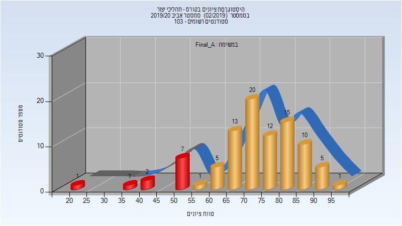

| סטודנטים | עברו/נכשלו | אחוז עוברים | ציון מינימלי | ציון מקסימלי | ממוצע | חציון |
| ---- | ---- | ---- | ---- | ---- | ---- | ---- |
| 93 | 82/11 | 88 | 21 | 95 | 72.903 | 73 |

### סופי מועד ב'

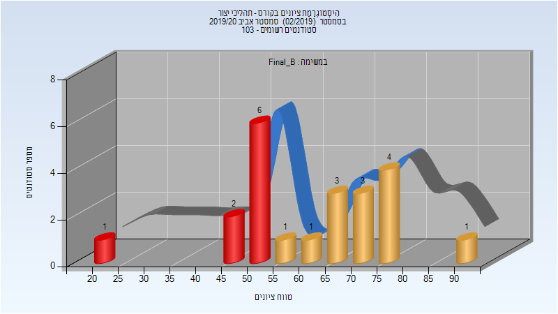

| סטודנטים | עברו/נכשלו | אחוז עוברים | ציון מינימלי | ציון מקסימלי | ממוצע | חציון |
| ---- | ---- | ---- | ---- | ---- | ---- | ---- |
| 22 | 13/9 | 59 | 22 | 92 | 62.682 | 63.5 |

### סופי

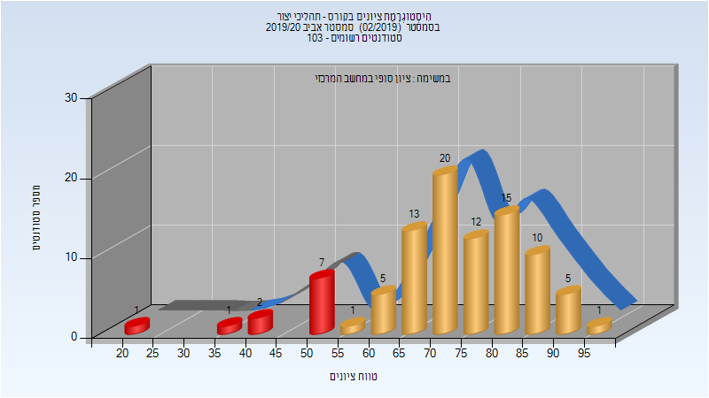

| סטודנטים | עברו/נכשלו | אחוז עוברים | ציון מינימלי | ציון מקסימלי | ממוצע | חציון |
| ---- | ---- | ---- | ---- | ---- | ---- | ---- |
| 99 | 90/9 | 91 | 22 | 95 | 74.101 | 74 |

## חורף 2020-2021

| איש סגל | תפקיד |
| ---- | ---- |
| בר דוד דניאל | מרצה - אחראי מקצוע |

### סופי מועד א'

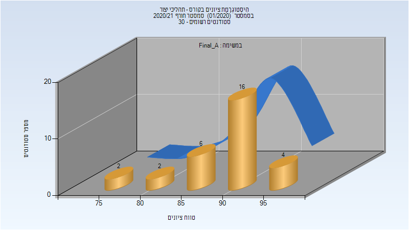

| סטודנטים | עברו/נכשלו | אחוז עוברים | ציון מינימלי | ציון מקסימלי | ממוצע | חציון |
| ---- | ---- | ---- | ---- | ---- | ---- | ---- |
| 30 | 30/0 | 100 | 76 | 98 | 90.933 | 93 |

### סופי

| סטודנטים | עברו/נכשלו | אחוז עוברים | ציון מינימלי | ציון מקסימלי | ממוצע | חציון |
| ---- | ---- | ---- | ---- | ---- | ---- | ---- |
| 30 | 30/0 | 100 | 76 | 98 | 90.933 | 93 |

