# 034033 - אנליזה נומרית מ'

## חורף 2014-2015

| איש סגל | תפקיד |
| ---- | ---- |
| חניאל עידו | מרצה - אחראי מקצוע |
| מגיד אלחנן | מתרגל |

### סופי מועד א'

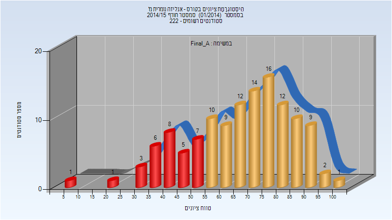

| סטודנטים | עברו/נכשלו | אחוז עוברים | ציון מינימלי | ציון מקסימלי | ממוצע | חציון |
| ---- | ---- | ---- | ---- | ---- | ---- | ---- |
| 126 | 95/31 | 75 | 9 | 100 | 66.889 | 71 |

### סופי מועד ב'

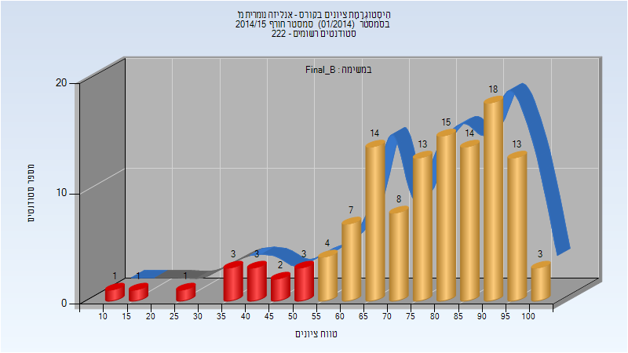

| סטודנטים | עברו/נכשלו | אחוז עוברים | ציון מינימלי | ציון מקסימלי | ממוצע | חציון |
| ---- | ---- | ---- | ---- | ---- | ---- | ---- |
| 123 | 109/14 | 89 | 11 | 100 | 76.455 | 80 |

### סופי

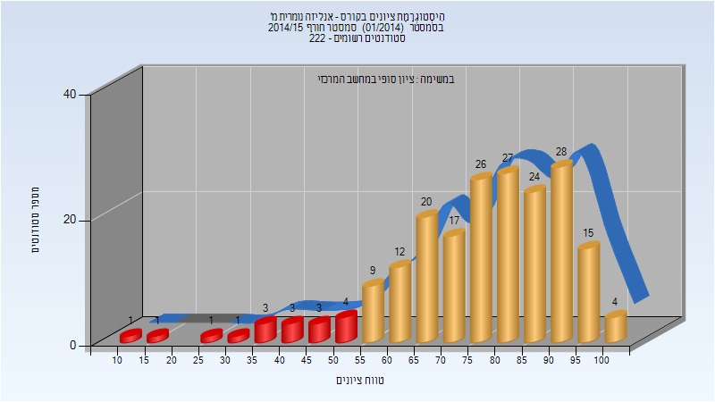

| סטודנטים | עברו/נכשלו | אחוז עוברים | ציון מינימלי | ציון מקסימלי | ממוצע | חציון |
| ---- | ---- | ---- | ---- | ---- | ---- | ---- |
| 199 | 182/17 | 91 | 11 | 100 | 76.618 | 79 |

## אביב 2016

| איש סגל | תפקיד |
| ---- | ---- |
| אוסובסקי שמואל | מרצה - אחראי מקצוע |
| מגיד אלחנן | מתרגל - עם הרשאות מרצה אחראי |

### סופי מועד א'

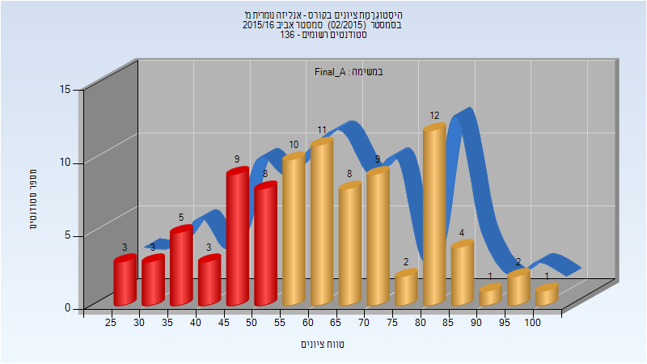

| סטודנטים | עברו/נכשלו | אחוז עוברים | ציון מינימלי | ציון מקסימלי | ממוצע | חציון |
| ---- | ---- | ---- | ---- | ---- | ---- | ---- |
| 91 | 60/31 | 66 | 25 | 100 | 61.846 | 60 |

### סופי מועד ב'

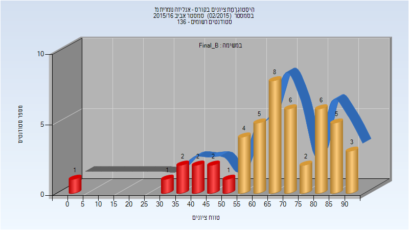

| סטודנטים | עברו/נכשלו | אחוז עוברים | ציון מינימלי | ציון מקסימלי | ממוצע | חציון |
| ---- | ---- | ---- | ---- | ---- | ---- | ---- |
| 48 | 39/9 | 81 | 2 | 94 | 66.896 | 69 |

### סופי

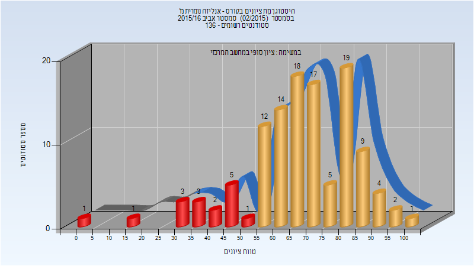

| סטודנטים | עברו/נכשלו | אחוז עוברים | ציון מינימלי | ציון מקסימלי | ממוצע | חציון |
| ---- | ---- | ---- | ---- | ---- | ---- | ---- |
| 117 | 101/16 | 86 | 2 | 100 | 67.915 | 69 |

## חורף 2016-2017

| איש סגל | תפקיד |
| ---- | ---- |
| אורון אלכסנדר | מרצה - אחראי מקצוע |
| מגיד אלחנן | מתרגל - עם הרשאות מרצה אחראי |

### סופי מועד א'

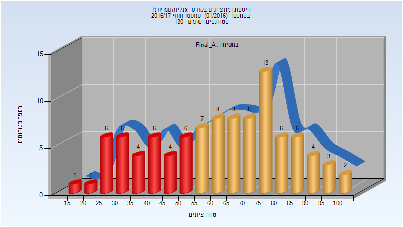

| סטודנטים | עברו/נכשלו | אחוז עוברים | ציון מינימלי | ציון מקסימלי | ממוצע | חציון |
| ---- | ---- | ---- | ---- | ---- | ---- | ---- |
| 99 | 65/34 | 66 | 15 | 100.1 | 62.725 | 64 |

### סופי מועד ב'

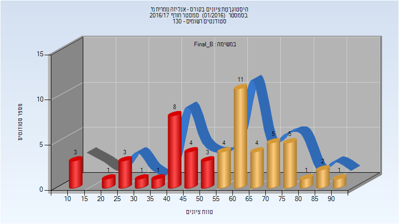

| סטודנטים | עברו/נכשלו | אחוז עוברים | ציון מינימלי | ציון מקסימלי | ממוצע | חציון |
| ---- | ---- | ---- | ---- | ---- | ---- | ---- |
| 57 | 33/24 | 58 | 11 | 91.7 | 55.384 | 60.3 |

### סופי

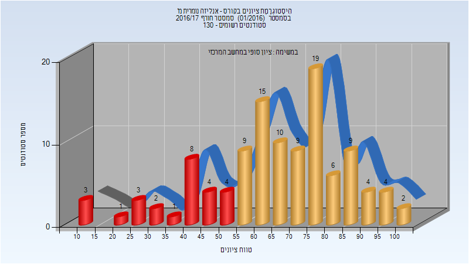

| סטודנטים | עברו/נכשלו | אחוז עוברים | ציון מינימלי | ציון מקסימלי | ממוצע | חציון |
| ---- | ---- | ---- | ---- | ---- | ---- | ---- |
| 113 | 87/26 | 77 | 11 | 100 | 65.779 | 68 |

## אביב 2017

| איש סגל | תפקיד |
| ---- | ---- |
| אוסובסקי שמואל | מרצה - אחראי מקצוע |
| חיימוביץ' אורי | מתרגל - עם הרשאות מרצה אחראי |
| מגיד אלחנן | מתרגל - עם הרשאות מרצה אחראי |

### סופי מועד א'

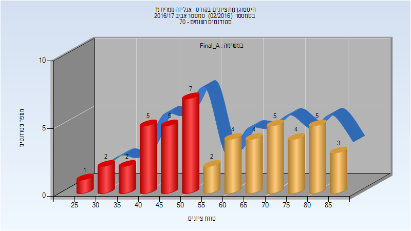

| סטודנטים | עברו/נכשלו | אחוז עוברים | ציון מינימלי | ציון מקסימלי | ממוצע | חציון |
| ---- | ---- | ---- | ---- | ---- | ---- | ---- |
| 49 | 27/22 | 55 | 29.7 | 89.8 | 60.476 | 60.6 |

### סופי מועד ב'

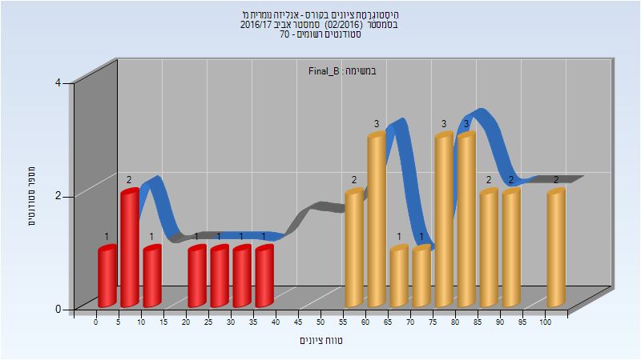

| סטודנטים | עברו/נכשלו | אחוז עוברים | ציון מינימלי | ציון מקסימלי | ממוצע | חציון |
| ---- | ---- | ---- | ---- | ---- | ---- | ---- |
| 27 | 19/8 | 70 | 3 | 100 | 59.963 | 63 |

### סופי

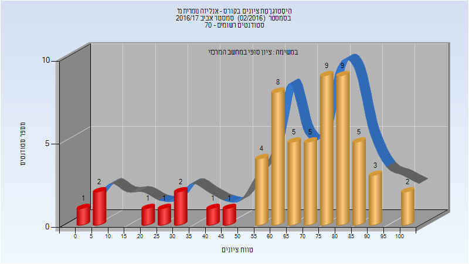

| סטודנטים | עברו/נכשלו | אחוז עוברים | ציון מינימלי | ציון מקסימלי | ממוצע | חציון |
| ---- | ---- | ---- | ---- | ---- | ---- | ---- |
| 59 | 50/9 | 85 | 3 | 100 | 67.373 | 72 |

## חורף 2017-2018

| איש סגל | תפקיד |
| ---- | ---- |
| אורון אלכסנדר | מרצה - אחראי מקצוע |
| גוטליב גלעד | מתרגל - עם הרשאות מרצה אחראי |
| מגיד אלחנן | מתרגל - עם הרשאות מרצה אחראי |

### סופי מועד א'

| סטודנטים | עברו/נכשלו | אחוז עוברים | ציון מינימלי | ציון מקסימלי | ממוצע | חציון |
| ---- | ---- | ---- | ---- | ---- | ---- | ---- |
| 97 | 78/19 | 80 | 28 | 100 | 68.803 | 70.7 |

### סופי מועד ב'

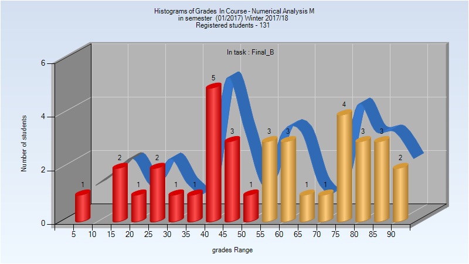

| סטודנטים | עברו/נכשלו | אחוז עוברים | ציון מינימלי | ציון מקסימלי | ממוצע | חציון |
| ---- | ---- | ---- | ---- | ---- | ---- | ---- |
| 37 | 20/17 | 54 | 5 | 93 | 56.211 | 56 |

### סופי

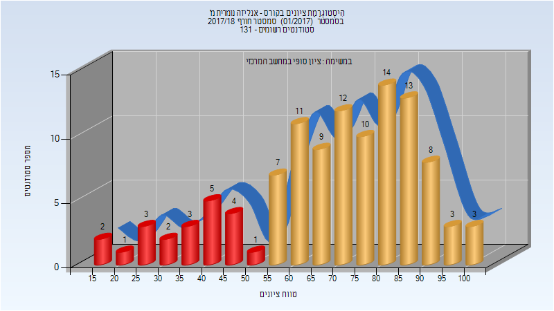

| סטודנטים | עברו/נכשלו | אחוז עוברים | ציון מינימלי | ציון מקסימלי | ממוצע | חציון |
| ---- | ---- | ---- | ---- | ---- | ---- | ---- |
| 111 | 90/21 | 81 | 16 | 100 | 69.225 | 72 |

## אביב 2018

| איש סגל | תפקיד |
| ---- | ---- |
| בר-יוסף צבי פנחס | מרצה - אחראי מקצוע |

### מבחן מועד א'

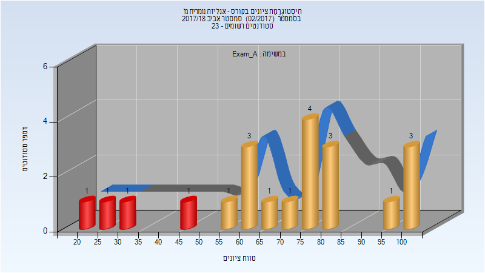

| סטודנטים | עברו/נכשלו | אחוז עוברים | ציון מינימלי | ציון מקסימלי | ממוצע | חציון |
| ---- | ---- | ---- | ---- | ---- | ---- | ---- |
| 21 | 17/4 | 81 | 22 | 100 | 69.667 | 75 |

### סופי מועד א'

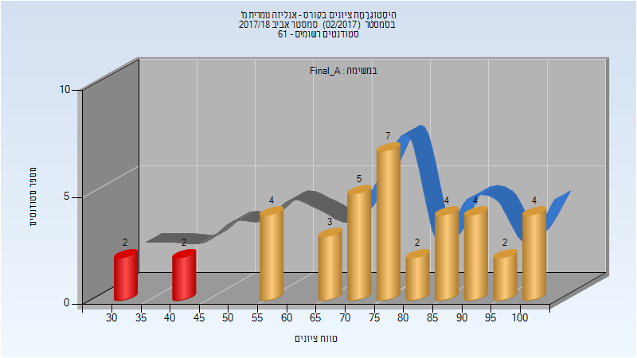

| סטודנטים | עברו/נכשלו | אחוז עוברים | ציון מינימלי | ציון מקסימלי | ממוצע | חציון |
| ---- | ---- | ---- | ---- | ---- | ---- | ---- |
| 39 | 35/4 | 90 | 30 | 100 | 75.718 | 76 |

### סופי מועד ב'

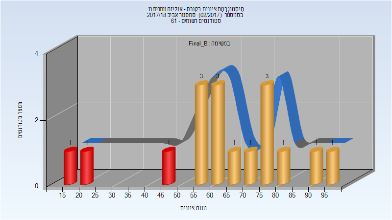

| סטודנטים | עברו/נכשלו | אחוז עוברים | ציון מינימלי | ציון מקסימלי | ממוצע | חציון |
| ---- | ---- | ---- | ---- | ---- | ---- | ---- |
| 17 | 14/3 | 82 | 15 | 99 | 63.765 | 64 |

### סופי

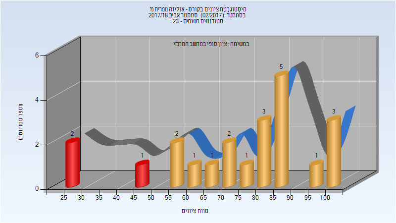

| סטודנטים | עברו/נכשלו | אחוז עוברים | ציון מינימלי | ציון מקסימלי | ממוצע | חציון |
| ---- | ---- | ---- | ---- | ---- | ---- | ---- |
| 56 | 53/3 | 95 | 15 | 100 | 76.518 | 77 |

## חורף 2018-2019

| איש סגל | תפקיד |
| ---- | ---- |
| דגני דוד | מרצה - אחראי מקצוע |
| דונאיביץ לב | מתרגל - עם הרשאות מרצה אחראי |
| מאיו בר | מתרגל - עם הרשאות מרצה אחראי |
| גוטליב גלעד | מתרגל - עם הרשאות מרצה אחראי |
| כהן יגאל | מתרגל - עם הרשאות מרצה אחראי |

### מבחן מועד א'

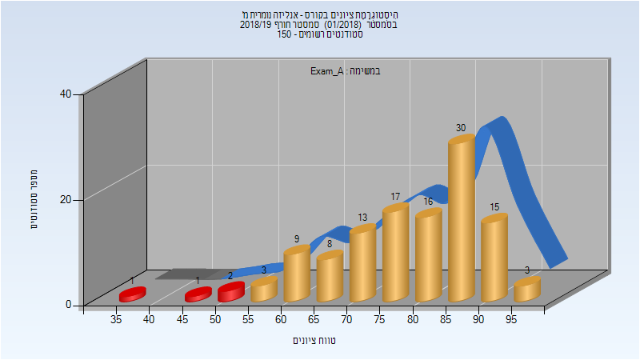

| סטודנטים | עברו/נכשלו | אחוז עוברים | ציון מינימלי | ציון מקסימלי | ממוצע | חציון |
| ---- | ---- | ---- | ---- | ---- | ---- | ---- |
| 118 | 114/4 | 97 | 38 | 95 | 78.695 | 81.5 |

### סופי מועד א'

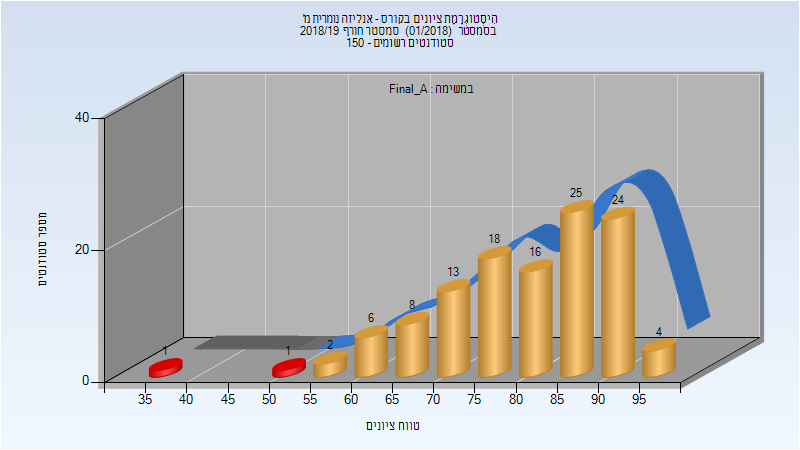

| סטודנטים | עברו/נכשלו | אחוז עוברים | ציון מינימלי | ציון מקסימלי | ממוצע | חציון |
| ---- | ---- | ---- | ---- | ---- | ---- | ---- |
| 118 | 116/2 | 98 | 38 | 96 | 80.534 | 83 |

### מבחן מועד ב'

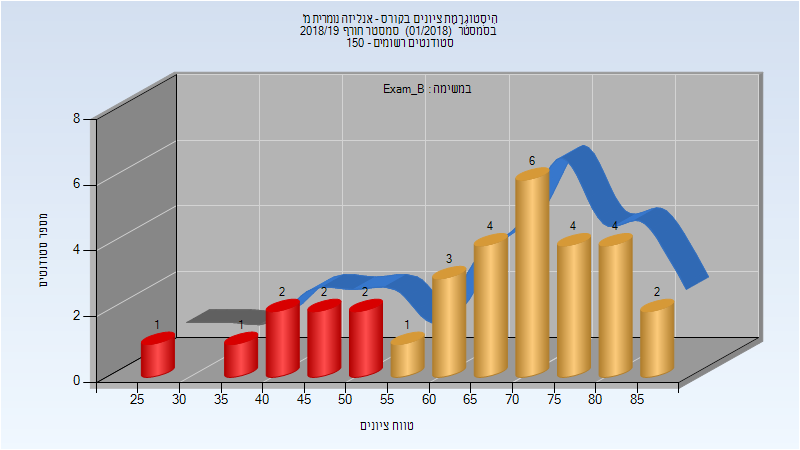

| סטודנטים | עברו/נכשלו | אחוז עוברים | ציון מינימלי | ציון מקסימלי | ממוצע | חציון |
| ---- | ---- | ---- | ---- | ---- | ---- | ---- |
| 32 | 24/8 | 75 | 27 | 88 | 65.344 | 69.5 |

### סופי מועד ב'

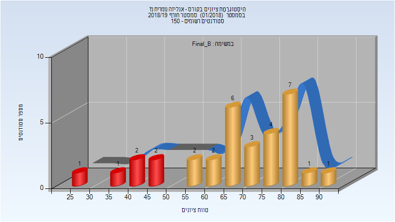

| סטודנטים | עברו/נכשלו | אחוז עוברים | ציון מינימלי | ציון מקסימלי | ממוצע | חציון |
| ---- | ---- | ---- | ---- | ---- | ---- | ---- |
| 32 | 26/6 | 81 | 27 | 90 | 67.219 | 69.5 |

### סופי

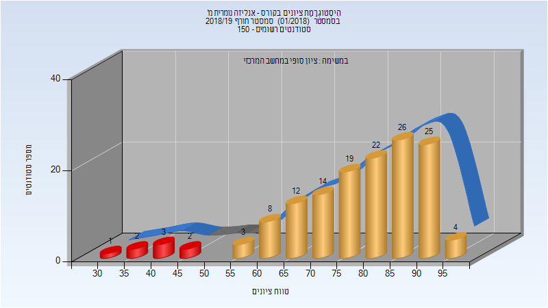

| סטודנטים | עברו/נכשלו | אחוז עוברים | ציון מינימלי | ציון מקסימלי | ממוצע | חציון |
| ---- | ---- | ---- | ---- | ---- | ---- | ---- |
| 141 | 134/7 | 95 | 37 | 96 | 78.284 | 81 |

## אביב 2019

| איש סגל | תפקיד |
| ---- | ---- |
| בר-יוסף צבי פנחס | מרצה - אחראי מקצוע |

### מבחן מועד א'

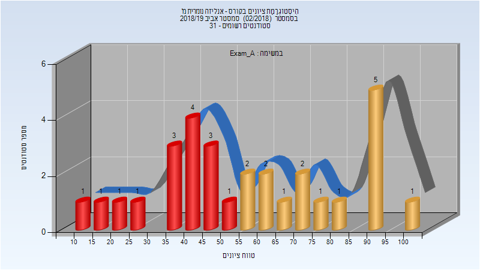

| סטודנטים | עברו/נכשלו | אחוז עוברים | ציון מינימלי | ציון מקסימלי | ממוצע | חציון |
| ---- | ---- | ---- | ---- | ---- | ---- | ---- |
| 30 | 15/15 | 50 | 11 | 102 | 56.667 | 54 |

### סופי מועד א'

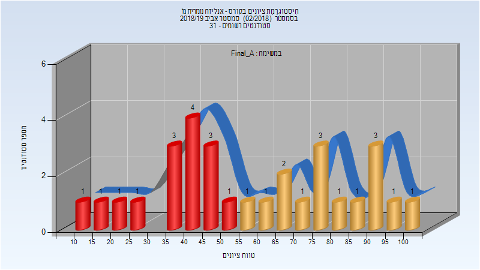

| סטודנטים | עברו/נכשלו | אחוז עוברים | ציון מינימלי | ציון מקסימלי | ממוצע | חציון |
| ---- | ---- | ---- | ---- | ---- | ---- | ---- |
| 30 | 15/15 | 50 | 11 | 100 | 57.9 | 54 |

### מבחן מועד ב'

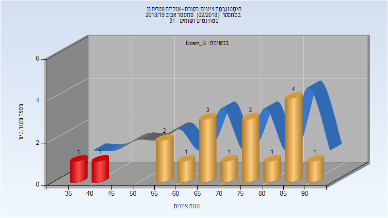

| סטודנטים | עברו/נכשלו | אחוז עוברים | ציון מינימלי | ציון מקסימלי | ממוצע | חציון |
| ---- | ---- | ---- | ---- | ---- | ---- | ---- |
| 18 | 16/2 | 89 | 35 | 93 | 70.333 | 72.5 |

### סופי מועד ב'

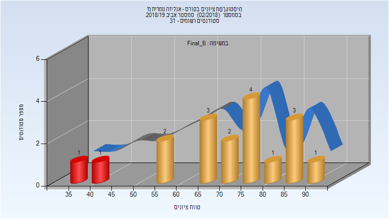

| סטודנטים | עברו/נכשלו | אחוז עוברים | ציון מינימלי | ציון מקסימלי | ממוצע | חציון |
| ---- | ---- | ---- | ---- | ---- | ---- | ---- |
| 18 | 16/2 | 89 | 35 | 90 | 70.667 | 74 |

### סופי

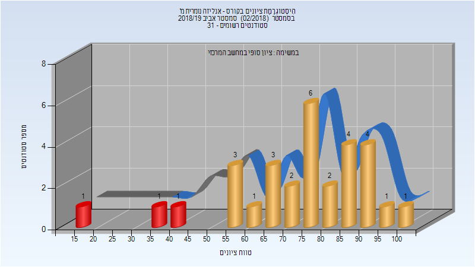

| סטודנטים | עברו/נכשלו | אחוז עוברים | ציון מינימלי | ציון מקסימלי | ממוצע | חציון |
| ---- | ---- | ---- | ---- | ---- | ---- | ---- |
| 30 | 27/3 | 90 | 16 | 100 | 73.3 | 76 |

## חורף 2019-2020

| איש סגל | תפקיד |
| ---- | ---- |
| אורון אלכסנדר | מרצה - אחראי מקצוע |
| שקטרוט מקס | מתרגל - עם הרשאות מרצה אחראי |
| כהן יגאל | מתרגל - עם הרשאות מרצה אחראי |
| בויקו יבגני | מתרגל - עם הרשאות מרצה אחראי |
| שירוקי יצחק | מתרגל - עם הרשאות מרצה אחראי |

### סופי מועד א'

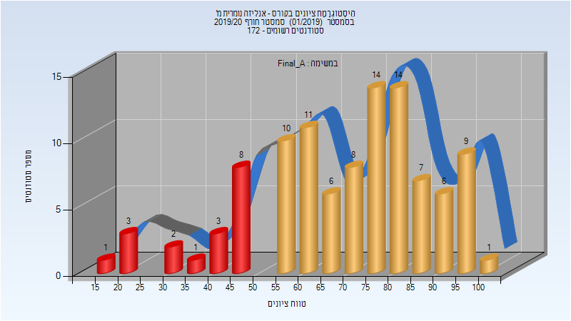

| סטודנטים | עברו/נכשלו | אחוז עוברים | ציון מינימלי | ציון מקסימלי | ממוצע | חציון |
| ---- | ---- | ---- | ---- | ---- | ---- | ---- |
| 104 | 86/18 | 83 | 16.4 | 100 | 70.218 | 74.6 |

### סופי מועד ב'

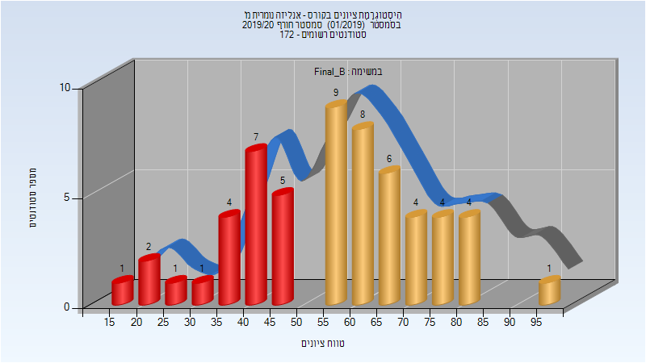

| סטודנטים | עברו/נכשלו | אחוז עוברים | ציון מינימלי | ציון מקסימלי | ממוצע | חציון |
| ---- | ---- | ---- | ---- | ---- | ---- | ---- |
| 57 | 36/21 | 63 | 15 | 96 | 56.772 | 59 |

### סופי

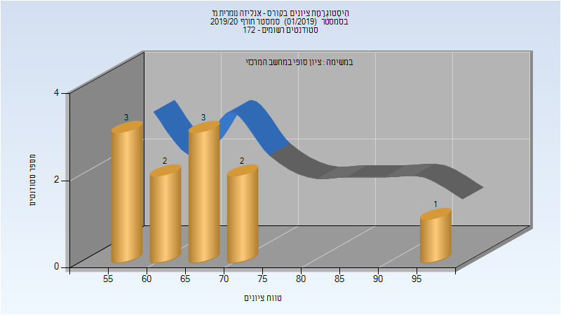

| סטודנטים | עברו/נכשלו | אחוז עוברים | ציון מינימלי | ציון מקסימלי | ממוצע | חציון |
| ---- | ---- | ---- | ---- | ---- | ---- | ---- |
| 145 | 123/22 | 85 | 15 | 100 | 68.839 | 70 |

## אביב 2020

| איש סגל | תפקיד |
| ---- | ---- |
| בר-יוסף צבי פנחס | מרצה - אחראי מקצוע |
| טל אברהם | מרצה |

### מבחן מועד ב'

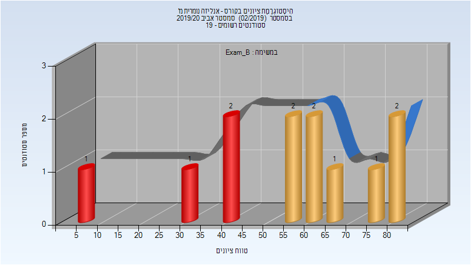

| סטודנטים | עברו/נכשלו | אחוז עוברים | ציון מינימלי | ציון מקסימלי | ממוצע | חציון |
| ---- | ---- | ---- | ---- | ---- | ---- | ---- |
| 12 | 8/4 | 67 | 7 | 82 | 55.417 | 58.5 |

### סופי מועד ב'

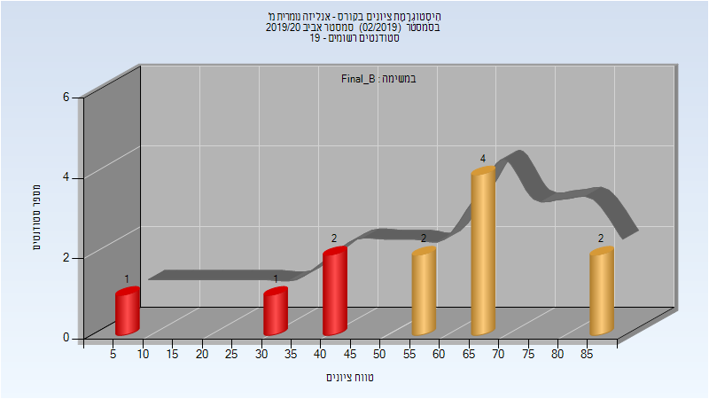

| סטודנטים | עברו/נכשלו | אחוז עוברים | ציון מינימלי | ציון מקסימלי | ממוצע | חציון |
| ---- | ---- | ---- | ---- | ---- | ---- | ---- |
| 12 | 8/4 | 67 | 7 | 85 | 56.25 | 61 |

### סופי

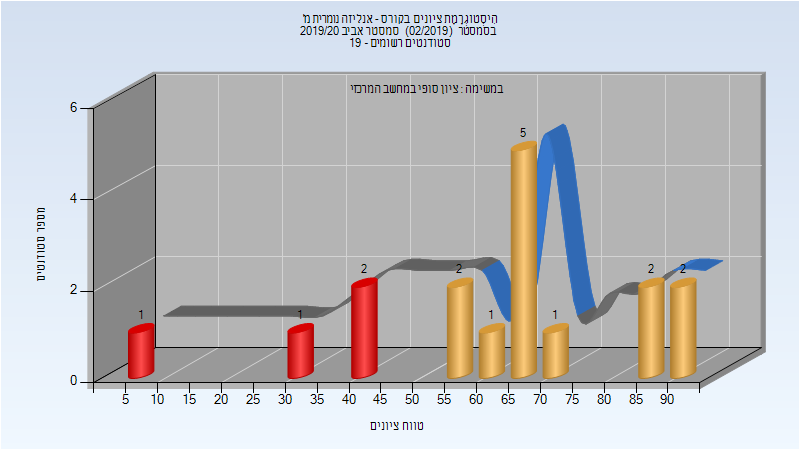

| סטודנטים | עברו/נכשלו | אחוז עוברים | ציון מינימלי | ציון מקסימלי | ממוצע | חציון |
| ---- | ---- | ---- | ---- | ---- | ---- | ---- |
| 17 | 13/4 | 76 | 7 | 90 | 62.118 | 65 |

## חורף 2020-2021

| איש סגל | תפקיד |
| ---- | ---- |
| הקסנר דניאל | מרצה - אחראי מקצוע |
| ורפמן בת חן | מתרגל - עם הרשאות מרצה אחראי |
| ברייטמן נינה ליאור | מתרגל - עם הרשאות מרצה אחראי |
| כהן יגאל | מתרגל - עם הרשאות מרצה אחראי |
| צ'פניק צבי | מתרגל - עם הרשאות מרצה אחראי |

### סופי מועד א'

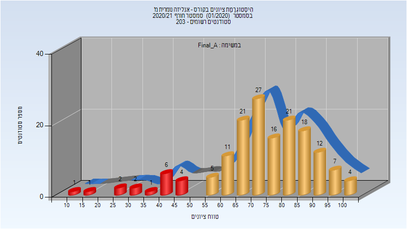

| סטודנטים | עברו/נכשלו | אחוז עוברים | ציון מינימלי | ציון מקסימלי | ממוצע | חציון |
| ---- | ---- | ---- | ---- | ---- | ---- | ---- |
| 159 | 142/17 | 89 | 12 | 100 | 73.472 | 74 |

### סופי מועד ב'

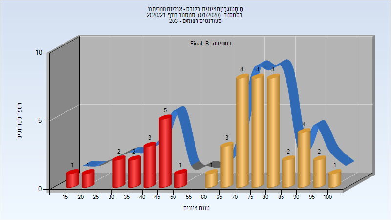

| סטודנטים | עברו/נכשלו | אחוז עוברים | ציון מינימלי | ציון מקסימלי | ממוצע | חציון |
| ---- | ---- | ---- | ---- | ---- | ---- | ---- |
| 52 | 37/15 | 71 | 15 | 100 | 67.827 | 74 |

### סופי

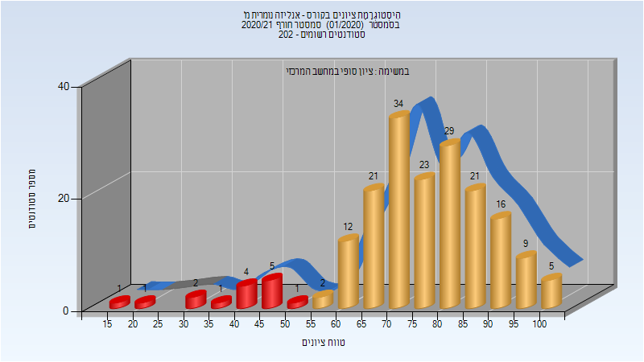

| סטודנטים | עברו/נכשלו | אחוז עוברים | ציון מינימלי | ציון מקסימלי | ממוצע | חציון |
| ---- | ---- | ---- | ---- | ---- | ---- | ---- |
| 187 | 171/16 | 91 | 15 | 100 | 75.492 | 76 |

