# 034035 - תרמודינמיקה 1

## חורף 2014-2015

| איש סגל | תפקיד |
| ---- | ---- |
| טרטקובסקי לאוניד | מרצה - אחראי מקצוע |

### סופי

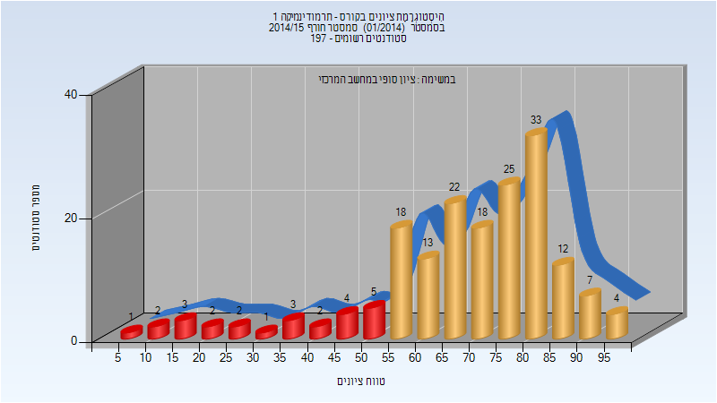

| סטודנטים | עברו/נכשלו | אחוז עוברים | ציון מינימלי | ציון מקסימלי | ממוצע | חציון |
| ---- | ---- | ---- | ---- | ---- | ---- | ---- |
| 177 | 152/25 | 86 | 9 | 99 | 68.633 | 73 |

## חורף 2015-2016

| איש סגל | תפקיד |
| ---- | ---- |
| ואן האוט רנה | מרצה - אחראי מקצוע |

### סופי מועד א'

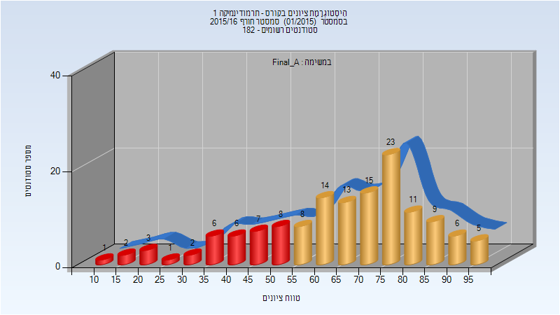

| סטודנטים | עברו/נכשלו | אחוז עוברים | ציון מינימלי | ציון מקסימלי | ממוצע | חציון |
| ---- | ---- | ---- | ---- | ---- | ---- | ---- |
| 140 | 104/36 | 74 | 11 | 99 | 65.554 | 69 |

### סופי מועד ב'

| סטודנטים | עברו/נכשלו | אחוז עוברים | ציון מינימלי | ציון מקסימלי | ממוצע | חציון |
| ---- | ---- | ---- | ---- | ---- | ---- | ---- |
| 165 | 128/37 | 78 | 3 | 100 | 66.945 | 72 |

### סופי

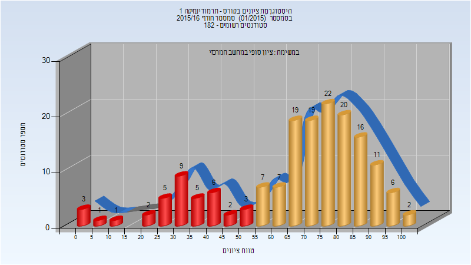

| סטודנטים | עברו/נכשלו | אחוז עוברים | ציון מינימלי | ציון מקסימלי | ממוצע | חציון |
| ---- | ---- | ---- | ---- | ---- | ---- | ---- |
| 166 | 129/37 | 78 | 3 | 100 | 67.283 | 72 |

## אביב 2016

| איש סגל | תפקיד |
| ---- | ---- |
| ואן האוט רנה | מרצה - אחראי מקצוע |
| גוטפינגר חיים | מרצה |
| פליישמן רפאל | מתרגל |

### מבחן מועד א'

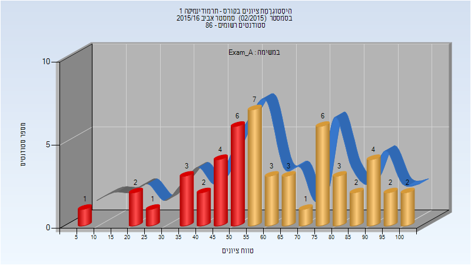

| סטודנטים | עברו/נכשלו | אחוז עוברים | ציון מינימלי | ציון מקסימלי | ממוצע | חציון |
| ---- | ---- | ---- | ---- | ---- | ---- | ---- |
| 52 | 33/19 | 63 | 8 | 100 | 62.808 | 59 |

### סופי מועד א'

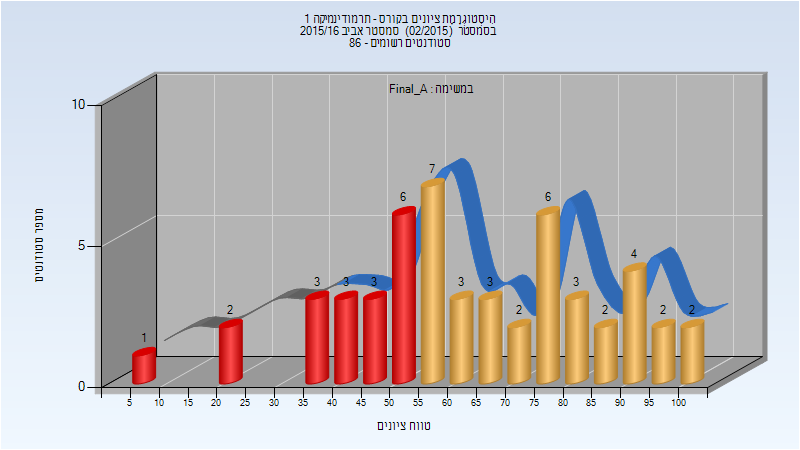

| סטודנטים | עברו/נכשלו | אחוז עוברים | ציון מינימלי | ציון מקסימלי | ממוצע | חציון |
| ---- | ---- | ---- | ---- | ---- | ---- | ---- |
| 52 | 34/18 | 65 | 8 | 100 | 63.519 | 60.5 |

### מבחן מועד ב'

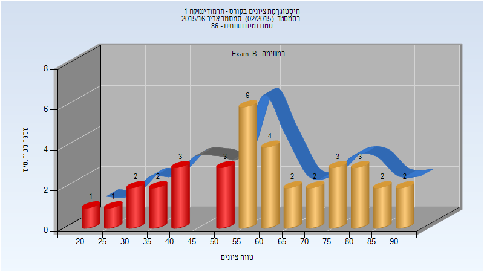

| סטודנטים | עברו/נכשלו | אחוז עוברים | ציון מינימלי | ציון מקסימלי | ממוצע | חציון |
| ---- | ---- | ---- | ---- | ---- | ---- | ---- |
| 36 | 24/12 | 67 | 22 | 92 | 60.667 | 59.5 |

### סופי מועד ב'

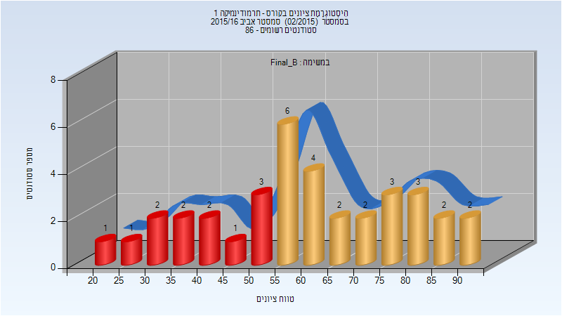

| סטודנטים | עברו/נכשלו | אחוז עוברים | ציון מינימלי | ציון מקסימלי | ממוצע | חציון |
| ---- | ---- | ---- | ---- | ---- | ---- | ---- |
| 36 | 24/12 | 67 | 22 | 92 | 60.706 | 59.5 |

### סופי

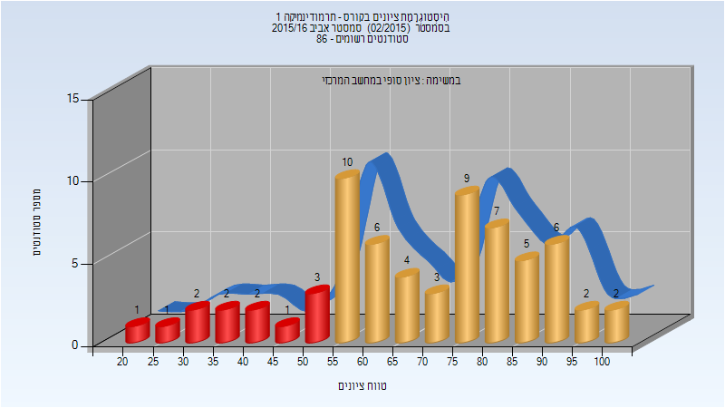

| סטודנטים | עברו/נכשלו | אחוז עוברים | ציון מינימלי | ציון מקסימלי | ממוצע | חציון |
| ---- | ---- | ---- | ---- | ---- | ---- | ---- |
| 66 | 54/12 | 82 | 22 | 100 | 68.985 | 71 |

## חורף 2016-2017

| איש סגל | תפקיד |
| ---- | ---- |
| טרטקובסקי לאוניד | מרצה - אחראי מקצוע |
| פארן ארנון | מתרגל - עם הרשאות מרצה אחראי |

### מבחן מועד א'

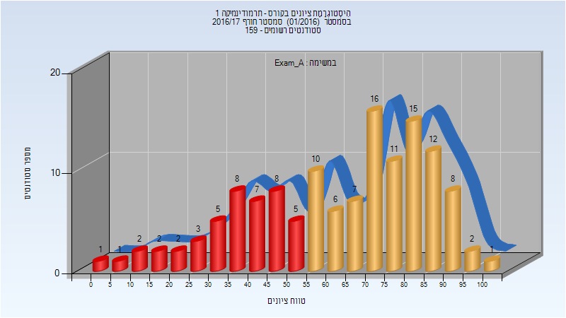

| סטודנטים | עברו/נכשלו | אחוז עוברים | ציון מינימלי | ציון מקסימלי | ממוצע | חציון |
| ---- | ---- | ---- | ---- | ---- | ---- | ---- |
| 132 | 88/44 | 67 | 0 | 100 | 62.909 | 69 |

### סופי מועד א'

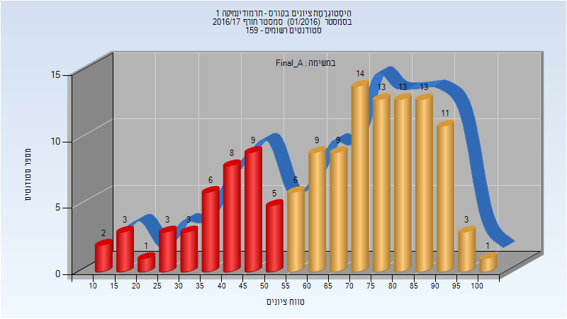

| סטודנטים | עברו/נכשלו | אחוז עוברים | ציון מינימלי | ציון מקסימלי | ממוצע | חציון |
| ---- | ---- | ---- | ---- | ---- | ---- | ---- |
| 132 | 92/40 | 70 | 12 | 100 | 65.417 | 70 |

### מבחן מועד ב'

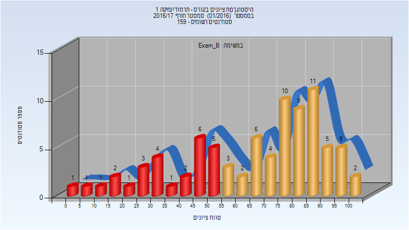

| סטודנטים | עברו/נכשלו | אחוז עוברים | ציון מינימלי | ציון מקסימלי | ממוצע | חציון |
| ---- | ---- | ---- | ---- | ---- | ---- | ---- |
| 84 | 57/27 | 68 | 4 | 100 | 66.036 | 74 |

### סופי מועד ב'

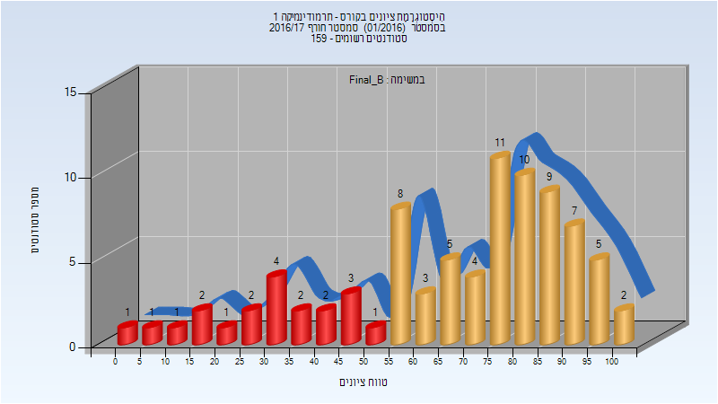

| סטודנטים | עברו/נכשלו | אחוז עוברים | ציון מינימלי | ציון מקסימלי | ממוצע | חציון |
| ---- | ---- | ---- | ---- | ---- | ---- | ---- |
| 84 | 64/20 | 76 | 4 | 100 | 67.429 | 76 |

### סופי

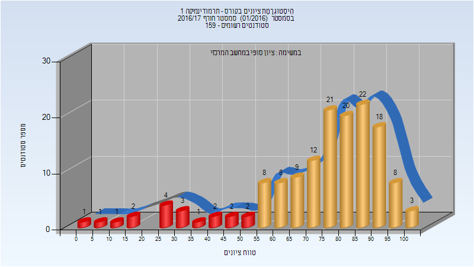

| סטודנטים | עברו/נכשלו | אחוז עוברים | ציון מינימלי | ציון מקסימלי | ממוצע | חציון |
| ---- | ---- | ---- | ---- | ---- | ---- | ---- |
| 148 | 129/19 | 87 | 4 | 100 | 73.662 | 79 |

## אביב 2017

| איש סגל | תפקיד |
| ---- | ---- |
| שפירא מיכאל | מרצה - אחראי מקצוע |
| פארן ארנון | מתרגל - עם הרשאות מרצה אחראי |

### מבחן מועד א'

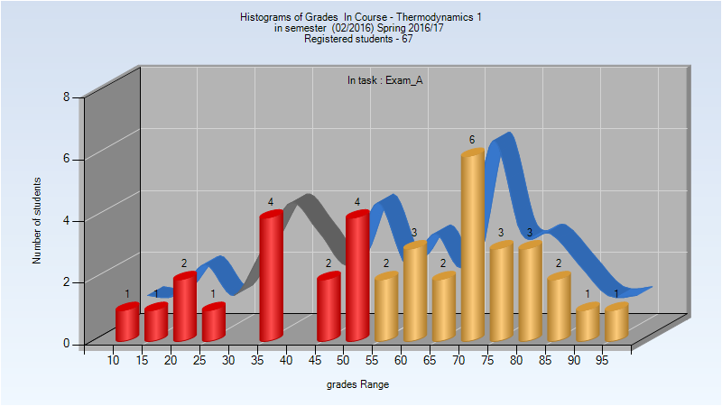

| סטודנטים | עברו/נכשלו | אחוז עוברים | ציון מינימלי | ציון מקסימלי | ממוצע | חציון |
| ---- | ---- | ---- | ---- | ---- | ---- | ---- |
| 38 | 23/15 | 61 | 14 | 95 | 59.421 | 63 |

### סופי מועד א'

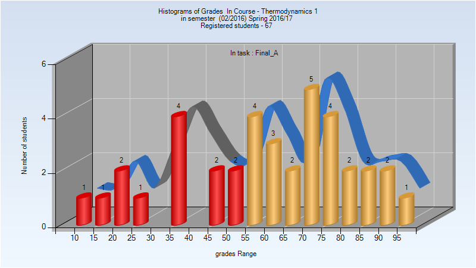

| סטודנטים | עברו/נכשלו | אחוז עוברים | ציון מינימלי | ציון מקסימלי | ממוצע | חציון |
| ---- | ---- | ---- | ---- | ---- | ---- | ---- |
| 38 | 25/13 | 66 | 14 | 95 | 59.921 | 63 |

### סופי מועד ב'

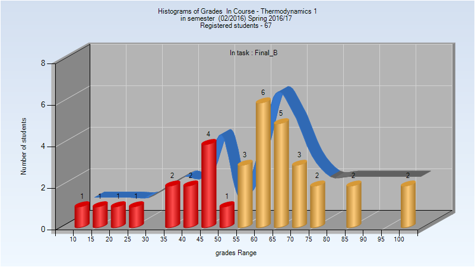

| סטודנטים | עברו/נכשלו | אחוז עוברים | ציון מינימלי | ציון מקסימלי | ממוצע | חציון |
| ---- | ---- | ---- | ---- | ---- | ---- | ---- |
| 36 | 23/13 | 64 | 12 | 100 | 58.417 | 61.5 |

### סופי

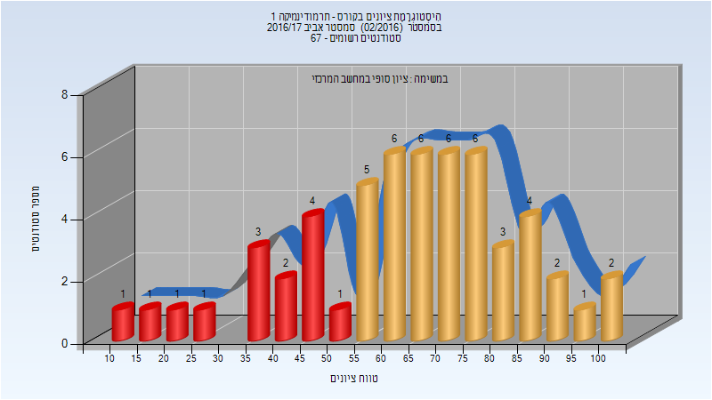

| סטודנטים | עברו/נכשלו | אחוז עוברים | ציון מינימלי | ציון מקסימלי | ממוצע | חציון |
| ---- | ---- | ---- | ---- | ---- | ---- | ---- |
| 55 | 41/14 | 75 | 12 | 100 | 64.309 | 66 |

## חורף 2017-2018

| איש סגל | תפקיד |
| ---- | ---- |
| ואן האוט רנה | מרצה - אחראי מקצוע |
| טרטקובסקי לאוניד | מרצה |
| אייל אמנון | מתרגל - עם הרשאות מרצה אחראי |
| תחאוחו אנדי | מתרגל - עם הרשאות מרצה אחראי |

### מבחן מועד א'

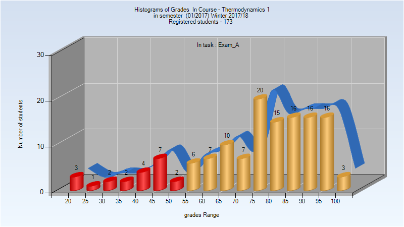

| סטודנטים | עברו/נכשלו | אחוז עוברים | ציון מינימלי | ציון מקסימלי | ממוצע | חציון |
| ---- | ---- | ---- | ---- | ---- | ---- | ---- |
| 137 | 116/21 | 85 | 20 | 100 | 74.956 | 78 |

### סופי מועד א'

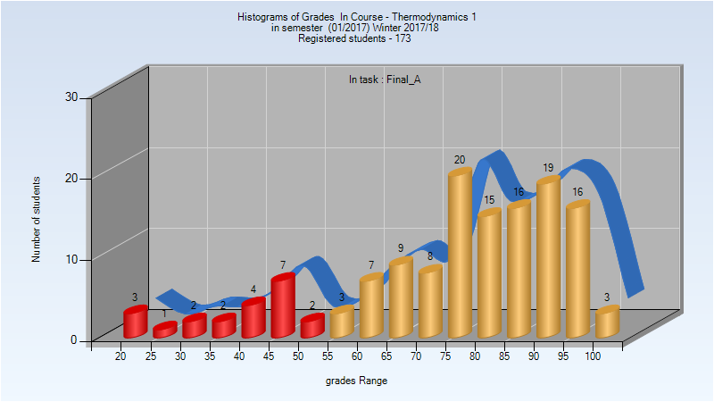

| סטודנטים | עברו/נכשלו | אחוז עוברים | ציון מינימלי | ציון מקסימלי | ממוצע | חציון |
| ---- | ---- | ---- | ---- | ---- | ---- | ---- |
| 137 | 116/21 | 85 | 20 | 100 | 75.701 | 80 |

### מבחן מועד ב'

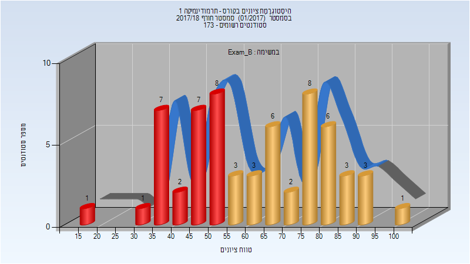

| סטודנטים | עברו/נכשלו | אחוז עוברים | ציון מינימלי | ציון מקסימלי | ממוצע | חציון |
| ---- | ---- | ---- | ---- | ---- | ---- | ---- |
| 61 | 35/26 | 57 | 15 | 100 | 62.049 | 62 |

### סופי מועד ב'

| סטודנטים | עברו/נכשלו | אחוז עוברים | ציון מינימלי | ציון מקסימלי | ממוצע | חציון |
| ---- | ---- | ---- | ---- | ---- | ---- | ---- |
| 61 | 35/26 | 57 | 15 | 100 | 62.361 | 62 |

### סופי

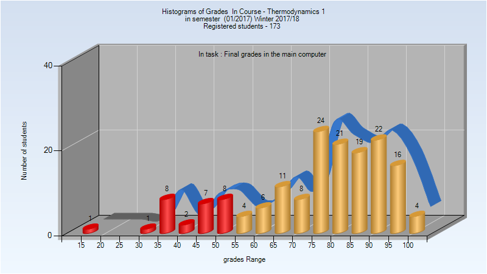

| סטודנטים | עברו/נכשלו | אחוז עוברים | ציון מינימלי | ציון מקסימלי | ממוצע | חציון |
| ---- | ---- | ---- | ---- | ---- | ---- | ---- |
| 162 | 135/27 | 83 | 15 | 100 | 75.907 | 80 |

## אביב 2018

| איש סגל | תפקיד |
| ---- | ---- |
| שפירא מיכאל | מרצה - אחראי מקצוע |
| גוטפינגר חיים | מרצה |
| אייל אמנון | מתרגל - עם הרשאות מרצה אחראי |

### מבחן מועד א'

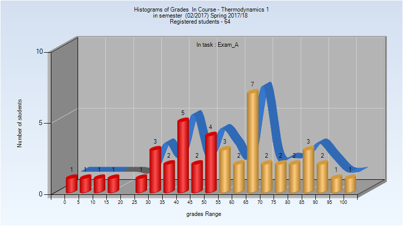

| סטודנטים | עברו/נכשלו | אחוז עוברים | ציון מינימלי | ציון מקסימלי | ממוצע | חציון |
| ---- | ---- | ---- | ---- | ---- | ---- | ---- |
| 46 | 25/21 | 54 | 4 | 100 | 57.109 | 58.5 |

### סופי מועד א'

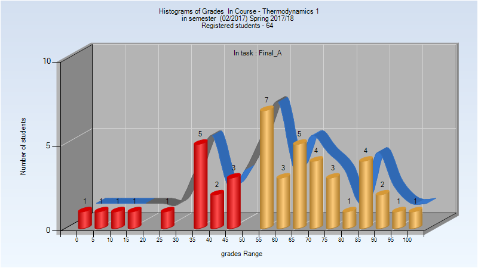

| סטודנטים | עברו/נכשלו | אחוז עוברים | ציון מינימלי | ציון מקסימלי | ממוצע | חציון |
| ---- | ---- | ---- | ---- | ---- | ---- | ---- |
| 46 | 31/15 | 67 | 4 | 100 | 59.413 | 61 |

### מבחן מועד ב'

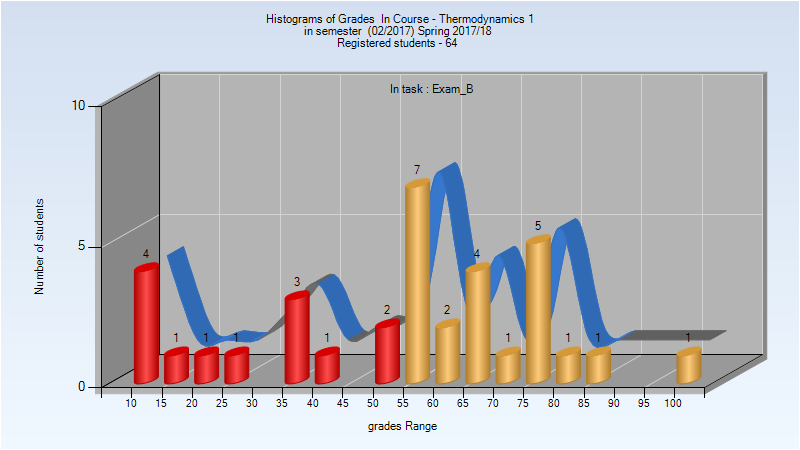

| סטודנטים | עברו/נכשלו | אחוז עוברים | ציון מינימלי | ציון מקסימלי | ממוצע | חציון |
| ---- | ---- | ---- | ---- | ---- | ---- | ---- |
| 35 | 22/13 | 63 | 12 | 100 | 54.171 | 56 |

### סופי מועד ב'

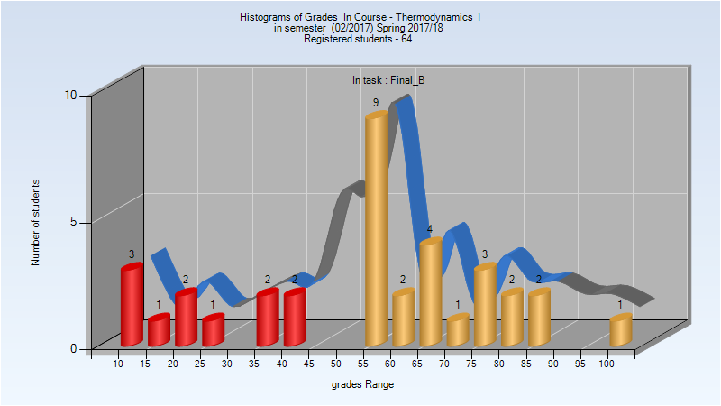

| סטודנטים | עברו/נכשלו | אחוז עוברים | ציון מינימלי | ציון מקסימלי | ממוצע | חציון |
| ---- | ---- | ---- | ---- | ---- | ---- | ---- |
| 35 | 24/11 | 69 | 12 | 100 | 55 | 57 |

### סופי

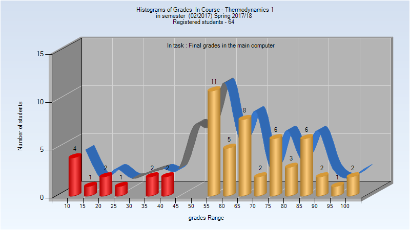

| סטודנטים | עברו/נכשלו | אחוז עוברים | ציון מינימלי | ציון מקסימלי | ממוצע | חציון |
| ---- | ---- | ---- | ---- | ---- | ---- | ---- |
| 58 | 46/12 | 79 | 11 | 100 | 62.483 | 65.5 |

## חורף 2018-2019

| איש סגל | תפקיד |
| ---- | ---- |
| טרטקובסקי לאוניד | מרצה - אחראי מקצוע |
| ואן האוט רנה | מרצה |
| דיסקין דוד | מתרגל - עם הרשאות מרצה אחראי |
| אייל אמנון | מתרגל - עם הרשאות מרצה אחראי |
| אשבל ליאור | מתרגל - עם הרשאות מרצה אחראי |
| תחאוחו אנדי | מתרגל - עם הרשאות מרצה אחראי |
| קייסר דוד | מתרגל - עם הרשאות מרצה אחראי |

### מבחן מועד א'

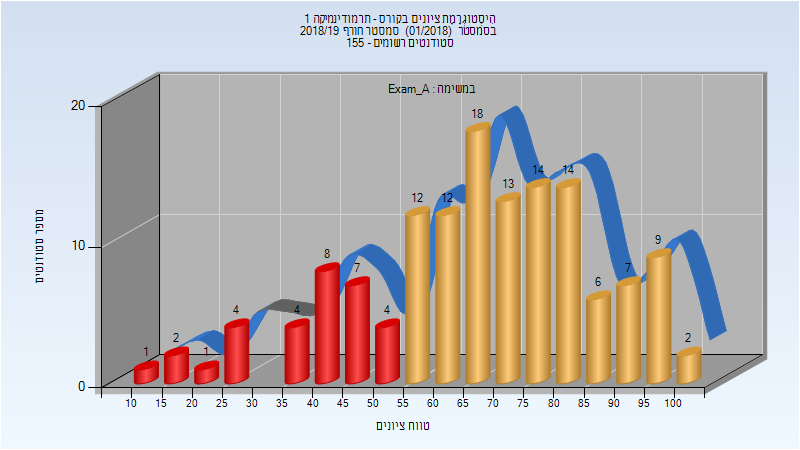

| סטודנטים | עברו/נכשלו | אחוז עוברים | ציון מינימלי | ציון מקסימלי | ממוצע | חציון |
| ---- | ---- | ---- | ---- | ---- | ---- | ---- |
| 138 | 107/31 | 78 | 10 | 100 | 67.058 | 69 |

### סופי מועד א'

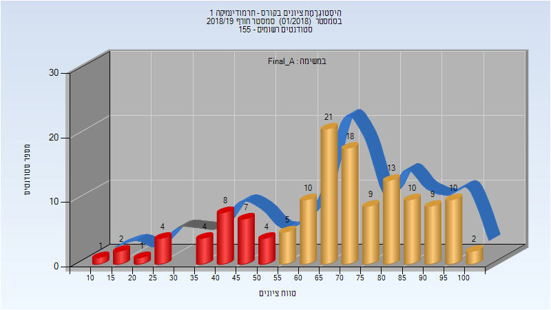

| סטודנטים | עברו/נכשלו | אחוז עוברים | ציון מינימלי | ציון מקסימלי | ממוצע | חציון |
| ---- | ---- | ---- | ---- | ---- | ---- | ---- |
| 138 | 107/31 | 78 | 10 | 100 | 68.406 | 70 |

### מבחן מועד ב'

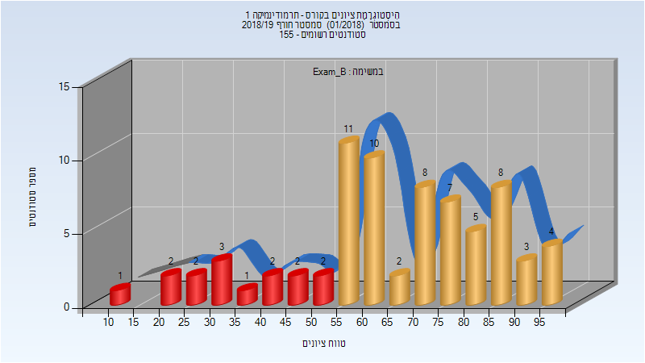

| סטודנטים | עברו/נכשלו | אחוז עוברים | ציון מינימלי | ציון מקסימלי | ממוצע | חציון |
| ---- | ---- | ---- | ---- | ---- | ---- | ---- |
| 73 | 58/15 | 79 | 12 | 98 | 65.603 | 65 |

### סופי מועד ב'

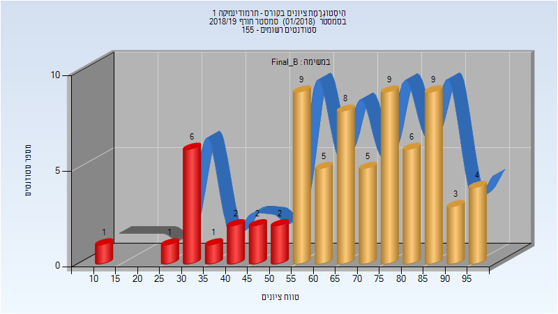

| סטודנטים | עברו/נכשלו | אחוז עוברים | ציון מינימלי | ציון מקסימלי | ממוצע | חציון |
| ---- | ---- | ---- | ---- | ---- | ---- | ---- |
| 73 | 58/15 | 79 | 12 | 98 | 67.014 | 68 |

### סופי

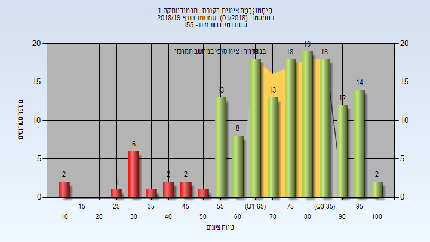

| סטודנטים | עברו/נכשלו | אחוז עוברים | ציון מינימלי | ציון מקסימלי | ממוצע | חציון |
| ---- | ---- | ---- | ---- | ---- | ---- | ---- |
| 150 | 135/15 | 90 | 10 | 100 | 73.753 | 76.5 |

## חורף 2019-2020

| איש סגל | תפקיד |
| ---- | ---- |
| ואן האוט רנה | מרצה - אחראי מקצוע |
| טרטקובסקי לאוניד | מרצה |
| דיסקין דוד | מתרגל - עם הרשאות מרצה אחראי |
| תחאוחו אנדי | מתרגל - עם הרשאות מרצה אחראי |
| קייסר דוד | מתרגל - עם הרשאות מרצה אחראי |
| רונן-מנוקובס רונה | מתרגל - עם הרשאות מרצה אחראי |
| אייל אמנון | מתרגל - עם הרשאות מרצה אחראי |

### מבחן מועד א'

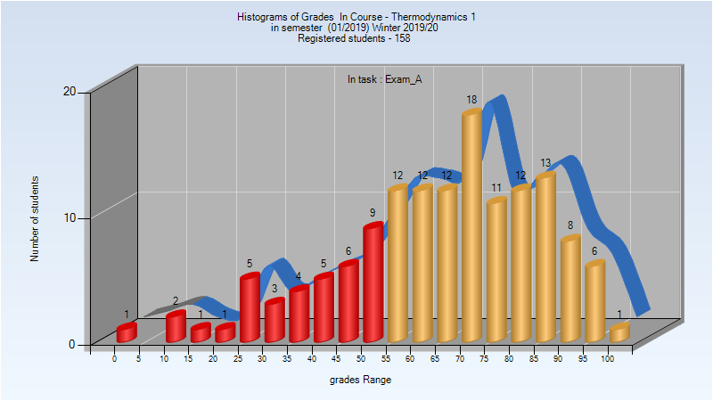

| סטודנטים | עברו/נכשלו | אחוז עוברים | ציון מינימלי | ציון מקסימלי | ממוצע | חציון |
| ---- | ---- | ---- | ---- | ---- | ---- | ---- |
| 142 | 105/37 | 74 | 0 | 100 | 65.366 | 69 |

### סופי מועד א'

| סטודנטים | עברו/נכשלו | אחוז עוברים | ציון מינימלי | ציון מקסימלי | ממוצע | חציון |
| ---- | ---- | ---- | ---- | ---- | ---- | ---- |
| 142 | 111/31 | 78 | 4 | 100 | 67.676 | 70.5 |

### מבחן מועד ב'

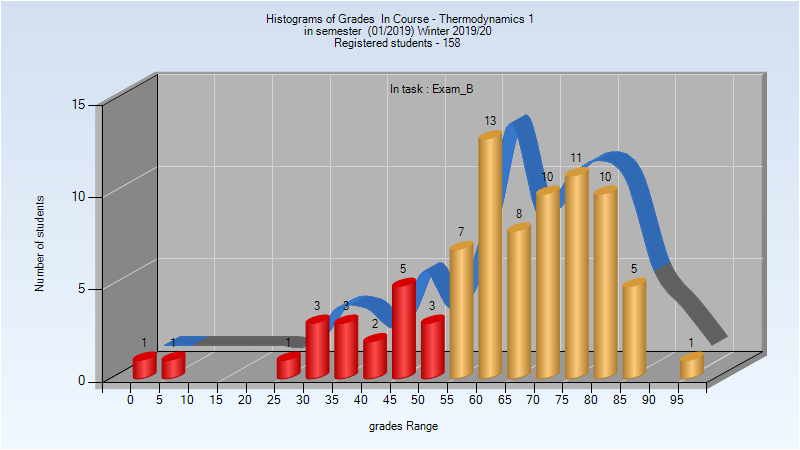

| סטודנטים | עברו/נכשלו | אחוז עוברים | ציון מינימלי | ציון מקסימלי | ממוצע | חציון |
| ---- | ---- | ---- | ---- | ---- | ---- | ---- |
| 84 | 65/19 | 77 | 1 | 96 | 63.952 | 68 |

### סופי מועד ב'

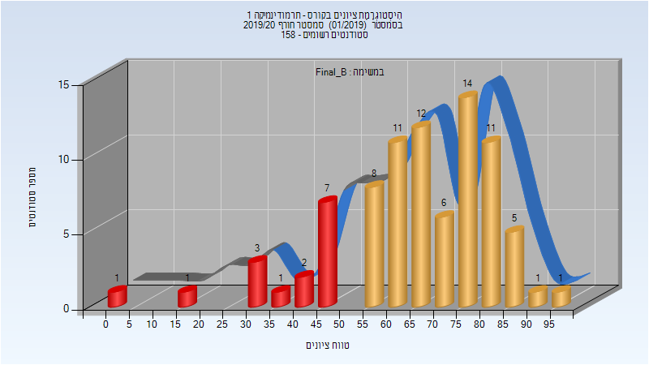

| סטודנטים | עברו/נכשלו | אחוז עוברים | ציון מינימלי | ציון מקסימלי | ממוצע | חציון |
| ---- | ---- | ---- | ---- | ---- | ---- | ---- |
| 84 | 69/15 | 82 | 1 | 96 | 65.619 | 68 |

### סופי

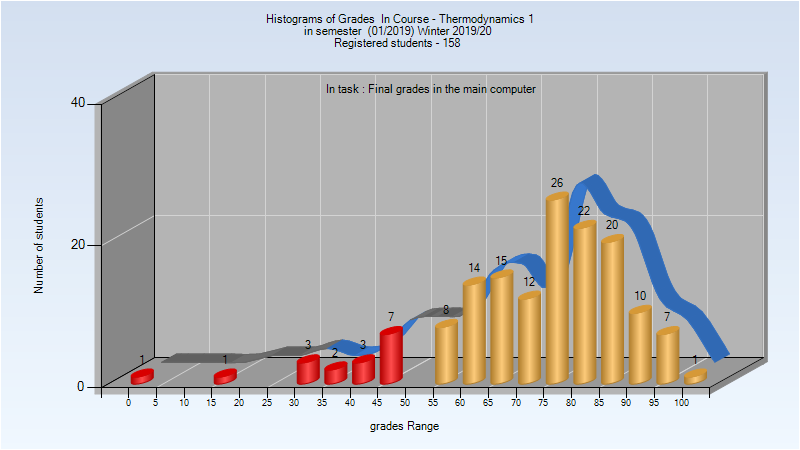

| סטודנטים | עברו/נכשלו | אחוז עוברים | ציון מינימלי | ציון מקסימלי | ממוצע | חציון |
| ---- | ---- | ---- | ---- | ---- | ---- | ---- |
| 152 | 136/16 | 89 | 1 | 100 | 72.829 | 76 |

## חורף 2020-2021

| איש סגל | תפקיד |
| ---- | ---- |
| טרטקובסקי לאוניד | מרצה - אחראי מקצוע |
| תחאוחו אנדי | מתרגל - עם הרשאות מרצה אחראי |
| אייל אמנון | מתרגל - עם הרשאות מרצה אחראי |
| קייסר דוד | מתרגל - עם הרשאות מרצה אחראי |
| דיסקין דוד | מתרגל - עם הרשאות מרצה אחראי |
| בונטין דניס | מתרגל - עם הרשאות מרצה אחראי |

### מבחן מועד א'

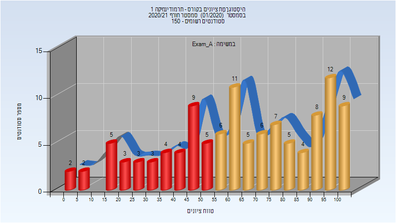

| סטודנטים | עברו/נכשלו | אחוז עוברים | ציון מינימלי | ציון מקסימלי | ממוצע | חציון |
| ---- | ---- | ---- | ---- | ---- | ---- | ---- |
| 114 | 73/41 | 64 | 1 | 100 | 63.675 | 64 |

### סופי מועד א'

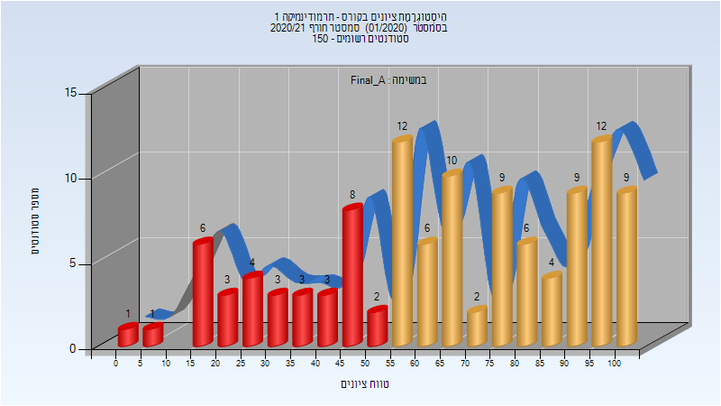

| סטודנטים | עברו/נכשלו | אחוז עוברים | ציון מינימלי | ציון מקסימלי | ממוצע | חציון |
| ---- | ---- | ---- | ---- | ---- | ---- | ---- |
| 114 | 80/34 | 70 | 1 | 100 | 65.272 | 65.5 |

### מבחן מועד ב'

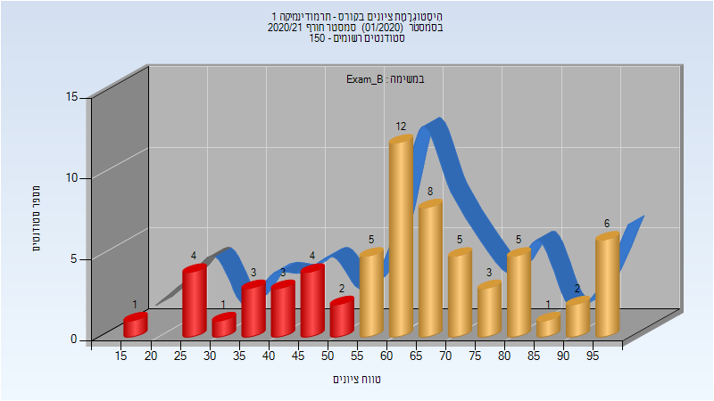

| סטודנטים | עברו/נכשלו | אחוז עוברים | ציון מינימלי | ציון מקסימלי | ממוצע | חציון |
| ---- | ---- | ---- | ---- | ---- | ---- | ---- |
| 66 | 48/18 | 73 | 16 | 98 | 63.576 | 63 |

### סופי מועד ב'

| סטודנטים | עברו/נכשלו | אחוז עוברים | ציון מינימלי | ציון מקסימלי | ממוצע | חציון |
| ---- | ---- | ---- | ---- | ---- | ---- | ---- |
| 66 | 49/17 | 74 | 16 | 98 | 64.197 | 64 |

### סופי

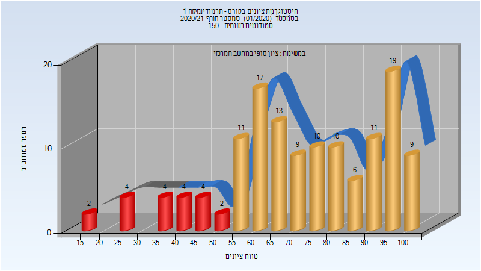

| סטודנטים | עברו/נכשלו | אחוז עוברים | ציון מינימלי | ציון מקסימלי | ממוצע | חציון |
| ---- | ---- | ---- | ---- | ---- | ---- | ---- |
| 135 | 115/20 | 85 | 16 | 100 | 72.726 | 73 |

