# 034039 - מעבדה בשיטות ניסוי

## חורף 2014-2015

| איש סגל | תפקיד |
| ---- | ---- |
| רוטשילד כרמל | מרצה - אחראי מקצוע |

### סופי

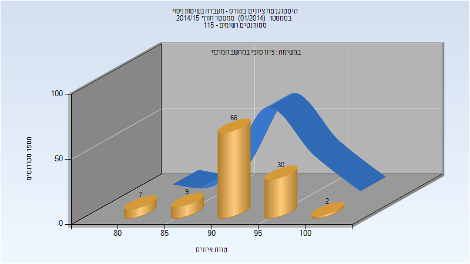

| סטודנטים | עברו/נכשלו | אחוז עוברים | ציון מינימלי | ציון מקסימלי | ממוצע | חציון |
| ---- | ---- | ---- | ---- | ---- | ---- | ---- |
| 114 | 114/0 | 100 | 80 | 100 | 92.149 | 93 |

## חורף 2016-2017

| איש סגל | תפקיד |
| ---- | ---- |
| רוטשילד כרמל | מרצה - אחראי מקצוע |

### סופי מועד א'

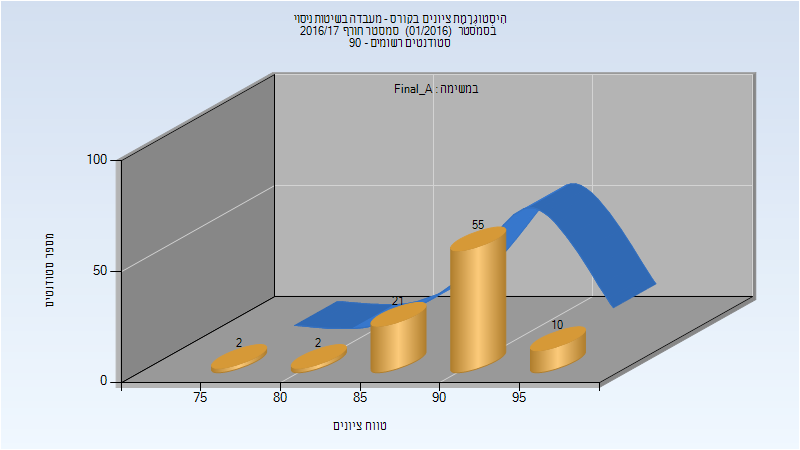

| סטודנטים | עברו/נכשלו | אחוז עוברים | ציון מינימלי | ציון מקסימלי | ממוצע | חציון |
| ---- | ---- | ---- | ---- | ---- | ---- | ---- |
| 90 | 90/0 | 100 | 78 | 97 | 90.7 | 92 |

### סופי

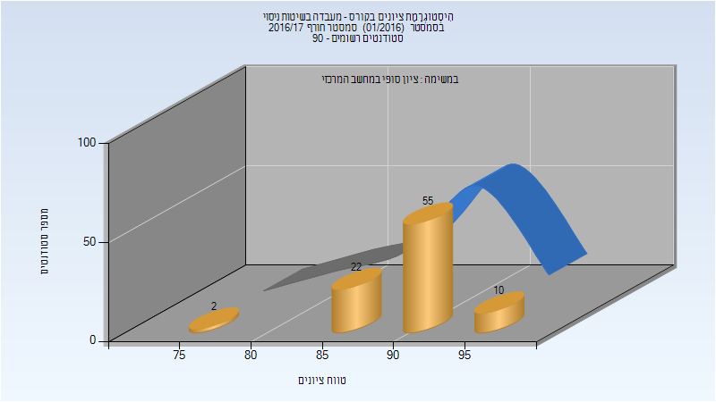

| סטודנטים | עברו/נכשלו | אחוז עוברים | ציון מינימלי | ציון מקסימלי | ממוצע | חציון |
| ---- | ---- | ---- | ---- | ---- | ---- | ---- |
| 89 | 89/0 | 100 | 78 | 97 | 90.933 | 92 |

## חורף 2017-2018

### סופי מועד א'

| סטודנטים | עברו/נכשלו | אחוז עוברים | ציון מינימלי | ציון מקסימלי | ממוצע | חציון |
| ---- | ---- | ---- | ---- | ---- | ---- | ---- |
| 70 | 70/0 | 100 | 83 | 97 | 91.243 | 91 |

### סופי

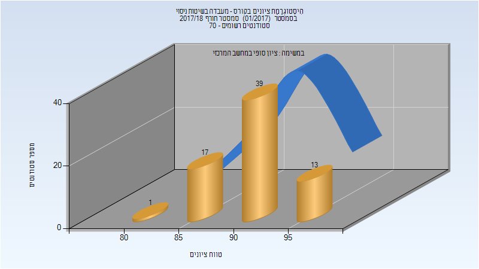

| סטודנטים | עברו/נכשלו | אחוז עוברים | ציון מינימלי | ציון מקסימלי | ממוצע | חציון |
| ---- | ---- | ---- | ---- | ---- | ---- | ---- |
| 70 | 70/0 | 100 | 83 | 97 | 91.243 | 91 |

## אביב 2018

| איש סגל | תפקיד |
| ---- | ---- |
| רוטשילד כרמל | מדריך מעבדה - עם הרשאות מרצה אחראי |
| קליגרמן יורי |  |

### סופי מועד א'

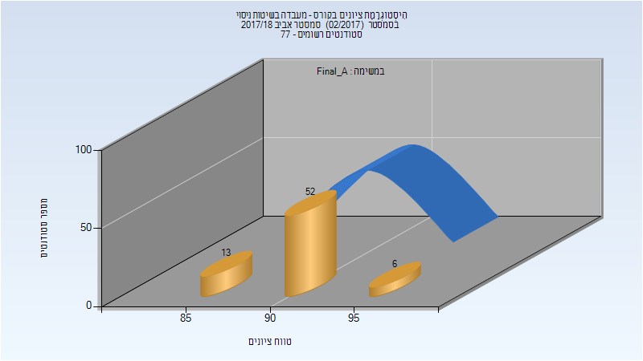

| סטודנטים | עברו/נכשלו | אחוז עוברים | ציון מינימלי | ציון מקסימלי | ממוצע | חציון |
| ---- | ---- | ---- | ---- | ---- | ---- | ---- |
| 71 | 71/0 | 100 | 85 | 95 | 91.197 | 91 |

### סופי

| סטודנטים | עברו/נכשלו | אחוז עוברים | ציון מינימלי | ציון מקסימלי | ממוצע | חציון |
| ---- | ---- | ---- | ---- | ---- | ---- | ---- |
| 76 | 76/0 | 100 | 81 | 100 | 90.789 | 91 |

## חורף 2018-2019

| איש סגל | תפקיד |
| ---- | ---- |
| רוטשילד כרמל | מדריך מעבדה - עם הרשאות מרצה אחראי |
| כרמון טל |  |
| כרמון יאיר |  |

### סופי מועד א'

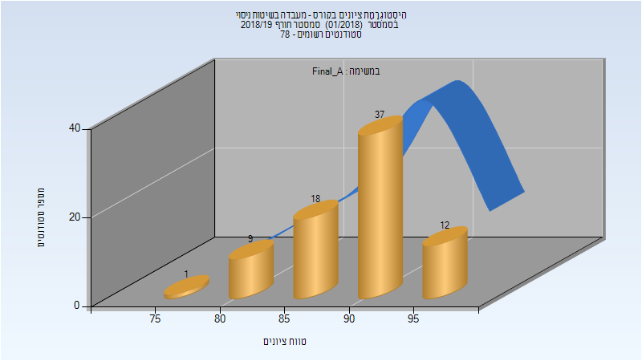

| סטודנטים | עברו/נכשלו | אחוז עוברים | ציון מינימלי | ציון מקסימלי | ממוצע | חציון |
| ---- | ---- | ---- | ---- | ---- | ---- | ---- |
| 77 | 77/0 | 100 | 79 | 97 | 89.909 | 91 |

### סופי

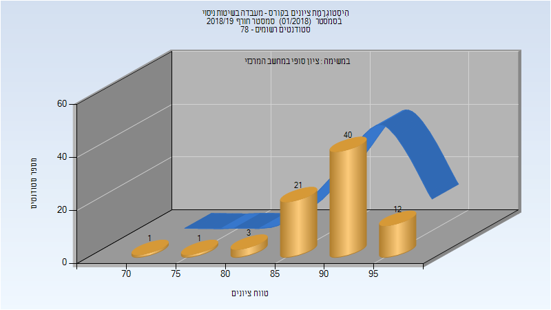

| סטודנטים | עברו/נכשלו | אחוז עוברים | ציון מינימלי | ציון מקסימלי | ממוצע | חציון |
| ---- | ---- | ---- | ---- | ---- | ---- | ---- |
| 78 | 78/0 | 100 | 74 | 97 | 90.397 | 91 |

## אביב 2019

| איש סגל | תפקיד |
| ---- | ---- |
| רוטשילד כרמל | מדריך מעבדה - עם הרשאות מרצה אחראי |
| קליגרמן יורי |  |

### סופי מועד א'

| סטודנטים | עברו/נכשלו | אחוז עוברים | ציון מינימלי | ציון מקסימלי | ממוצע | חציון |
| ---- | ---- | ---- | ---- | ---- | ---- | ---- |
| 101 | 101/0 | 100 | 85 | 98 | 92.941 | 93 |

### סופי

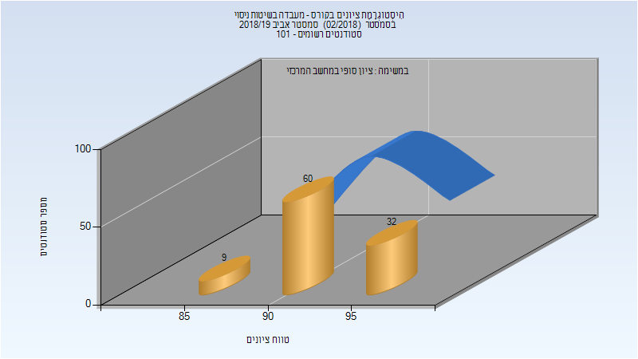

| סטודנטים | עברו/נכשלו | אחוז עוברים | ציון מינימלי | ציון מקסימלי | ממוצע | חציון |
| ---- | ---- | ---- | ---- | ---- | ---- | ---- |
| 101 | 101/0 | 100 | 85 | 98 | 92.941 | 93 |

## חורף 2019-2020

| איש סגל | תפקיד |
| ---- | ---- |
| רוטשילד כרמל | מדריך מעבדה - עם הרשאות מרצה אחראי |
| פינסקי דורון |  |
| כרמון טל |  |

### סופי מועד א'

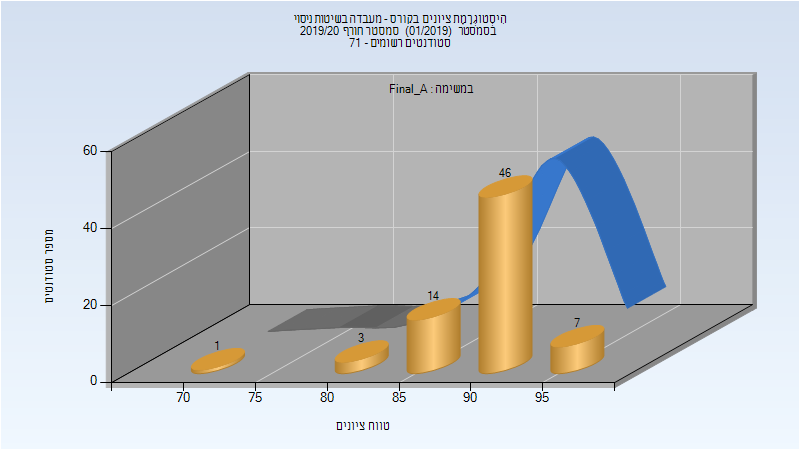

| סטודנטים | עברו/נכשלו | אחוז עוברים | ציון מינימלי | ציון מקסימלי | ממוצע | חציון |
| ---- | ---- | ---- | ---- | ---- | ---- | ---- |
| 71 | 71/0 | 100 | 74.987 | 95.612 | 91.502 | 92.191 |

### סופי

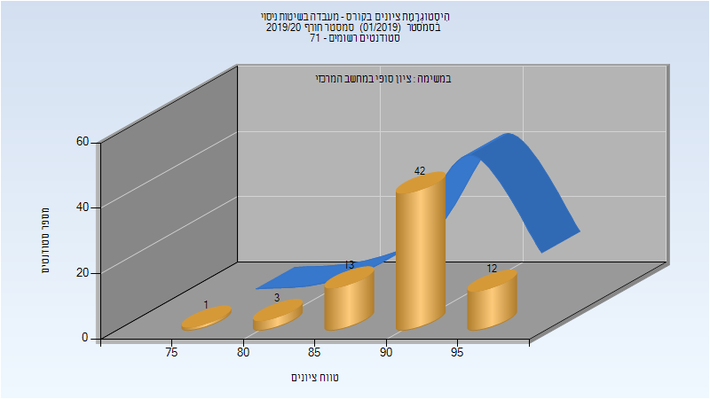

| סטודנטים | עברו/נכשלו | אחוז עוברים | ציון מינימלי | ציון מקסימלי | ממוצע | חציון |
| ---- | ---- | ---- | ---- | ---- | ---- | ---- |
| 71 | 71/0 | 100 | 75 | 96 | 91.437 | 92 |

## אביב 2020

| איש סגל | תפקיד |
| ---- | ---- |
| פינסקי דורון | מתרגל |
| רוטשילד כרמל | מדריך מעבדה - עם הרשאות מרצה אחראי |
| קליגרמן יורי |  |

### סופי מועד א'

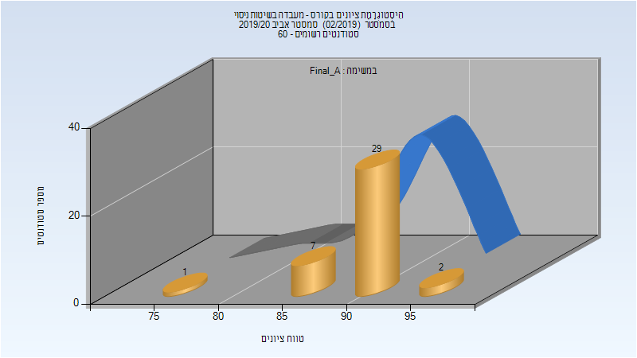

| סטודנטים | עברו/נכשלו | אחוז עוברים | ציון מינימלי | ציון מקסימלי | ממוצע | חציון |
| ---- | ---- | ---- | ---- | ---- | ---- | ---- |
| 39 | 39/0 | 100 | 76.25 | 96.75 | 91.693 | 92.2 |

### סופי

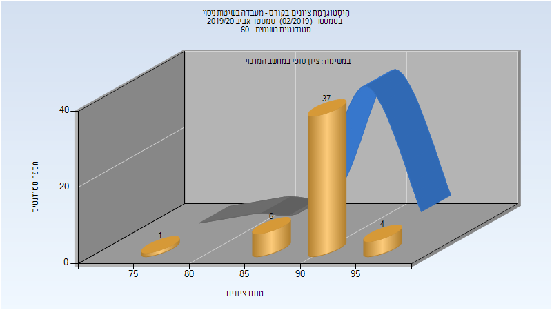

| סטודנטים | עברו/נכשלו | אחוז עוברים | ציון מינימלי | ציון מקסימלי | ממוצע | חציון |
| ---- | ---- | ---- | ---- | ---- | ---- | ---- |
| 49 | 49/0 | 100 | 76 | 97 | 91.551 | 92 |

## קיץ 2020

| איש סגל | תפקיד |
| ---- | ---- |
| רוטשילד כרמל | מדריך מעבדה - עם הרשאות מרצה אחראי |

### סופי

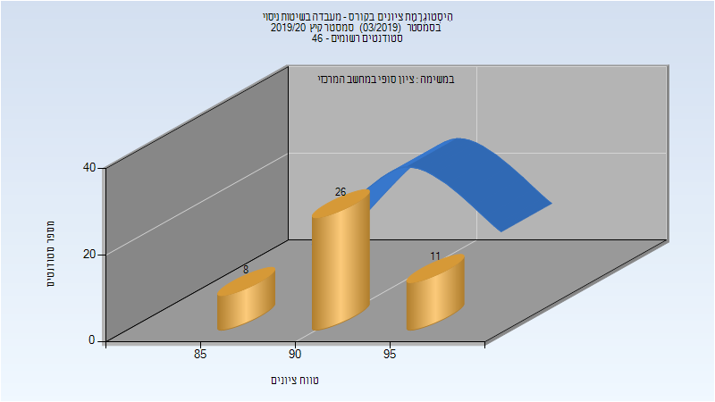

| סטודנטים | עברו/נכשלו | אחוז עוברים | ציון מינימלי | ציון מקסימלי | ממוצע | חציון |
| ---- | ---- | ---- | ---- | ---- | ---- | ---- |
| 45 | 45/0 | 100 | 85 | 98 | 92.756 | 94 |

## חורף 2020-2021

| איש סגל | תפקיד |
| ---- | ---- |
| פינסקי דורון | מתרגל |
| קליגרמן יורי |  |
| גומיד חאלד |  |
| רוטשילד כרמל |  |
| בוכר יצחק |  |

### סופי מועד א'

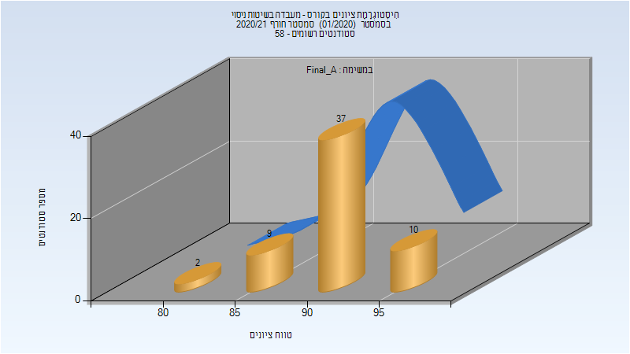

| סטודנטים | עברו/נכשלו | אחוז עוברים | ציון מינימלי | ציון מקסימלי | ממוצע | חציון |
| ---- | ---- | ---- | ---- | ---- | ---- | ---- |
| 58 | 58/0 | 100 | 83 | 98 | 92.103 | 92.5 |

### סופי

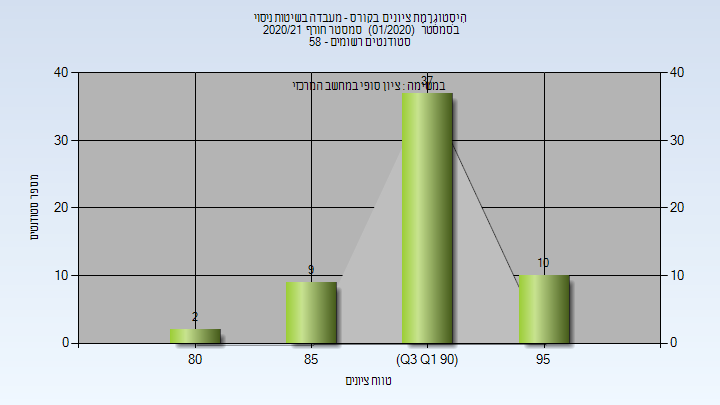

| סטודנטים | עברו/נכשלו | אחוז עוברים | ציון מינימלי | ציון מקסימלי | ממוצע | חציון |
| ---- | ---- | ---- | ---- | ---- | ---- | ---- |
| 58 | 58/0 | 100 | 83 | 98 | 92.103 | 92.5 |

