# 034042 - מבוא לשרטוט הנדסי

## חורף 2014-2015

### סופי

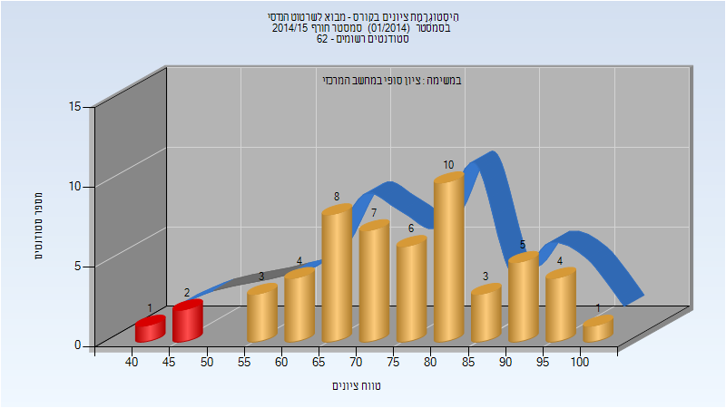

| סטודנטים | עברו/נכשלו | אחוז עוברים | ציון מינימלי | ציון מקסימלי | ממוצע | חציון |
| ---- | ---- | ---- | ---- | ---- | ---- | ---- |
| 54 | 51/3 | 94 | 44 | 100 | 75.63 | 77.5 |

## אביב 2015

| איש סגל | תפקיד |
| ---- | ---- |
| גורלי גיורא | מרצה - אחראי מקצוע |

### סופי

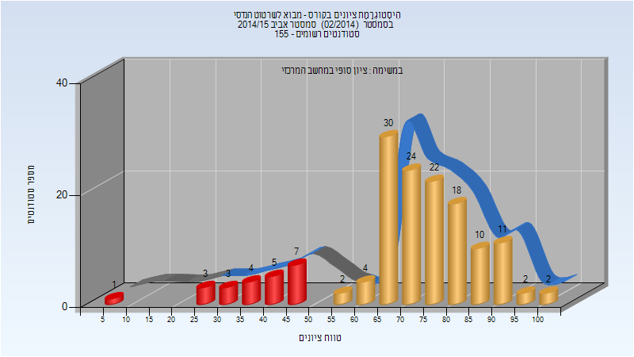

| סטודנטים | עברו/נכשלו | אחוז עוברים | ציון מינימלי | ציון מקסימלי | ממוצע | חציון |
| ---- | ---- | ---- | ---- | ---- | ---- | ---- |
| 148 | 125/23 | 84 | 6 | 100 | 70.514 | 72 |

## חורף 2015-2016

| איש סגל | תפקיד |
| ---- | ---- |
| גורלי גיורא | מרצה - אחראי מקצוע |

### סופי

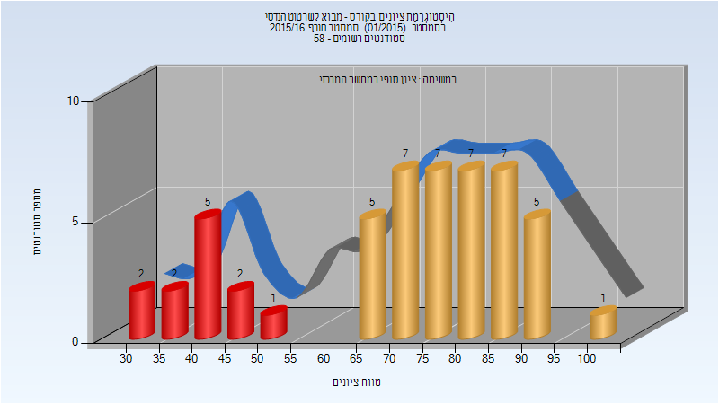

| סטודנטים | עברו/נכשלו | אחוז עוברים | ציון מינימלי | ציון מקסימלי | ממוצע | חציון |
| ---- | ---- | ---- | ---- | ---- | ---- | ---- |
| 51 | 39/12 | 76 | 30 | 100 | 70.863 | 75 |

## אביב 2016

| איש סגל | תפקיד |
| ---- | ---- |
| גורלי גיורא | מרצה - אחראי מקצוע |
| ריז'נסקי אורן | מתרגל - עם הרשאות מרצה אחראי |

### מבחן מועד א'

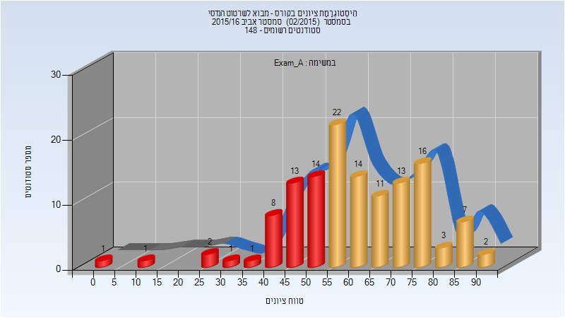

| סטודנטים | עברו/נכשלו | אחוז עוברים | ציון מינימלי | ציון מקסימלי | ממוצע | חציון |
| ---- | ---- | ---- | ---- | ---- | ---- | ---- |
| 129 | 88/41 | 68 | 0 | 93 | 61.109 | 60 |

### סופי מועד א'

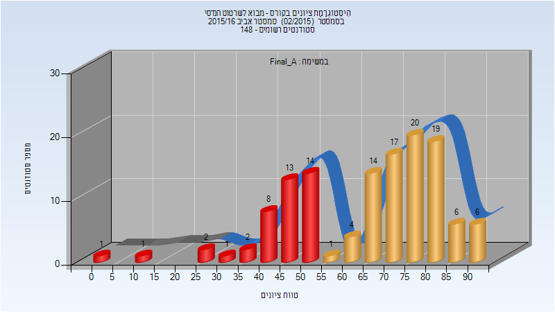

| סטודנטים | עברו/נכשלו | אחוז עוברים | ציון מינימלי | ציון מקסימלי | ממוצע | חציון |
| ---- | ---- | ---- | ---- | ---- | ---- | ---- |
| 129 | 87/42 | 67 | 0 | 94.8 | 66.313 | 70.65 |

### סופי מועד ב'

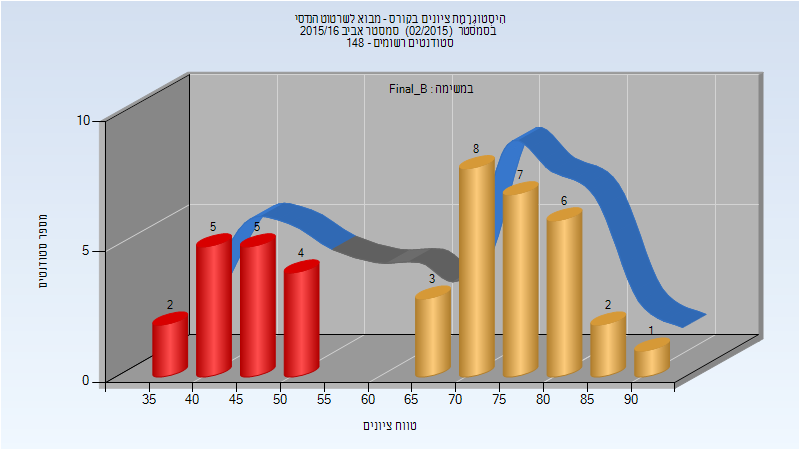

| סטודנטים | עברו/נכשלו | אחוז עוברים | ציון מינימלי | ציון מקסימלי | ממוצע | חציון |
| ---- | ---- | ---- | ---- | ---- | ---- | ---- |
| 43 | 27/16 | 63 | 36 | 91.17 | 65.317 | 71.83 |

### סופי

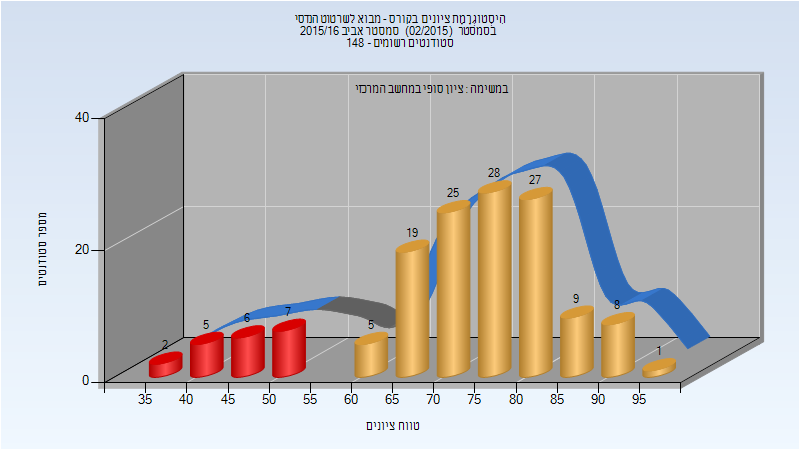

| סטודנטים | עברו/נכשלו | אחוז עוברים | ציון מינימלי | ציון מקסימלי | ממוצע | חציון |
| ---- | ---- | ---- | ---- | ---- | ---- | ---- |
| 142 | 122/20 | 86 | 38 | 95 | 72.732 | 75 |

## חורף 2016-2017

| איש סגל | תפקיד |
| ---- | ---- |
| גורלי גיורא | מרצה - אחראי מקצוע |
| ריז'נסקי אורן | מתרגל - עם הרשאות מרצה אחראי |
| שאוליאן הדר | מתרגל - עם הרשאות מרצה אחראי |

### מבחן מועד א'

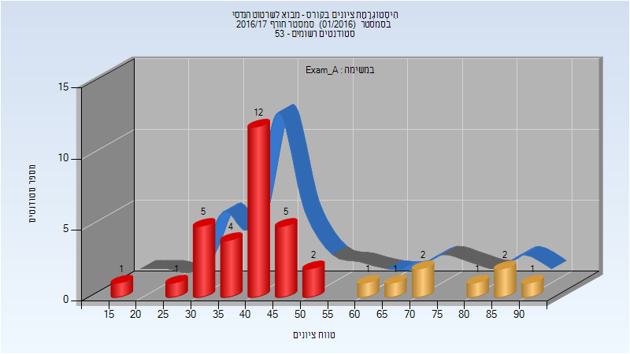

| סטודנטים | עברו/נכשלו | אחוז עוברים | ציון מינימלי | ציון מקסימלי | ממוצע | חציון |
| ---- | ---- | ---- | ---- | ---- | ---- | ---- |
| 38 | 8/30 | 21 | 15 | 90 | 47.816 | 43 |

### סופי מועד א'

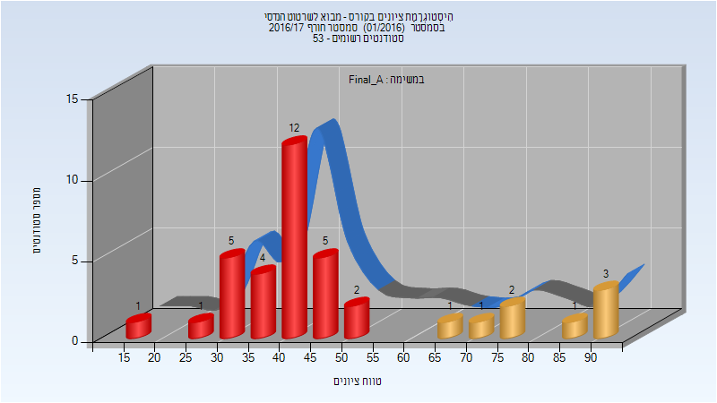

| סטודנטים | עברו/נכשלו | אחוז עוברים | ציון מינימלי | ציון מקסימלי | ממוצע | חציון |
| ---- | ---- | ---- | ---- | ---- | ---- | ---- |
| 38 | 8/30 | 21 | 15 | 90.98 | 48.638 | 43 |

### מבחן מועד ב'

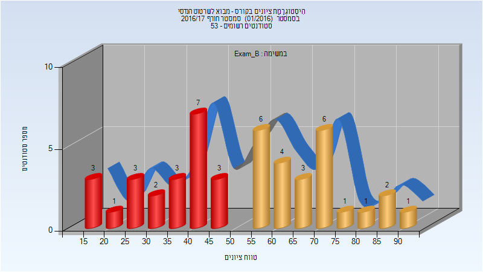

| סטודנטים | עברו/נכשלו | אחוז עוברים | ציון מינימלי | ציון מקסימלי | ממוצע | חציון |
| ---- | ---- | ---- | ---- | ---- | ---- | ---- |
| 46 | 24/22 | 52 | 15 | 90 | 52.304 | 55 |

### סופי מועד ב'

| סטודנטים | עברו/נכשלו | אחוז עוברים | ציון מינימלי | ציון מקסימלי | ממוצע | חציון |
| ---- | ---- | ---- | ---- | ---- | ---- | ---- |
| 46 | 24/22 | 52 | 15 | 90.98 | 54.695 | 58 |

### סופי

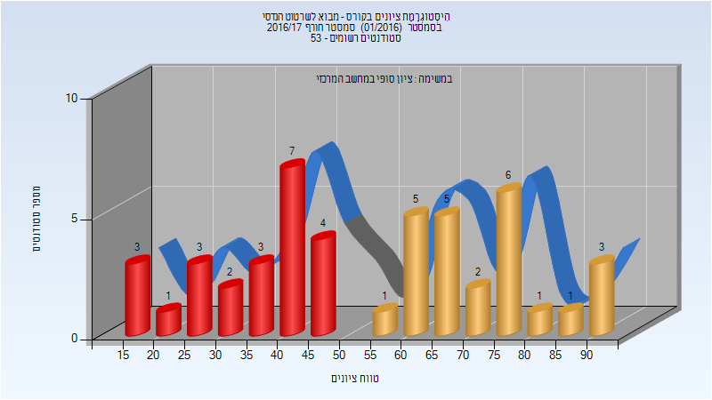

| סטודנטים | עברו/נכשלו | אחוז עוברים | ציון מינימלי | ציון מקסימלי | ממוצע | חציון |
| ---- | ---- | ---- | ---- | ---- | ---- | ---- |
| 47 | 24/23 | 51 | 15 | 91 | 54.574 | 49 |

## אביב 2017

| איש סגל | תפקיד |
| ---- | ---- |
| גורלי גיורא | מרצה - אחראי מקצוע |
| גלבוע ירון | מתרגל - עם הרשאות מרצה אחראי |
| ריז'נסקי אורן | מתרגל - עם הרשאות מרצה אחראי |
| שאוליאן הדר | מתרגל - עם הרשאות מרצה אחראי |

### מבחן מועד א'

| סטודנטים | עברו/נכשלו | אחוז עוברים | ציון מינימלי | ציון מקסימלי | ממוצע | חציון |
| ---- | ---- | ---- | ---- | ---- | ---- | ---- |
| 151 | 98/53 | 65 | 12 | 100 | 64.751 | 66.49 |

### סופי מועד א'

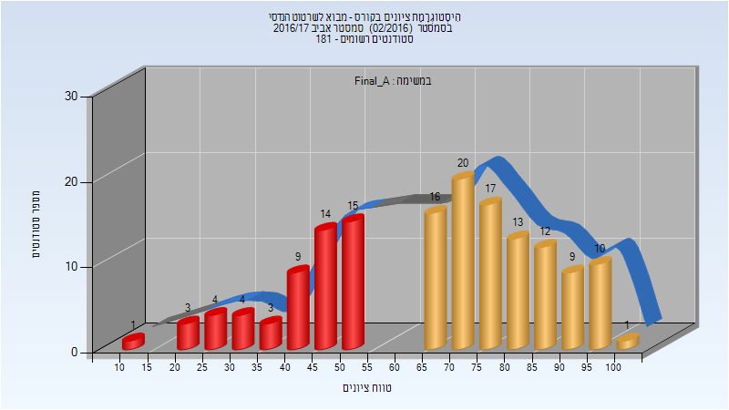

| סטודנטים | עברו/נכשלו | אחוז עוברים | ציון מינימלי | ציון מקסימלי | ממוצע | חציון |
| ---- | ---- | ---- | ---- | ---- | ---- | ---- |
| 151 | 98/53 | 65 | 12 | 100 | 67.159 | 72.407 |

### סופי מועד ב'

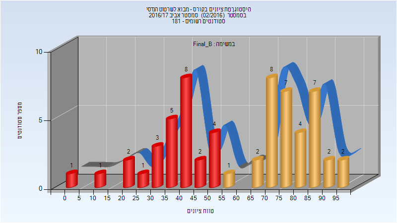

| סטודנטים | עברו/נכשלו | אחוז עוברים | ציון מינימלי | ציון מקסימלי | ממוצע | חציון |
| ---- | ---- | ---- | ---- | ---- | ---- | ---- |
| 60 | 33/27 | 55 | 0 | 99.886 | 60.551 | 68.9435 |

### סופי

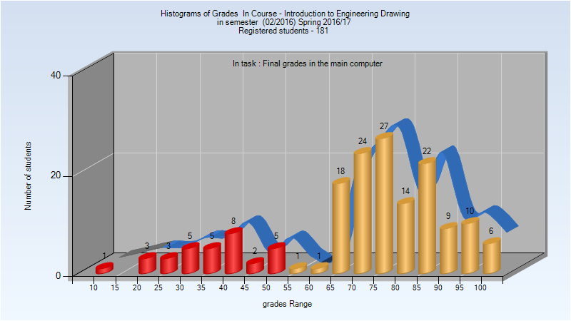

| סטודנטים | עברו/נכשלו | אחוז עוברים | ציון מינימלי | ציון מקסימלי | ממוצע | חציון |
| ---- | ---- | ---- | ---- | ---- | ---- | ---- |
| 164 | 132/32 | 80 | 11 | 100 | 71.841 | 75 |

## חורף 2017-2018

| איש סגל | תפקיד |
| ---- | ---- |
| דרימר נתאי | מרצה - אחראי מקצוע |
| ריז'נסקי אורן | מתרגל - עם הרשאות מרצה אחראי |

### מבחן מועד א'

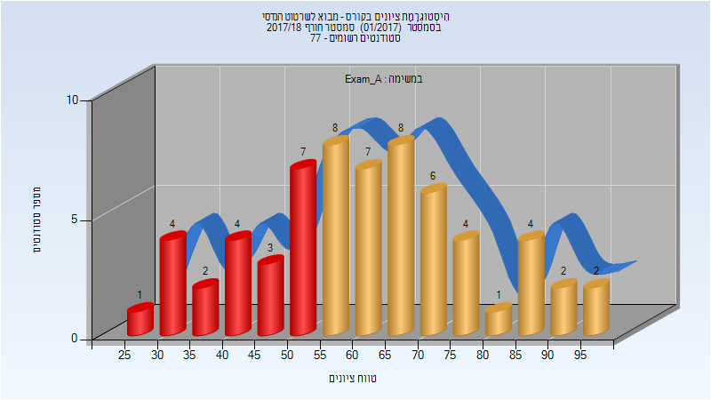

| סטודנטים | עברו/נכשלו | אחוז עוברים | ציון מינימלי | ציון מקסימלי | ממוצע | חציון |
| ---- | ---- | ---- | ---- | ---- | ---- | ---- |
| 63 | 42/21 | 67 | 26 | 98 | 61.603 | 62 |

### סופי מועד א'

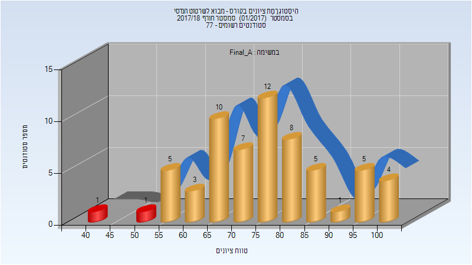

| סטודנטים | עברו/נכשלו | אחוז עוברים | ציון מינימלי | ציון מקסימלי | ממוצע | חציון |
| ---- | ---- | ---- | ---- | ---- | ---- | ---- |
| 62 | 60/2 | 97 | 42.05 | 100 | 76.681 | 76.4 |

### מבחן מועד ב'

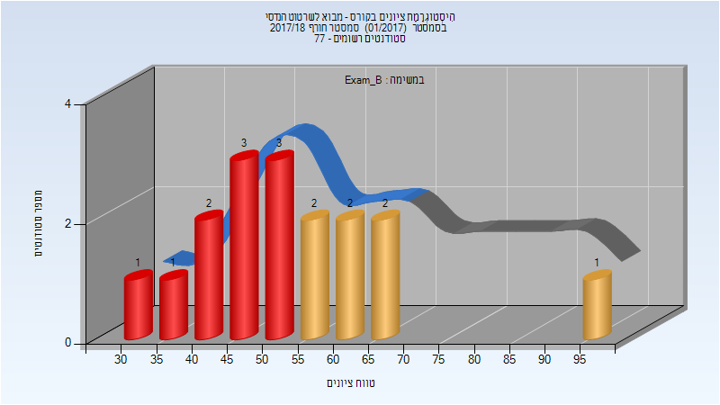

| סטודנטים | עברו/נכשלו | אחוז עוברים | ציון מינימלי | ציון מקסימלי | ממוצע | חציון |
| ---- | ---- | ---- | ---- | ---- | ---- | ---- |
| 17 | 7/10 | 41 | 34 | 96 | 54.176 | 52 |

### סופי מועד ב'

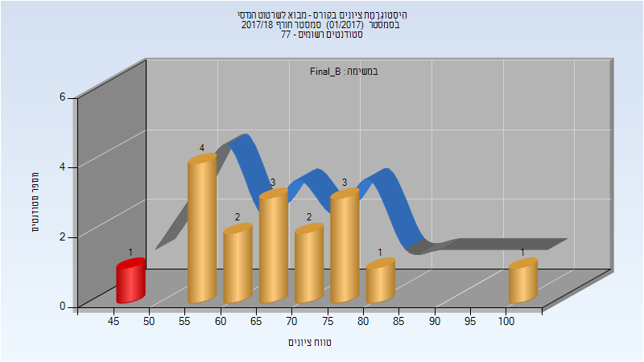

| סטודנטים | עברו/נכשלו | אחוז עוברים | ציון מינימלי | ציון מקסימלי | ממוצע | חציון |
| ---- | ---- | ---- | ---- | ---- | ---- | ---- |
| 17 | 16/1 | 94 | 48 | 100 | 68.824 | 68.8 |

### סופי

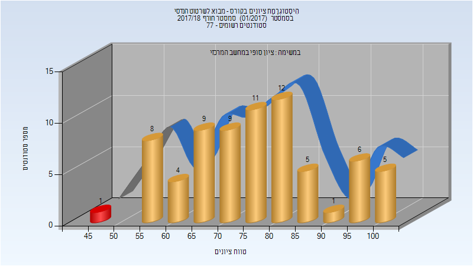

| סטודנטים | עברו/נכשלו | אחוז עוברים | ציון מינימלי | ציון מקסימלי | ממוצע | חציון |
| ---- | ---- | ---- | ---- | ---- | ---- | ---- |
| 71 | 70/1 | 99 | 48 | 100 | 76.676 | 76 |

## אביב 2018

| איש סגל | תפקיד |
| ---- | ---- |
| דרימר נתאי | מרצה - אחראי מקצוע |
| בירן אדריאן | מרצה |
| אוסטרומוחוב נדיה | מתרגל - עם הרשאות מרצה אחראי |
| ריז'נסקי אורן | מתרגל - עם הרשאות מרצה אחראי |
| שאוליאן הדר | מתרגל - עם הרשאות מרצה אחראי |
| דונאיביץ לב | מתרגל - עם הרשאות מרצה אחראי |

### מבחן מועד א'

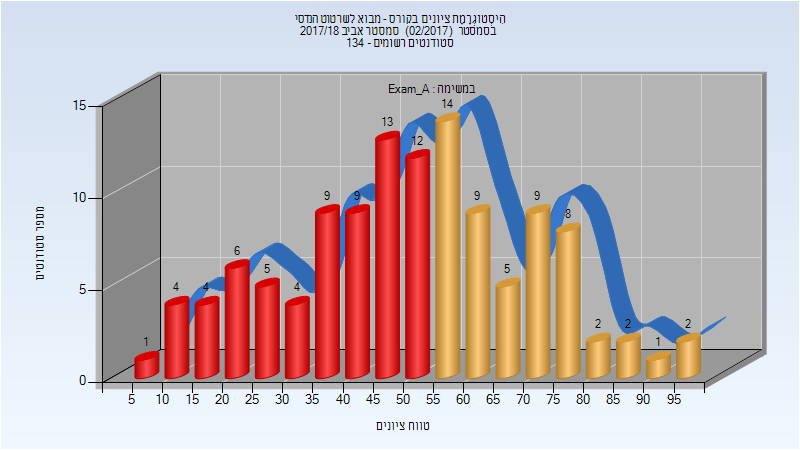

| סטודנטים | עברו/נכשלו | אחוז עוברים | ציון מינימלי | ציון מקסימלי | ממוצע | חציון |
| ---- | ---- | ---- | ---- | ---- | ---- | ---- |
| 119 | 52/67 | 44 | 7 | 96 | 50.79 | 51 |

### סופי מועד א'

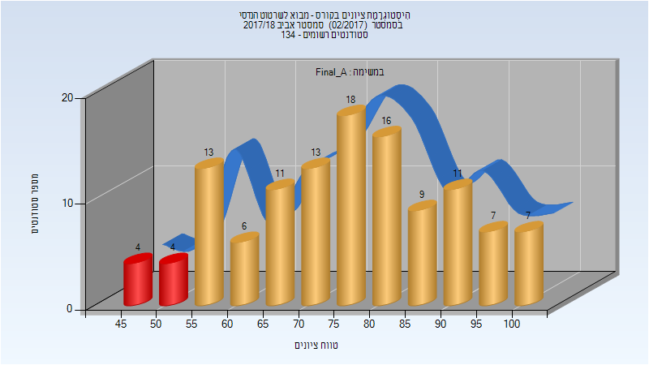

| סטודנטים | עברו/נכשלו | אחוז עוברים | ציון מינימלי | ציון מקסימלי | ממוצע | חציון |
| ---- | ---- | ---- | ---- | ---- | ---- | ---- |
| 119 | 111/8 | 93 | 45.64 | 100 | 76.438 | 76.85 |

### מבחן מועד ב'

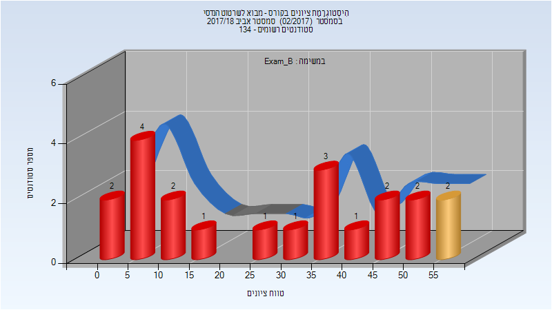

| סטודנטים | עברו/נכשלו | אחוז עוברים | ציון מינימלי | ציון מקסימלי | ממוצע | חציון |
| ---- | ---- | ---- | ---- | ---- | ---- | ---- |
| 21 | 2/19 | 10 | 2 | 59 | 28.667 | 30 |

### סופי מועד ב'

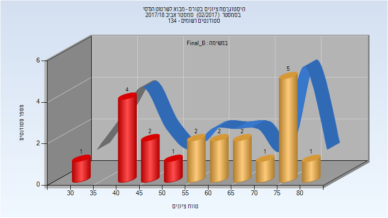

| סטודנטים | עברו/נכשלו | אחוז עוברים | ציון מינימלי | ציון מקסימלי | ממוצע | חציון |
| ---- | ---- | ---- | ---- | ---- | ---- | ---- |
| 21 | 13/8 | 62 | 30.4 | 82.01 | 60.359 | 62.04 |

### סופי

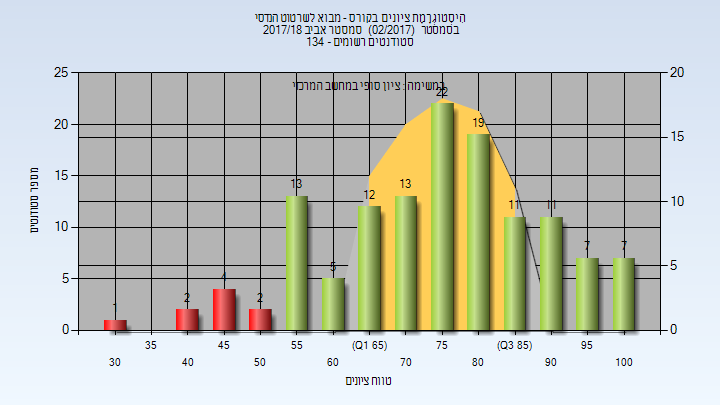

| סטודנטים | עברו/נכשלו | אחוז עוברים | ציון מינימלי | ציון מקסימלי | ממוצע | חציון |
| ---- | ---- | ---- | ---- | ---- | ---- | ---- |
| 129 | 120/9 | 93 | 30 | 100 | 75.992 | 77 |

## אביב 2019

| איש סגל | תפקיד |
| ---- | ---- |
| דרימר נתאי | מרצה - אחראי מקצוע |
| שאוליאן הדר | מתרגל - עם הרשאות מרצה אחראי |
| ריז'נסקי אורן | מתרגל - עם הרשאות מרצה אחראי |
| אוסטרומוחוב נדיה | מתרגל - עם הרשאות מרצה אחראי |

### מבחן מועד א'

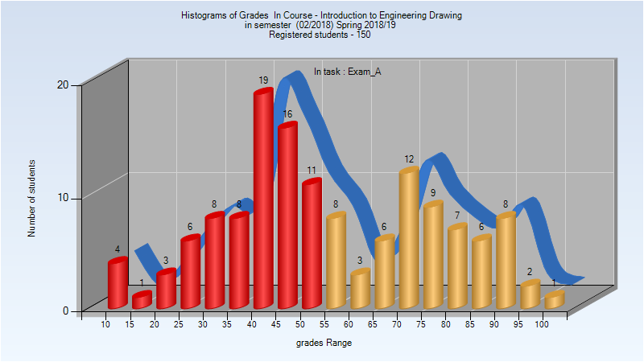

| סטודנטים | עברו/נכשלו | אחוז עוברים | ציון מינימלי | ציון מקסימלי | ממוצע | חציון |
| ---- | ---- | ---- | ---- | ---- | ---- | ---- |
| 138 | 62/76 | 45 | 13 | 100 | 55.623 | 52 |

### סופי מועד א'

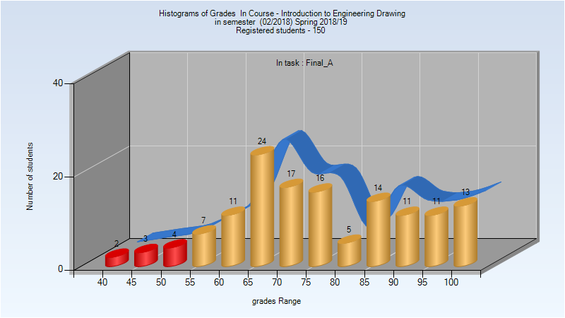

| סטודנטים | עברו/נכשלו | אחוז עוברים | ציון מינימלי | ציון מקסימלי | ממוצע | חציון |
| ---- | ---- | ---- | ---- | ---- | ---- | ---- |
| 138 | 129/9 | 93 | 43.3 | 100 | 77.109 | 75.267 |

### מבחן מועד ב'

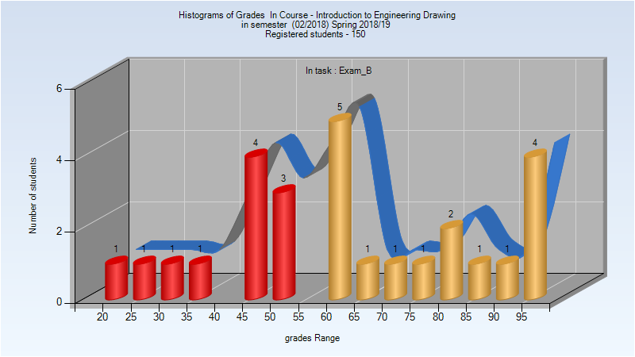

| סטודנטים | עברו/נכשלו | אחוז עוברים | ציון מינימלי | ציון מקסימלי | ממוצע | חציון |
| ---- | ---- | ---- | ---- | ---- | ---- | ---- |
| 27 | 16/11 | 59 | 24 | 97 | 63.889 | 61 |

### סופי מועד ב'

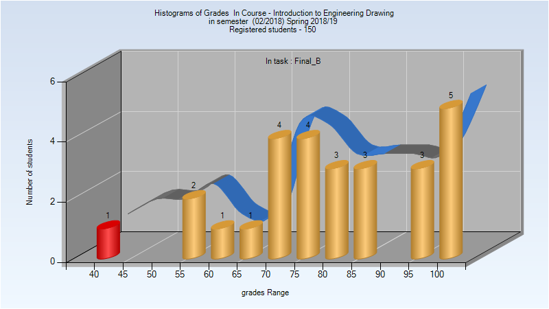

| סטודנטים | עברו/נכשלו | אחוז עוברים | ציון מינימלי | ציון מקסימלי | ממוצע | חציון |
| ---- | ---- | ---- | ---- | ---- | ---- | ---- |
| 27 | 26/1 | 96 | 40.667 | 100 | 80.728 | 79.267 |

### סופי

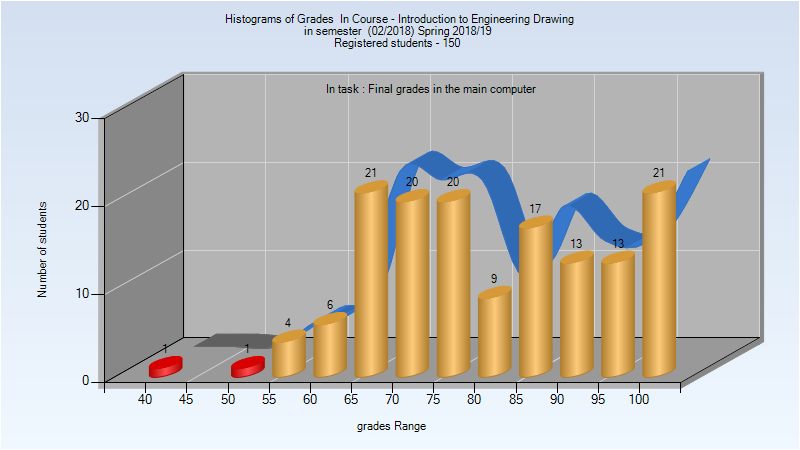

| סטודנטים | עברו/נכשלו | אחוז עוברים | ציון מינימלי | ציון מקסימלי | ממוצע | חציון |
| ---- | ---- | ---- | ---- | ---- | ---- | ---- |
| 146 | 144/2 | 99 | 41 | 100 | 81.185 | 79.5 |

## חורף 2019-2020

| איש סגל | תפקיד |
| ---- | ---- |
| בירן אדריאן | מרצה - אחראי מקצוע |
| אלמוגי בת-אל | מרצה |

## אביב 2020

| איש סגל | תפקיד |
| ---- | ---- |
| דרימר נתאי | מרצה - אחראי מקצוע |
| ריז'נסקי אורן | מתרגל - עם הרשאות מרצה אחראי |
| שאוליאן הדר | מתרגל - עם הרשאות מרצה אחראי |
| ורפמן בת חן | מתרגל - עם הרשאות מרצה אחראי |

### מבחן מועד א'

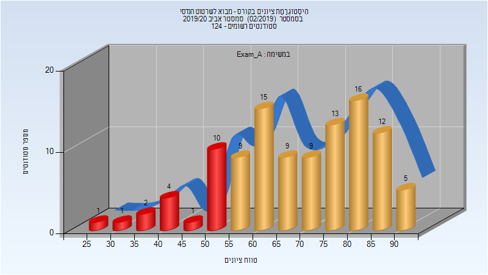

| סטודנטים | עברו/נכשלו | אחוז עוברים | ציון מינימלי | ציון מקסימלי | ממוצע | חציון |
| ---- | ---- | ---- | ---- | ---- | ---- | ---- |
| 107 | 88/19 | 82 | 26 | 93 | 69.131 | 70 |

### סופי מועד א'

| סטודנטים | עברו/נכשלו | אחוז עוברים | ציון מינימלי | ציון מקסימלי | ממוצע | חציון |
| ---- | ---- | ---- | ---- | ---- | ---- | ---- |
| 107 | 107/0 | 100 | 55.51 | 100 | 86.077 | 86.85 |

### מבחן מועד ב'

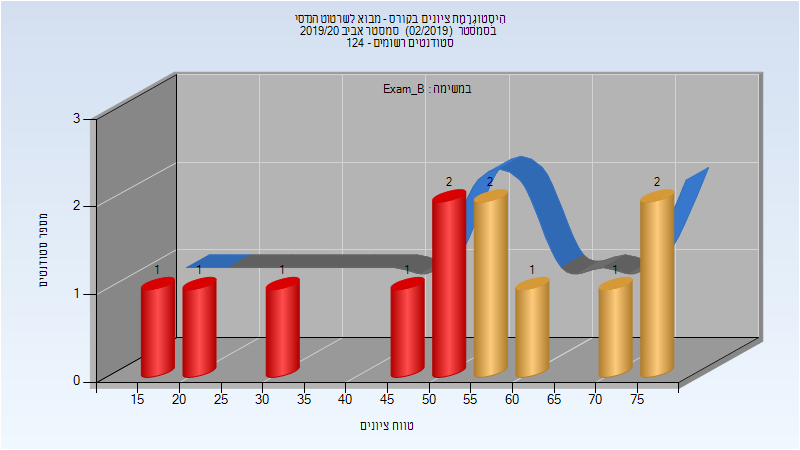

| סטודנטים | עברו/נכשלו | אחוז עוברים | ציון מינימלי | ציון מקסימלי | ממוצע | חציון |
| ---- | ---- | ---- | ---- | ---- | ---- | ---- |
| 12 | 6/6 | 50 | 19 | 78 | 52.333 | 53.5 |

### סופי מועד ב'

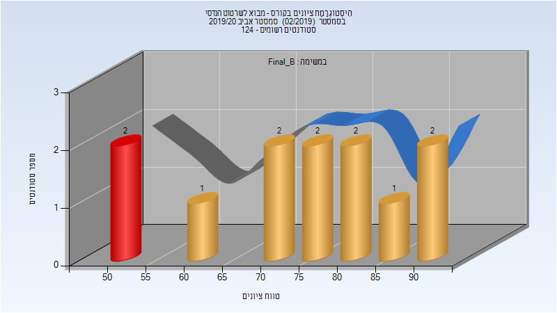

| סטודנטים | עברו/נכשלו | אחוז עוברים | ציון מינימלי | ציון מקסימלי | ממוצע | חציון |
| ---- | ---- | ---- | ---- | ---- | ---- | ---- |
| 12 | 10/2 | 83 | 51.7 | 93.33 | 75.383 | 76.135 |

### סופי

| סטודנטים | עברו/נכשלו | אחוז עוברים | ציון מינימלי | ציון מקסימלי | ממוצע | חציון |
| ---- | ---- | ---- | ---- | ---- | ---- | ---- |
| 117 | 116/1 | 99 | 52 | 100 | 85.427 | 87 |

