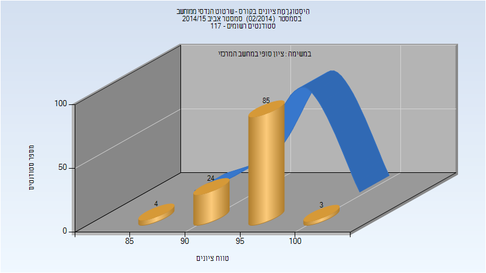

# 034043 - שרטוט הנדסי ממוחשב

## אביב 2015

### סופי

| סטודנטים | עברו/נכשלו | אחוז עוברים | ציון מינימלי | ציון מקסימלי | ממוצע | חציון |
| ---- | ---- | ---- | ---- | ---- | ---- | ---- |
| 116 | 116/0 | 100 | 88 | 100 | 95.586 | 96 |

## חורף 2017-2018

| איש סגל | תפקיד |
| ---- | ---- |
| לומברוזו אורן | מרצה - אחראי מקצוע |
| מושקוביץ יהב |  |
| דמצ'נקו איגור |  |

### סופי מועד א'

| סטודנטים | עברו/נכשלו | אחוז עוברים | ציון מינימלי | ציון מקסימלי | ממוצע | חציון |
| ---- | ---- | ---- | ---- | ---- | ---- | ---- |
| 141 | 141/0 | 100 | 90 | 99 | 96.305 | 96 |

### סופי

| סטודנטים | עברו/נכשלו | אחוז עוברים | ציון מינימלי | ציון מקסימלי | ממוצע | חציון |
| ---- | ---- | ---- | ---- | ---- | ---- | ---- |
| 141 | 141/0 | 100 | 90 | 99 | 96.305 | 96 |

## אביב 2018

| איש סגל | תפקיד |
| ---- | ---- |
| לומברוזו אורן | מרצה - אחראי מקצוע |
| דמצ'נקו איגור |  |

### סופי מועד א'

| סטודנטים | עברו/נכשלו | אחוז עוברים | ציון מינימלי | ציון מקסימלי | ממוצע | חציון |
| ---- | ---- | ---- | ---- | ---- | ---- | ---- |
| 39 | 39/0 | 100 | 92 | 99 | 96.487 | 96 |

### סופי

| סטודנטים | עברו/נכשלו | אחוז עוברים | ציון מינימלי | ציון מקסימלי | ממוצע | חציון |
| ---- | ---- | ---- | ---- | ---- | ---- | ---- |
| 39 | 39/0 | 100 | 92 | 99 | 96.487 | 96 |

## חורף 2018-2019

| איש סגל | תפקיד |
| ---- | ---- |
| לומברוזו אורן | מרצה - אחראי מקצוע |
| ריז'נסקי אורן |  |
| מושקוביץ יהב |  |
| דמצ'נקו איגור |  |

### סופי מועד א'

| סטודנטים | עברו/נכשלו | אחוז עוברים | ציון מינימלי | ציון מקסימלי | ממוצע | חציון |
| ---- | ---- | ---- | ---- | ---- | ---- | ---- |
| 112 | 112/0 | 100 | 84 | 100 | 95.286 | 96 |

### סופי

| סטודנטים | עברו/נכשלו | אחוז עוברים | ציון מינימלי | ציון מקסימלי | ממוצע | חציון |
| ---- | ---- | ---- | ---- | ---- | ---- | ---- |
| 112 | 112/0 | 100 | 84 | 100 | 95.286 | 96 |

## חורף 2019-2020

| איש סגל | תפקיד |
| ---- | ---- |
| לומברוזו אורן | מרצה - אחראי מקצוע |
| דמצ'נקו איגור |  |
| פוקשנסקי מיכאל |  |
| שאוליאן הדר |  |

### סופי מועד א'

| סטודנטים | עברו/נכשלו | אחוז עוברים | ציון מינימלי | ציון מקסימלי | ממוצע | חציון |
| ---- | ---- | ---- | ---- | ---- | ---- | ---- |
| 131 | 131/0 | 100 | 90 | 100 | 96.626 | 97 |

### סופי

| סטודנטים | עברו/נכשלו | אחוז עוברים | ציון מינימלי | ציון מקסימלי | ממוצע | חציון |
| ---- | ---- | ---- | ---- | ---- | ---- | ---- |
| 131 | 131/0 | 100 | 90 | 100 | 96.626 | 97 |

