# 034043 - שרטוט הנדסי ממוחשב

## אביב 2015

### סופי

| סטודנטים | עברו/נכשלו | אחוז עוברים | ציון מינימלי | ציון מקסימלי | ממוצע | חציון |
| ---- | ---- | ---- | ---- | ---- | ---- | ---- |
| 116 | 116/0 | 100 | 88 | 100 | 95.586 | 96 |

## חורף 2015-2016

### סופי

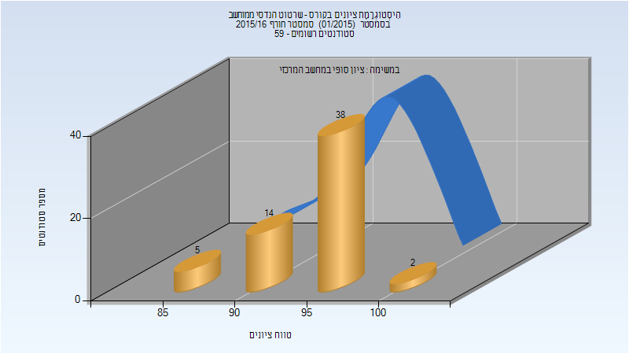

| סטודנטים | עברו/נכשלו | אחוז עוברים | ציון מינימלי | ציון מקסימלי | ממוצע | חציון |
| ---- | ---- | ---- | ---- | ---- | ---- | ---- |
| 59 | 59/0 | 100 | 86 | 100 | 94.847 | 96 |

## אביב 2016

| איש סגל | תפקיד |
| ---- | ---- |
| בהט אודי | מרצה - אחראי מקצוע |
| יאזמיר בוריס |  |

### סופי מועד א'

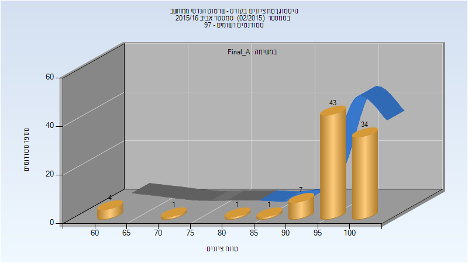

| סטודנטים | עברו/נכשלו | אחוז עוברים | ציון מינימלי | ציון מקסימלי | ממוצע | חציון |
| ---- | ---- | ---- | ---- | ---- | ---- | ---- |
| 91 | 91/0 | 100 | 62 | 100 | 95.912 | 98 |

### סופי

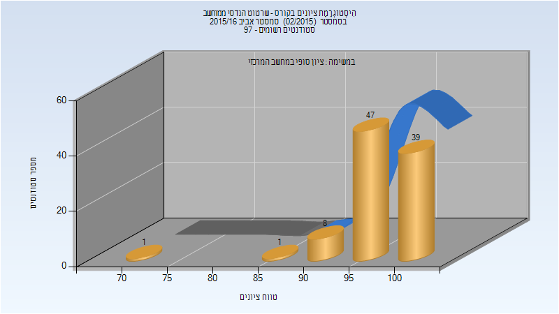

| סטודנטים | עברו/נכשלו | אחוז עוברים | ציון מינימלי | ציון מקסימלי | ממוצע | חציון |
| ---- | ---- | ---- | ---- | ---- | ---- | ---- |
| 96 | 96/0 | 100 | 74 | 100 | 97.667 | 99 |

## חורף 2016-2017

| איש סגל | תפקיד |
| ---- | ---- |
| לומברוזו אורן | מרצה - אחראי מקצוע |
| טולצ'ינסקי אריה | מרצה |
| ריז'נסקי אורן |  |
| דמצ'נקו איגור |  |
| יקר רע |  |

### סופי מועד א'

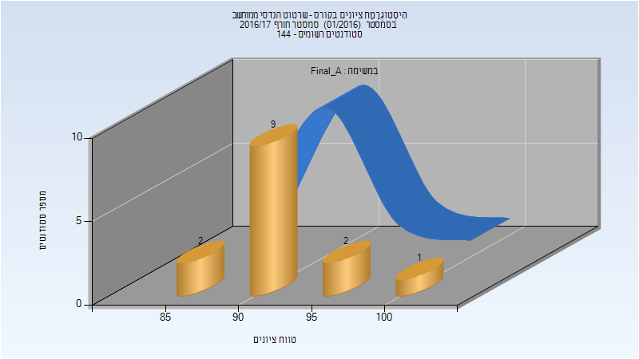

| סטודנטים | עברו/נכשלו | אחוז עוברים | ציון מינימלי | ציון מקסימלי | ממוצע | חציון |
| ---- | ---- | ---- | ---- | ---- | ---- | ---- |
| 14 | 14/0 | 100 | 85 | 100 | 92.786 | 92.5 |

### סופי מועד ב'

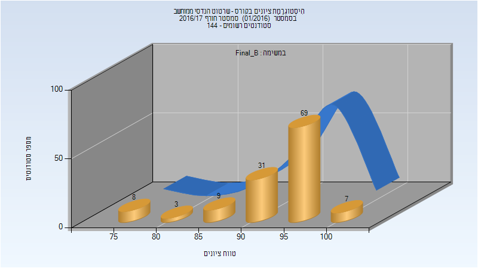

| סטודנטים | עברו/נכשלו | אחוז עוברים | ציון מינימלי | ציון מקסימלי | ממוצע | חציון |
| ---- | ---- | ---- | ---- | ---- | ---- | ---- |
| 127 | 127/0 | 100 | 76 | 100 | 93.748 | 95 |

### סופי

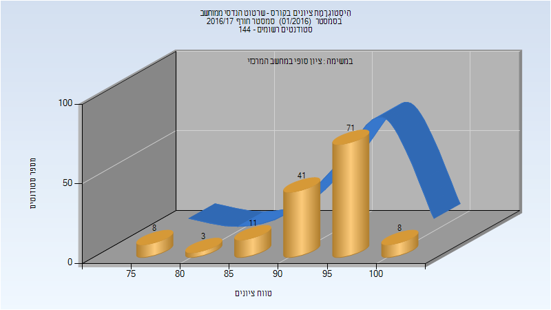

| סטודנטים | עברו/נכשלו | אחוז עוברים | ציון מינימלי | ציון מקסימלי | ממוצע | חציון |
| ---- | ---- | ---- | ---- | ---- | ---- | ---- |
| 142 | 142/0 | 100 | 76 | 100 | 93.634 | 95 |

## אביב 2017

| איש סגל | תפקיד |
| ---- | ---- |
| לומברוזו אורן | מרצה - אחראי מקצוע |
| טולצ'ינסקי אריה | מרצה |
| דמצ'נקו איגור |  |

### סופי מועד ב'

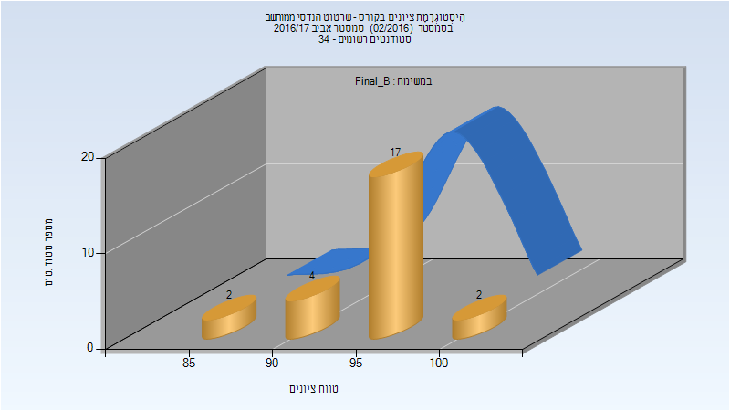

| סטודנטים | עברו/נכשלו | אחוז עוברים | ציון מינימלי | ציון מקסימלי | ממוצע | חציון |
| ---- | ---- | ---- | ---- | ---- | ---- | ---- |
| 25 | 25/0 | 100 | 89 | 100 | 95.8 | 96 |

### סופי

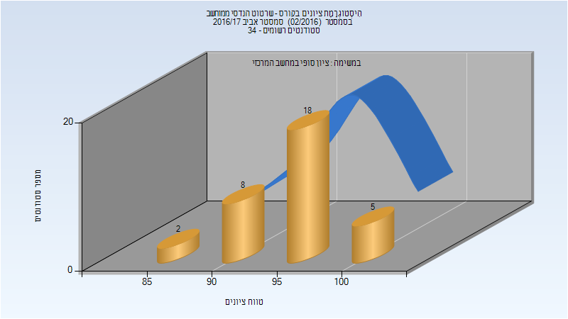

| סטודנטים | עברו/נכשלו | אחוז עוברים | ציון מינימלי | ציון מקסימלי | ממוצע | חציון |
| ---- | ---- | ---- | ---- | ---- | ---- | ---- |
| 33 | 33/0 | 100 | 89 | 100 | 95.818 | 96 |

## חורף 2017-2018

| איש סגל | תפקיד |
| ---- | ---- |
| לומברוזו אורן | מרצה - אחראי מקצוע |
| דמצ'נקו איגור |  |
| מושקוביץ יהב |  |

### סופי מועד א'

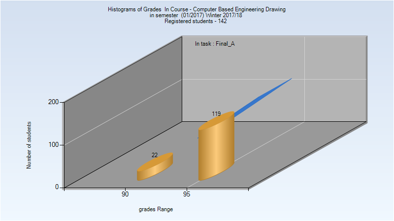

| סטודנטים | עברו/נכשלו | אחוז עוברים | ציון מינימלי | ציון מקסימלי | ממוצע | חציון |
| ---- | ---- | ---- | ---- | ---- | ---- | ---- |
| 141 | 141/0 | 100 | 90 | 99 | 96.305 | 96 |

### סופי

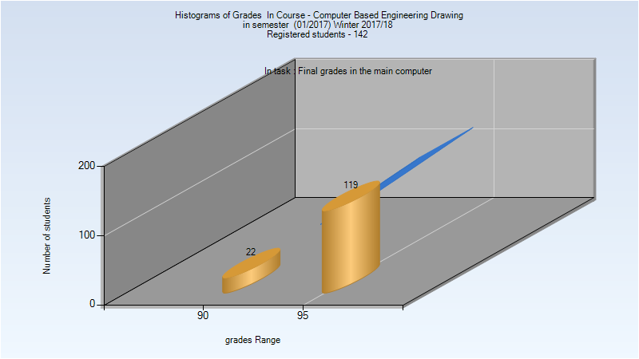

| סטודנטים | עברו/נכשלו | אחוז עוברים | ציון מינימלי | ציון מקסימלי | ממוצע | חציון |
| ---- | ---- | ---- | ---- | ---- | ---- | ---- |
| 141 | 141/0 | 100 | 90 | 99 | 96.305 | 96 |

## אביב 2018

| איש סגל | תפקיד |
| ---- | ---- |
| לומברוזו אורן | מרצה - אחראי מקצוע |
| דמצ'נקו איגור |  |

### סופי מועד א'

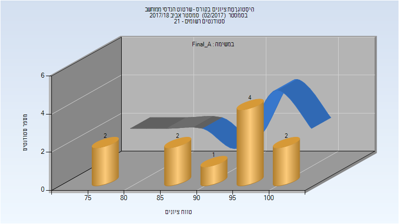

| סטודנטים | עברו/נכשלו | אחוז עוברים | ציון מינימלי | ציון מקסימלי | ממוצע | חציון |
| ---- | ---- | ---- | ---- | ---- | ---- | ---- |
| 39 | 39/0 | 100 | 92 | 99 | 96.487 | 96 |

### סופי

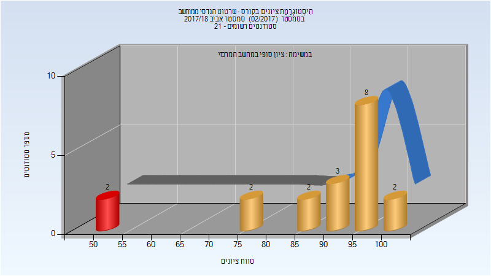

| סטודנטים | עברו/נכשלו | אחוז עוברים | ציון מינימלי | ציון מקסימלי | ממוצע | חציון |
| ---- | ---- | ---- | ---- | ---- | ---- | ---- |
| 39 | 39/0 | 100 | 92 | 99 | 96.487 | 96 |

## חורף 2018-2019

| איש סגל | תפקיד |
| ---- | ---- |
| לומברוזו אורן | מרצה - אחראי מקצוע |
| מושקוביץ יהב |  |
| דמצ'נקו איגור |  |
| ריז'נסקי אורן |  |

### סופי מועד א'

| סטודנטים | עברו/נכשלו | אחוז עוברים | ציון מינימלי | ציון מקסימלי | ממוצע | חציון |
| ---- | ---- | ---- | ---- | ---- | ---- | ---- |
| 112 | 112/0 | 100 | 84 | 100 | 95.286 | 96 |

### סופי

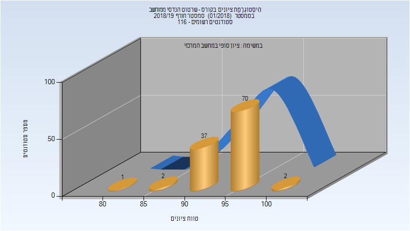

| סטודנטים | עברו/נכשלו | אחוז עוברים | ציון מינימלי | ציון מקסימלי | ממוצע | חציון |
| ---- | ---- | ---- | ---- | ---- | ---- | ---- |
| 112 | 112/0 | 100 | 84 | 100 | 95.286 | 96 |

## חורף 2019-2020

| איש סגל | תפקיד |
| ---- | ---- |
| לומברוזו אורן | מרצה - אחראי מקצוע |
| פוקשנסקי מיכאל |  |
| דמצ'נקו איגור |  |
| שאוליאן הדר |  |

### סופי מועד א'

| סטודנטים | עברו/נכשלו | אחוז עוברים | ציון מינימלי | ציון מקסימלי | ממוצע | חציון |
| ---- | ---- | ---- | ---- | ---- | ---- | ---- |
| 132 | 132/0 | 100 | 90 | 100 | 96.621 | 97 |

### סופי

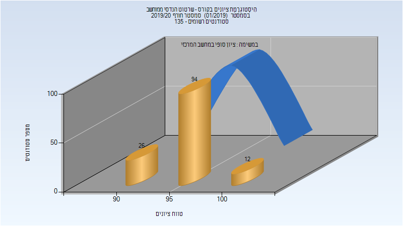

| סטודנטים | עברו/נכשלו | אחוז עוברים | ציון מינימלי | ציון מקסימלי | ממוצע | חציון |
| ---- | ---- | ---- | ---- | ---- | ---- | ---- |
| 133 | 133/0 | 100 | 90 | 100 | 96.579 | 97 |

## חורף 2020-2021

| איש סגל | תפקיד |
| ---- | ---- |
| שכנר יורם | מרצה - אחראי מקצוע |
| דמצ'נקו איגור | מרצה |
| גרבר ארתור |  |
| נח רמי |  |
| פרידמן גל |  |
| פייגין רומן |  |
| נצר-ליצ'יניצ אשר |  |

### סופי מועד א'

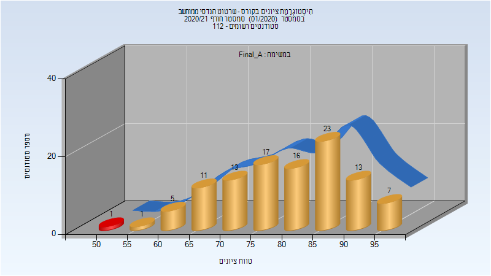

| סטודנטים | עברו/נכשלו | אחוז עוברים | ציון מינימלי | ציון מקסימלי | ממוצע | חציון |
| ---- | ---- | ---- | ---- | ---- | ---- | ---- |
| 107 | 106/1 | 99 | 53 | 98 | 80.299 | 81 |

### סופי מועד ב'

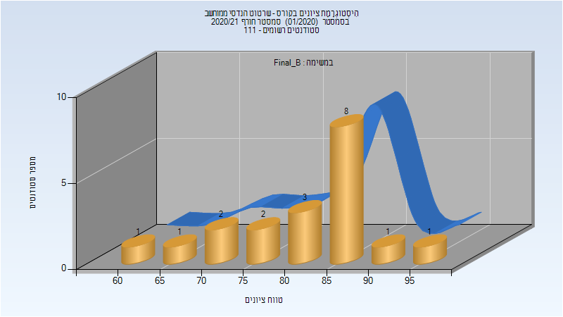

| סטודנטים | עברו/נכשלו | אחוז עוברים | ציון מינימלי | ציון מקסימלי | ממוצע | חציון |
| ---- | ---- | ---- | ---- | ---- | ---- | ---- |
| 19 | 19/0 | 100 | 64 | 98 | 81.789 | 82 |

### סופי

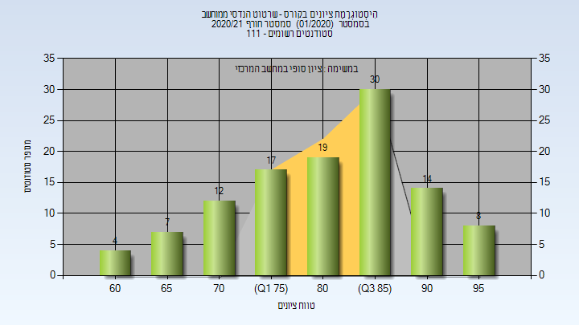

| סטודנטים | עברו/נכשלו | אחוז עוברים | ציון מינימלי | ציון מקסימלי | ממוצע | חציון |
| ---- | ---- | ---- | ---- | ---- | ---- | ---- |
| 107 | 106/1 | 99 | 53 | 98 | 80.299 | 81 |

