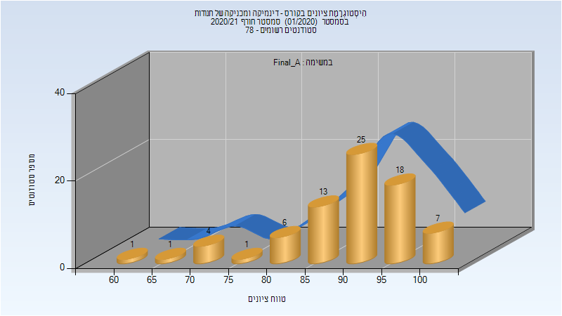
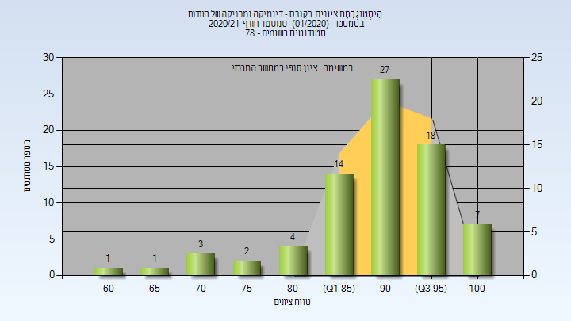

# 034051

## חורף 2020-2021

| איש סגל | תפקיד |
| ---- | ---- |
| בוכר יצחק | מרצה - אחראי מקצוע |
| ורד יואב | מתרגל - עם הרשאות מרצה אחראי |
| רוזנשטוק דוד | מתרגל - עם הרשאות מרצה אחראי |
| ברוך איל | מתרגל - עם הרשאות מרצה אחראי |

### סופי מועד א'

| סטודנטים | עברו/נכשלו | אחוז עוברים | ציון מינימלי | ציון מקסימלי | ממוצע | חציון |
| ---- | ---- | ---- | ---- | ---- | ---- | ---- |
| 76 | 76/0 | 100 | 60 | 100 | 90.289 | 92 |

### סופי

| סטודנטים | עברו/נכשלו | אחוז עוברים | ציון מינימלי | ציון מקסימלי | ממוצע | חציון |
| ---- | ---- | ---- | ---- | ---- | ---- | ---- |
| 76 | 76/0 | 100 | 60 | 100 | 90.908 | 93 |

