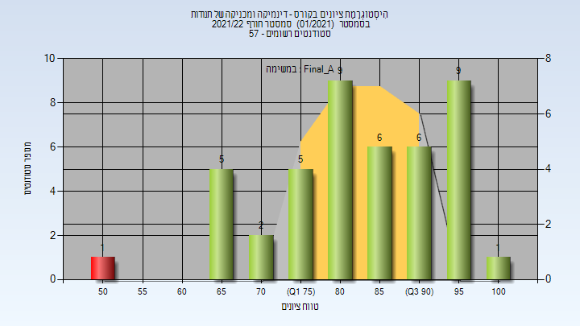
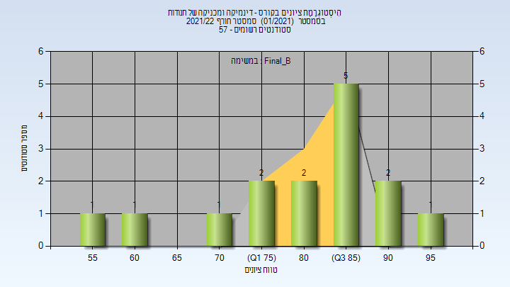

# 034051

## חורף 2020-2021

| איש סגל | תפקיד |
| ---- | ---- |
| בוכר יצחק | מרצה - אחראי מקצוע |
| ורד יואב | מתרגל - עם הרשאות מרצה אחראי |
| רוזנשטוק דוד | מתרגל - עם הרשאות מרצה אחראי |
| ברוך איל | מתרגל - עם הרשאות מרצה אחראי |

### סופי מועד א'

| סטודנטים | עברו/נכשלו | אחוז עוברים | ציון מינימלי | ציון מקסימלי | ממוצע | חציון |
| ---- | ---- | ---- | ---- | ---- | ---- | ---- |
| 76 | 76/0 | 100 | 60 | 100 | 90.289 | 92 |

### סופי

| סטודנטים | עברו/נכשלו | אחוז עוברים | ציון מינימלי | ציון מקסימלי | ממוצע | חציון |
| ---- | ---- | ---- | ---- | ---- | ---- | ---- |
| 77 | 77/0 | 100 | 60 | 100 | 90.701 | 93 |

## חורף 2021-2022

| איש סגל | תפקיד |
| ---- | ---- |
| בוכר יצחק | מרצה - אחראי מקצוע |
| ברוך איל | מתרגל - עם הרשאות מרצה אחראי |
| טננבאום אלעד | מתרגל - עם הרשאות מרצה אחראי |

### סופי מועד א'

| סטודנטים | עברו/נכשלו | אחוז עוברים | ציון מינימלי | ציון מקסימלי | ממוצע | חציון |
| ---- | ---- | ---- | ---- | ---- | ---- | ---- |
| 44 | 43/1 | 98 | 54 | 100 | 84.568 | 84.5 |

### סופי מועד ב'

| סטודנטים | עברו/נכשלו | אחוז עוברים | ציון מינימלי | ציון מקסימלי | ממוצע | חציון |
| ---- | ---- | ---- | ---- | ---- | ---- | ---- |
| 15 | 15/0 | 100 | 57 | 96 | 81 | 81 |

### סופי

| סטודנטים | עברו/נכשלו | אחוז עוברים | ציון מינימלי | ציון מקסימלי | ממוצע | חציון |
| ---- | ---- | ---- | ---- | ---- | ---- | ---- |
| 55 | 55/0 | 100 | 57 | 100 | 84.182 | 85 |

