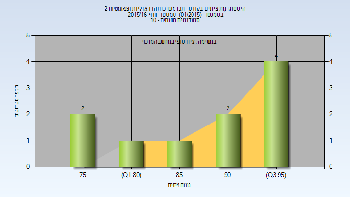

# 034206 - תכן מערכות הדראוליות ופנאומטיות 2

## חורף 2015-2016

| איש סגל | תפקיד |
| ---- | ---- |
| מיטל בן-ציון ז" | מרצה - אחראי מקצוע |

### סופי

| סטודנטים | עברו/נכשלו | אחוז עוברים | ציון מינימלי | ציון מקסימלי | ממוצע | חציון |
| ---- | ---- | ---- | ---- | ---- | ---- | ---- |
| 10 | 10/0 | 100 | 75 | 97 | 88.9 | 92 |

