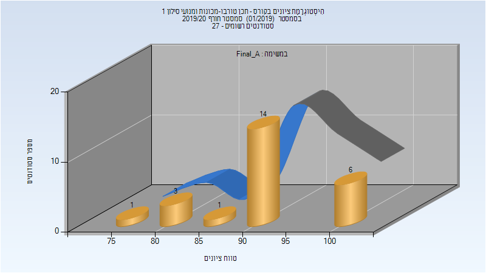
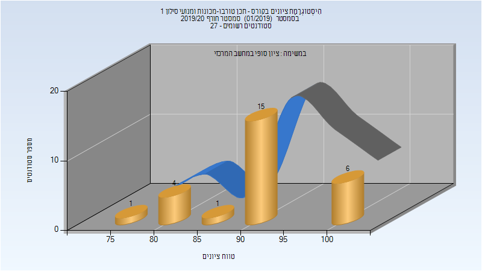

# 034210 - תכן טורבו-מכונות ומנועי סילון 1

## חורף 2019-2020

| איש סגל | תפקיד |
| ---- | ---- |
| אדלר דן | מרצה - אחראי מקצוע |

### סופי מועד א'

| סטודנטים | עברו/נכשלו | אחוז עוברים | ציון מינימלי | ציון מקסימלי | ממוצע | חציון |
| ---- | ---- | ---- | ---- | ---- | ---- | ---- |
| 25 | 25/0 | 100 | 75 | 100 | 90.4 | 90 |

### סופי

| סטודנטים | עברו/נכשלו | אחוז עוברים | ציון מינימלי | ציון מקסימלי | ממוצע | חציון |
| ---- | ---- | ---- | ---- | ---- | ---- | ---- |
| 26 | 26/0 | 100 | 75 | 100 | 90.385 | 90 |

