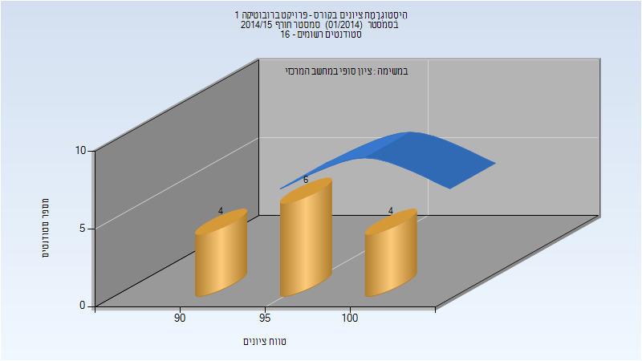

# 034339 - פרויקט ברובוטיקה 1

## חורף 2014-2015

| איש סגל | תפקיד |
| ---- | ---- |
| זקסנהויז מרים | מרצה - אחראי מקצוע |

### סופי

| סטודנטים | עברו/נכשלו | אחוז עוברים | ציון מינימלי | ציון מקסימלי | ממוצע | חציון |
| ---- | ---- | ---- | ---- | ---- | ---- | ---- |
| 14 | 14/0 | 100 | 90 | 100 | 96.5 | 97.5 |

