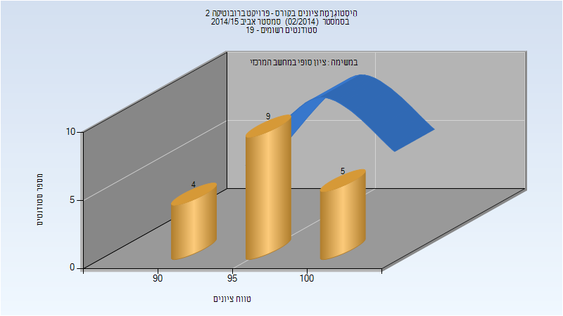

# 034340 - פרויקט ברובוטיקה 2

## אביב 2015

| איש סגל | תפקיד |
| ---- | ---- |
| זקסנהויז מרים | מרצה - אחראי מקצוע |

### סופי

| סטודנטים | עברו/נכשלו | אחוז עוברים | ציון מינימלי | ציון מקסימלי | ממוצע | חציון |
| ---- | ---- | ---- | ---- | ---- | ---- | ---- |
| 18 | 18/0 | 100 | 90 | 100 | 96.944 | 98 |

