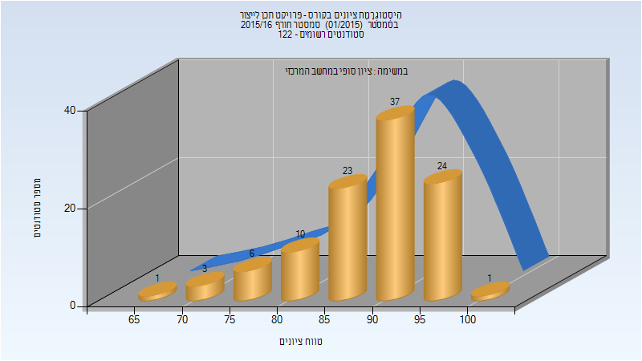
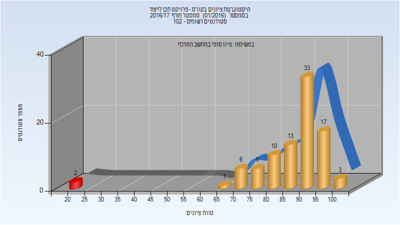
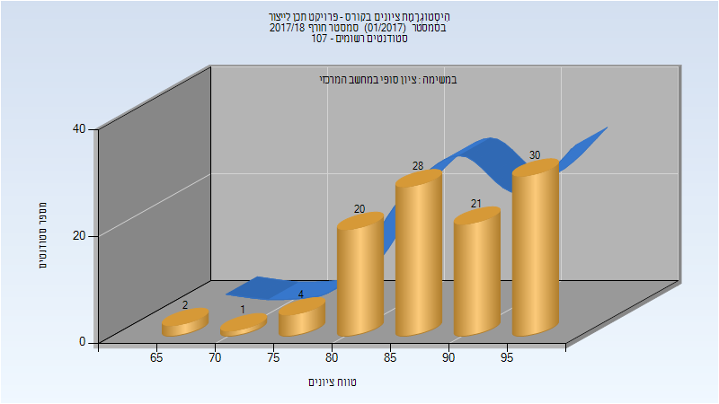
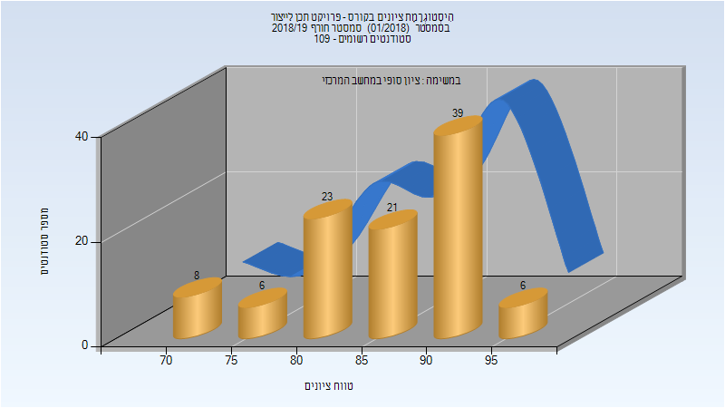
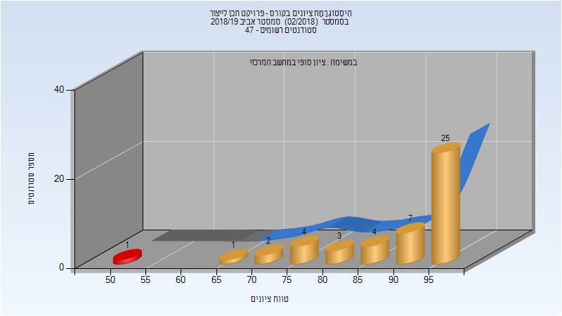
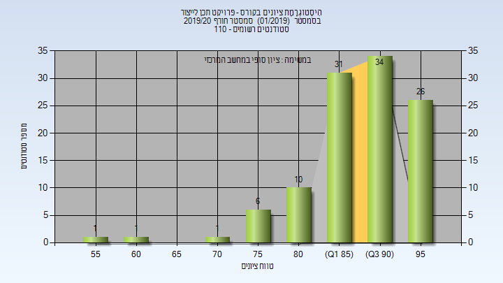
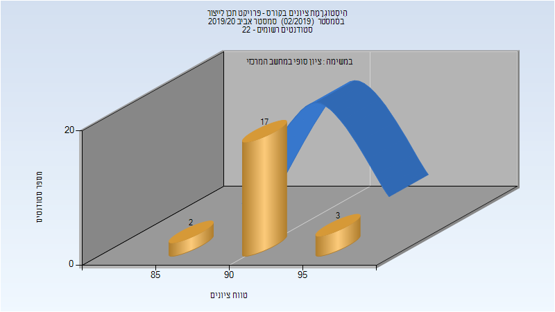

# 034371 - פרויקט תכן לייצור

## חורף 2015-2016

### סופי

| סטודנטים | עברו/נכשלו | אחוז עוברים | ציון מינימלי | ציון מקסימלי | ממוצע | חציון |
| ---- | ---- | ---- | ---- | ---- | ---- | ---- |
| 112 | 112/0 | 100 | 68 | 100 | 89.048 | 90 |

## חורף 2016-2017

### סופי

| סטודנטים | עברו/נכשלו | אחוז עוברים | ציון מינימלי | ציון מקסימלי | ממוצע | חציון |
| ---- | ---- | ---- | ---- | ---- | ---- | ---- |
| 91 | 89/2 | 98 | 24 | 100 | 87.549 | 91 |

## אביב 2017

### סופי

| סטודנטים | עברו/נכשלו | אחוז עוברים | ציון מינימלי | ציון מקסימלי | ממוצע | חציון |
| ---- | ---- | ---- | ---- | ---- | ---- | ---- |
| 51 | 51/0 | 100 | 72 | 97 | 87.373 | 89 |

## חורף 2017-2018

| איש סגל | תפקיד |
| ---- | ---- |
| צוק דובי | מרצה |
| פישר דניאל | מרצה |
| ארקה חבייר | מרצה |

### סופי

| סטודנטים | עברו/נכשלו | אחוז עוברים | ציון מינימלי | ציון מקסימלי | ממוצע | חציון |
| ---- | ---- | ---- | ---- | ---- | ---- | ---- |
| 106 | 106/0 | 100 | 68 | 97 | 88.651 | 89 |

## חורף 2018-2019

| איש סגל | תפקיד |
| ---- | ---- |
| טננבאום עמי | מרצה |
| אקונס פרץ | מרצה |
| צוק דב | מרצה |
| ארקה חבייר | מרצה |
| פישר דניאל | מרצה |

### סופי

| סטודנטים | עברו/נכשלו | אחוז עוברים | ציון מינימלי | ציון מקסימלי | ממוצע | חציון |
| ---- | ---- | ---- | ---- | ---- | ---- | ---- |
| 103 | 103/0 | 100 | 70 | 96 | 86.524 | 86 |

## אביב 2019

| איש סגל | תפקיד |
| ---- | ---- |
| ארקה חבייר | מרצה |
| צוק דב | מרצה |
| אקונס פרץ | מרצה |
| פישר דניאל | מרצה |

### סופי

| סטודנטים | עברו/נכשלו | אחוז עוברים | ציון מינימלי | ציון מקסימלי | ממוצע | חציון |
| ---- | ---- | ---- | ---- | ---- | ---- | ---- |
| 47 | 46/1 | 98 | 50 | 98 | 89.83 | 95 |

## חורף 2019-2020

| איש סגל | תפקיד |
| ---- | ---- |
| פישר דניאל | מרצה |
| טננבאום עמי | מרצה |
| אקונס פרץ | מרצה |
| ארקה חבייר | מרצה |
| צוק דב | מרצה |

### סופי

| סטודנטים | עברו/נכשלו | אחוז עוברים | ציון מינימלי | ציון מקסימלי | ממוצע | חציון |
| ---- | ---- | ---- | ---- | ---- | ---- | ---- |
| 110 | 110/0 | 100 | 55 | 98 | 88.982 | 90 |

## אביב 2020

| איש סגל | תפקיד |
| ---- | ---- |
| צוק דב | מרצה |
| ארקה חבייר | מרצה |
| טננבאום עמי | מרצה |
| אקונס פרץ | מרצה |
| פישר דניאל | מרצה |

### סופי

| סטודנטים | עברו/נכשלו | אחוז עוברים | ציון מינימלי | ציון מקסימלי | ממוצע | חציון |
| ---- | ---- | ---- | ---- | ---- | ---- | ---- |
| 22 | 22/0 | 100 | 88 | 95 | 92.091 | 92 |

