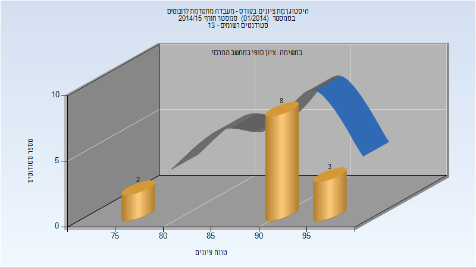
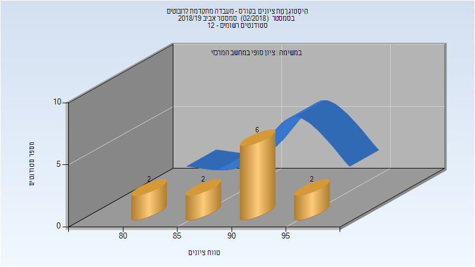
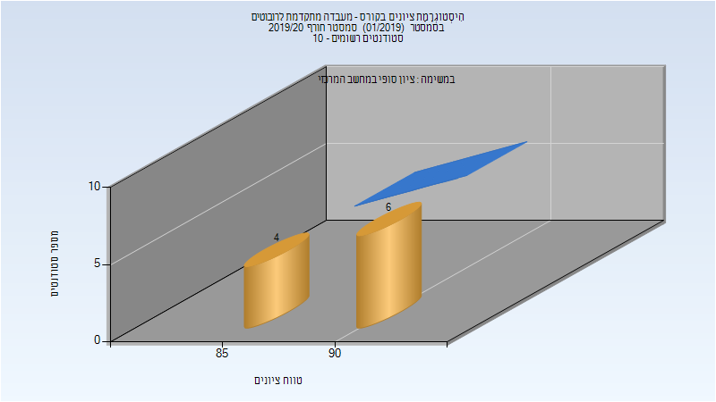

# 034401 - מעבדה מתקדמת לרובוטים

## חורף 2014-2015

| איש סגל | תפקיד |
| ---- | ---- |
| שהם משה | מרצה - אחראי מקצוע |

### סופי

| סטודנטים | עברו/נכשלו | אחוז עוברים | ציון מינימלי | ציון מקסימלי | ממוצע | חציון |
| ---- | ---- | ---- | ---- | ---- | ---- | ---- |
| 13 | 13/0 | 100 | 78 | 98 | 91.692 | 93 |

## אביב 2019

| איש סגל | תפקיד |
| ---- | ---- |
| שהם משה | מדריך מעבדה - עם הרשאות מרצה אחראי |
| אילסר דותן |  |

### סופי מועד א'

| סטודנטים | עברו/נכשלו | אחוז עוברים | ציון מינימלי | ציון מקסימלי | ממוצע | חציון |
| ---- | ---- | ---- | ---- | ---- | ---- | ---- |
| 12 | 12/0 | 100 | 83 | 98 | 90.417 | 90 |

### סופי

| סטודנטים | עברו/נכשלו | אחוז עוברים | ציון מינימלי | ציון מקסימלי | ממוצע | חציון |
| ---- | ---- | ---- | ---- | ---- | ---- | ---- |
| 12 | 12/0 | 100 | 83 | 98 | 90.417 | 90 |

## חורף 2019-2020

| איש סגל | תפקיד |
| ---- | ---- |
| אילסר דותן | מדריך מעבדה - עם הרשאות מרצה אחראי |

### סופי

| סטודנטים | עברו/נכשלו | אחוז עוברים | ציון מינימלי | ציון מקסימלי | ממוצע | חציון |
| ---- | ---- | ---- | ---- | ---- | ---- | ---- |
| 10 | 10/0 | 100 | 88 | 94 | 91.4 | 92 |

