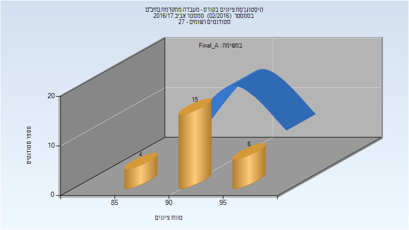
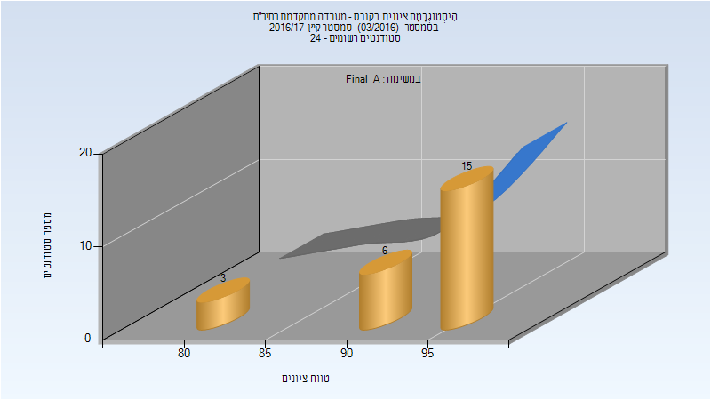
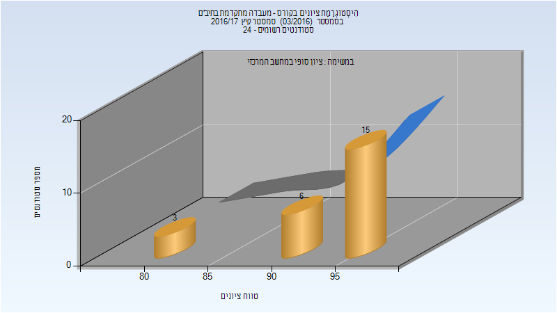
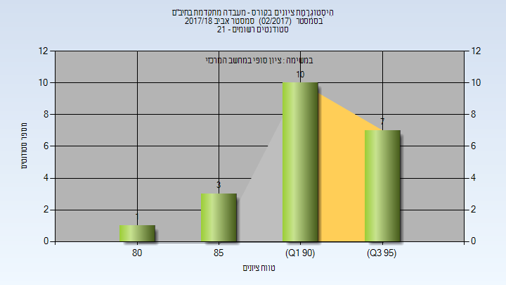
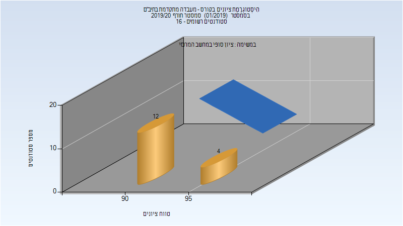
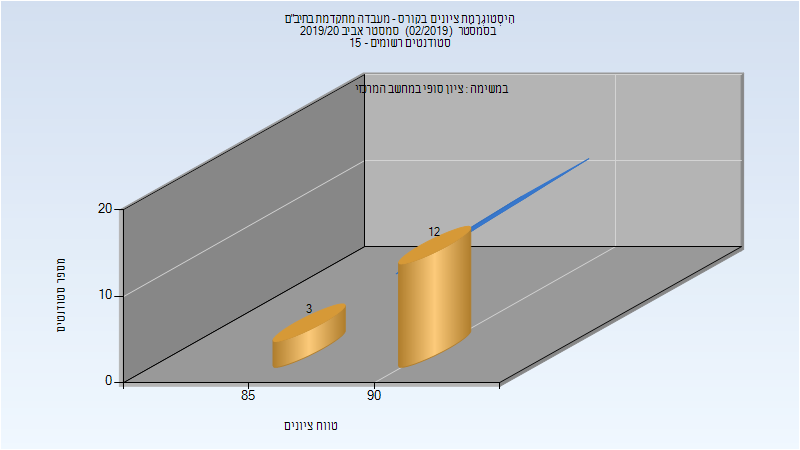
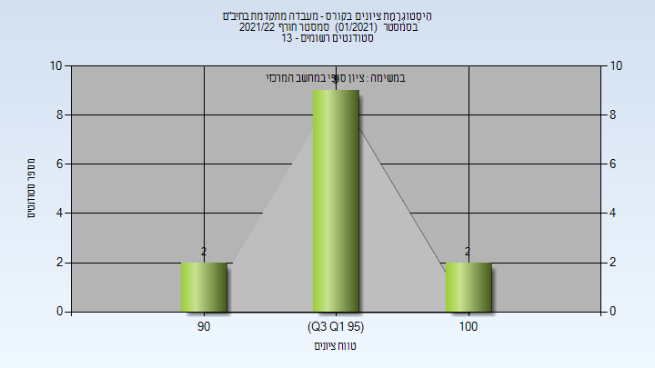

# 034404 - מעבדה מתקדמת בתיב"ם

## אביב 2017

| איש סגל | תפקיד |
| ---- | ---- |
| לומברוזו אורן | מדריך מעבדה - עם הרשאות מרצה אחראי |
| זריהן נועם |  |

### סופי מועד א'

| סטודנטים | עברו/נכשלו | אחוז עוברים | ציון מינימלי | ציון מקסימלי | ממוצע | חציון |
| ---- | ---- | ---- | ---- | ---- | ---- | ---- |
| 25 | 25/0 | 100 | 85 | 97 | 92.72 | 93 |

### סופי

| סטודנטים | עברו/נכשלו | אחוז עוברים | ציון מינימלי | ציון מקסימלי | ממוצע | חציון |
| ---- | ---- | ---- | ---- | ---- | ---- | ---- |
| 25 | 25/0 | 100 | 85 | 97 | 92.4 | 93 |

## קיץ 2017

### סופי מועד א'

| סטודנטים | עברו/נכשלו | אחוז עוברים | ציון מינימלי | ציון מקסימלי | ממוצע | חציון |
| ---- | ---- | ---- | ---- | ---- | ---- | ---- |
| 24 | 24/0 | 100 | 84 | 96 | 93.25 | 95 |

### סופי

| סטודנטים | עברו/נכשלו | אחוז עוברים | ציון מינימלי | ציון מקסימלי | ממוצע | חציון |
| ---- | ---- | ---- | ---- | ---- | ---- | ---- |
| 24 | 24/0 | 100 | 84 | 96 | 93.25 | 95 |

## אביב 2018

| איש סגל | תפקיד |
| ---- | ---- |
| לומברוזו אורן | מדריך מעבדה - עם הרשאות מרצה אחראי |

### סופי

| סטודנטים | עברו/נכשלו | אחוז עוברים | ציון מינימלי | ציון מקסימלי | ממוצע | חציון |
| ---- | ---- | ---- | ---- | ---- | ---- | ---- |
| 21 | 21/0 | 100 | 83 | 96 | 92.619 | 93 |

## אביב 2019

| איש סגל | תפקיד |
| ---- | ---- |
| לומברוזו אורן | מדריך מעבדה - עם הרשאות מרצה אחראי |

### סופי

| סטודנטים | עברו/נכשלו | אחוז עוברים | ציון מינימלי | ציון מקסימלי | ממוצע | חציון |
| ---- | ---- | ---- | ---- | ---- | ---- | ---- |
| 15 | 15/0 | 100 | 89 | 93 | 90.8 | 91 |

## חורף 2019-2020

| איש סגל | תפקיד |
| ---- | ---- |
| לומברוזו אורן | מדריך מעבדה - עם הרשאות מרצה אחראי |

### סופי

| סטודנטים | עברו/נכשלו | אחוז עוברים | ציון מינימלי | ציון מקסימלי | ממוצע | חציון |
| ---- | ---- | ---- | ---- | ---- | ---- | ---- |
| 16 | 16/0 | 100 | 93 | 98 | 94.312 | 93 |

## אביב 2020

| איש סגל | תפקיד |
| ---- | ---- |
| לומברוזו אורן | מדריך מעבדה - עם הרשאות מרצה אחראי |

### סופי

| סטודנטים | עברו/נכשלו | אחוז עוברים | ציון מינימלי | ציון מקסימלי | ממוצע | חציון |
| ---- | ---- | ---- | ---- | ---- | ---- | ---- |
| 15 | 15/0 | 100 | 88 | 94 | 91.6 | 93 |

## חורף 2021-2022

| איש סגל | תפקיד |
| ---- | ---- |
| נויפלד טל | מדריך מעבדה - עם הרשאות מרצה אחראי |

### סופי מועד א'

| סטודנטים | עברו/נכשלו | אחוז עוברים | ציון מינימלי | ציון מקסימלי | ממוצע | חציון |
| ---- | ---- | ---- | ---- | ---- | ---- | ---- |
| 13 | 13/0 | 100 | 91 | 100 | 96.077 | 97 |

### סופי

| סטודנטים | עברו/נכשלו | אחוז עוברים | ציון מינימלי | ציון מקסימלי | ממוצע | חציון |
| ---- | ---- | ---- | ---- | ---- | ---- | ---- |
| 13 | 13/0 | 100 | 91 | 100 | 96.077 | 97 |

