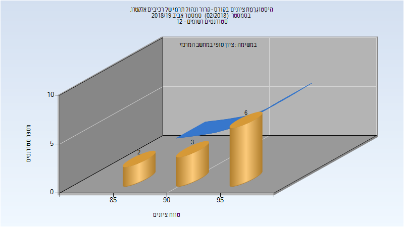
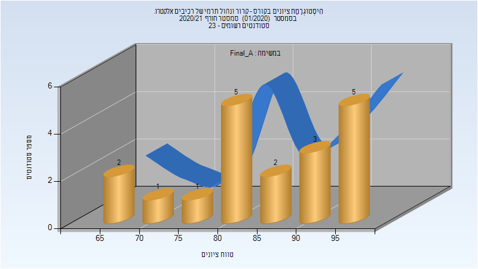

# 035023 - קרור ונהול תרמי של רכיבים אלקטרו.

## חורף 2016-2017

| איש סגל | תפקיד |
| ---- | ---- |
| יוסיפון גלעד | מרצה - אחראי מקצוע |
| קריגר נמרוד | מתרגל - עם הרשאות מרצה אחראי |

## אביב 2019

| איש סגל | תפקיד |
| ---- | ---- |
| יוסיפון גלעד | מרצה - אחראי מקצוע |
| סבג ברק | מתרגל - עם הרשאות מרצה אחראי |

### סופי

| סטודנטים | עברו/נכשלו | אחוז עוברים | ציון מינימלי | ציון מקסימלי | ממוצע | חציון |
| ---- | ---- | ---- | ---- | ---- | ---- | ---- |
| 11 | 11/0 | 100 | 85 | 98 | 93.727 | 94 |

## חורף 2020-2021

| איש סגל | תפקיד |
| ---- | ---- |
| יוסיפון גלעד | מרצה - אחראי מקצוע |
| סבג ברק | מתרגל - עם הרשאות מרצה אחראי |

### סופי מועד א'

| סטודנטים | עברו/נכשלו | אחוז עוברים | ציון מינימלי | ציון מקסימלי | ממוצע | חציון |
| ---- | ---- | ---- | ---- | ---- | ---- | ---- |
| 19 | 19/0 | 100 | 66 | 98 | 85 | 84 |

