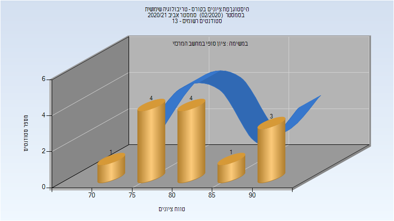

# 035024 - טריבולוגיה שימושית

## חורף 2019-2020

| איש סגל | תפקיד |
| ---- | ---- |
| קאסם היתם | מרצה |

## אביב 2020

| איש סגל | תפקיד |
| ---- | ---- |
| קאסם היתם | מרצה - אחראי מקצוע |
| בדלר דוד |  |

## אביב 2021

| איש סגל | תפקיד |
| ---- | ---- |
| קאסם היתם | מרצה - אחראי מקצוע |
| בדלר דוד |  |

### סופי מועד א'

| סטודנטים | עברו/נכשלו | אחוז עוברים | ציון מינימלי | ציון מקסימלי | ממוצע | חציון |
| ---- | ---- | ---- | ---- | ---- | ---- | ---- |
| 13 | 13/0 | 100 | 73 | 92 | 82.308 | 81 |

### סופי

| סטודנטים | עברו/נכשלו | אחוז עוברים | ציון מינימלי | ציון מקסימלי | ממוצע | חציון |
| ---- | ---- | ---- | ---- | ---- | ---- | ---- |
| 13 | 13/0 | 100 | 73 | 92 | 82.308 | 81 |

## חורף 2021-2022

| איש סגל | תפקיד |
| ---- | ---- |
| קאסם היתם | מרצה - אחראי מקצוע |
| בדלר דוד |  |

