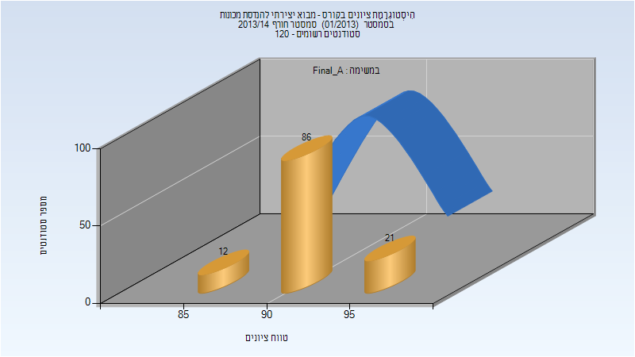
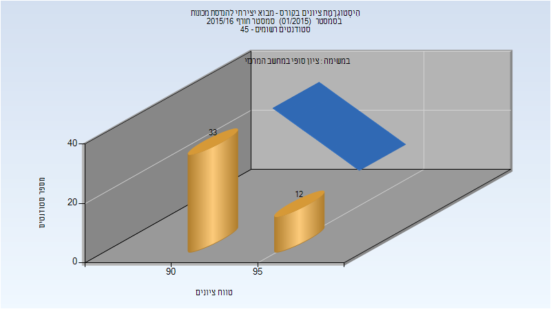
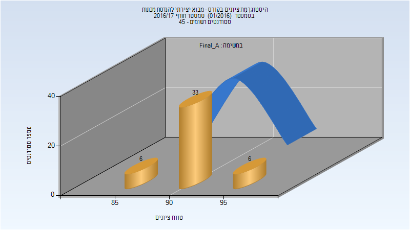
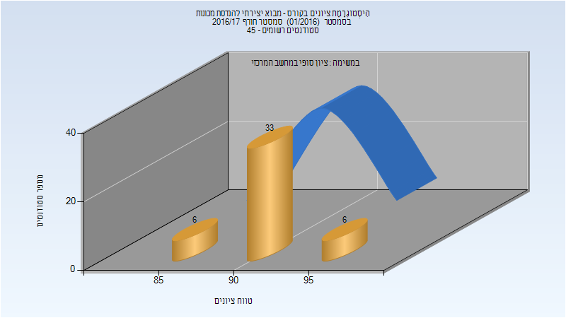
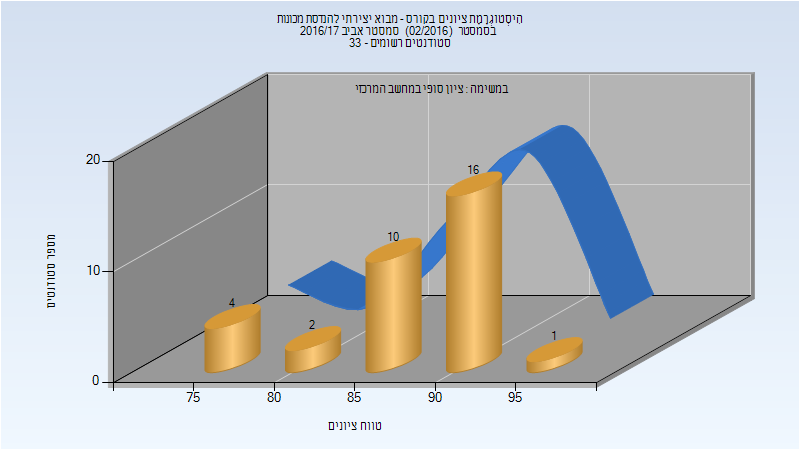
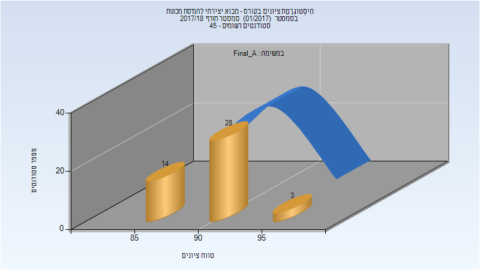
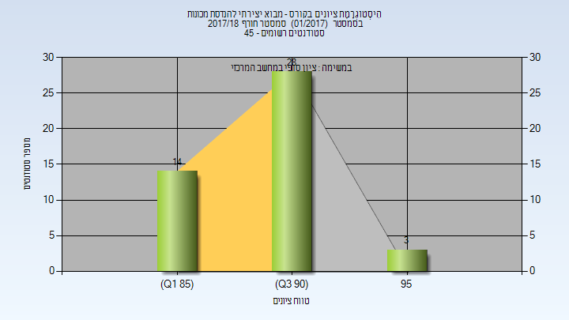
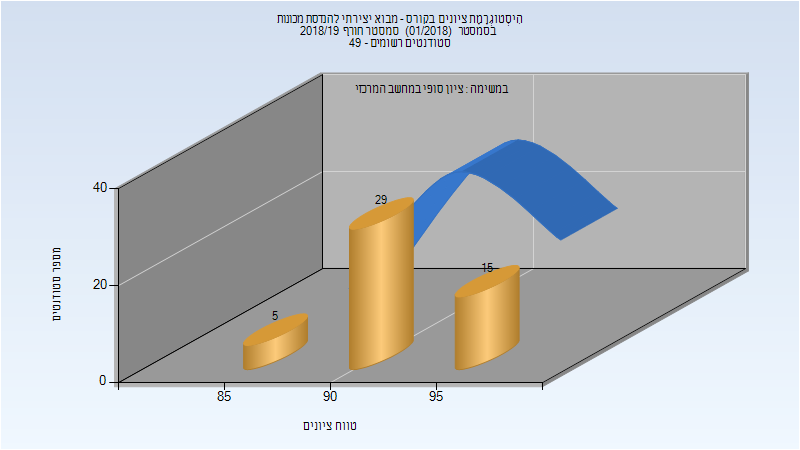
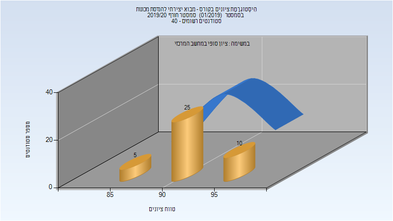

# 035026 - מבוא יצירתי להנדסת מכונות

## חורף 2013-2014

| איש סגל | תפקיד |
| ---- | ---- |
| אילתה דוד | מרצה - אחראי מקצוע |

### סופי מועד א'

| סטודנטים | עברו/נכשלו | אחוז עוברים | ציון מינימלי | ציון מקסימלי | ממוצע | חציון |
| ---- | ---- | ---- | ---- | ---- | ---- | ---- |
| 119 | 119/0 | 100 | 85 | 96 | 92.521 | 93 |

## חורף 2015-2016

| איש סגל | תפקיד |
| ---- | ---- |
| אילתה דוד | מרצה - אחראי מקצוע |

### סופי

| סטודנטים | עברו/נכשלו | אחוז עוברים | ציון מינימלי | ציון מקסימלי | ממוצע | חציון |
| ---- | ---- | ---- | ---- | ---- | ---- | ---- |
| 45 | 45/0 | 100 | 90 | 96 | 93.133 | 93 |

## חורף 2016-2017

| איש סגל | תפקיד |
| ---- | ---- |
| אילתה דוד | מרצה - אחראי מקצוע |

### סופי מועד א'

| סטודנטים | עברו/נכשלו | אחוז עוברים | ציון מינימלי | ציון מקסימלי | ממוצע | חציון |
| ---- | ---- | ---- | ---- | ---- | ---- | ---- |
| 45 | 45/0 | 100 | 88 | 95 | 92.067 | 92 |

### סופי

| סטודנטים | עברו/נכשלו | אחוז עוברים | ציון מינימלי | ציון מקסימלי | ממוצע | חציון |
| ---- | ---- | ---- | ---- | ---- | ---- | ---- |
| 45 | 45/0 | 100 | 88 | 95 | 92.067 | 92 |

## אביב 2017

| איש סגל | תפקיד |
| ---- | ---- |
| הרבסט יאיר | מרצה - אחראי מקצוע |

### סופי

| סטודנטים | עברו/נכשלו | אחוז עוברים | ציון מינימלי | ציון מקסימלי | ממוצע | חציון |
| ---- | ---- | ---- | ---- | ---- | ---- | ---- |
| 33 | 33/0 | 100 | 76 | 95 | 87.545 | 90 |

## חורף 2017-2018

| איש סגל | תפקיד |
| ---- | ---- |
| קסה אדנה )דני( | מתרגל |
| אילתה דוד | מרצה - אחראי מקצוע |

### סופי מועד א'

| סטודנטים | עברו/נכשלו | אחוז עוברים | ציון מינימלי | ציון מקסימלי | ממוצע | חציון |
| ---- | ---- | ---- | ---- | ---- | ---- | ---- |
| 45 | 45/0 | 100 | 88 | 96 | 90.578 | 90 |

### סופי

| סטודנטים | עברו/נכשלו | אחוז עוברים | ציון מינימלי | ציון מקסימלי | ממוצע | חציון |
| ---- | ---- | ---- | ---- | ---- | ---- | ---- |
| 45 | 45/0 | 100 | 88 | 96 | 90.578 | 90 |

## אביב 2018

| איש סגל | תפקיד |
| ---- | ---- |
| וולף אלון | מרצה |

## חורף 2018-2019

| איש סגל | תפקיד |
| ---- | ---- |
| אילתה דוד | מרצה - אחראי מקצוע |

### סופי מועד א'

| סטודנטים | עברו/נכשלו | אחוז עוברים | ציון מינימלי | ציון מקסימלי | ממוצע | חציון |
| ---- | ---- | ---- | ---- | ---- | ---- | ---- |
| 49 | 49/0 | 100 | 89 | 96 | 93.082 | 93 |

### סופי

| סטודנטים | עברו/נכשלו | אחוז עוברים | ציון מינימלי | ציון מקסימלי | ממוצע | חציון |
| ---- | ---- | ---- | ---- | ---- | ---- | ---- |
| 49 | 49/0 | 100 | 89 | 96 | 93.082 | 93 |

## חורף 2019-2020

| איש סגל | תפקיד |
| ---- | ---- |
| אילתה דוד | מרצה - אחראי מקצוע |
| קסה אדנה )דני( | מתרגל - עם הרשאות מרצה אחראי |

### סופי מועד א'

| סטודנטים | עברו/נכשלו | אחוז עוברים | ציון מינימלי | ציון מקסימלי | ממוצע | חציון |
| ---- | ---- | ---- | ---- | ---- | ---- | ---- |
| 40 | 40/0 | 100 | 89 | 95 | 92.375 | 92.5 |

### סופי

| סטודנטים | עברו/נכשלו | אחוז עוברים | ציון מינימלי | ציון מקסימלי | ממוצע | חציון |
| ---- | ---- | ---- | ---- | ---- | ---- | ---- |
| 40 | 40/0 | 100 | 89 | 95 | 92.375 | 92.5 |

