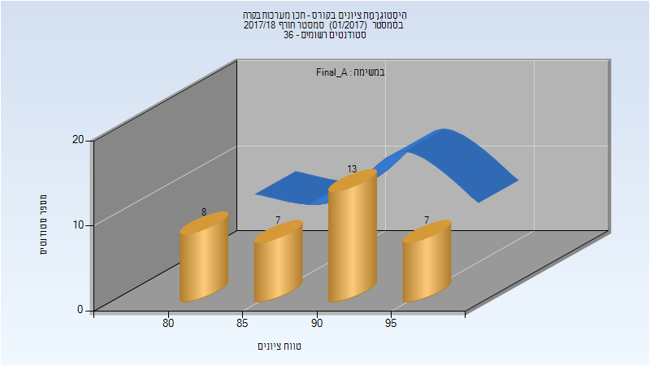
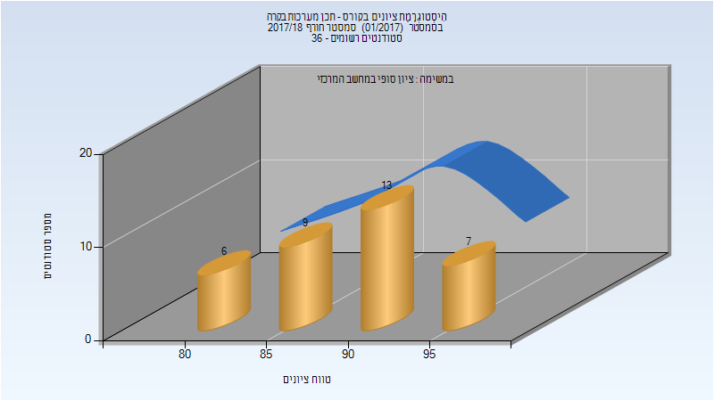
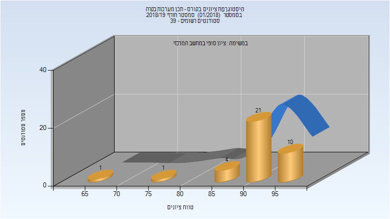
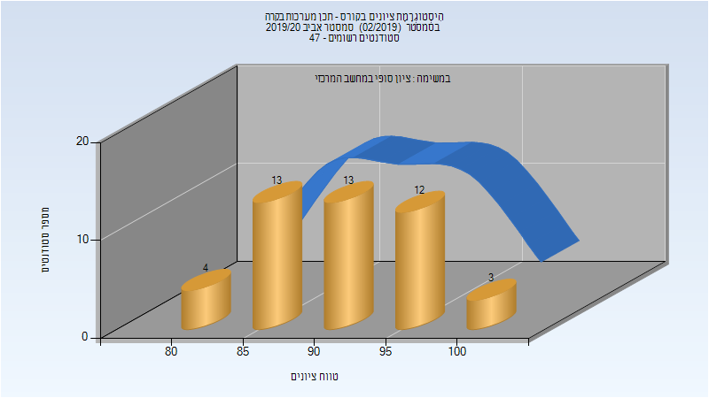

# 035036 - תכן מערכות בקרה

## חורף 2017-2018

### סופי מועד א'

| סטודנטים | עברו/נכשלו | אחוז עוברים | ציון מינימלי | ציון מקסימלי | ממוצע | חציון |
| ---- | ---- | ---- | ---- | ---- | ---- | ---- |
| 35 | 35/0 | 100 | 80 | 96 | 89.514 | 90 |

### סופי

| סטודנטים | עברו/נכשלו | אחוז עוברים | ציון מינימלי | ציון מקסימלי | ממוצע | חציון |
| ---- | ---- | ---- | ---- | ---- | ---- | ---- |
| 35 | 35/0 | 100 | 80 | 96 | 89.686 | 90 |

## חורף 2018-2019

| איש סגל | תפקיד |
| ---- | ---- |
| קריסטלני מקסים | מרצה - אחראי מקצוע |

### סופי

| סטודנטים | עברו/נכשלו | אחוז עוברים | ציון מינימלי | ציון מקסימלי | ממוצע | חציון |
| ---- | ---- | ---- | ---- | ---- | ---- | ---- |
| 37 | 37/0 | 100 | 69 | 97 | 91.676 | 93 |

## אביב 2020

| איש סגל | תפקיד |
| ---- | ---- |
| קריסטלני מקסים | מרצה - אחראי מקצוע |

### סופי

| סטודנטים | עברו/נכשלו | אחוז עוברים | ציון מינימלי | ציון מקסימלי | ממוצע | חציון |
| ---- | ---- | ---- | ---- | ---- | ---- | ---- |
| 45 | 45/0 | 100 | 80 | 100 | 91.867 | 91 |

## חורף 2020-2021

| איש סגל | תפקיד |
| ---- | ---- |
| קריסטלני מקסים | מרצה - אחראי מקצוע |

