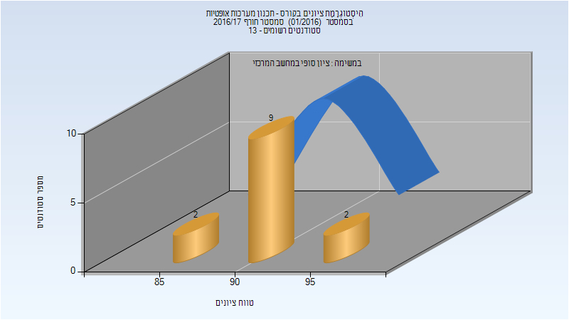
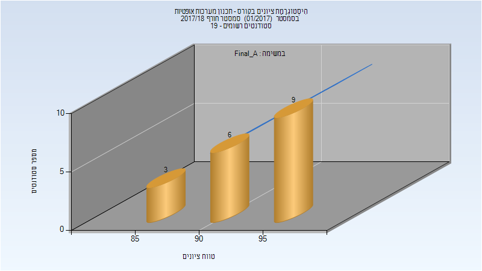
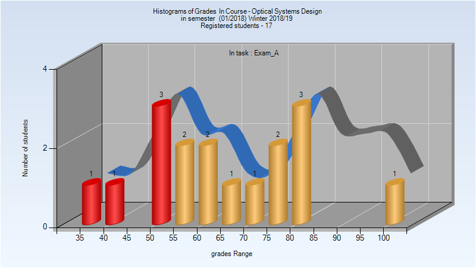
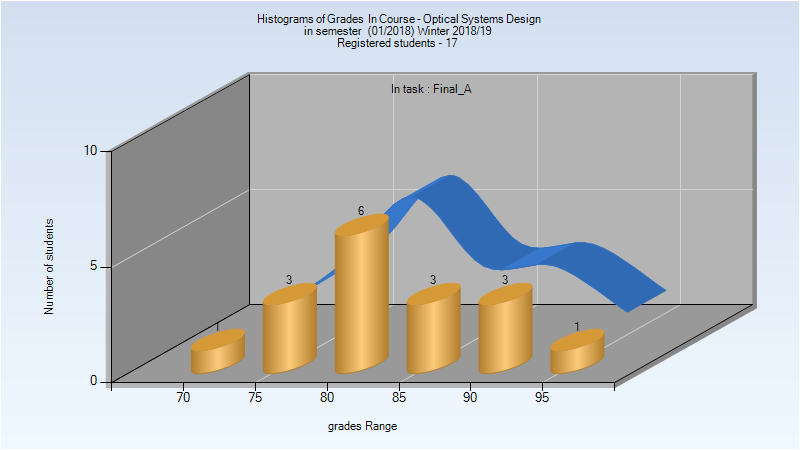
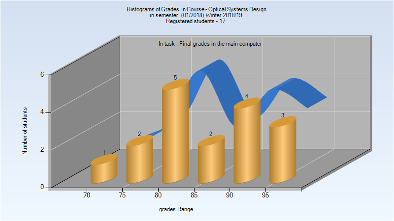
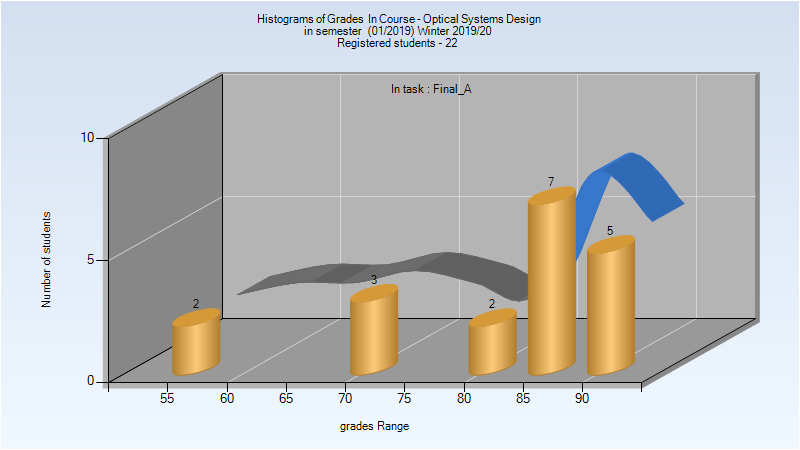
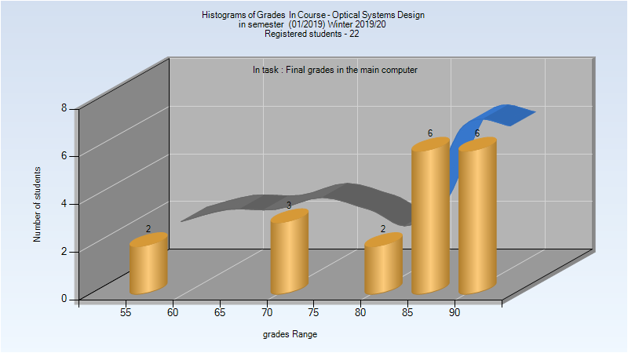
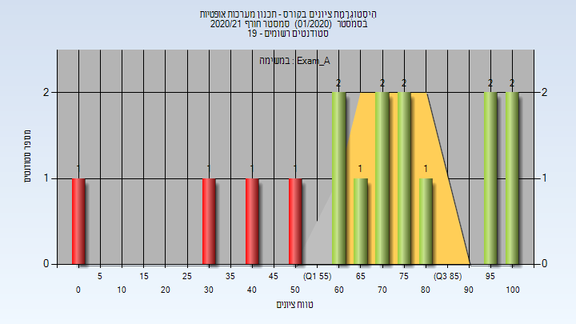
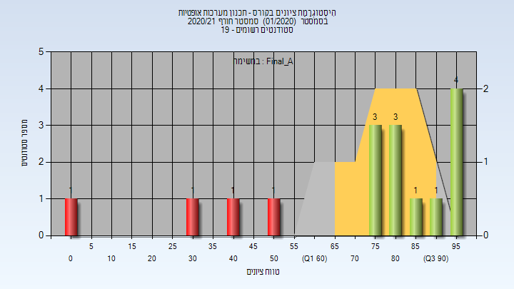
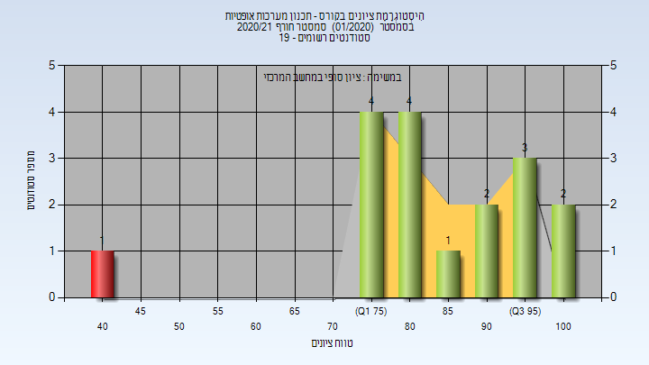

# 035050 - תכנון מערכות אופטיות

## חורף 2015-2016

| איש סגל | תפקיד |
| ---- | ---- |
| רוטשילד כרמל | מרצה - אחראי מקצוע |

## חורף 2016-2017

| איש סגל | תפקיד |
| ---- | ---- |
| רוטשילד כרמל | מרצה - אחראי מקצוע |
| ינאי מיכאל | מתרגל - עם הרשאות מרצה אחראי |

### סופי מועד א'

| סטודנטים | עברו/נכשלו | אחוז עוברים | ציון מינימלי | ציון מקסימלי | ממוצע | חציון |
| ---- | ---- | ---- | ---- | ---- | ---- | ---- |
| 13 | 13/0 | 100 | 86 | 95 | 91.308 | 91 |

### סופי

| סטודנטים | עברו/נכשלו | אחוז עוברים | ציון מינימלי | ציון מקסימלי | ממוצע | חציון |
| ---- | ---- | ---- | ---- | ---- | ---- | ---- |
| 13 | 13/0 | 100 | 86 | 95 | 91.308 | 91 |

## חורף 2017-2018

| איש סגל | תפקיד |
| ---- | ---- |
| רוטשילד כרמל | מרצה - אחראי מקצוע |
| ינאי מיכאל | מתרגל - עם הרשאות מרצה אחראי |

### סופי מועד א'

| סטודנטים | עברו/נכשלו | אחוז עוברים | ציון מינימלי | ציון מקסימלי | ממוצע | חציון |
| ---- | ---- | ---- | ---- | ---- | ---- | ---- |
| 18 | 18/0 | 100 | 88 | 99 | 94.333 | 95 |

### סופי

| סטודנטים | עברו/נכשלו | אחוז עוברים | ציון מינימלי | ציון מקסימלי | ממוצע | חציון |
| ---- | ---- | ---- | ---- | ---- | ---- | ---- |
| 18 | 18/0 | 100 | 88 | 99 | 94.444 | 95 |

## חורף 2018-2019

| איש סגל | תפקיד |
| ---- | ---- |
| רוטשילד כרמל | מרצה - אחראי מקצוע |
| לנקביץ עבודי תום | מתרגל - עם הרשאות מרצה אחראי |

### מבחן מועד א'

| סטודנטים | עברו/נכשלו | אחוז עוברים | ציון מינימלי | ציון מקסימלי | ממוצע | חציון |
| ---- | ---- | ---- | ---- | ---- | ---- | ---- |
| 17 | 12/5 | 71 | 37 | 100 | 64.588 | 61 |

### סופי מועד א'

| סטודנטים | עברו/נכשלו | אחוז עוברים | ציון מינימלי | ציון מקסימלי | ממוצע | חציון |
| ---- | ---- | ---- | ---- | ---- | ---- | ---- |
| 17 | 17/0 | 100 | 73.12 | 99.28 | 84.833 | 83.6 |

### סופי

| סטודנטים | עברו/נכשלו | אחוז עוברים | ציון מינימלי | ציון מקסימלי | ממוצע | חציון |
| ---- | ---- | ---- | ---- | ---- | ---- | ---- |
| 17 | 17/0 | 100 | 73 | 99 | 86.824 | 88 |

## חורף 2019-2020

| איש סגל | תפקיד |
| ---- | ---- |
| רוטשילד כרמל | מרצה - אחראי מקצוע |
| שימנוביץ' מיכל | מתרגל - עם הרשאות מרצה אחראי |

### סופי מועד א'

| סטודנטים | עברו/נכשלו | אחוז עוברים | ציון מינימלי | ציון מקסימלי | ממוצע | חציון |
| ---- | ---- | ---- | ---- | ---- | ---- | ---- |
| 19 | 19/0 | 100 | 56.36 | 94.48 | 82.825 | 85.2 |

### סופי

| סטודנטים | עברו/נכשלו | אחוז עוברים | ציון מינימלי | ציון מקסימלי | ממוצע | חציון |
| ---- | ---- | ---- | ---- | ---- | ---- | ---- |
| 21 | 21/0 | 100 | 56 | 94 | 83.571 | 88 |

## אביב 2020

## חורף 2020-2021

| איש סגל | תפקיד |
| ---- | ---- |
| רוטשילד כרמל | מרצה - אחראי מקצוע |
| מירון דרור | מתרגל - עם הרשאות מרצה אחראי |

### מבחן מועד א'

| סטודנטים | עברו/נכשלו | אחוז עוברים | ציון מינימלי | ציון מקסימלי | ממוצע | חציון |
| ---- | ---- | ---- | ---- | ---- | ---- | ---- |
| 16 | 12/4 | 75 | 0 | 100 | 67.781 | 70.75 |

### סופי מועד א'

| סטודנטים | עברו/נכשלו | אחוז עוברים | ציון מינימלי | ציון מקסימלי | ממוצע | חציון |
| ---- | ---- | ---- | ---- | ---- | ---- | ---- |
| 16 | 12/4 | 75 | 0 | 99.7 | 73.112 | 81.6 |

### סופי

| סטודנטים | עברו/נכשלו | אחוז עוברים | ציון מינימלי | ציון מקסימלי | ממוצע | חציון |
| ---- | ---- | ---- | ---- | ---- | ---- | ---- |
| 17 | 16/1 | 94 | 40 | 100 | 84 | 82 |

