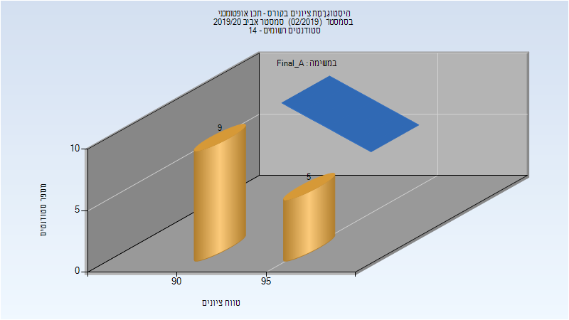

# 035051 - תכן אופטומכני

## אביב 2016

| איש סגל | תפקיד |
| ---- | ---- |
| עזיז דוד | מרצה - אחראי מקצוע |
| ינאי מיכאל | מתרגל - עם הרשאות מרצה אחראי |

## אביב 2017

| איש סגל | תפקיד |
| ---- | ---- |
| עזיז דוד | מרצה - אחראי מקצוע |
| ינאי מיכאל | מתרגל - עם הרשאות מרצה אחראי |

## אביב 2018

| איש סגל | תפקיד |
| ---- | ---- |
| עזיז דוד | מרצה - אחראי מקצוע |
| ינאי מיכאל | מתרגל - עם הרשאות מרצה אחראי |

## אביב 2019

| איש סגל | תפקיד |
| ---- | ---- |
| עזיז דוד | מרצה - אחראי מקצוע |
| לנקביץ עבודי תום | מתרגל - עם הרשאות מרצה אחראי |

## אביב 2020

| איש סגל | תפקיד |
| ---- | ---- |
| עזיז דוד | מרצה - אחראי מקצוע |
| ינאי מיכאל | מתרגל - עם הרשאות מרצה אחראי |

### סופי מועד א'

| סטודנטים | עברו/נכשלו | אחוז עוברים | ציון מינימלי | ציון מקסימלי | ממוצע | חציון |
| ---- | ---- | ---- | ---- | ---- | ---- | ---- |
| 14 | 14/0 | 100 | 90 | 98 | 93.857 | 94 |

### סופי

| סטודנטים | עברו/נכשלו | אחוז עוברים | ציון מינימלי | ציון מקסימלי | ממוצע | חציון |
| ---- | ---- | ---- | ---- | ---- | ---- | ---- |
| 14 | 14/0 | 100 | 90 | 98 | 93.857 | 94 |

