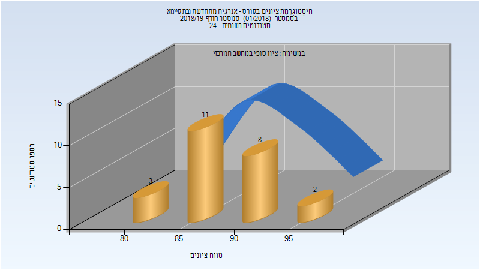
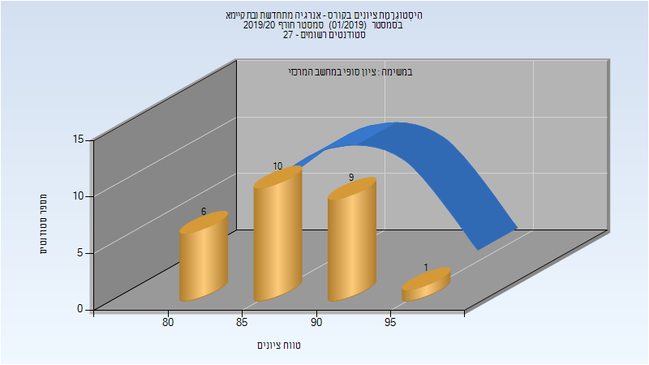
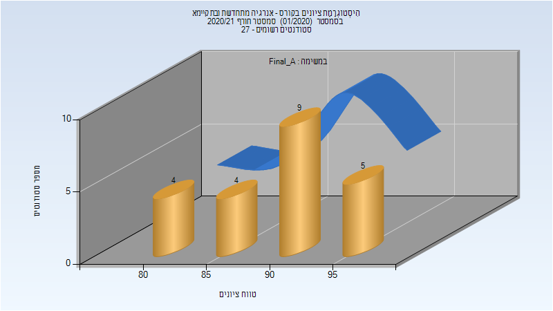
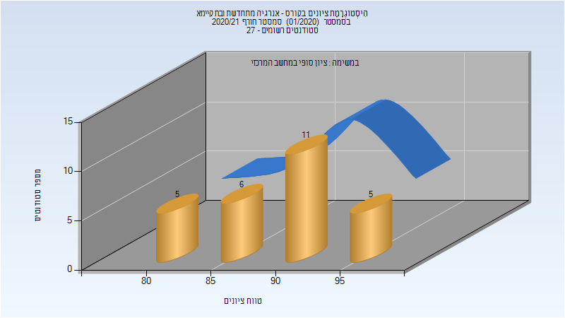

# 035053 - אנרגיה מתחדשת ובת קיימא

## חורף 2018-2019

| איש סגל | תפקיד |
| ---- | ---- |
| לאש בוריס | מרצה - אחראי מקצוע |
| שלם גלעד איל | מתרגל - עם הרשאות מרצה אחראי |

### סופי

| סטודנטים | עברו/נכשלו | אחוז עוברים | ציון מינימלי | ציון מקסימלי | ממוצע | חציון |
| ---- | ---- | ---- | ---- | ---- | ---- | ---- |
| 24 | 24/0 | 100 | 80 | 97 | 88.958 | 89 |

## חורף 2019-2020

| איש סגל | תפקיד |
| ---- | ---- |
| לאש בוריס | מרצה - אחראי מקצוע |
| שלם גלעד איל | מתרגל - עם הרשאות מרצה אחראי |

### סופי

| סטודנטים | עברו/נכשלו | אחוז עוברים | ציון מינימלי | ציון מקסימלי | ממוצע | חציון |
| ---- | ---- | ---- | ---- | ---- | ---- | ---- |
| 26 | 26/0 | 100 | 80 | 95 | 87.962 | 88 |

## חורף 2020-2021

| איש סגל | תפקיד |
| ---- | ---- |
| לאש בוריס | מרצה - אחראי מקצוע |

### סופי מועד א'

| סטודנטים | עברו/נכשלו | אחוז עוברים | ציון מינימלי | ציון מקסימלי | ממוצע | חציון |
| ---- | ---- | ---- | ---- | ---- | ---- | ---- |
| 22 | 22/0 | 100 | 82 | 96 | 90.455 | 92 |

### סופי

| סטודנטים | עברו/נכשלו | אחוז עוברים | ציון מינימלי | ציון מקסימלי | ממוצע | חציון |
| ---- | ---- | ---- | ---- | ---- | ---- | ---- |
| 27 | 27/0 | 100 | 81 | 96 | 89.926 | 92 |

