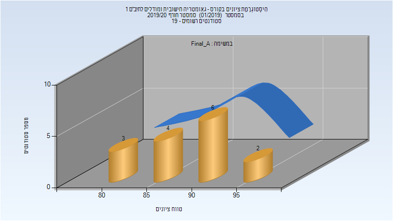
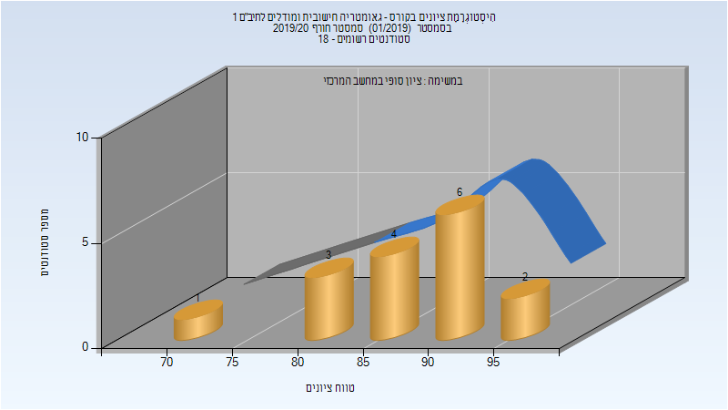

# 036020 - גאומטריה חישובית ומודלים לתיב"ם 1

## חורף 2019-2020

| איש סגל | תפקיד |
| ---- | ---- |
| פישר ענת | מרצה - אחראי מקצוע |

### סופי מועד א'

| סטודנטים | עברו/נכשלו | אחוז עוברים | ציון מינימלי | ציון מקסימלי | ממוצע | חציון |
| ---- | ---- | ---- | ---- | ---- | ---- | ---- |
| 16 | 16/0 | 100 | 71 | 97 | 88.188 | 88.5 |

### סופי

| סטודנטים | עברו/נכשלו | אחוז עוברים | ציון מינימלי | ציון מקסימלי | ממוצע | חציון |
| ---- | ---- | ---- | ---- | ---- | ---- | ---- |
| 16 | 16/0 | 100 | 71 | 97 | 88.188 | 88.5 |

