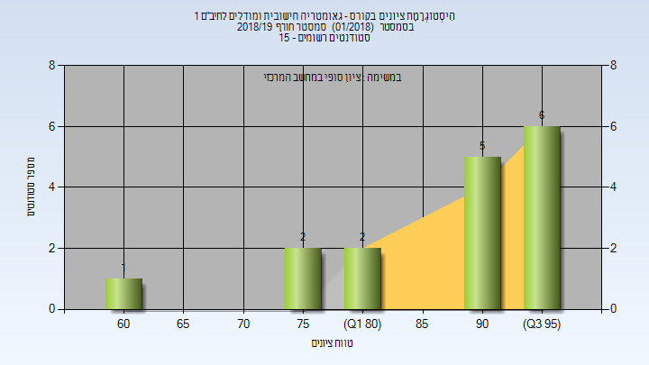
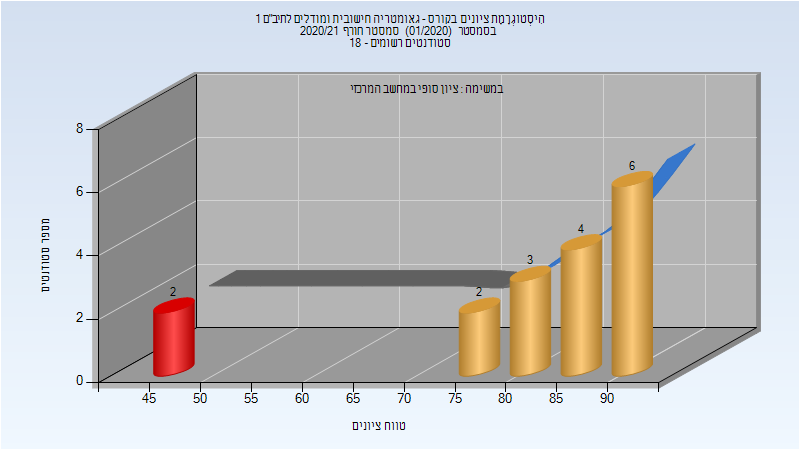
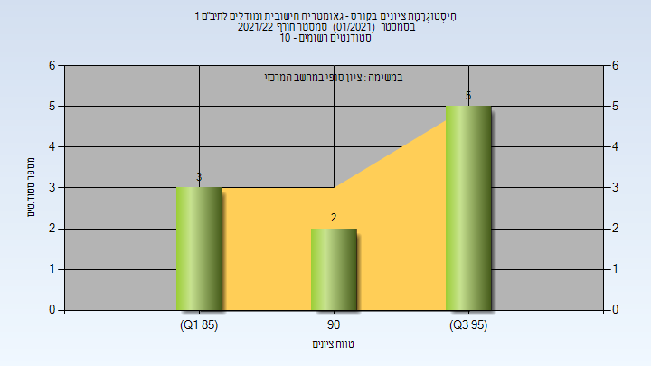

# 036020 - גאומטריה חישובית ומודלים לתיב"ם 1

## חורף 2018-2019

| איש סגל | תפקיד |
| ---- | ---- |
| פישר ענת | מרצה - אחראי מקצוע |
| שניאור רונית | מתרגל - עם הרשאות מרצה אחראי |

### סופי

| סטודנטים | עברו/נכשלו | אחוז עוברים | ציון מינימלי | ציון מקסימלי | ממוצע | חציון |
| ---- | ---- | ---- | ---- | ---- | ---- | ---- |
| 16 | 16/0 | 100 | 61 | 99 | 88.875 | 92.5 |

## חורף 2019-2020

| איש סגל | תפקיד |
| ---- | ---- |
| פישר ענת | מרצה - אחראי מקצוע |

### סופי מועד א'

| סטודנטים | עברו/נכשלו | אחוז עוברים | ציון מינימלי | ציון מקסימלי | ממוצע | חציון |
| ---- | ---- | ---- | ---- | ---- | ---- | ---- |
| 16 | 16/0 | 100 | 71 | 97 | 88.188 | 88.5 |

### סופי

| סטודנטים | עברו/נכשלו | אחוז עוברים | ציון מינימלי | ציון מקסימלי | ממוצע | חציון |
| ---- | ---- | ---- | ---- | ---- | ---- | ---- |
| 16 | 16/0 | 100 | 71 | 97 | 88.188 | 88.5 |

## חורף 2020-2021

| איש סגל | תפקיד |
| ---- | ---- |
| פישר ענת | מרצה - אחראי מקצוע |
| שאוליאן הדר | מתרגל - עם הרשאות מרצה אחראי |

### סופי מועד א'

| סטודנטים | עברו/נכשלו | אחוז עוברים | ציון מינימלי | ציון מקסימלי | ממוצע | חציון |
| ---- | ---- | ---- | ---- | ---- | ---- | ---- |
| 17 | 15/2 | 88 | 46 | 94 | 82.059 | 87 |

### סופי

| סטודנטים | עברו/נכשלו | אחוז עוברים | ציון מינימלי | ציון מקסימלי | ממוצע | חציון |
| ---- | ---- | ---- | ---- | ---- | ---- | ---- |
| 17 | 17/0 | 100 | 76 | 94 | 86.824 | 87 |

## חורף 2021-2022

| איש סגל | תפקיד |
| ---- | ---- |
| פישר ענת | מרצה - אחראי מקצוע |
| פידלמן אמרי | מתרגל - עם הרשאות מרצה אחראי |

### סופי

| סטודנטים | עברו/נכשלו | אחוז עוברים | ציון מינימלי | ציון מקסימלי | ממוצע | חציון |
| ---- | ---- | ---- | ---- | ---- | ---- | ---- |
| 10 | 10/0 | 100 | 88 | 99 | 93.5 | 94 |

