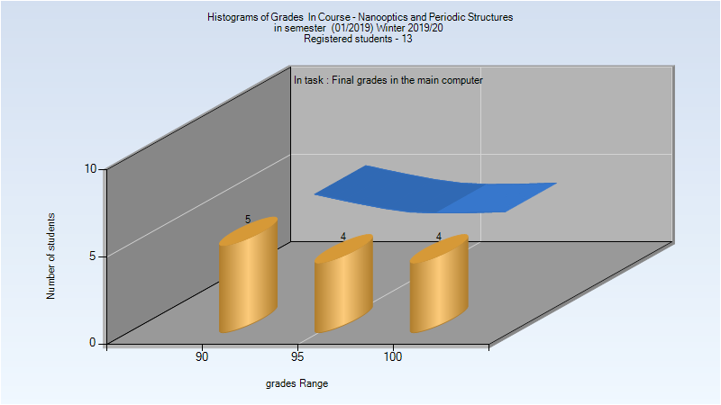
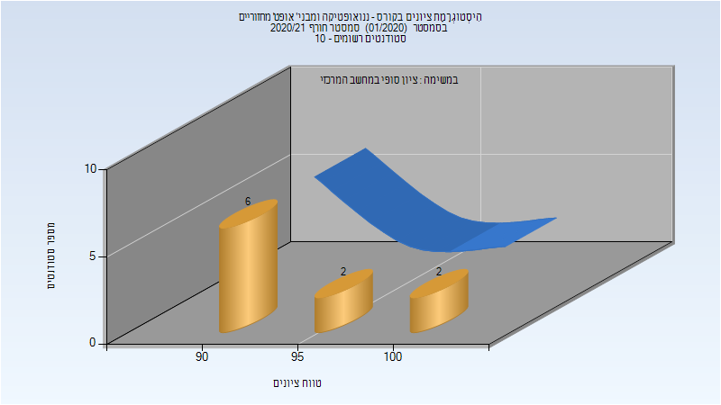

# 036070 - ננואופטיקה ומבני' אופט' מחזוריים

## חורף 2019-2020

| איש סגל | תפקיד |
| ---- | ---- |
| חסמן ארז | מרצה - אחראי מקצוע |
| סופרין שמואל | מתרגל - עם הרשאות מרצה אחראי |

### סופי מועד א'

| סטודנטים | עברו/נכשלו | אחוז עוברים | ציון מינימלי | ציון מקסימלי | ממוצע | חציון |
| ---- | ---- | ---- | ---- | ---- | ---- | ---- |
| 13 | 13/0 | 100 | 92 | 100 | 96.615 | 97 |

### סופי

| סטודנטים | עברו/נכשלו | אחוז עוברים | ציון מינימלי | ציון מקסימלי | ממוצע | חציון |
| ---- | ---- | ---- | ---- | ---- | ---- | ---- |
| 13 | 13/0 | 100 | 92 | 100 | 96.615 | 97 |

## חורף 2020-2021

| איש סגל | תפקיד |
| ---- | ---- |
| חסמן ארז | מרצה - אחראי מקצוע |
| סופרין שמואל | מתרגל - עם הרשאות מרצה אחראי |

### סופי

| סטודנטים | עברו/נכשלו | אחוז עוברים | ציון מינימלי | ציון מקסימלי | ממוצע | חציון |
| ---- | ---- | ---- | ---- | ---- | ---- | ---- |
| 10 | 10/0 | 100 | 93 | 100 | 94.8 | 93 |

