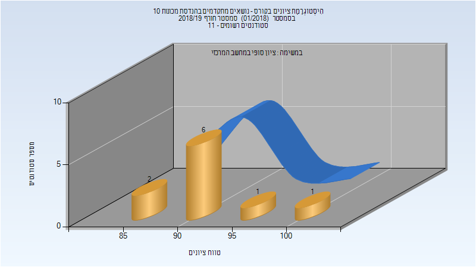

# 036089 - נושאים מתקדמים בהנדסת מכונות 10

## חורף 2018-2019

| איש סגל | תפקיד |
| ---- | ---- |
| רוזנברג צבי | מרצה - אחראי מקצוע |

### סופי

| סטודנטים | עברו/נכשלו | אחוז עוברים | ציון מינימלי | ציון מקסימלי | ממוצע | חציון |
| ---- | ---- | ---- | ---- | ---- | ---- | ---- |
| 10 | 10/0 | 100 | 87 | 100 | 91.9 | 90.5 |

