# 044105 - תורת המעגלים החשמליים

## חורף 2012-2013

| איש סגל | תפקיד |
| ---- | ---- |
| סתיו ינון | מרצה - אחראי מקצוע |
| שומוביץ שני | מתרגל |
| מוסאזאדה סאמאן | מתרגל |
| ברקוביץ' סופיה | מתרגל |
| מור אורי | מתרגל |

### מבחן מועד א'

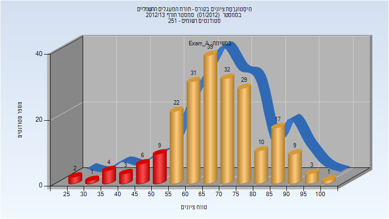

| סטודנטים | עברו/נכשלו | אחוז עוברים | ציון מינימלי | ציון מקסימלי | ממוצע | חציון |
| ---- | ---- | ---- | ---- | ---- | ---- | ---- |
| 218 | 193/25 | 89 | 25 | 100 | 66.606 | 65 |

### סופי מועד א'

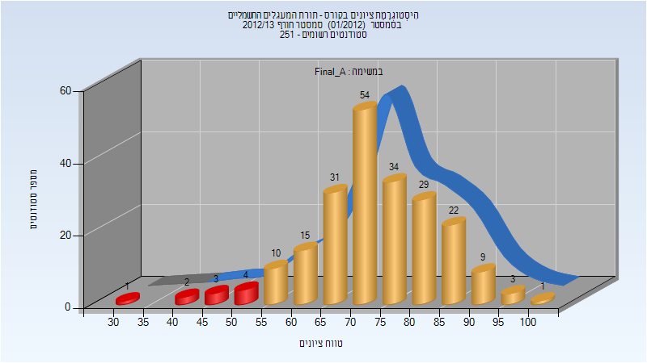

| סטודנטים | עברו/נכשלו | אחוז עוברים | ציון מינימלי | ציון מקסימלי | ממוצע | חציון |
| ---- | ---- | ---- | ---- | ---- | ---- | ---- |
| 218 | 208/10 | 95 | 34 | 100 | 73.725 | 73.5 |

### סופי מועד ב'

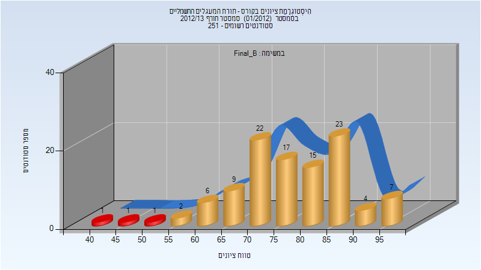

| סטודנטים | עברו/נכשלו | אחוז עוברים | ציון מינימלי | ציון מקסימלי | ממוצע | חציון |
| ---- | ---- | ---- | ---- | ---- | ---- | ---- |
| 108 | 105/3 | 97 | 43 | 96 | 77.694 | 78 |

## אביב 2013

| איש סגל | תפקיד |
| ---- | ---- |
| סתיו ינון | מרצה - אחראי מקצוע |
| מור אורי | מתרגל |
| ברקוביץ' סופיה | מתרגל |
| שומוביץ שני | מתרגל |

### מבחן מועד א'

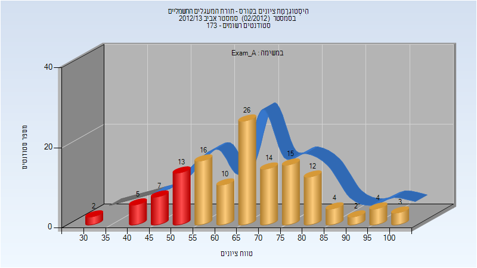

| סטודנטים | עברו/נכשלו | אחוז עוברים | ציון מינימלי | ציון מקסימלי | ממוצע | חציון |
| ---- | ---- | ---- | ---- | ---- | ---- | ---- |
| 133 | 106/27 | 80 | 31.176 | 100 | 67.368 | 67.647 |

### סופי מועד א'

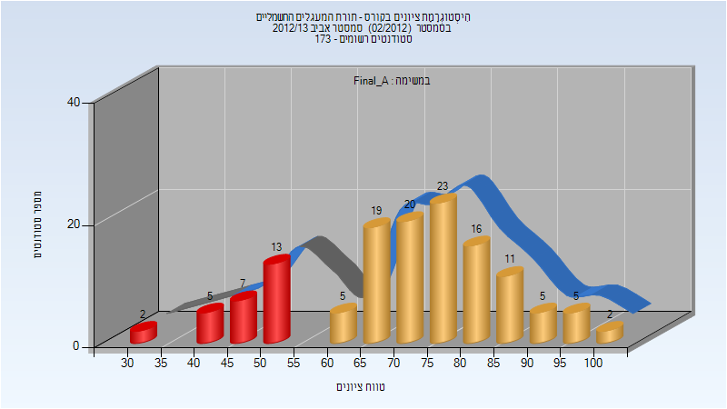

| סטודנטים | עברו/נכשלו | אחוז עוברים | ציון מינימלי | ציון מקסימלי | ממוצע | חציון |
| ---- | ---- | ---- | ---- | ---- | ---- | ---- |
| 133 | 106/27 | 80 | 31 | 100 | 71.383 | 74 |

### סופי מועד ב'

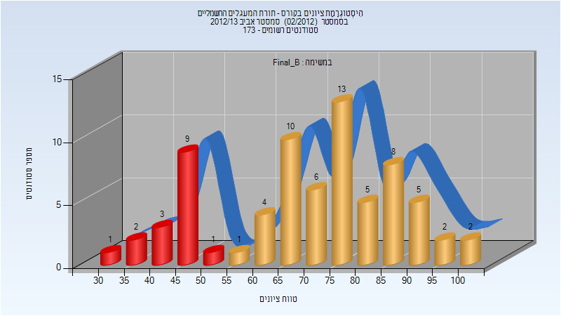

| סטודנטים | עברו/נכשלו | אחוז עוברים | ציון מינימלי | ציון מקסימלי | ממוצע | חציון |
| ---- | ---- | ---- | ---- | ---- | ---- | ---- |
| 72 | 56/16 | 78 | 31 | 100 | 71.139 | 73.5 |

## חורף 2013-2014

| איש סגל | תפקיד |
| ---- | ---- |
| סתיו ינון | מרצה - אחראי מקצוע |
| מור אורי | מתרגל |
| ברקוביץ' סופיה | מתרגל |

### מבחן מועד א'

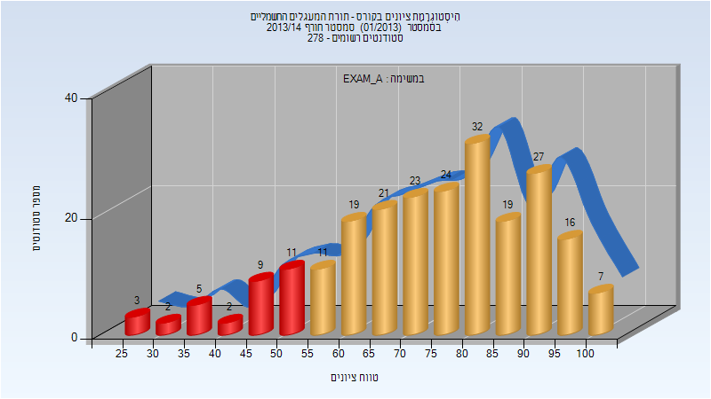

| סטודנטים | עברו/נכשלו | אחוז עוברים | ציון מינימלי | ציון מקסימלי | ממוצע | חציון |
| ---- | ---- | ---- | ---- | ---- | ---- | ---- |
| 231 | 199/32 | 86 | 25 | 100 | 72.251 | 75 |

### סופי מועד א'

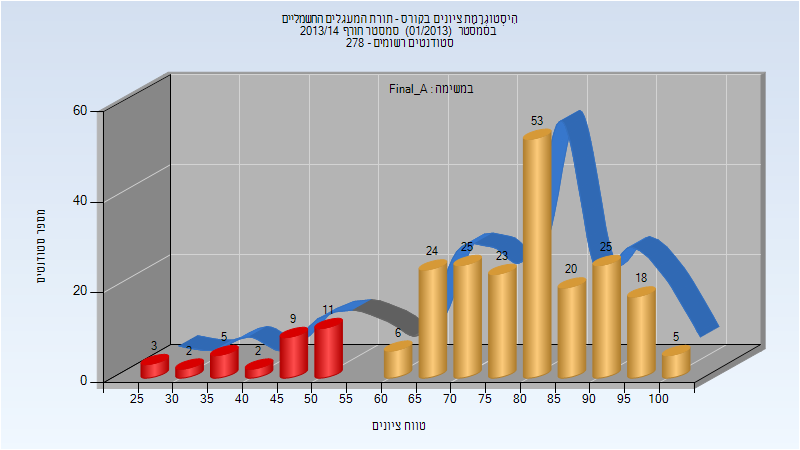

| סטודנטים | עברו/נכשלו | אחוז עוברים | ציון מינימלי | ציון מקסימלי | ממוצע | חציון |
| ---- | ---- | ---- | ---- | ---- | ---- | ---- |
| 231 | 199/32 | 86 | 25 | 100 | 75.935 | 80 |

### סופי מועד ב'

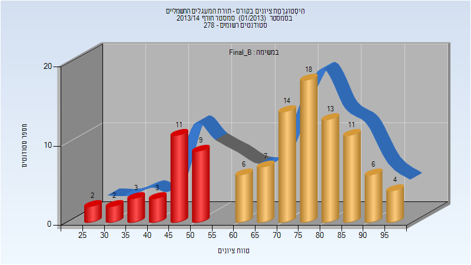

| סטודנטים | עברו/נכשלו | אחוז עוברים | ציון מינימלי | ציון מקסימלי | ממוצע | חציון |
| ---- | ---- | ---- | ---- | ---- | ---- | ---- |
| 109 | 79/30 | 72 | 25 | 99 | 68.587 | 73 |

## אביב 2014

| איש סגל | תפקיד |
| ---- | ---- |
| סתיו ינון | מרצה - אחראי מקצוע |
| חנוכה עדי | מתרגל |
| רמדאן מיסבאח | מתרגל |
| שפרנק דנה | מתרגל |
| קרטובסקי אסף | מתרגל |

### מבחן מועד א'

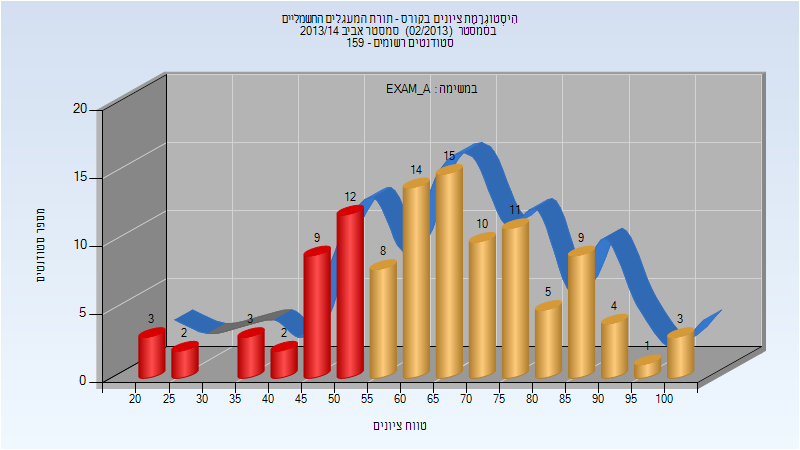

| סטודנטים | עברו/נכשלו | אחוז עוברים | ציון מינימלי | ציון מקסימלי | ממוצע | חציון |
| ---- | ---- | ---- | ---- | ---- | ---- | ---- |
| 111 | 80/31 | 72 | 20 | 100 | 63.063 | 65 |

### סופי מועד א'

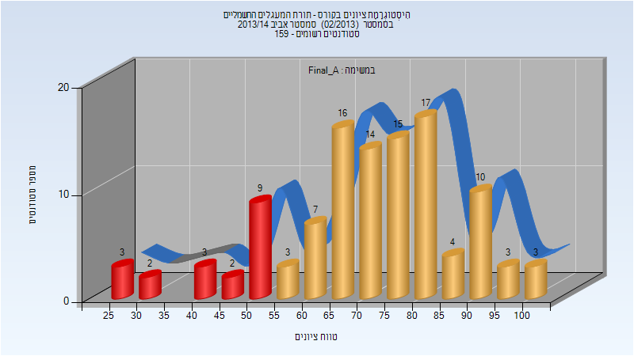

| סטודנטים | עברו/נכשלו | אחוז עוברים | ציון מינימלי | ציון מקסימלי | ממוצע | חציון |
| ---- | ---- | ---- | ---- | ---- | ---- | ---- |
| 111 | 92/19 | 83 | 25 | 100 | 71.09 | 72 |

### סופי מועד ב'

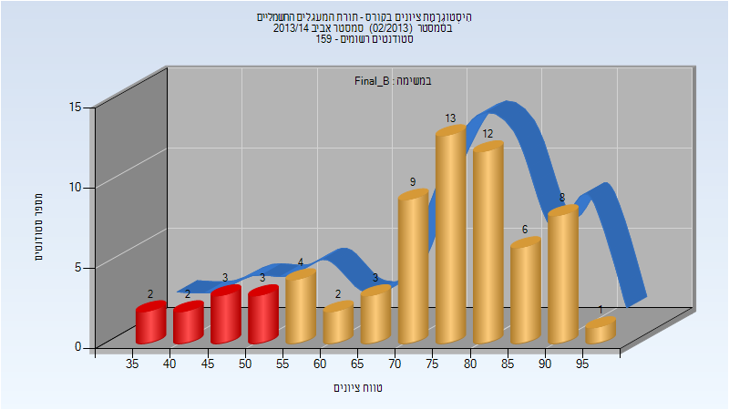

| סטודנטים | עברו/נכשלו | אחוז עוברים | ציון מינימלי | ציון מקסימלי | ממוצע | חציון |
| ---- | ---- | ---- | ---- | ---- | ---- | ---- |
| 68 | 58/10 | 85 | 35 | 96 | 73.118 | 76 |

## חורף 2014-2015

| איש סגל | תפקיד |
| ---- | ---- |
| סתיו ינון | מרצה - אחראי מקצוע |
| חנוכה עדי | מתרגל |
| הפנר אבי | מתרגל |
| רמדאן מיסבאח | מתרגל |
| קרטובסקי אסף | מתרגל |

### מבחן מועד א'

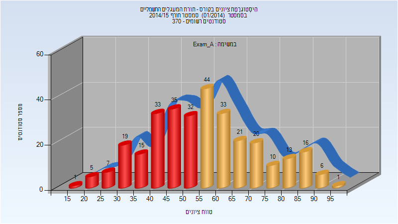

| סטודנטים | עברו/נכשלו | אחוז עוברים | ציון מינימלי | ציון מקסימלי | ממוצע | חציון |
| ---- | ---- | ---- | ---- | ---- | ---- | ---- |
| 311 | 164/147 | 53 | 15 | 95 | 54.116 | 55 |

### סופי מועד א'

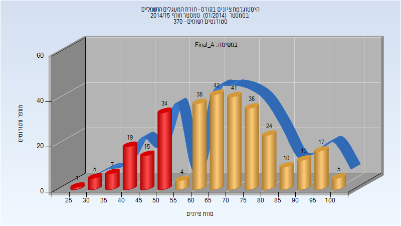

| סטודנטים | עברו/נכשלו | אחוז עוברים | ציון מינימלי | ציון מקסימלי | ממוצע | חציון |
| ---- | ---- | ---- | ---- | ---- | ---- | ---- |
| 311 | 230/81 | 74 | 25 | 100 | 67.016 | 68 |

### סופי מועד ב'

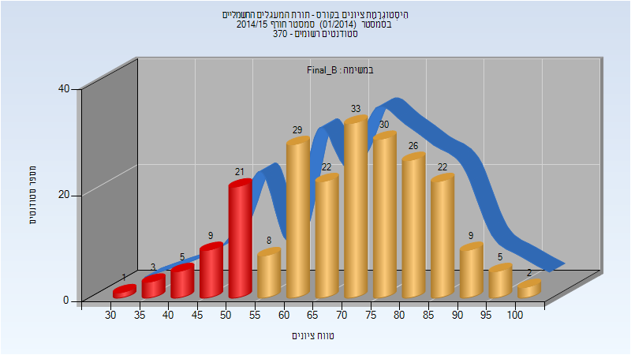

| סטודנטים | עברו/נכשלו | אחוז עוברים | ציון מינימלי | ציון מקסימלי | ממוצע | חציון |
| ---- | ---- | ---- | ---- | ---- | ---- | ---- |
| 225 | 186/39 | 83 | 30 | 100 | 70.071 | 72 |

### סופי

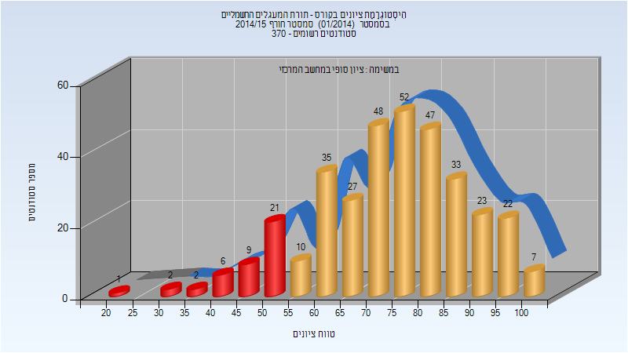

| סטודנטים | עברו/נכשלו | אחוז עוברים | ציון מינימלי | ציון מקסימלי | ממוצע | חציון |
| ---- | ---- | ---- | ---- | ---- | ---- | ---- |
| 345 | 304/41 | 88 | 20 | 100 | 73.93 | 76 |

## אביב 2015

| איש סגל | תפקיד |
| ---- | ---- |
| סתיו ינון | מרצה - אחראי מקצוע |
| רמדאן מיסבאח | מתרגל |
| קרטובסקי אסף | מתרגל |

### מבחן מועד א'

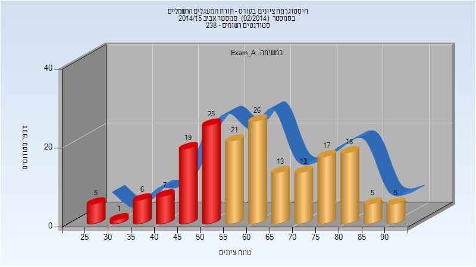

| סטודנטים | עברו/נכשלו | אחוז עוברים | ציון מינימלי | ציון מקסימלי | ממוצע | חציון |
| ---- | ---- | ---- | ---- | ---- | ---- | ---- |
| 181 | 118/63 | 65 | 25 | 90 | 59.724 | 60 |

### סופי מועד א'

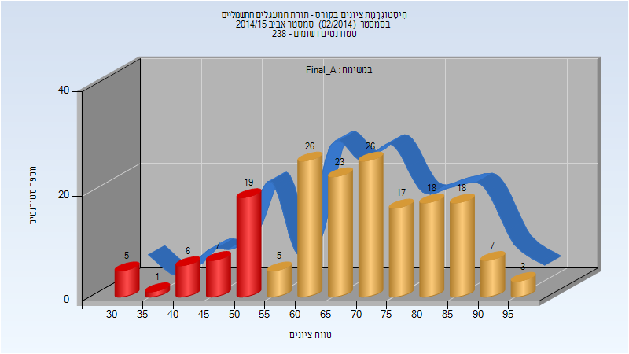

| סטודנטים | עברו/נכשלו | אחוז עוברים | ציון מינימלי | ציון מקסימלי | ממוצע | חציון |
| ---- | ---- | ---- | ---- | ---- | ---- | ---- |
| 181 | 143/38 | 79 | 30 | 96 | 67.917 | 69 |

### סופי מועד ב'

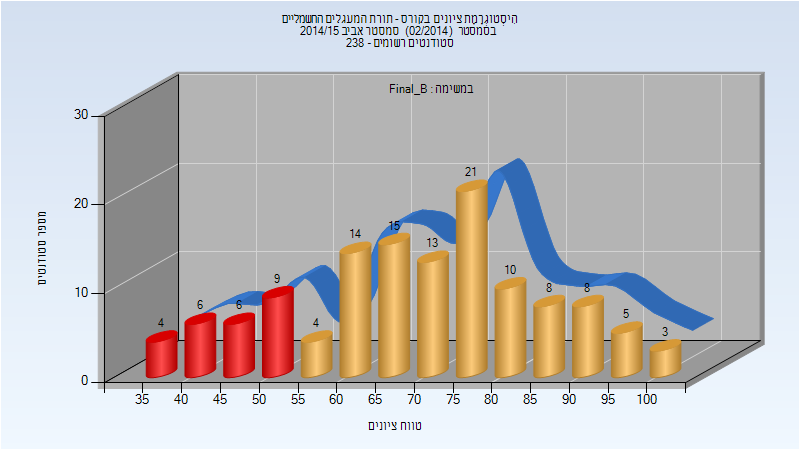

| סטודנטים | עברו/נכשלו | אחוז עוברים | ציון מינימלי | ציון מקסימלי | ממוצע | חציון |
| ---- | ---- | ---- | ---- | ---- | ---- | ---- |
| 126 | 101/25 | 80 | 35 | 100 | 69.849 | 71.5 |

### סופי

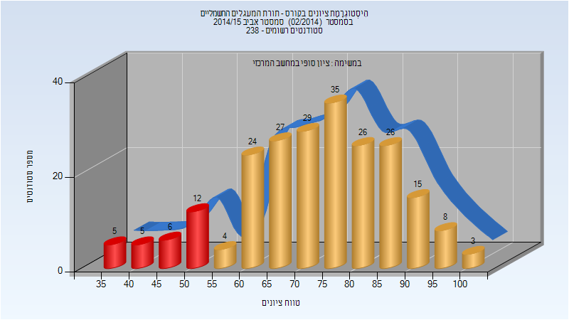

| סטודנטים | עברו/נכשלו | אחוז עוברים | ציון מינימלי | ציון מקסימלי | ממוצע | חציון |
| ---- | ---- | ---- | ---- | ---- | ---- | ---- |
| 225 | 197/28 | 88 | 35 | 100 | 72.964 | 75 |

## חורף 2015-2016

| איש סגל | תפקיד |
| ---- | ---- |
| סתיו ינון | מרצה - אחראי מקצוע |
| חכמוביץ יואב | מתרגל |
| רמדאן מיסבאח | מתרגל - עם הרשאות מרצה אחראי |
| קרטובסקי אסף | מתרגל - עם הרשאות מרצה אחראי |

### מבחן מועד א'

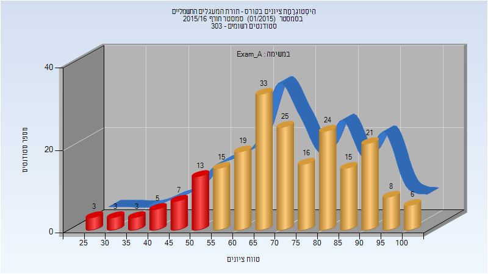

| סטודנטים | עברו/נכשלו | אחוז עוברים | ציון מינימלי | ציון מקסימלי | ממוצע | חציון |
| ---- | ---- | ---- | ---- | ---- | ---- | ---- |
| 216 | 182/34 | 84 | 25 | 100 | 69.167 | 70 |

### סופי מועד א'

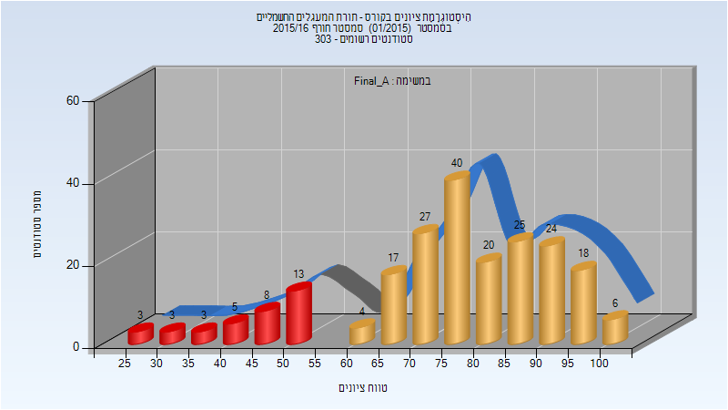

| סטודנטים | עברו/נכשלו | אחוז עוברים | ציון מינימלי | ציון מקסימלי | ממוצע | חציון |
| ---- | ---- | ---- | ---- | ---- | ---- | ---- |
| 216 | 181/35 | 84 | 25 | 100 | 75.241 | 77 |

### מבחן מועד ב'

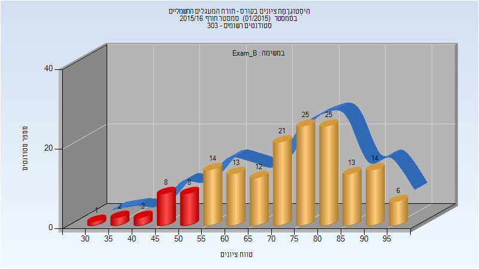

| סטודנטים | עברו/נכשלו | אחוז עוברים | ציון מינימלי | ציון מקסימלי | ממוצע | חציון |
| ---- | ---- | ---- | ---- | ---- | ---- | ---- |
| 164 | 143/21 | 87 | 30 | 95 | 70.427 | 75 |

### סופי מועד ב'

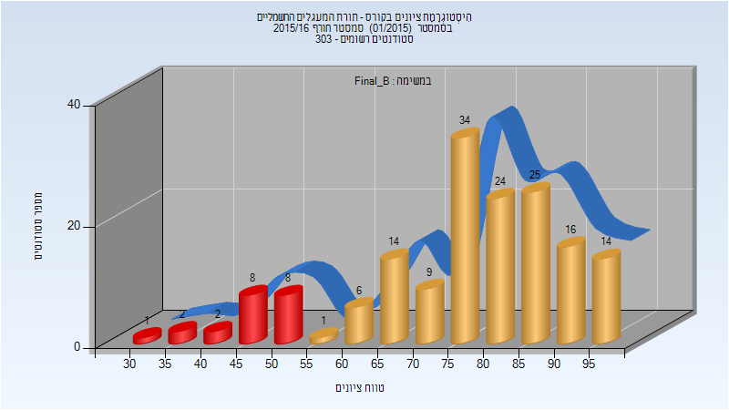

| סטודנטים | עברו/נכשלו | אחוז עוברים | ציון מינימלי | ציון מקסימלי | ממוצע | חציון |
| ---- | ---- | ---- | ---- | ---- | ---- | ---- |
| 164 | 143/21 | 87 | 30 | 99 | 76.427 | 79 |

### סופי

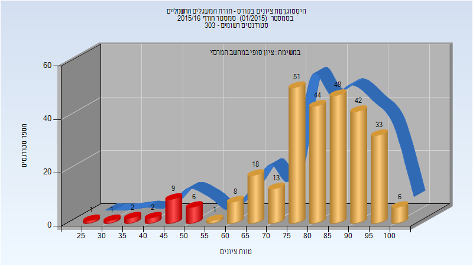

| סטודנטים | עברו/נכשלו | אחוז עוברים | ציון מינימלי | ציון מקסימלי | ממוצע | חציון |
| ---- | ---- | ---- | ---- | ---- | ---- | ---- |
| 285 | 264/21 | 93 | 25 | 100 | 80.575 | 83 |

## אביב 2016

| איש סגל | תפקיד |
| ---- | ---- |
| סתיו ינון | מרצה - אחראי מקצוע |
| חכמוביץ יואב | מתרגל |
| רמדאן מיסבאח | מתרגל - עם הרשאות מרצה אחראי |

### מבחן מועד א'

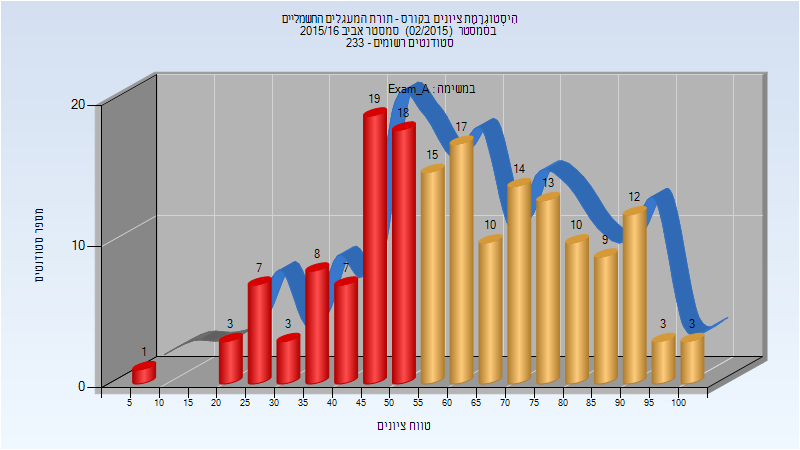

| סטודנטים | עברו/נכשלו | אחוז עוברים | ציון מינימלי | ציון מקסימלי | ממוצע | חציון |
| ---- | ---- | ---- | ---- | ---- | ---- | ---- |
| 172 | 106/66 | 62 | 5 | 100 | 60.029 | 60 |

### סופי מועד א'

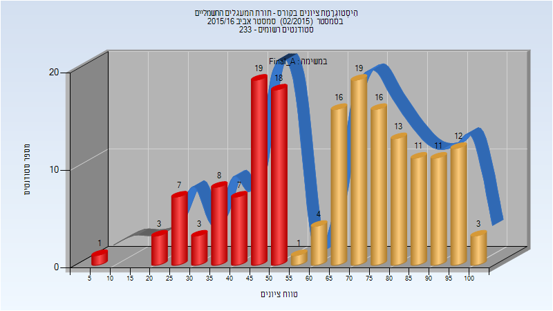

| סטודנטים | עברו/נכשלו | אחוז עוברים | ציון מינימלי | ציון מקסימלי | ממוצע | חציון |
| ---- | ---- | ---- | ---- | ---- | ---- | ---- |
| 172 | 106/66 | 62 | 5 | 100 | 64.698 | 69 |

### סופי מועד ב'

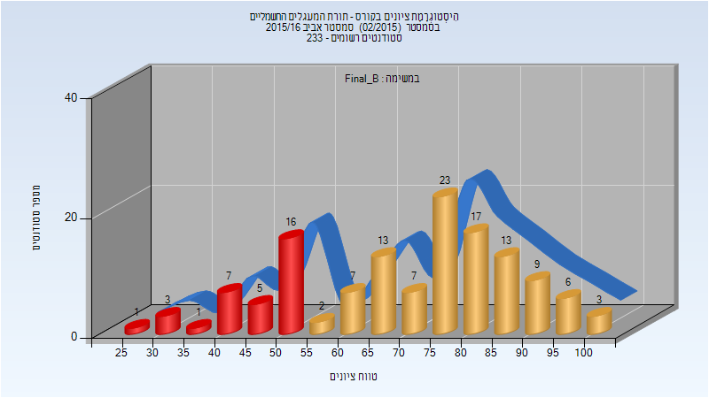

| סטודנטים | עברו/נכשלו | אחוז עוברים | ציון מינימלי | ציון מקסימלי | ממוצע | חציון |
| ---- | ---- | ---- | ---- | ---- | ---- | ---- |
| 133 | 100/33 | 75 | 25 | 100 | 70.797 | 75 |

### סופי

| סטודנטים | עברו/נכשלו | אחוז עוברים | ציון מינימלי | ציון מקסימלי | ממוצע | חציון |
| ---- | ---- | ---- | ---- | ---- | ---- | ---- |
| 214 | 181/33 | 85 | 20 | 100 | 74.907 | 79 |

## חורף 2016-2017

| איש סגל | תפקיד |
| ---- | ---- |
| סתיו ינון | מרצה - אחראי מקצוע |
| ריינהרדט אורי | מתרגל |
| חאג' עלי אמיר | מתרגל - עם הרשאות מרצה אחראי |
| חכמוביץ יואב | מתרגל - עם הרשאות מרצה אחראי |

### מבחן מועד א'

| סטודנטים | עברו/נכשלו | אחוז עוברים | ציון מינימלי | ציון מקסימלי | ממוצע | חציון |
| ---- | ---- | ---- | ---- | ---- | ---- | ---- |
| 290 | 234/56 | 81 | 10 | 105 | 68.276 | 70 |

### סופי מועד א'

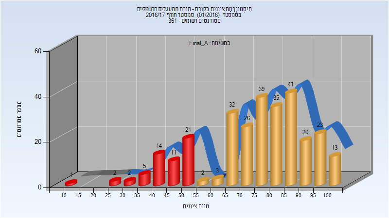

| סטודנטים | עברו/נכשלו | אחוז עוברים | ציון מינימלי | ציון מקסימלי | ממוצע | חציון |
| ---- | ---- | ---- | ---- | ---- | ---- | ---- |
| 290 | 234/56 | 81 | 10 | 100 | 74.217 | 79 |

### מבחן מועד ב'

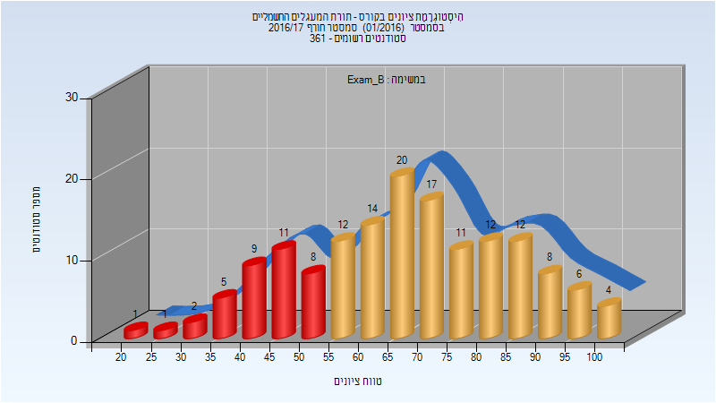

| סטודנטים | עברו/נכשלו | אחוז עוברים | ציון מינימלי | ציון מקסימלי | ממוצע | חציון |
| ---- | ---- | ---- | ---- | ---- | ---- | ---- |
| 153 | 116/37 | 76 | 20 | 100 | 65.49 | 65 |

### סופי מועד ב'

| סטודנטים | עברו/נכשלו | אחוז עוברים | ציון מינימלי | ציון מקסימלי | ממוצע | חציון |
| ---- | ---- | ---- | ---- | ---- | ---- | ---- |
| 153 | 116/37 | 76 | 20 | 100 | 71.203 | 75 |

### סופי

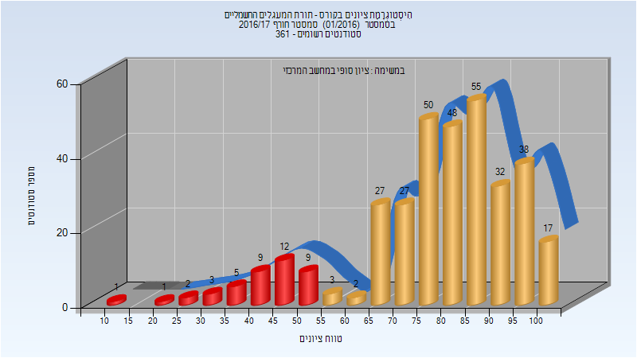

| סטודנטים | עברו/נכשלו | אחוז עוברים | ציון מינימלי | ציון מקסימלי | ממוצע | חציון |
| ---- | ---- | ---- | ---- | ---- | ---- | ---- |
| 341 | 299/42 | 88 | 10 | 100 | 77.977 | 82 |

## אביב 2017

| איש סגל | תפקיד |
| ---- | ---- |
| סתיו ינון | מרצה - אחראי מקצוע |
| חכמוביץ יואב | מתרגל - עם הרשאות מרצה אחראי |
| חאג' עלי אמיר | מתרגל - עם הרשאות מרצה אחראי |
| נאור עודד | מתרגל - עם הרשאות מרצה אחראי |

### מבחן מועד א'

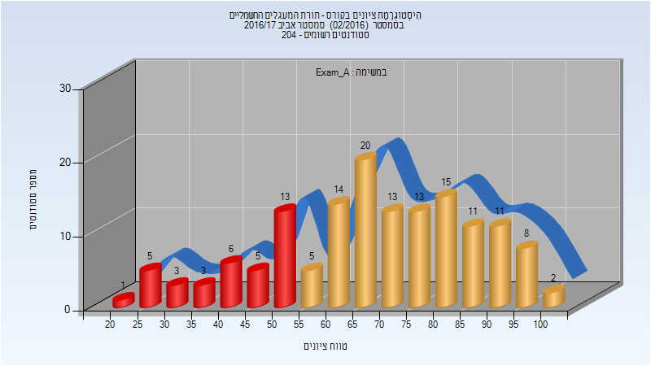

| סטודנטים | עברו/נכשלו | אחוז עוברים | ציון מינימלי | ציון מקסימלי | ממוצע | חציון |
| ---- | ---- | ---- | ---- | ---- | ---- | ---- |
| 148 | 112/36 | 76 | 20 | 100 | 66.486 | 65 |

### סופי מועד א'

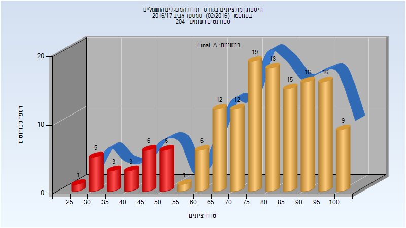

| סטודנטים | עברו/נכשלו | אחוז עוברים | ציון מינימלי | ציון מקסימלי | ממוצע | חציון |
| ---- | ---- | ---- | ---- | ---- | ---- | ---- |
| 148 | 124/24 | 84 | 25 | 100 | 76 | 79.5 |

### מבחן מועד ב'

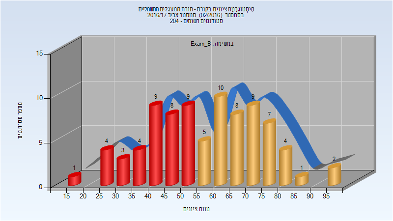

| סטודנטים | עברו/נכשלו | אחוז עוברים | ציון מינימלי | ציון מקסימלי | ממוצע | חציון |
| ---- | ---- | ---- | ---- | ---- | ---- | ---- |
| 84 | 46/38 | 55 | 15 | 95 | 55.488 | 55.5 |

### סופי מועד ב'

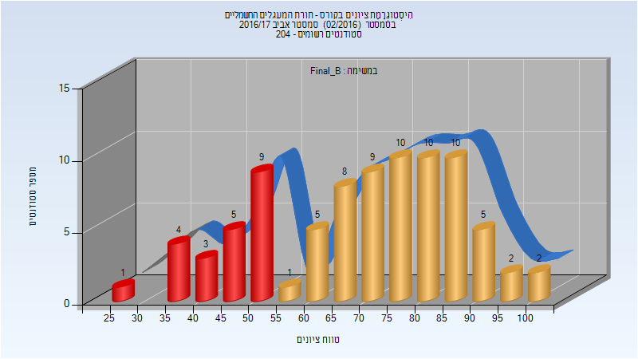

| סטודנטים | עברו/נכשלו | אחוז עוברים | ציון מינימלי | ציון מקסימלי | ממוצע | חציון |
| ---- | ---- | ---- | ---- | ---- | ---- | ---- |
| 84 | 62/22 | 74 | 25 | 100 | 69.631 | 73 |

### סופי

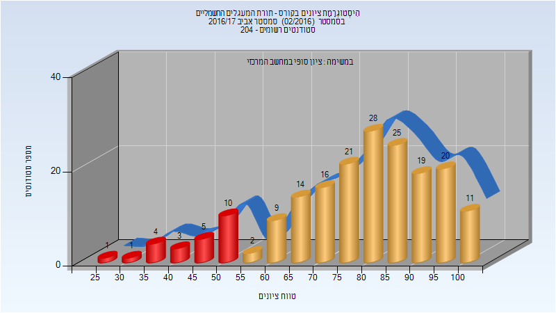

| סטודנטים | עברו/נכשלו | אחוז עוברים | ציון מינימלי | ציון מקסימלי | ממוצע | חציון |
| ---- | ---- | ---- | ---- | ---- | ---- | ---- |
| 189 | 165/24 | 87 | 25 | 100 | 77.836 | 83 |

## חורף 2017-2018

| איש סגל | תפקיד |
| ---- | ---- |
| ריינהרדט אורי | מתרגל |
| נאור עודד | מתרגל |
| סתיו ינון | מרצה |
| אפשטיין אריאל | מרצה |
| חאג' עלי אמיר | מתרגל - עם הרשאות מרצה אחראי |

### מבחן מועד א'

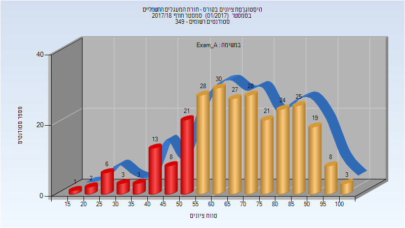

| סטודנטים | עברו/נכשלו | אחוז עוברים | ציון מינימלי | ציון מקסימלי | ממוצע | חציון |
| ---- | ---- | ---- | ---- | ---- | ---- | ---- |
| 270 | 213/57 | 79 | 15 | 100 | 65.837 | 65 |

### סופי מועד א'

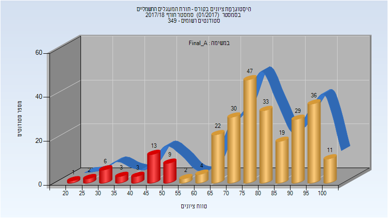

| סטודנטים | עברו/נכשלו | אחוז עוברים | ציון מינימלי | ציון מקסימלי | ממוצע | חציון |
| ---- | ---- | ---- | ---- | ---- | ---- | ---- |
| 270 | 233/37 | 86 | 20 | 100 | 76.87 | 79 |

### מבחן מועד ב'

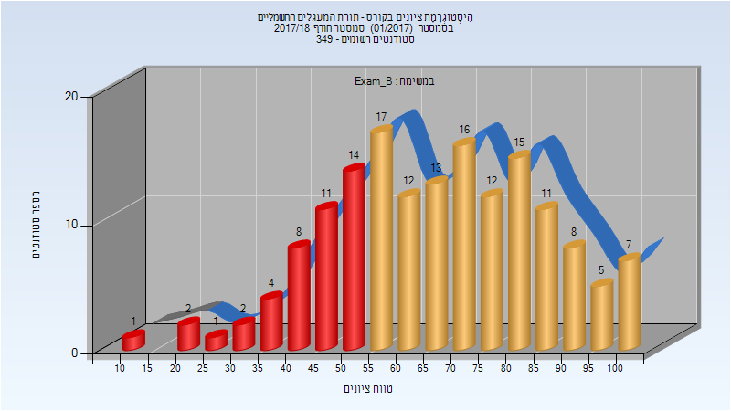

| סטודנטים | עברו/נכשלו | אחוז עוברים | ציון מינימלי | ציון מקסימלי | ממוצע | חציון |
| ---- | ---- | ---- | ---- | ---- | ---- | ---- |
| 159 | 116/43 | 73 | 10 | 100 | 65.031 | 65 |

### סופי מועד ב'

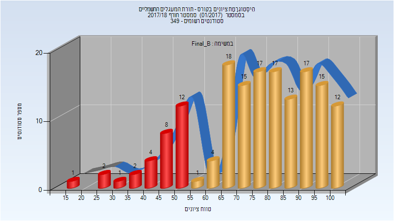

| סטודנטים | עברו/נכשלו | אחוז עוברים | ציון מינימלי | ציון מקסימלי | ממוצע | חציון |
| ---- | ---- | ---- | ---- | ---- | ---- | ---- |
| 159 | 129/30 | 81 | 15 | 100 | 75.013 | 79 |

### סופי

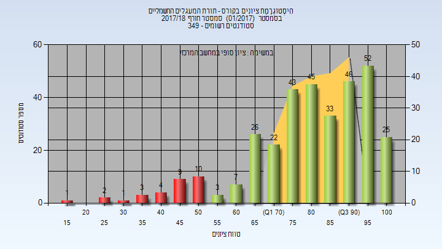

| סטודנטים | עברו/נכשלו | אחוז עוברים | ציון מינימלי | ציון מקסימלי | ממוצע | חציון |
| ---- | ---- | ---- | ---- | ---- | ---- | ---- |
| 332 | 302/30 | 91 | 15 | 100 | 80.91 | 83 |

## אביב 2018

| איש סגל | תפקיד |
| ---- | ---- |
| סתיו ינון | מרצה - אחראי מקצוע |
| ריינהרדט אורי | מתרגל - עם הרשאות מרצה אחראי |

### מבחן מועד א'

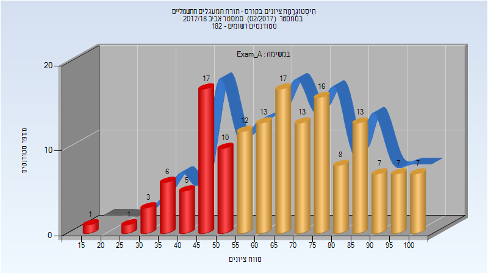

| סטודנטים | עברו/נכשלו | אחוז עוברים | ציון מינימלי | ציון מקסימלי | ממוצע | חציון |
| ---- | ---- | ---- | ---- | ---- | ---- | ---- |
| 156 | 113/43 | 72 | 15 | 100 | 65.385 | 65 |

### סופי מועד א'

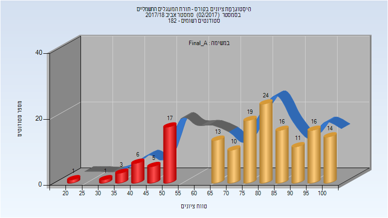

| סטודנטים | עברו/נכשלו | אחוז עוברים | ציון מינימלי | ציון מקסימלי | ממוצע | חציון |
| ---- | ---- | ---- | ---- | ---- | ---- | ---- |
| 156 | 123/33 | 79 | 20 | 100 | 76.083 | 80 |

### מבחן מועד ב'

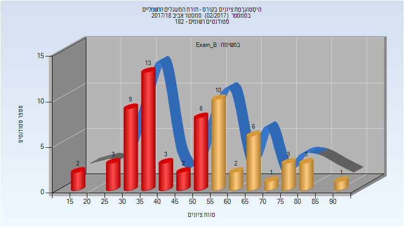

| סטודנטים | עברו/נכשלו | אחוז עוברים | ציון מינימלי | ציון מקסימלי | ממוצע | חציון |
| ---- | ---- | ---- | ---- | ---- | ---- | ---- |
| 66 | 26/40 | 39 | 15 | 90 | 47.348 | 50 |

### סופי מועד ב'

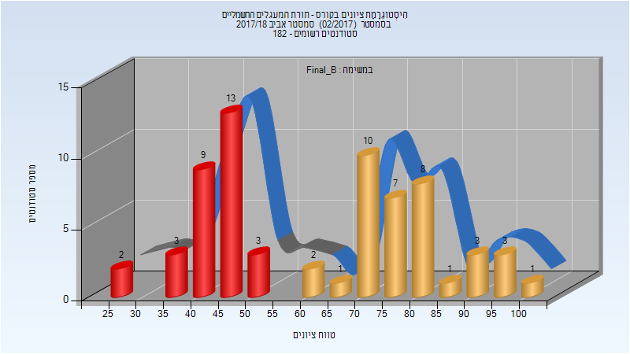

| סטודנטים | עברו/נכשלו | אחוז עוברים | ציון מינימלי | ציון מקסימלי | ממוצע | חציון |
| ---- | ---- | ---- | ---- | ---- | ---- | ---- |
| 66 | 36/30 | 55 | 25 | 100 | 62.091 | 68.5 |

### סופי

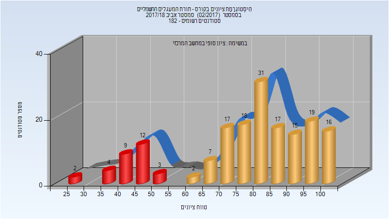

| סטודנטים | עברו/נכשלו | אחוז עוברים | ציון מינימלי | ציון מקסימלי | ממוצע | חציון |
| ---- | ---- | ---- | ---- | ---- | ---- | ---- |
| 172 | 142/30 | 83 | 25 | 100 | 77.25 | 80 |

## חורף 2018-2019

| איש סגל | תפקיד |
| ---- | ---- |
| סתיו ינון | מרצה - אחראי מקצוע |
| אפשטיין אריאל | מרצה |
| ריינהרדט אורי | מתרגל - עם הרשאות מרצה אחראי |

### מבחן מועד א'

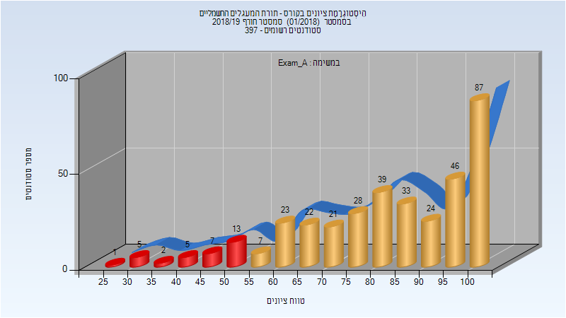

| סטודנטים | עברו/נכשלו | אחוז עוברים | ציון מינימלי | ציון מקסימלי | ממוצע | חציון |
| ---- | ---- | ---- | ---- | ---- | ---- | ---- |
| 363 | 330/33 | 91 | 25 | 100 | 80.813 | 85 |

### סופי מועד א'

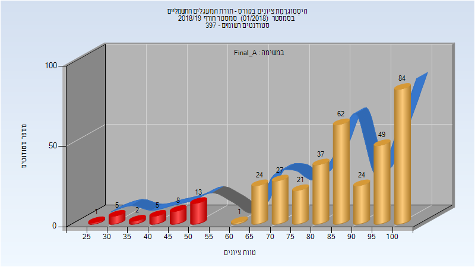

| סטודנטים | עברו/נכשלו | אחוז עוברים | ציון מינימלי | ציון מקסימלי | ממוצע | חציון |
| ---- | ---- | ---- | ---- | ---- | ---- | ---- |
| 363 | 329/34 | 91 | 25 | 100 | 83.865 | 88 |

### מבחן מועד ב'

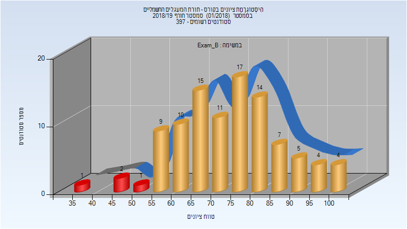

| סטודנטים | עברו/נכשלו | אחוז עוברים | ציון מינימלי | ציון מקסימלי | ממוצע | חציון |
| ---- | ---- | ---- | ---- | ---- | ---- | ---- |
| 100 | 96/4 | 96 | 35 | 100 | 72.35 | 75 |

### סופי מועד ב'

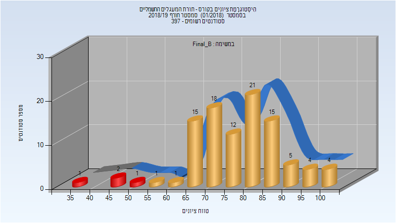

| סטודנטים | עברו/נכשלו | אחוז עוברים | ציון מינימלי | ציון מקסימלי | ממוצע | חציון |
| ---- | ---- | ---- | ---- | ---- | ---- | ---- |
| 100 | 96/4 | 96 | 35 | 100 | 77.68 | 78 |

### סופי

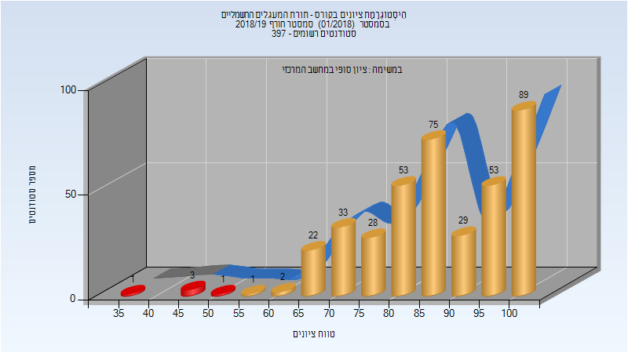

| סטודנטים | עברו/נכשלו | אחוז עוברים | ציון מינימלי | ציון מקסימלי | ממוצע | חציון |
| ---- | ---- | ---- | ---- | ---- | ---- | ---- |
| 390 | 385/5 | 99 | 35 | 100 | 86.946 | 88 |

## אביב 2019

| איש סגל | תפקיד |
| ---- | ---- |
| סתיו ינון | מרצה - אחראי מקצוע |
| ריינהרדט אורי | מתרגל - עם הרשאות מרצה אחראי |

### מבחן מועד א'

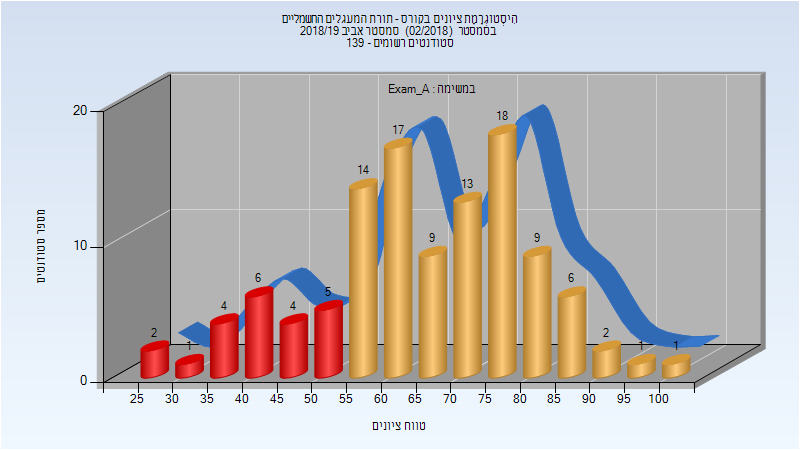

| סטודנטים | עברו/נכשלו | אחוז עוברים | ציון מינימלי | ציון מקסימלי | ממוצע | חציון |
| ---- | ---- | ---- | ---- | ---- | ---- | ---- |
| 112 | 90/22 | 80 | 25 | 100 | 66.018 | 66 |

### סופי מועד א'

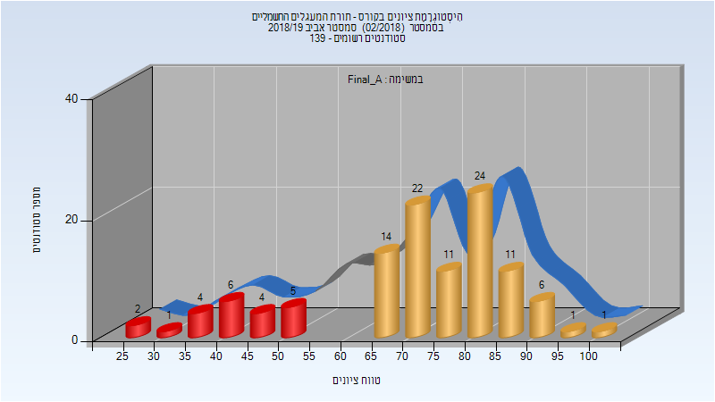

| סטודנטים | עברו/נכשלו | אחוז עוברים | ציון מינימלי | ציון מקסימלי | ממוצע | חציון |
| ---- | ---- | ---- | ---- | ---- | ---- | ---- |
| 112 | 90/22 | 80 | 25 | 100 | 71.116 | 74 |

### מבחן מועד ב'

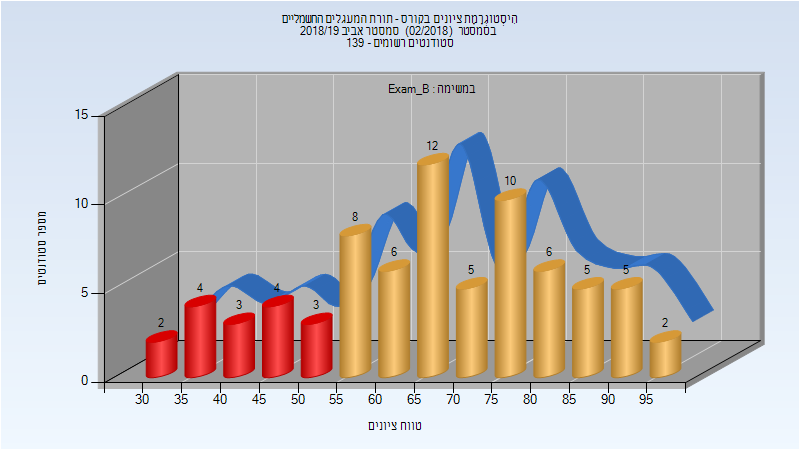

| סטודנטים | עברו/נכשלו | אחוז עוברים | ציון מינימלי | ציון מקסימלי | ממוצע | חציון |
| ---- | ---- | ---- | ---- | ---- | ---- | ---- |
| 75 | 59/16 | 79 | 31 | 97 | 67.32 | 69 |

### סופי מועד ב'

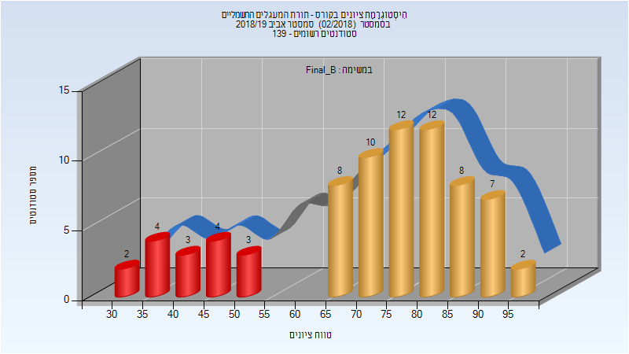

| סטודנטים | עברו/נכשלו | אחוז עוברים | ציון מינימלי | ציון מקסימלי | ממוצע | חציון |
| ---- | ---- | ---- | ---- | ---- | ---- | ---- |
| 75 | 59/16 | 79 | 31 | 98 | 71.68 | 75 |

### סופי

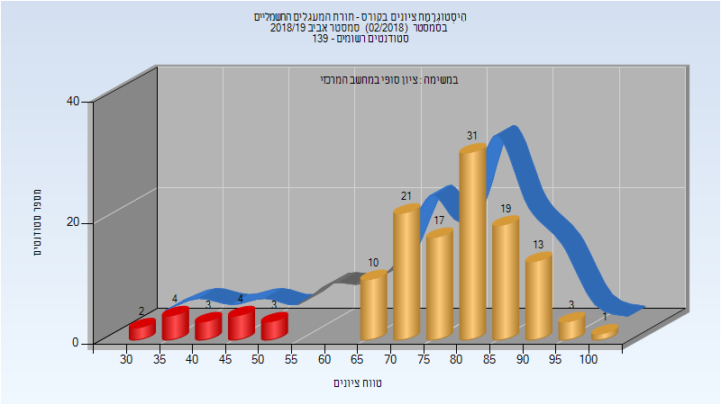

| סטודנטים | עברו/נכשלו | אחוז עוברים | ציון מינימלי | ציון מקסימלי | ממוצע | חציון |
| ---- | ---- | ---- | ---- | ---- | ---- | ---- |
| 131 | 115/16 | 88 | 31 | 100 | 75.847 | 80 |

## חורף 2019-2020

| איש סגל | תפקיד |
| ---- | ---- |
| סתיו ינון | מרצה - אחראי מקצוע |
| ריינהרדט אורי | מתרגל - עם הרשאות מרצה אחראי |

### מבחן מועד א'

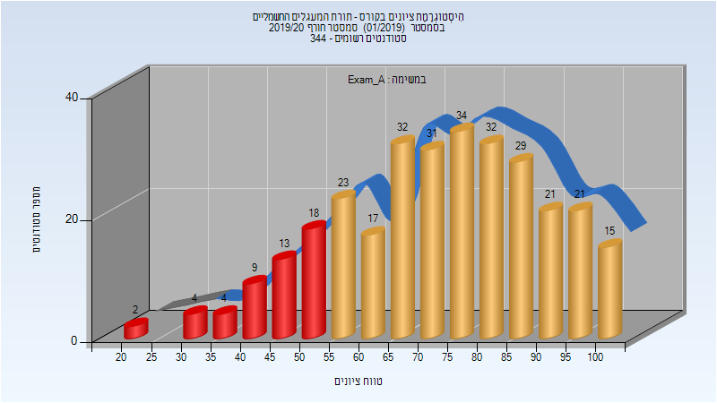

| סטודנטים | עברו/נכשלו | אחוז עוברים | ציון מינימלי | ציון מקסימלי | ממוצע | חציון |
| ---- | ---- | ---- | ---- | ---- | ---- | ---- |
| 305 | 255/50 | 84 | 21 | 100 | 72.826 | 74 |

### סופי מועד א'

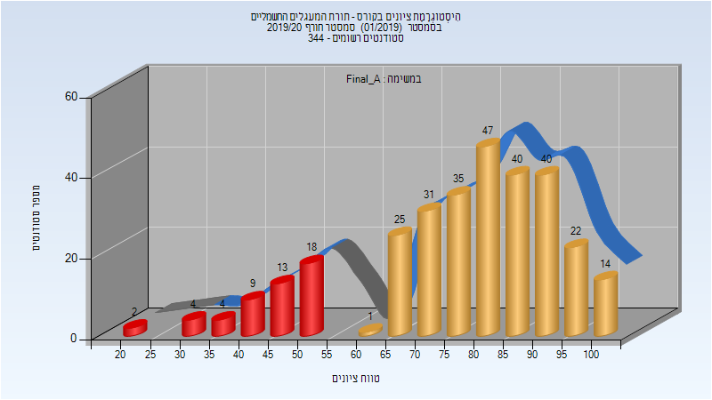

| סטודנטים | עברו/נכשלו | אחוז עוברים | ציון מינימלי | ציון מקסימלי | ממוצע | חציון |
| ---- | ---- | ---- | ---- | ---- | ---- | ---- |
| 305 | 255/50 | 84 | 21 | 100 | 76.836 | 80 |

### מבחן מועד ב'

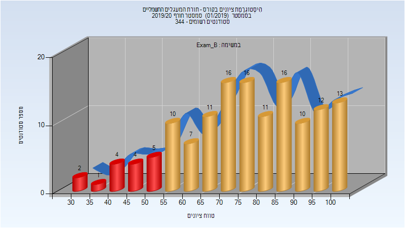

| סטודנטים | עברו/נכשלו | אחוז עוברים | ציון מינימלי | ציון מקסימלי | ממוצע | חציון |
| ---- | ---- | ---- | ---- | ---- | ---- | ---- |
| 138 | 122/16 | 88 | 30 | 100 | 75.964 | 77 |

### סופי מועד ב'

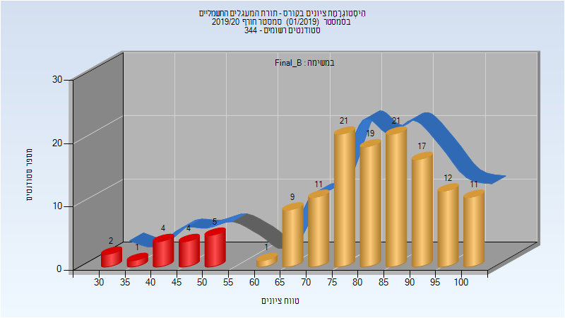

| סטודנטים | עברו/נכשלו | אחוז עוברים | ציון מינימלי | ציון מקסימלי | ממוצע | חציון |
| ---- | ---- | ---- | ---- | ---- | ---- | ---- |
| 138 | 122/16 | 88 | 30 | 100 | 79.71 | 82 |

### סופי

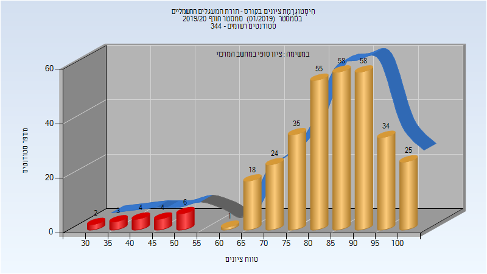

| סטודנטים | עברו/נכשלו | אחוז עוברים | ציון מינימלי | ציון מקסימלי | ממוצע | חציון |
| ---- | ---- | ---- | ---- | ---- | ---- | ---- |
| 329 | 313/16 | 95 | 30 | 100 | 83.438 | 86 |

## אביב 2020

| איש סגל | תפקיד |
| ---- | ---- |
| סתיו ינון | מרצה - אחראי מקצוע |
| אפשטיין אריאל | מרצה |
| ריינהרדט אורי | מתרגל - עם הרשאות מרצה אחראי |

### מבחן מועד א'

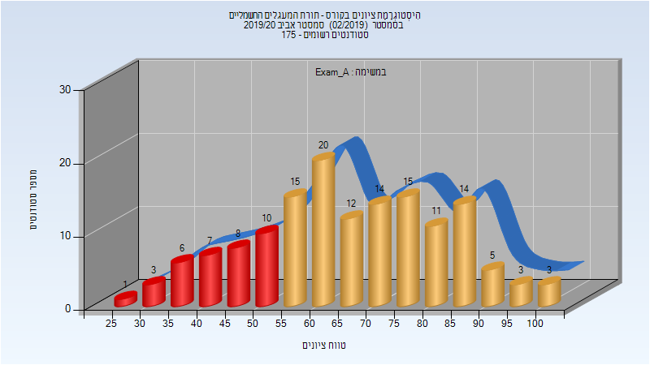

| סטודנטים | עברו/נכשלו | אחוז עוברים | ציון מינימלי | ציון מקסימלי | ממוצע | חציון |
| ---- | ---- | ---- | ---- | ---- | ---- | ---- |
| 147 | 113/34 | 77 | 29 | 100 | 66.388 | 66 |

### סופי מועד א'

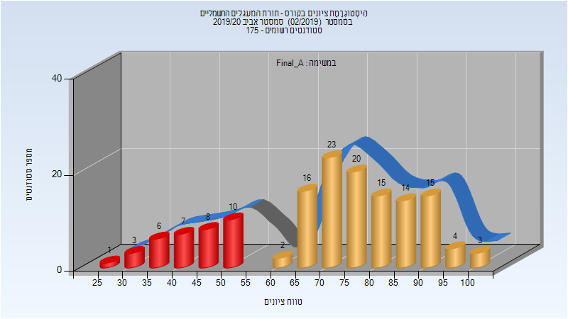

| סטודנטים | עברו/נכשלו | אחוז עוברים | ציון מינימלי | ציון מקסימלי | ממוצע | חציון |
| ---- | ---- | ---- | ---- | ---- | ---- | ---- |
| 147 | 113/34 | 77 | 29 | 100 | 71.02 | 73 |

### מבחן מועד ב'

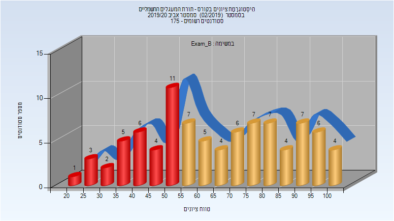

| סטודנטים | עברו/נכשלו | אחוז עוברים | ציון מינימלי | ציון מקסימלי | ממוצע | חציון |
| ---- | ---- | ---- | ---- | ---- | ---- | ---- |
| 90 | 58/32 | 64 | 21 | 100 | 65.978 | 65.5 |

### סופי מועד ב'

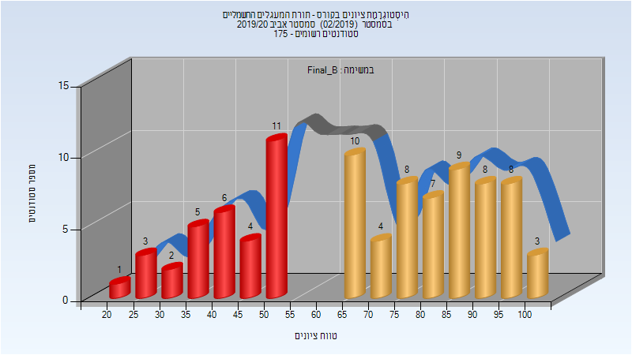

| סטודנטים | עברו/נכשלו | אחוז עוברים | ציון מינימלי | ציון מקסימלי | ממוצע | חציון |
| ---- | ---- | ---- | ---- | ---- | ---- | ---- |
| 90 | 58/32 | 64 | 21 | 100 | 68.844 | 73 |

### סופי

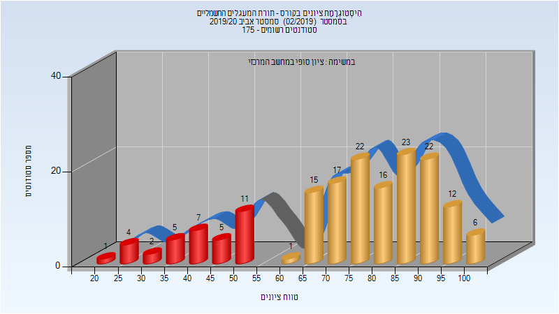

| סטודנטים | עברו/נכשלו | אחוז עוברים | ציון מינימלי | ציון מקסימלי | ממוצע | חציון |
| ---- | ---- | ---- | ---- | ---- | ---- | ---- |
| 169 | 135/34 | 80 | 21 | 100 | 74.586 | 79 |

## חורף 2020-2021

| איש סגל | תפקיד |
| ---- | ---- |
| סתיו ינון | מרצה - אחראי מקצוע |
| פורת משה | מרצה |
| לוי נעם | מתרגל - עם הרשאות מרצה אחראי |

### מבחן מועד א'

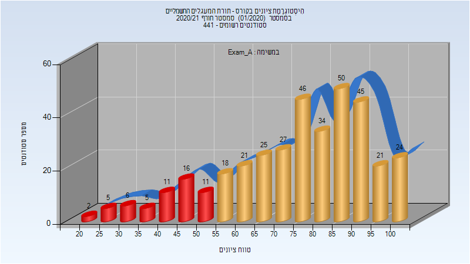

| סטודנטים | עברו/נכשלו | אחוז עוברים | ציון מינימלי | ציון מקסימלי | ממוצע | חציון |
| ---- | ---- | ---- | ---- | ---- | ---- | ---- |
| 366 | 321/45 | 88 | 26 | 100 | 77.923 | 81 |

### סופי מועד א'

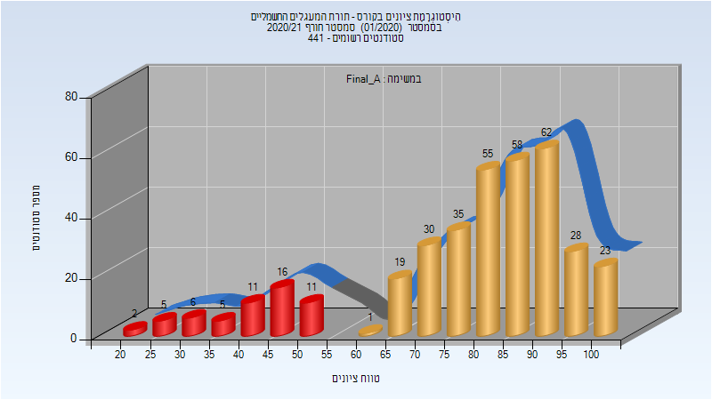

| סטודנטים | עברו/נכשלו | אחוז עוברים | ציון מינימלי | ציון מקסימלי | ממוצע | חציון |
| ---- | ---- | ---- | ---- | ---- | ---- | ---- |
| 366 | 321/45 | 88 | 26 | 100 | 81.402 | 85.5 |

### מבחן מועד ב'

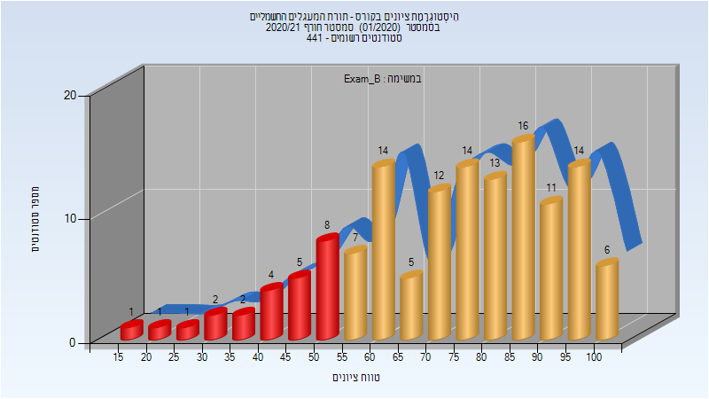

| סטודנטים | עברו/נכשלו | אחוז עוברים | ציון מינימלי | ציון מקסימלי | ממוצע | חציון |
| ---- | ---- | ---- | ---- | ---- | ---- | ---- |
| 134 | 111/23 | 83 | 19 | 100 | 73.358 | 76 |

### סופי מועד ב'

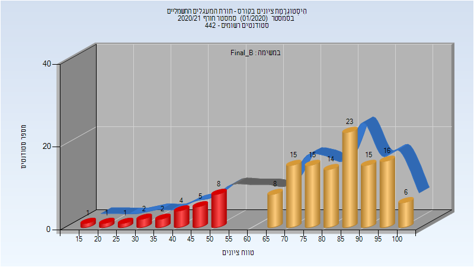

| סטודנטים | עברו/נכשלו | אחוז עוברים | ציון מינימלי | ציון מקסימלי | ממוצע | חציון |
| ---- | ---- | ---- | ---- | ---- | ---- | ---- |
| 134 | 111/23 | 83 | 19 | 100 | 77.276 | 82 |

### סופי

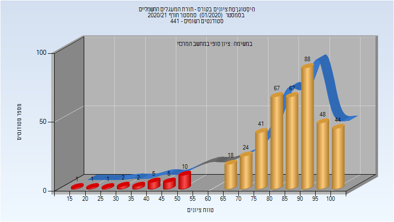

| סטודנטים | עברו/נכשלו | אחוז עוברים | ציון מינימלי | ציון מקסימלי | ממוצע | חציון |
| ---- | ---- | ---- | ---- | ---- | ---- | ---- |
| 423 | 396/27 | 94 | 19 | 100 | 84.296 | 88 |

