# 044127 - יסודות התקני מוליכים למחצה

## אביב 2010

| איש סגל | תפקיד |
| ---- | ---- |
| ריטר דן | מרצה - אחראי מקצוע |
| דוד אסף | מתרגל |

### סופי מועד א'

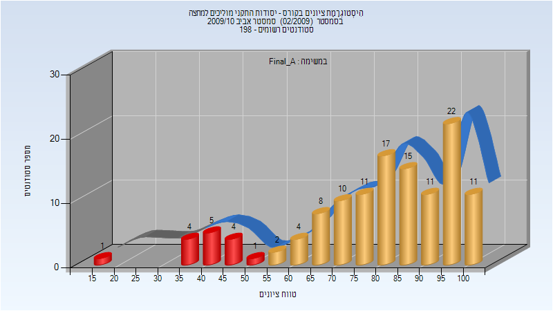

| סטודנטים | עברו/נכשלו | אחוז עוברים | ציון מינימלי | ציון מקסימלי | ממוצע | חציון |
| ---- | ---- | ---- | ---- | ---- | ---- | ---- |
| 126 | 111/15 | 88 | 19 | 100 | 79.619 | 83.5 |

## אביב 2019

| איש סגל | תפקיד |
| ---- | ---- |
| חייט אלכסנדר | מרצה - אחראי מקצוע |
| אשל יוני | מתרגל - עם הרשאות מרצה אחראי |
| לירז לידזי דן | מתרגל - עם הרשאות מרצה אחראי |
| בר עמנואל | מתרגל - עם הרשאות מרצה אחראי |

### מבחן מועד א'

| סטודנטים | עברו/נכשלו | אחוז עוברים | ציון מינימלי | ציון מקסימלי | ממוצע | חציון |
| ---- | ---- | ---- | ---- | ---- | ---- | ---- |
| 248 | 105/143 | 42 | 0 | 96 | 49.573 | 51 |

### סופי מועד א'

| סטודנטים | עברו/נכשלו | אחוז עוברים | ציון מינימלי | ציון מקסימלי | ממוצע | חציון |
| ---- | ---- | ---- | ---- | ---- | ---- | ---- |
| 248 | 209/39 | 84 | 16 | 100 | 70.472 | 71 |

### מבחן מועד ב'

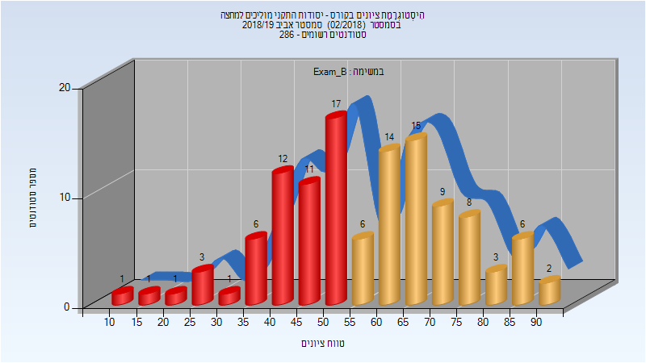

| סטודנטים | עברו/נכשלו | אחוז עוברים | ציון מינימלי | ציון מקסימלי | ממוצע | חציון |
| ---- | ---- | ---- | ---- | ---- | ---- | ---- |
| 116 | 63/53 | 54 | 11 | 91 | 58.103 | 58.5 |

### סופי מועד ב'

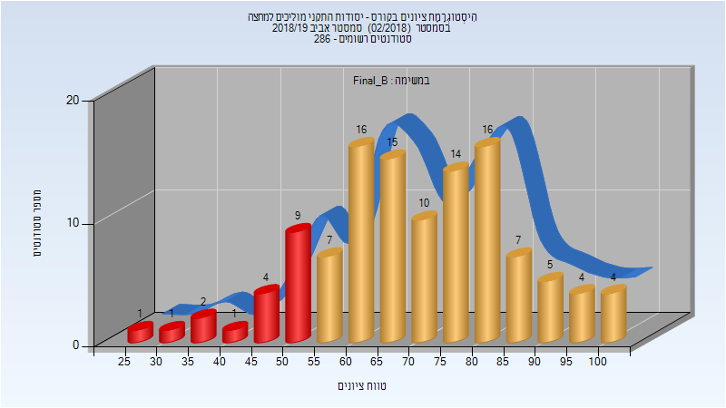

| סטודנטים | עברו/נכשלו | אחוז עוברים | ציון מינימלי | ציון מקסימלי | ממוצע | חציון |
| ---- | ---- | ---- | ---- | ---- | ---- | ---- |
| 116 | 98/18 | 84 | 25 | 100 | 70.716 | 71 |

### סופי

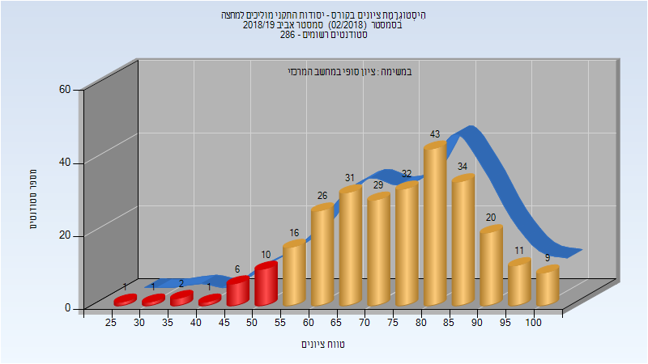

| סטודנטים | עברו/נכשלו | אחוז עוברים | ציון מינימלי | ציון מקסימלי | ממוצע | חציון |
| ---- | ---- | ---- | ---- | ---- | ---- | ---- |
| 272 | 251/21 | 92 | 25 | 100 | 75.159 | 76 |

## חורף 2019-2020

| איש סגל | תפקיד |
| ---- | ---- |
| גויכמן איליה | מרצה - אחראי מקצוע |
| בן-יעקב תמי | מרצה |
| שלנקביץ' דמיטרי | מתרגל - עם הרשאות מרצה אחראי |
| לירז לידזי דן | מתרגל - עם הרשאות מרצה אחראי |

### מבחן מועד א'

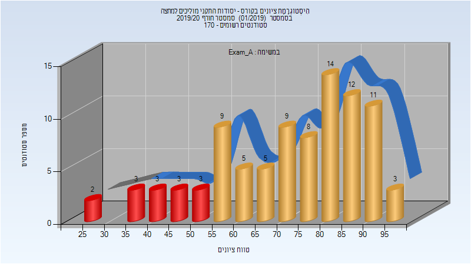

| סטודנטים | עברו/נכשלו | אחוז עוברים | ציון מינימלי | ציון מקסימלי | ממוצע | חציון |
| ---- | ---- | ---- | ---- | ---- | ---- | ---- |
| 90 | 76/14 | 84 | 27 | 99 | 72.344 | 75 |

### סופי מועד א'

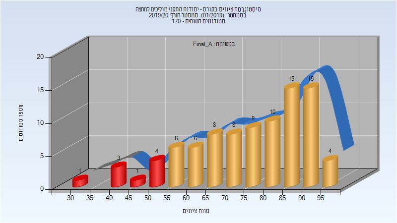

| סטודנטים | עברו/נכשלו | אחוז עוברים | ציון מינימלי | ציון מקסימלי | ממוצע | חציון |
| ---- | ---- | ---- | ---- | ---- | ---- | ---- |
| 90 | 81/9 | 90 | 34 | 99 | 75.789 | 77.5 |

### מבחן מועד ב'

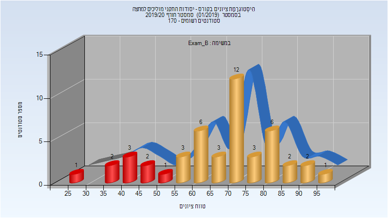

| סטודנטים | עברו/נכשלו | אחוז עוברים | ציון מינימלי | ציון מקסימלי | ממוצע | חציון |
| ---- | ---- | ---- | ---- | ---- | ---- | ---- |
| 47 | 38/9 | 81 | 28 | 97 | 66.979 | 70 |

### סופי מועד ב'

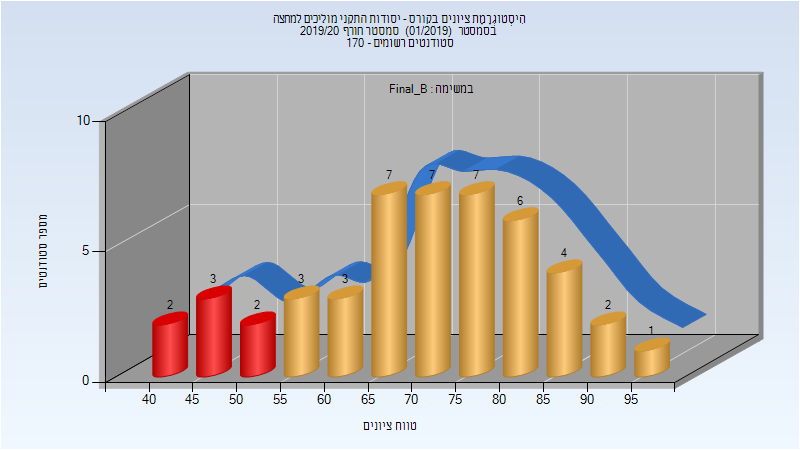

| סטודנטים | עברו/נכשלו | אחוז עוברים | ציון מינימלי | ציון מקסימלי | ממוצע | חציון |
| ---- | ---- | ---- | ---- | ---- | ---- | ---- |
| 47 | 40/7 | 85 | 41 | 97 | 70.681 | 73 |

### סופי

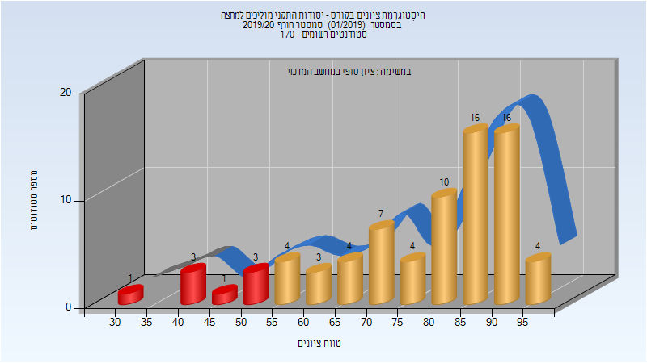

| סטודנטים | עברו/נכשלו | אחוז עוברים | ציון מינימלי | ציון מקסימלי | ממוצע | חציון |
| ---- | ---- | ---- | ---- | ---- | ---- | ---- |
| 141 | 129/12 | 91 | 34 | 99 | 76.536 | 81 |

## אביב 2020

| איש סגל | תפקיד |
| ---- | ---- |
| גויכמן איליה | מרצה - אחראי מקצוע |
| חייט אלכסנדר | מרצה |
| לייצין מיכאל | מתרגל - עם הרשאות מרצה אחראי |
| שלנקביץ' דמיטרי | מתרגל - עם הרשאות מרצה אחראי |

### מבחן מועד א'

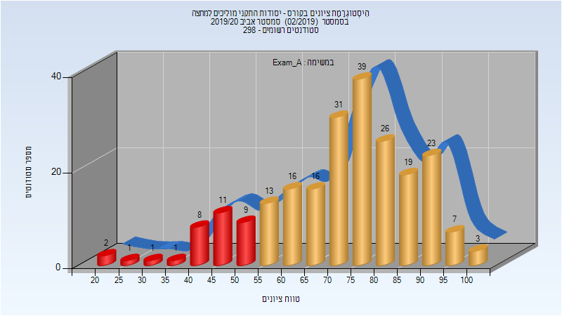

| סטודנטים | עברו/נכשלו | אחוז עוברים | ציון מינימלי | ציון מקסימלי | ממוצע | חציון |
| ---- | ---- | ---- | ---- | ---- | ---- | ---- |
| 226 | 193/33 | 85 | 21 | 100 | 72.385 | 75 |

### סופי מועד א'

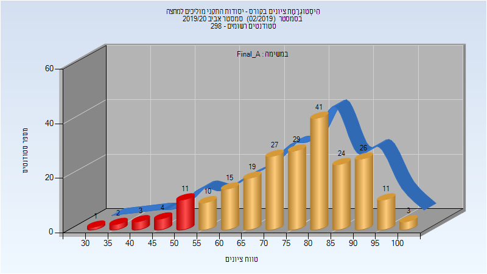

| סטודנטים | עברו/נכשלו | אחוז עוברים | ציון מינימלי | ציון מקסימלי | ממוצע | חציון |
| ---- | ---- | ---- | ---- | ---- | ---- | ---- |
| 226 | 205/21 | 91 | 32 | 100 | 75.942 | 78 |

### מבחן מועד ב'

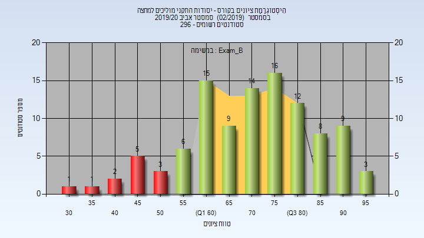

| סטודנטים | עברו/נכשלו | אחוז עוברים | ציון מינימלי | ציון מקסימלי | ממוצע | חציון |
| ---- | ---- | ---- | ---- | ---- | ---- | ---- |
| 104 | 92/12 | 88 | 33 | 99 | 71.798 | 73 |

### סופי מועד ב'

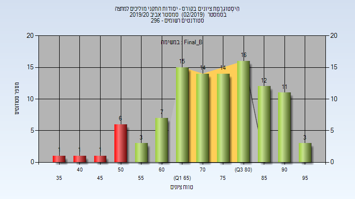

| סטודנטים | עברו/נכשלו | אחוז עוברים | ציון מינימלי | ציון מקסימלי | ממוצע | חציון |
| ---- | ---- | ---- | ---- | ---- | ---- | ---- |
| 104 | 95/9 | 91 | 35 | 99 | 74.942 | 76 |

### סופי

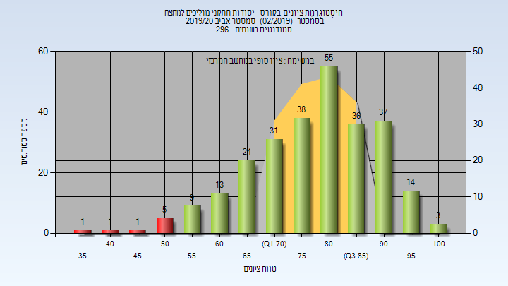

| סטודנטים | עברו/נכשלו | אחוז עוברים | ציון מינימלי | ציון מקסימלי | ממוצע | חציון |
| ---- | ---- | ---- | ---- | ---- | ---- | ---- |
| 268 | 260/8 | 97 | 35 | 100 | 79.041 | 81 |

## חורף 2020-2021

| איש סגל | תפקיד |
| ---- | ---- |
| גויכמן איליה | מרצה - אחראי מקצוע |
| בן-יעקב תמי | מרצה |
| יצחק רזיאל | מתרגל - עם הרשאות מרצה אחראי |

### מבחן מועד א'

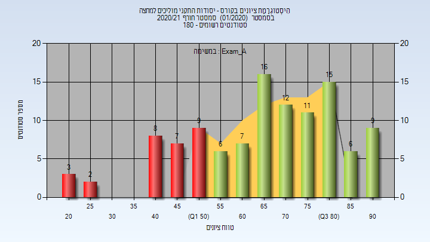

| סטודנטים | עברו/נכשלו | אחוז עוברים | ציון מינימלי | ציון מקסימלי | ממוצע | חציון |
| ---- | ---- | ---- | ---- | ---- | ---- | ---- |
| 111 | 82/29 | 74 | 20 | 94 | 66.559 | 69 |

### סופי מועד א'

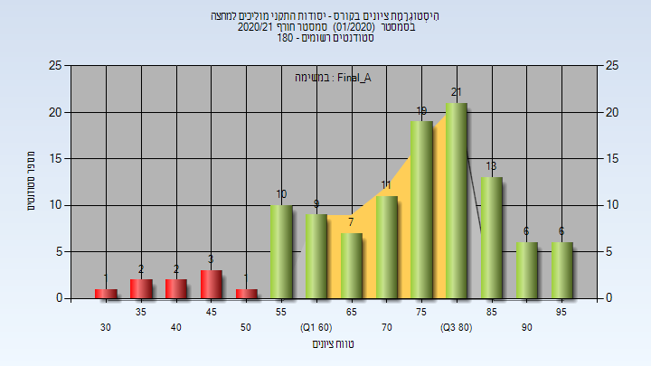

| סטודנטים | עברו/נכשלו | אחוז עוברים | ציון מינימלי | ציון מקסימלי | ממוצע | חציון |
| ---- | ---- | ---- | ---- | ---- | ---- | ---- |
| 111 | 102/9 | 92 | 31 | 96 | 74.153 | 77 |

### מבחן מועד ב'

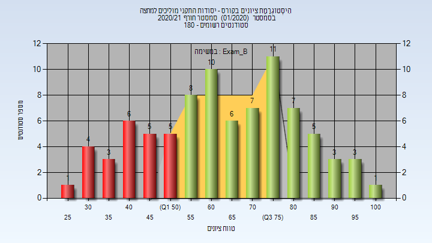

| סטודנטים | עברו/נכשלו | אחוז עוברים | ציון מינימלי | ציון מקסימלי | ממוצע | חציון |
| ---- | ---- | ---- | ---- | ---- | ---- | ---- |
| 85 | 61/24 | 72 | 26 | 100 | 64.835 | 65 |

### סופי מועד ב'

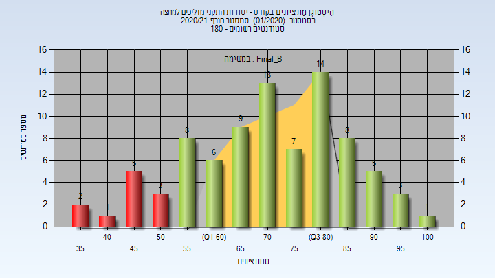

| סטודנטים | עברו/נכשלו | אחוז עוברים | ציון מינימלי | ציון מקסימלי | ממוצע | חציון |
| ---- | ---- | ---- | ---- | ---- | ---- | ---- |
| 85 | 74/11 | 87 | 37 | 100 | 72.106 | 72 |

### סופי

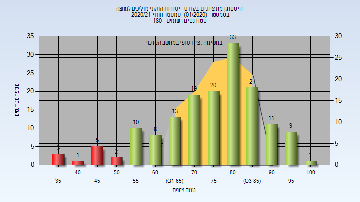

| סטודנטים | עברו/נכשלו | אחוז עוברים | ציון מינימלי | ציון מקסימלי | ממוצע | חציון |
| ---- | ---- | ---- | ---- | ---- | ---- | ---- |
| 156 | 144/12 | 92 | 37 | 100 | 76.032 | 79 |

## אביב 2021

| איש סגל | תפקיד |
| ---- | ---- |
| גויכמן איליה | מרצה - אחראי מקצוע |
| חייט אלכסנדר | מרצה |
| יצחק רזיאל | מתרגל - עם הרשאות מרצה אחראי |

